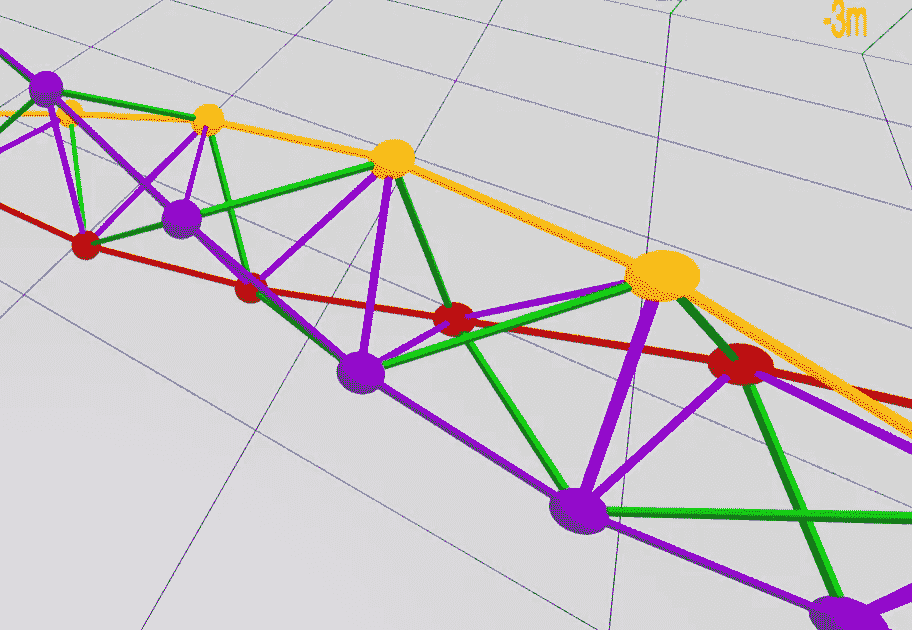
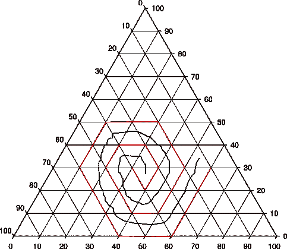

# 加入一个免费的、全在线的、非竞争性的数学马拉松，围绕一些公开的问题来组织

> 原文：<https://medium.com/hackernoon/join-a-free-all-online-non-competitive-mathathon-organized-around-some-open-problems-7cb32d70a667>

The Boerdijk-Coxeter Helix, formed purely out of regular tetrahedra, not discovered until the 1950s.

在 12 月 1 日的周末，我们正在尝试一些从未做过的事情。黑客马拉松通常是一个周末，通常从周五晚上到周日下午，由团队进行密集的计算机编程。往往会注入竞争和现金奖励的人造戏剧。通常团队选择他们自己的项目。有时他们位于一个大的会议空间，有时他们是完全虚拟的。通常它们是围绕一个主题来组织的，但这个主题很少是数学。

我们正在尝试一些不同的东西:一个免费的、虚拟的“数学黑客马拉松”——一个 [*数学马拉松*](https://www.eventbrite.com/e/mathathon-a-cooperative-virtual-mathathon-tickets-50181898409) 。这多少有些实验性，因为与黑客马拉松不同，*数学马拉松*没有既定的传统。虽然当然会用到计算机，而且有些问题是关于算法的，但这基本上是关于几何学的。我们的目标雄心勃勃。我们想要:

*   *参与者获得真实*:能够贡献[真实问题](https://github.com/PubInv/Mathathon-2018-Simplex-Chains/blob/master/SimplexChains.pdf)其解决方案目前未知，不是简单的练习，
*   参与者体验在团队中解决实际问题，
*   业余数学家和学生能够解决真实的、相对容易的、目前答案未知的数学问题，
*   整个数学马拉松合作探索一个特定领域的一组特定的预定义问题，以强调不是个人的成就，而是群体的进步，以及
*   其他人能够从我们的经验中学习，在未来举办其他的数学马拉松。

大众发明 Mathathon 2018 的精神是*合作*，而不是*竞赛*。

为了实现这个目标，我们的数学马拉松将是“免费和开放的”我们指的是“言论自由”中的免费，但它也碰巧是“免费披萨”中的免费参与者将在允许共享的[知识共享](https://en.wikipedia.org/wiki/Creative_Commons_license)许可证下创作他们的所有作品，特别是[Attribution-share like 4.0 International(CC BY-SA 4.0)](https://creativecommons.org/licenses/by-sa/4.0/)许可证。

因为我们不确定我们能否在任何一个城镇找到足够多的人来参与，并允许尽可能多的人参与，包括国际上的人，公共发明数学马拉松将完全是虚拟的。我们将使用一个 Zoom room 进行视频聊天，一个公共的 [Slack channel](https://pubinv-mathathon-2018.slack.com/) 进行文本交流，一个版本控制系统“git”用于共享文档，作为 [GitHub 库](https://github.com/PubInv/Mathathon-2018-Simplex-Chains)托管。

在数学和科学中，有时提出正确的问题和找到正确的答案一样重要。因此，我们准备了一份长长的“未决”问题清单，作为合作的框架。所有这些问题都属于几何学的一个分支，涉及三角形或四面体(统称为*单形*)如何组合在一起形成单形链。我们相信这些问题的难度范围从高中生可以解决的问题到可以发表的研究问题。

作为我们正在解决的这类问题的一个例子，这里有一个来自我们关于 mathathon 问题的[进展中文章](https://github.com/PubInv/Mathathon-2018-Simplex-Chains/blob/master/SimplexChains.pdf)开头的问题:

> 术语单形意味着最简单的正多面体。在二维中，单形是等边三角形。在三维空间中，单形是正四面体。在四维空间中，它被称为单形。大概也可以在高维欧几里得空间中定义一个单形。
> 
> 将单形链定义为由许多单形通过特定规则面对面邻接而成的图形。面的维数总是比空间的维数少一。在二维空间中，单形链是一系列边对边相连的等边三角形。
> 
> 让我们从 0 开始给单形链编号。然后，我们可以通过一个规则来定义一个单纯形链，该规则指出将第 n+1 个单纯形附加到第 n 个单纯形的哪个边上。在二维中，我们可以将单纯形链中最后一个三角形的边标注为逆时针或顺时针，或者只是左右。
> 
> 很明显，规则“总是向左”“总是向右”产生了一个漂亮的六边形，但随后开始将三角形放在已经存在的地方，产生了“自我碰撞”
> 
> “如果 n 是偶数就向左走，如果 n 是奇数就向右走”这个规则更有趣一点；它产生了一个直线上升的“梯子”。也就是说，整个图形包含在由三角形的高度分开的两条平行线中。

A plane-filling spiral of triangles

> 练习:可能有一个单纯形链式法则，用等边三角形平铺整个平面。能定义一下吗？

为了准备数学马拉松，我们写了一个互动的[网页](https://pubinv.github.io/Mathathon-2018-Simplex-Chains/platforms/index.html)，让你尝试用图形来解决这个问题。

我们也处理三维中的单形，它们是堆叠在一起的四面体。一般来说，较难的问题是关于三维空间的，而较容易的问题是关于 2D 平面的。要了解我们提出的 3D 问题，请观看以下视频:

当前的一组[开放问题](https://en.wikipedia.org/wiki/Open_problem)正在进行中，但是包含了 20 多个(或多或少)我们不知道答案的清晰问题。通常当你说“一个公开的问题”时，它意味着一个困难的、公认的问题，这个问题的解决会给解决者带来很大的声誉。在这些情况下，我们不是这个意思。我们和我们的参与者一样，对所有可能知道的事情只知道很小的一部分。以下是一些我们不知道的事情:

*   我们列出的问题的解决方案，
*   它们到底有多难，
*   他们是否会引起任何人的兴趣，或者我们的缩放室是否能容纳超过 100 人，
*   这些问题的解决方案是否值得发表，
*   这个数学马拉松会成功解决一个问题，还是所有问题。

但是我们相信花一个周末来探索这个会很有趣！

一个读者可能会问:为什么我，或者任何人，要关心三角形和四面体是如何组合在一起的？为什么单形链很有趣？

对一个“纯”数学家来说，答案是:

> 它们很漂亮。

对一个“应用”数学家来说，答案是:

> 三角形和四面体本质上是刚性结构，因此对结构和机械工程至关重要。重量最大的二维结构——桁架，是由三角形构成的，而最有效的三维结构，或称空间构架，往往是由四面体构成的

我们关于开放问题的演进文档可以在这里找到:[https://github . com/PubInv/matha thon-2018-Simplex-Chains/blob/master/Simplex Chains . pdf](https://github.com/PubInv/Mathathon-2018-Simplex-Chains/blob/master/SimplexChains.pdf)。要对问题提出改进建议或提出其他建议，创建一个拉动请求或一个[问题](https://github.com/PubInv/Mathathon-2018-Simplex-Chains/issues)，回复本文，发送电子邮件[<【read.robert@gmail.com】>](mailto:read.robert@gmail.com)，或加入[闲置团队](https://join.slack.com/t/pubinv-mathathon-2018/shared_invite/enQtNDQwMTgxOTE0MTAyLTc5ZWM5ZmEzZmY1YjA2ZDE4ZTE5YzliNjViY2JmZjhhYTIyMjFiNDY4OWUyYzdmYWY1NTg2ODBmMzk0ODdkOGU)。

为了给每个人创造一个安全、温和、有益的环境，我们招募了几名志愿者主持人(大卫·耶施克和我)，他们除了深夜睡觉时间外，将一直在线。我们将尝试回答问题，帮助团队组建，并帮助人们使用 git 向全世界公开分享他们的工作，尤其是向 mathathon 的其他成员。我们将鼓励人们发布他们的作品，即使是粗糙的、不完整的、甚至可能是错误的。我们的目标是用这段时间开发一个不断发展的作品，而不是等到最后才展示要评判的作品。这就是为什么我们打算设立“共享工作的最佳早期贡献者”这样的奖项

当我在研究生院时，我听到有史以来最著名的计算机科学家之一 E. W. Dijkstra 教授说:

> 如果你要失败，就壮观地失败。

据我们所知，这种围绕开放问题组织的全虚拟的合作数学马拉松是前所未有的。它可能会惨败。也许没人会出现。也许一个问题也解决不了。也许我们对问题的表述非常不清楚。

由于这些原因，这是一个特别令人兴奋的实验。我们不知道会发生什么。我们希望你能加入我们。报名免费，但限 100 人参加:[https://www . eventbrite . com/e/matha thon-a-cooperative-virtual-matha thon-tickets-50181898409](https://www.eventbrite.com/e/mathathon-a-cooperative-virtual-mathathon-tickets-50181898409)

我们打算授予最高奖项，如“学生的最佳贡献”，但不提供任何金钱奖励。

[公共发明](https://pubinv.github.io/PubInv/)是由作者创办的教育类非营利组织。请分享这篇文章，或我们的任何其他宣传材料，给 mathy 个人，俱乐部和社区。