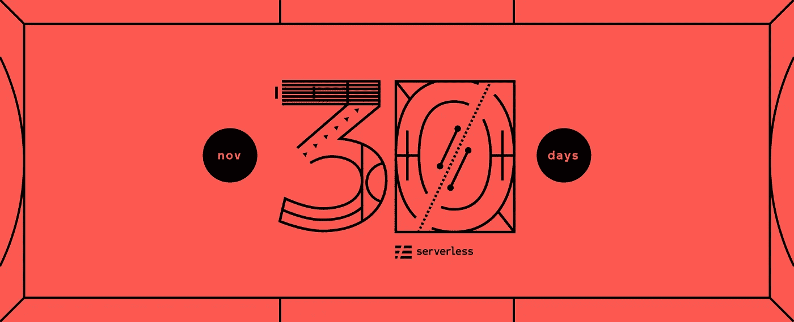

# 参加#NoServerNovember 挑战赛

> 原文：<https://medium.com/hackernoon/join-the-noservernovember-challenge-622e36a83e2e>

这是我一年中最喜欢的时间；假期正如火如荼地进行着，我们正在为感恩节做准备，现在是#NoServerNovember。我们的无服务器团队今年推出了#NoServerNovember，帮助无服务器爱好者提升水平，并帮助新用户开始使用无服务器。

11 月的每一周，我们都会宣布新的项目供您尝试，以及完成挑战的绝佳资源。您使用#NoServerNovember challenge 完成并通过 tweet 发送给我们的每个项目都会让您参加抽奖，赢得一些无服务器奖品。所以，这个月尝试一个项目，每周增加一个新项目，或者通过完成所有项目获得无服务器冠军的称号。我们将在整个月公布获奖者，大奖将在月底公布。

## 挑战

目前有 **9** 个挑战可供选择！

## 11 月 19 日:Twilio 提醒，Slack bot，股票代码

用 Twilio 做一个短信提醒机器人。

*初学曲目*

创建一个无服务器支持的 Twilio 提醒机器人，给你发短信。让它告诉你去倒垃圾。或者移动你的车以避免停车罚单。或者给你妈妈发生日快乐短信。

以下是一些帮助您入门的资源:

*   [如何用无服务器避免停车罚单](https://serverless.com/blog/avoid-parking-tickets-with-serverless/)

如何提交给提醒机器人挑战:1。在 Tweet 上发布你的 GitHub repo 的链接，并附上发送短信的截图。2.包括#noServerNovember 标签。

制作一个松弛的机器人，建议随机 80 年代的动作片。

*中级/高级赛道*

创建一个无服务器支持的 Slack bot。用户应该能够输入斜线命令(如`/action`)，并接收随机动作的名称。

如果你包括封面艺术，IMDB /烂番茄页面的链接，引用，或者其他任何使它更强大的东西，那就加分了。

以下是一些帮助您入门的资源:

*   [GitHub](https://github.com/johnagan/serverless-slackbot)中的 `[serverless-slackbot](https://github.com/johnagan/serverless-slackbot)` [示例](https://github.com/johnagan/serverless-slackbot)
*   [电影数据库 API](https://developers.themoviedb.org/3/discover/movie-discover)
*   [TMDB 电影元数据](https://www.kaggle.com/tmdb/tmdb-movie-metadata)
*   [创建一个无服务器的 Slack 机器人](https://foobar123.com/code-with-me-create-a-slack-app-with-serverless-part-1-18b1052310c8)
*   [制作一个无服务器聊天机器人](https://acloud.guru/learn/serverless-chatbot)

如何提交给 80 年代动作片的挑战:1。在 Tweet 上发布 GitHub repo 的链接，并附上运行中的机器人的截图。2.包括#noServerNovember 标签。

创建一个 cron + ETL 支持的股票报价器。

*中级/高级赛道*

创建一个无服务器支持的 cron 作业，该作业运行一个 ETL 脚本，将数据从一个 SaaS 服务拖到另一个服务中。例如，您可以发送一个电话号码来接收股票(或额外的时髦词汇奖励点，加密)价格信息。我们建议使用 Twitter ->无服务器后端(AWS Lambda、微软 Azure 或谷歌云功能)->

以下是一些帮助您入门的资源:

*   [无服务器红移的 ETL 作业处理](https://serverless.com/blog/etl-job-processing-with-serverless-lambda-and-redshift/)

如何提交股票报价挑战:1。在推特上发布你的 GitHub 回购的链接和你的股票行情截图。2.包括#noServerNovember 标签。

## 11 月 12 日:可爱的猫，Alexa 技能，动物机器人

制作一个网站，为游客提供可爱的猫 gif。

*初学者赛道*

做一个网站。在那个网站上，随便拉一个猫的 gif。最基本的，gif 应该在每次页面刷新时改变。如果你创建一个自定义域名的奖励积分。

以下是一些帮助您入门的资源:

*   [Giphy 上的可爱猫咪 gif](https://giphy.com/explore/cute-cat)
*   [如何使用预建的无服务器组件创建动态网站](https://serverless.com/blog/how-create-dynamic-website-with-serverless-components/)
*   [查看我们的示例浏览器，获取动态网站示例](https://serverless.com/examples/aws-node-serve-dynamic-html-via-http-endpoint)
*   [为 Lambda 和 API 网关创建自定义域名](https://serverless.com/blog/serverless-api-gateway-domain/)

如何提交给可爱的猫挑战:1。在推特上发布你的 GitHub repo 和你的可爱猫咪网页的链接。2.包括#noServerNovember 标签。

建立一个 Alexa 技能，告诉你一个方向的随机事实。

*中级/高级赛道(趣味版)*

制作一个无服务器支持的 Alexa 技能。当你说，“Alexa，告诉我一些关于一个方向的事情，”或者“Alexa，告诉我一些关于一个方向的事实，”Alexa 应该回答你，告诉你一个关于一个方向的随机事实。

以下是一些帮助您入门的资源:

*   这里有一些单向事实；你需要把它转换成一个数据库
*   [在无服务器示例浏览器中搜索 Alexa 示例](https://serverless.com/examples/)
*   [用无服务器预约插件培养 Alexa 技能](https://serverless.com/blog/building-testing-alexa-skill-bespoken-plugin/)
*   [如何建立一个无服务器的 Alexa 技能](/@rupakg/how-to-build-a-serverless-alexa-skill-51d8479e0432)

如何向单向挑战屈服:1。在推特上发布你的 GitHub repo 的链接，最好还有一个 Alexa 技能工作的视频(或声音剪辑),因为这样更有趣。2.包括#noServerNovember 标签。

创建一个能识别图像中动物的 Twitter 机器人。

*高级跟踪*

制作一个无服务器、支持图像识别的 Twitter 机器人。当一个用户在机器人上发推文:“@animalbot，这张图片里是什么？”，机器人应该回复动物的名字，“是熊猫！”

以下是一些帮助您入门的资源:

*   [通过无服务器框架使用 Tensorflow 进行图像识别](https://serverless.com/blog/using-tensorflow-serverless-framework-deep-learning-image-recognition/)
*   [使用无服务器框架在 Azure 上部署机器人](https://www.microsoft.com/developerblog/2017/06/01/deploying-bots-using-the-serverless-framework/)
*   [制作 Twitter AWS Lambda 机器人](https://garywoodfine.com/twitter-wordpress-aws-lambda-bot/)

如何接受动物机器人的挑战:1。在推特上发布你的 GitHub repo 和 AnimalBot 账户的链接。2.包括#noServerNovember 标签。

## 11 月 5 日:无服务器 Ipsum，DadJokeBot，GitHub 检查

本周我们有三项挑战适合所有级别！即使你以前从未建立过 AWS 帐户，也从未编写过任何代码，也可以完成无服务器 Ipsum 挑战。

每完成一项挑战，你就有一次机会参加抽奖。

构建一个无服务器的 Ipsum 生成器。

*初学者赛道*

构建一个简单的无服务器支持的 web 应用程序，在加载时显示无服务器 Ipsum。或者托尼·丹扎·伊普斯姆。或者办公室 Ipsum。或者我不能倒垃圾的理由。

只要它看起来像 Lorem Ipsum，但使用不同的单词，我们就很好。页面不需要看起来很花哨，即使你一生中从未编写过任何代码，你也可以做到这一点！

这里有一个教程让你开始:

*   [我刚刚部署了一个无服务器应用程序，但我不会编码](https://medium.freecodecamp.org/i-just-deployed-a-serverless-app-and-i-cant-code-here-s-how-i-did-it-94983d7b43bd)

此外，对于那些还不是开发人员但正在学习的人来说，还有一些启发:

*   [4 年从厨师到无服务器开发者](https://serverless.com/blog/from-chef-to-serverless-developer-in-4-years/)

如何提交无服务器 Ipsum 挑战:1。在 Tweet 上发布您的 GitHub repo 和 Ipsum 网页的链接。2.包括#noServerNovember 标签。

做一个推特机器人来发爸爸的笑话。

*中高级赛道(趣味版)*

写一个无服务器支持的 Twitter 机器人。让它在推特上发布爸爸的笑话。这就是事情的全部。

以下是一些帮助您入门的链接:

*   [一个爸爸笑话 API](https://icanhazdadjoke.com/api)
*   [写一个 Twitter Wordpress AWS Lambda bot](https://garywoodfine.com/twitter-wordpress-aws-lambda-bot/)
*   [用微软 Azure 写一个 Twitter 机器人](https://www.microsoft.com/developerblog/2017/06/01/deploying-bots-using-the-serverless-framework/)

如何提交 DadBot Twitter 挑战:1。在推特上发布你的 GitHub 回购和 DadBot 账户的链接。2.包括#noServerNovember 标签。

使用无服务器自动执行 GitHub 检查。

*中级/高级赛道(实际有用(！！！)版本)*

这个项目是我们办公室最喜欢的项目之一，因为它非常实用。用 GitHub 实现自动化非常有用。

对于简单的版本，设置一个 GitHub 检查，确保在 PR 标题中有对 GitHub /吉拉/ etc 问题的引用。对于更难的版本，设置一个 GitHub 检查，在新提交时自动 lint &重新格式化代码。

或者，做点别的有趣的事。我们会留下这个开放式的。

以下是一些帮助您入门的资源:

*   [GitHub 检查文档](https://developer.github.com/v3/checks/)
*   [在 AWS Lambda 上使用 git](https://blog.enki.com/using-git-on-aws-lambda-f365a2db706b?gi=c17971d97e6a)
*   [设置一个无服务器的 GitHub webhook](https://serverless.com/blog/serverless-github-webhook-slack/)
*   [参见我们的示例浏览器](https://serverless.com/examples/aws-node-github-webhook-listener)中的 GitHub webhook 示例
*   [如何构建 GitHub bot](https://medium.freecodecamp.org/how-to-build-a-github-bot-with-phantomjs-react-and-serverless-framework-7b66bb575616)

如何向 GitHub Check 挑战提交:1。在 Tweet 上发布您的 GitHub repo 的链接，并附上 Check in 操作的截图。2.包括#noServerNovember 标签。

**11 月 26 日:** *特别版:重新发明无服务器黑客马拉松*

## 它是如何工作的

11 月的前三个星期一，我们将发布一系列新的无服务器挑战赛。我们还将包括一些帮助您入门的资源。11 月的最后一周，我们将推出一个特别版“发明黑客马拉松”。

找一个自己喜欢的挑战！或者更好的是，找到你喜欢的多个挑战！你完成的每一个挑战都可以单独进入，你可以随时完成任何一个挑战。

接受挑战。放在 GitHub 里。用#NoServerNovember 的标签发一个链接到你的回购，加上其他相关的链接或截图。

每一份参赛作品都有资格获奖。我们每周将抽取三名获奖者，在您获奖之前，我们不会将您从池中移除。因此，如果你在第一周完成了一项挑战，你也可以在第二周和第三周参加抽奖。那就更有理由早点开始了！

抽奖日期:

*   十一月十二日
*   十一月十九日
*   十一月二十六日

## 规则

为了符合条件，参赛作品必须使用无服务器框架和无服务器后端(如 AWS Lambda、Google Cloud Functions 或 Microsoft Azure)。

每个每日挑战你只能参加一次。然而，你可以完成尽可能多的日常挑战，这些将作为单独的条目。

您必须遵循挑战描述中包含的任何附加说明，才能对您的参赛作品进行计数。只有使用#noServerNovember 标签的参赛作品才有资格获奖。

玩得开心，祝你好运！