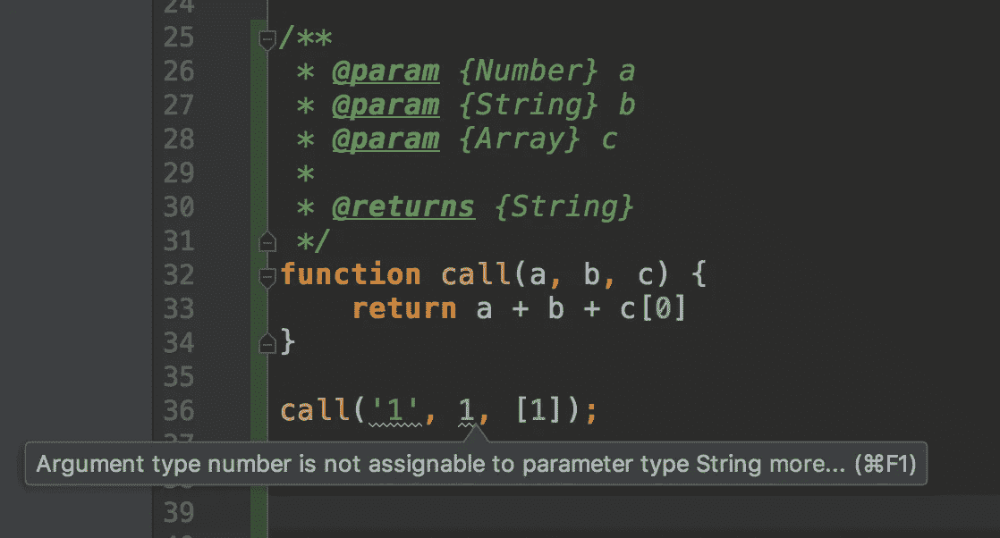

# JSDoc。JavaScript:有用的部分

> 原文：<https://medium.com/hackernoon/jsdoc-javascript-the-useful-parts-58f52f0cc25e>

Photo by [Rowan](https://www.flickr.com/photos/purplerabbits/) on [Flickr](https://www.flickr.com/)

> [JSDoc](http://usejsdoc.org/about-getting-started.html) 3 是 JavaScript 的 API 文档生成器，类似于 Javadoc 或 phpDocumentor。您可以将文档注释直接添加到源代码中，就在代码本身旁边。

我使用 JSDoc 超过 4 年，发现它非常好和有用。在项目中拥有文档是很重要的。这有助于你节省记忆、教导新人和支持的时间。项目可能有不同类型的文档。作为一名工程师，文档的重要部分是代码文档，JSDoc 也解决了这个问题。

# 简单的例子

从这个简单的例子中，你可以简单快速地理解函数取什么参数的类型。您不应该在函数内部寻找它。更常见的是，函数和方法更复杂，需要花费时间来了解函数和参数的类型。

# 好榜样

在这里你可以找到一个模块的详细文档。试着浏览一下，如果你不明白这个模块是做什么的，我们可以打电话给☎️

 [## shystruk/famulus

### 这个 JavaScript 库提供了一个有用的函数式编程助手。添加您自己的👍

github.com](https://github.com/shystruk/famulus/blob/master/isValuesUnique.js) 

# **类型注释(**类型检查)

JSDoc 中我喜欢的最强大的特性之一是类型检查。它在 WebStorm 中运行得非常好。它不会取代 TypeScript，但是在你习惯于编写 JSDoc 之后，你将不再担心类型，最重要的是，你不需要在任何配置部分浪费时间。

## 韦伯斯特罗姆

所以，在这里你可以看到 WebStorm 突出了哪个参数不适合赋值类型。这有助于避免类型错误，最重要的是节省时间。

## VS 代码

> VS 代码允许您在常规 JavaScript 文件中利用 TypeScript 的一些高级类型检查和错误报告功能。这是捕捉常见编程错误的好方法。这些类型检查还支持一些令人兴奋的 JavaScript 快速修复，包括*添加缺失的导入*和*添加缺失的属性*。

对于 VS 代码，你应该在每个文件中添加`//@ts-check`，如果你想要的话。

 [## 使用 Visual Studio 代码进行 JavaScript 编程

### 充分利用 Visual Studio 代码进行 JavaScript 开发

code.visualstudio.com](https://code.visualstudio.com/Docs/languages/javascript#_type-checking-and-quick-fixes-for-javascript-files) 

👏**感谢您的阅读。欢迎建议、评论、想法**👍

**如果你喜欢这个，就鼓掌吧，关注我上** [**中**](/@shystruk) **，** [**推特**](https://twitter.com/shystrukk) **，**[**github**](https://github.com/shystruk)**分享给你的朋友**😎