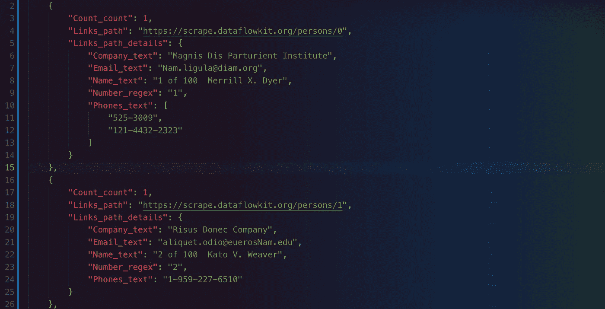
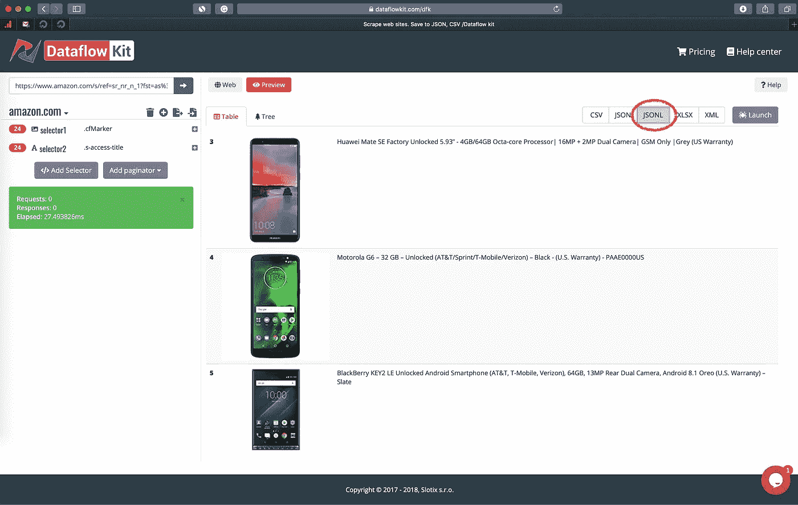

# JSON Lines 格式:为什么 jsonl 比普通 JSON 更适合网络抓取

> 原文：<https://medium.com/hackernoon/json-lines-format-76353b4e588d>



# CSV 和 JSON 格式介绍

**逗号分隔值(CSV)格式**是一种常用的数据交换格式，广泛用于表示具有相同字段列表的记录集。

**JavaScript Object Notation(JSON)**如今已经成为事实上的数据交换格式标准，取代了在 21 世纪初非常流行的 XML。它不仅是自描述的，也是人类可读的。

让我们看看这两种格式的例子。

以下是以 CSV 数据表示的系列列表:

```
id,father,mother,children
1,Mark,Charlotte,1
2,John,Ann,3
3,Bob,Monika,2
```

CSV 看起来比下面显示的 [JSON](https://hackernoon.com/tagged/json) 数组模拟简单得多:

```
[
   {"id":1,"father":"Mark","mother":"Charlotte","children":1},
   {"id":2,"father":"John","mother":"Ann","children":3},
   {"id":3,"father":"Bob","mother":"Monika","children":2},
]
```

但是 CSV 仅限于存储二维的无类型数据。没有任何方法可以在普通 CSV 中存储嵌套结构或类型的值，比如孩子的名字。

```
[
   {"id":1,"father":"Mark","mother":"Charlotte","children":["Tom"]},
   {"id":2,"father":"John","mother":"Ann","children":["Jessika","Antony","Jack"]},
   {"id":3,"father":"Bob","mother":"Monika","children":["Jerry","Karol"]},
]
```

不过，在 JSON 文件中表示嵌套结构很容易。

**为什么不用一个常规的 json 数组来包围整个数据，这样文件本身就是有效的 JSON？**

> 为了从 JSON 数组中插入或读取记录，您必须解析整个文件，这远非理想。
> 
> 因为 JSON 行中的每个条目都是有效的 JSON，所以它可以作为独立的 JSON 文档进行解析/解组。例如，您可以在其中进行搜索，将一个 10gb 的文件分割成较小的文件，而无需解析整个文件。
> 
> 1.解析之前不需要读取内存中的整个文件。2.您可以通过简单地向文件追加内容来轻松地向文件中添加更多的行。如果整个文件是一个 JSON 数组，那么您必须解析它，添加新行，然后转换回 JSON。

> 因此，将几千兆字节作为单个 JSON 数组是不实际的。考虑到 Dataflow kit 用户需要存储和解析大量数据，我们实现了将[导出为 JSONL 格式](https://github.com/slotix/dataflowkit/issues/11)。



**JSON lines (jsonl)、换行符分隔的 JSON (ndjson)、换行符分隔的 JSON (ldjson)** 是三个术语，表示主要用于 JSON 流的相同格式。

让我们看看 **JSON Lines** 是什么，以及它与其他 JSON 流格式相比如何。

## JSON 行与 JSON

表示为 **JSON 行**格式的完全相同的系列列表如下所示:

```
{"id":1,"father":"Mark","mother":"Charlotte","children":["Tom"]}
{"id":2,"father":"John","mother":"Ann","children":["Jessika","Antony","Jack"]}
{"id":3,"father":"Bob","mother":"Monika","children":["Jerry","Karol"]}
```

**JSON 行**本质上由几行组成，每一行都是一个有效的 JSON 对象，由换行符``\n``分隔。

它不需要定制的解析器。只需读取一行，解析为 JSON，读取一行，解析为 JSON…等等。

实际上在工业中使用`jsonl`已经是非常普遍的了

点击下面的链接可以找到更多关于 JSON lines 规范的细节。

 [## JSON 行

### 本页描述了 JSON 行文本格式，也称为换行符分隔的 JSON。JSON Lines 是一种方便的格式…

jsonlines.org](http://jsonlines.org) 

## JSON 行与 JSON 文本序列

让我们比较一下 **JSON 文本序列格式**和相关媒体类型“application/json-seq”与 [NDJSON](https://hackernoon.com/tagged/ndjson) 。它由任意数量的 JSON 文本组成，都用 UTF-8 编码，每个文本都以 ASCII 记录分隔符(0x1E)为前缀，每个文本都以 ASCII 换行符(0x0A)结束。

让我们看看上面提到的人员列表，用 JSON-sequence 文件表示:

```
<RS>{"id":1,"father":"Mark","mother":"Charlotte","children":["Tom"]}<LF>
<RS>{"id":2,"father":"John","mother":"Ann","children":["Jessika","Antony","Jack"]}<LF>
<RS>{"id":3,"father":"Bob","mother":"Monika","children":["Jerry","Karol"]}<LF>
```

这里是不可打印的 ASCII 记录分隔符(0x1E)的占位符。`<LF>`代表换行符。

除了每个记录开头的这个特殊符号之外，该格式看起来几乎与 JSON 行相同。

由于这两种格式如此相似，你可能想知道为什么它们都存在？

*JSON 文本序列*格式用于流上下文。所以这种格式没有定义相应的文件扩展名。虽然 JSON 文本序列格式规范注册了新的 MIME 媒体类型`application/json-seq.`，但是在文本编辑器中存储和编辑这种格式很容易出错，因为不可打印的(0x1E)字符可能是乱码。

您可以考虑始终使用 JSON 行作为替代。

## JSON 行与连接的 JSON

JSON 行的另一个替代方法是**级联 JSON。**在这种格式中，每个 JSON 文本根本没有相互分离。

下面是上面一个例子的级联 JSON 表示:

```
{"id":1,"father":"Mark","mother":"Charlotte","children":["Tom"]}{"id":2,"father":"John","mother":"Ann","children":["Jessika","Antony","Jack"]}{"id":3,"father":"Bob","mother":"Monika","children":["Jerry","Karol"]}
```

串联 JSON 并不是一种新的格式，它只是一个没有任何分隔符的流多个 JSON 对象的名称。

虽然生成 JSON 并不是一项复杂的任务，但是解析这种格式实际上需要很大的努力。事实上，您应该实现一个上下文感知的解析器，该解析器检测各个记录并正确地将它们相互分离。

## 印刷精美的 JSON 格式

如果你有大的嵌套结构，那么不推荐直接阅读 JSON 行文本。使用`jq`工具使查看大型结构更容易:

`grep . families.jsonl | jq`

因此，您会看到打印得非常漂亮的 JSON 文件:

```
{
  "id": 1,
  "father": "Mark",
  "mother": "Charlotte",
  "children": [
    "Tom"
  ]
}
{
  "id": 2,
  "father": "John",
  "mother": "Ann",
  "children": [
    "Jessika",
    "Antony",
    "Jack"
  ]
}
{
  "id": 3,
  "father": "Bob",
  "mother": "Monika",
  "children": [
    "Jerry",
    "Karol"
  ]
}
```

# 结论

> 从技术上讲，完整的 JSON 行文件作为一个整体不再是有效的 JSON，因为它包含多个 JSON 文本。
> 
> 每一个新行都意味着一个单独的条目，这使得 JSON Lines 格式的文件是可流的。您可以根据需要读取任意多的行来获得相同数量的记录。

[](https://dataflowkit.com) [## 将网站转变为结构化数据/数据流套件

### 用 Go 写的 Web 抓取开源平台

dataflowkit.com](https://dataflowkit.com)