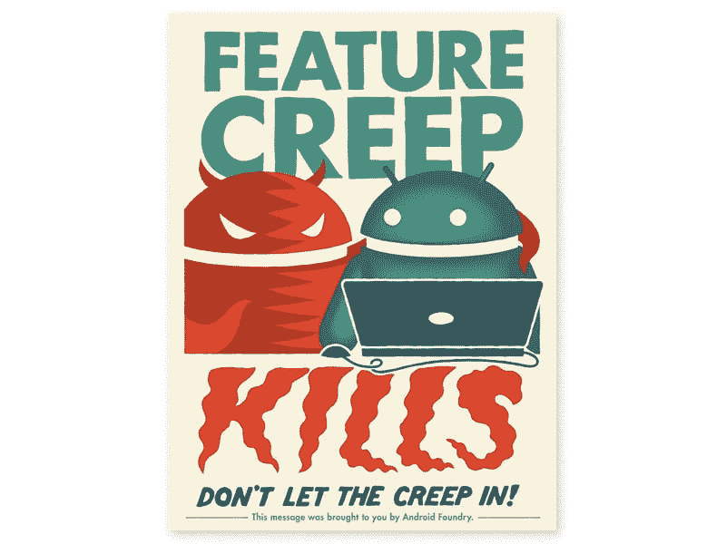

# 给我一把锋利的谷歌！*

> 原文：<https://medium.com/hackernoon/just-give-me-a-sharp-knife-google-9b20c782abe9>

[https://unsplash.com/photos/h26wHZ03fjA](https://unsplash.com/photos/h26wHZ03fjA)

我喜欢做一名开发人员，我喜欢编写应用程序，我喜欢编写高质量的代码。我称自己为软件工匠，因为我相信我们的[宣言](http://manifesto.softwarecraftsmanship.org/)，它提醒我要写精心制作的代码并表现得专业。

几天前[谷歌](https://hackernoon.com/tagged/google)公布了[谷歌输入输出应用](https://play.google.com/store/apps/details?id=com.google.samples.apps.iosched)的[源代码](https://github.com/google/iosched)。自从早期的 Android[开始，这里就一直是展示开发 Android 应用程序的艺术水平的窗口。随着我们在过去两年中所看到的，谷歌给出了如何构建应用程序的提示和工具，我们许多人都对代码感到好奇。](https://hackernoon.com/tagged/android)

但是很快，开发者在那里发布了关于[巨大的方法](https://github.com/google/iosched/blob/master/mobile/src/main/java/com/google/samples/apps/iosched/ui/schedule/ScheduleFragment.kt)和[类](https://github.com/google/iosched/blob/master/mobile/src/main/java/com/google/samples/apps/iosched/ui/schedule/ScheduleViewModel.kt)。老实说，它不像以前那么差，但它不是它应该有的参考源基础。问题是，来自世界各地的开发者会看到这些代码，他们会复制它们。一直都是这样。这段代码应该是一个角色模型，一个理想的例子。它不是。Android 博客中提到的重写尤其令人难过。

# 事情还不止这些

不仅样本不完整，工具和文档也开始倾向于不专业的习惯。不久前，我发布了这条推文:

> 阅读[https://developer.android.com/guide/app-bundle/build……](https://t.co/aCEJgVEirb)听起来像是构建发布版甚至部署应该从 [@androidstudio](https://twitter.com/androidstudio) 开始，事实正好相反！如果超过一个宠物项目，永远不要在本地发布！专业点！格雷先来。Ci 第一！作为最后！ [@AndroidDev](https://twitter.com/AndroidDev) 专业点！

我的意图不是指责谷歌员工不专业。我想要求的是阻止牛仔发展，让现实世界的职业发展成为一等公民。

# 起初

过去，Android 示例代码主要关注 Android APIs 的使用。代码片段没有考虑架构问题，也没有考虑代码是否干净。这很好。但是开发人员没有其他代码可以学习，开始复制样本代码。背后的想法是:这就是“谷歌”告诉你**必须使用**这个的方式。

# 事情变了

幸运的是，事情有所好转。谷歌员工越来越意识到他们无意中制造的混乱。我们得到了[测试支持](https://developer.android.com/training/testing/)、[架构指南](https://developer.android.com/jetpack/docs/guide)、[架构蓝图](https://github.com/googlesamples/android-architecture)、[架构组件](https://developer.android.com/topic/libraries/architecture/)。

当我发现“应用捆绑包”现在可以通过 Android Studio 创建，并且文档更喜欢这种方法，而不是通过 gradle 发布，因为它放在第一位，这导致了我经常被误解的推文。

这让我想起了谷歌 I/O，它宣布你现在可以从 Android Studio 直接发布到 PlayStore。那个特征，我记得，让我真的很生气。在我看来，这是一个非常无用的功能，甚至，我认为它是危险的。它鼓励牛仔式的发展。

# 怎么了？

从您的 IDE 发布不保证可再现性。此项目是否已签入版本控制？发送的所有内容都提交了吗？我们在哪个分支上？

您如何知道您发送的内容实际上是有效的？也许你在你的设备上测试了它，但是你检查过没有严重的 lint 警告告诉你这将在旧的 android 版本上崩溃吗？你有没有运行你的单元测试套件来确保所有的老特性仍然工作？

“在我的机器上工作”的问题永远不会出现在一个版本中。

如今，移动是严肃的行业，应用是严肃的软件项目。对于大多数公司来说，这是他们的核心业务！
往往开发者还是不会这样对待他们。测试、架构、干净的代码花了很长时间，直到他们开发出 Android。来自 Java 后端开发人员的知识没有成功，尽管那时两者说的是同一种语言。

甚至在安卓本身也能看出来:

# Android 源代码

如果你曾经深入研究过 Android 开源代码(AOSP)，你就会知道:这是一个巨大的混乱。这是一个如此庞大和难以维护的烂摊子，也许唯一的出路是一个新平台，一个叫做 [Flutter](https://flutter.io/) 的新 API。

正如我在开始所说的，我不认为谷歌的开发人员不专业，但他们有时会鼓励(无意的)不专业的开发。

# 安卓工作室

Android Studio 或开发文档对我们有帮助吗？老实说不多。

我所知道的大多数开发人员，在开始的几分钟内就删除了“新项目向导”创建的所有样板文件。

或者想想 Android Studio 的 SVG 导入之类的 UI 工具。怎么导入几十个 SVG？手动，一个一个来！
为什么没有批处理工具？在大多数公司，设计师都有一个交付规格和资产的过程。设计师不在 Android Studio 内部工作。那么我们的 IDE 是不是只面向业余爱好者呢？

来说说测试吧！感觉好像在 Android Studio 上工作的开发人员很少在那里运行测试。我们经常在点击某个测试旁边的图标后看到:“*没有找到测试*”的问题吗？最近，由于缓存代码，测试根本不会运行，或者错误的代码会运行。在 Android Studio 中运行测试变得像赌博:结果是不可预测的。使用这样的设置，测试驱动开发变得非常困难。

说到缓存:“使缓存无效并重启”是现在开发人员使用最多的选项。有一个菜单条目说明了很多！

我从来没有讨厌过 IDE，我使用过其中的大部分，从 JBuilder，Eclipse，甚至是用于黑莓开发的可怕的 Java IDE。但是我确实讨厌 Android Studio！尤其是在 Java 项目中使用 IntelliJ 就像健康一样，而 Android Studio 只是一个分支。令人难以置信的是，这种差异是如此之大，尤其是在性能方面。

# 断裂的链条

Android Studio 成为了我们很多人日常 Android 开发中最大的痛点。在一个破碎的平台之后，我们现在有了破碎的工具。

稳定我们的工具应该比增加一些好的选项更重要。或者像一个开发者对我说的那样:“至少完成一次吧！”。有人想即时运行吗？感觉 Android Studio 正面临一些严重的[功能蠕变](https://en.wikipedia.org/wiki/Feature_creep)。

在写这篇文章的时候，Android Studio 3.1 仍然是稳定的版本。已经很久了。这听起来不对。我们需要更小、更快的版本。就像那些，我们在移动应用中的目标。一年发布一到两次，这在过去的几十年中被证明是错误的，是敏捷开发的对立面。

你可能会说，有金丝雀建筑。但是我们开发不是为了好玩，这是我们的工作。我们想要更少的痛苦，而不是更多。对于金丝雀版本，版本跳转通常意味着您的工具和项目中的版本跳转，因此不容易返回。

正如另一个开发人员在一次关于工具的讨论中所说的:“给我一把锋利的刀”！

# 我们需要什么？

关注中小型团队和应用程序！

不要把注意力放在业余爱好者身上。Flutter 让新手的入门水平如此之低，以至于这场战斗已经输了。

不要专注于大型组织:在某些时候，Android Studio 无法扩展，像优步或脸书这样的大型团队无法使用它。那很好。你不可能涵盖所有可能的情况。

致 Android 团队的开发人员:

*   意识到你作为一个开发者的角色模型和你的责任。
*   关注干净的代码！看看 I/O 应用程序就知道了:现在可能有了一些基本的架构，但代码本身还远远不够干净。AOSP 也是如此，包括建筑构件。
*   给我们可以使用的工具！给我们锋利的刀！能做很少事情但做得很好的东西。

[https://shop.deadzebra.com/feature-creep-kills-print/](https://shop.deadzebra.com/feature-creep-kills-print/)

*   (不是另一个匕首咆哮)