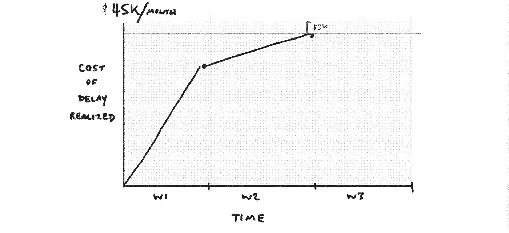
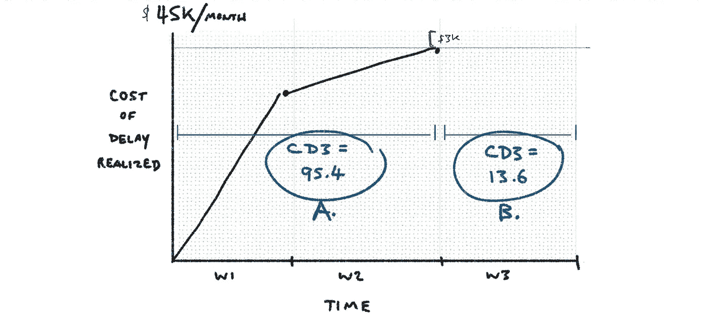
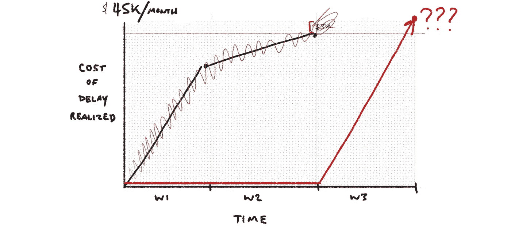
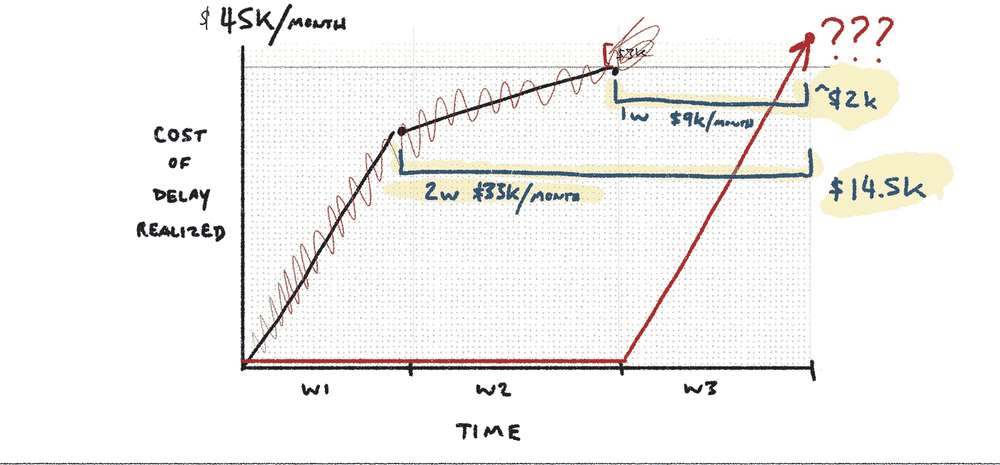
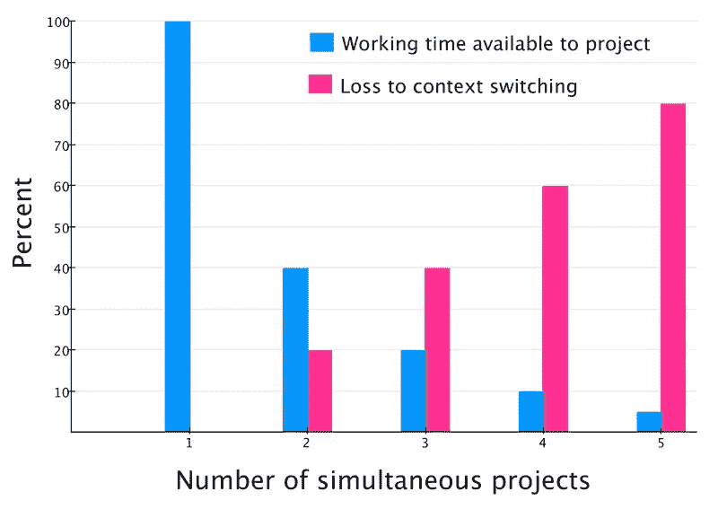
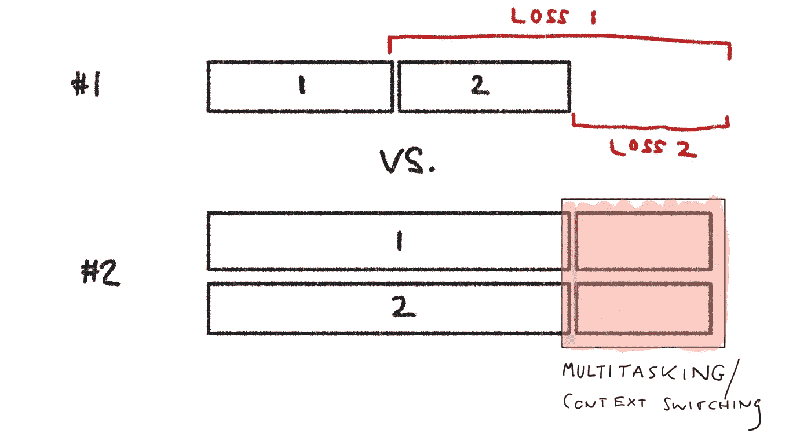

# 就差一个冲刺了！？

> 原文：<https://medium.com/hackernoon/just-one-more-sprint-9832c11cf9b3>

在这篇文章中，我将使用一个常见的场景来强调一些关键的产品开发优先级概念。具体来说，我们将深入研究停止一项工作，并开始另一项工作的决定。

# 我们继续走吗？

先说个例子。当我把它画在下面时，你可能会说“这是一个不用动脑筋的问题！”从某种程度上来说是的，但是跟着我。

示例…

我认为一个新的工作流程将每月产生 45，000 美元的额外收入(延迟的[成本)。我们工作了两周，实现了该价值的很大一部分(每月 4.2 万美元)。我们应该“完成项目”(在这种情况下，向工作流添加一个额外的选项)，还是应该立即停止并开始新的工作？](http://blackswanfarming.com/cost-of-delay/)

请注意，桌面上还有$3k，这是尚未提取的价值。

# 比较 CD3(已完成工作和剩余工作)

让我们看看 **CD3。** [CD3 是延误的成本除以持续时间](http://blackswanfarming.com/cost-of-delay-divided-by-duration/)(一周是 0.22 个月)。将 CD3 视为创造价值的速度(当价值被表述为每个时间段的价值时，一个基于时间的机会成本…我们的延迟成本)。

到目前为止，工作(A)的 CD3 为 95.4。剩余工作(B)的 CD3 为 13.6。

换句话说，这意味着 A 以每月 9.54 万美元的速度创造价值，而 B(如果我们继续努力)将以每月 1.36 万美元的速度创造价值。

# 备选方案:待办事项

假设我们有一个待处理的项目，延迟成本为每月 4 万美元，预计持续时间为 5 周。4 万美元/1.1 个月= 36.3。答案很明显。从待办事项中提取项目并停止工作。36.3 英寸> 13.6 英寸(2.6 倍)

> 但是，但是，但是…
> 
> 团队已经在做这个了！上下文切换怎么样？这个队势如破竹！我们应该就此了结。也许一个工程师可以继续工作，我们可以平分他们的时间。也许…

想象一下在你所有的努力中混合这种类型的思考。想想影响。听起来很疯狂，对吧？但这种事经常发生。这是一个容易落入的陷阱。一旦一个团队开始努力，就会有各种各样的理由继续下去。

# 标准是:一个大批量

但是让我们暂时退后一步。大多数团队没有增量交付。他们不是增量交付，而是这样做:

看他们是怎么等到第三周结束才“释放”的？

他们有一个需求/模型/无论什么的清单，并且他们一次就完成了。超级高效！先来看超级明显的问题。由于没有更早地释放增量，他们未能在系统中移动潜在价值:

在我们最初的方法中，第一个增量在两周内“赚”到 14.5 千美元，第二个增量在一周内“赚”到额外的 2 千美元。在上面的例子中，通过在第三周结束后才发布，我们“损失”了$16.k。这并不好。

但是更大的问题是，由于没有增量发布，我们增加了风险……风险是每月不能赚到 45，000 美元，风险是当集成时整个事情不能工作，风险是我们可能没有发现一些未被锁定的价值并把整个努力带到一个更好的地方。通过更早地发布，我们可以更快地改变进程。

# 让我们双管齐下！

经常发生的情况是团队合理化“双管齐下！”第一个绊脚石是多任务处理的成本:

https://leanpub.com/managing-risk-with-agile/read

因此，如果试图同时做到这两点，我们会因为上下文切换而损失 20%。稍微偏离一下我们的例子——因为我很懒，不想在我们的例子中弄清楚这一点——我们在下面看到，对于**选项#2** (同时做这两项)，我们招致损失 1 和损失 2:

因此，通过优化“走额外的一英里”和“完成我们开始的事情”，我们正在承担损失。团队正在为积极主动、不退缩的表象买单。

# 全职工程师！

但是团队会拿出最后一张牌…那就是有一个“全职工程师”致力于完成最初的工作。这是一个规避上下文切换论点的常用策略(“嘿，没有人是多任务的！”).大概是这样的:

*   完成项目(3，000 美元/月延迟成本)=账单
*   开始新的待定项(延迟成本为 40k/月)= Mary、Lin 和 Chili

> 当我们在做的时候，应该有人坚持下去。为什么不是比尔？团队的其他成员应该开始这项新工作。

这里考虑几个问题:

*   剩余的 3k CoD 的 CD3 将低于 13.6，因为 Bill 将独自工作。最初是为 4 个人安排的一周，所以一个人可能需要 3 周，或者 CD3 为 4.5。
*   相比之下，Bill 为 4 万美元的 CoD 项目贡献了 25%的费用，该项目计划花费 5 周时间。他个人将贡献 36.3 CD3 的 25%(0.25 *(40/1.1))，或 9。哦看…9>4.5！

所以……不管你怎么削减，只有一个人在上面并不能改善情况。即使 Bill 是一名专家，并且只有专家 Bill 可以完成这项工作，事实仍然是组织允许专家 Bill 从事价值低得多的工作。这可能是一个结构性问题，完全超出了比尔的控制范围，但这就是现实。

# 结论

那又怎样？这有什么意义。

*   增量交付
*   避免沉没成本偏差
*   根据你今天所知道的做出经济决策
*   如果你已经从一个机会中获取了大部分价值，那么继续前进
*   注意多重任务和 FTE 陷阱

谢谢！