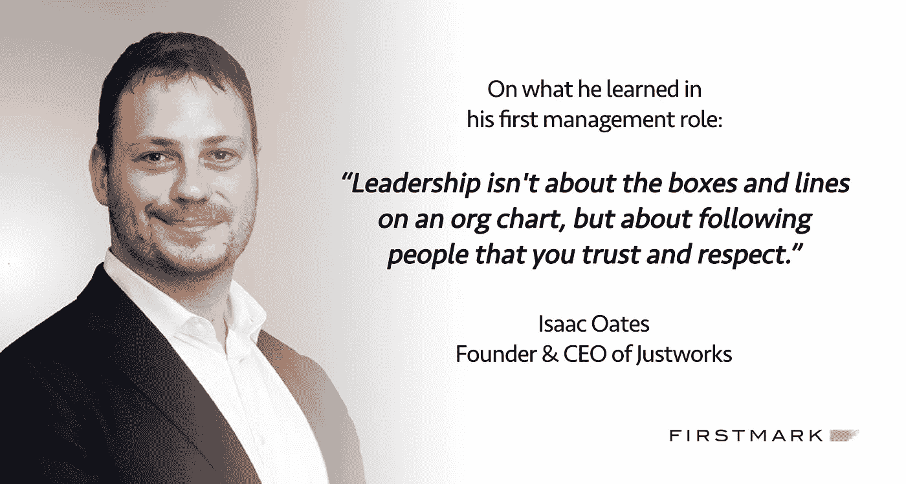

# Justworks 的艾萨克·奥茨讲述了如何委派 CEO +更多

> 原文：<https://medium.com/hackernoon/justworks-isaac-oates-on-how-to-delegate-as-ceo-more-66092b1554d5>

## 有效领导系列

*Isaac Oates 是 Justworks 的创始人兼首席执行官，just works 是发展最快的人力资源技术公司，通过让企业家和企业在一个地方获得大公司的福利、自动化薪资、人力资源工具和合规支持，帮助他们充满信心地成长。FirstMark 是 Justworks 的骄傲投资者。*

*在他职业生涯的早期，艾萨克同时在亚马逊和美国陆军担任情报官员——这两个职位磨练了他领导方法的各个方面。在 Etsy 收购了他的第一家初创公司 Adtuitive 后，Isaac 领导了 Etsy 的人力资源和支付部门。他在 2012 年创立了 Justworks。我们最近采访了他，以了解他作为一名领导者的成长，他作为首席执行官如何处理授权等更多信息。*

## 你的第一个管理角色是什么？你从中学到了什么？

我的职业生涯始于亚马逊的一名软件工程师，在那里我从事“第三方支付”(3PP)，这是一个在市场上的买家和卖家之间转移资金的系统。大约三年后，我在团队中担任了项目管理的角色。即使没有人在书面上向我汇报，我也有能力带领更广泛的团队取得成功。这是第一次真正明白领导力不是关于组织结构图上的方框和线条，而是关于跟随你信任和尊重的人。

## 在你职业生涯的早期，在你担任领导角色之前，你欣赏一个优秀经理的哪一个品质？

我在亚马逊的第一任经理菲尔·威尔逊非常关心我这个人。我 22 岁，刚从学校毕业，刚开始在支付团队做工程师。菲尔会和我谈论他自己的职业经历，帮助我思考我所面临的挑战。我认为最大的教训是，他可以通过提问而不是告诉你该做什么来领导。他真的很擅长让你得出自己的结论，但也让你到他想要的地方。这是我希望自己更擅长的事情。这需要很大的耐心。他给我们的支持更像是一个教练或哥哥，我们至今仍保持着联系。

> 最大的教训是，他可以通过提问而不是告诉你该做什么来领导。

## 作为领导者，你养成的最重要的日常或每周习惯是什么？

无论是在纸上，在电子表格上，还是在我的收件箱里，将任务分类成不同的组，然后一起迎头痛击，帮助我变得更有效率。例如，最近我在我的电子邮件账户里设置了一些过滤器，把需要回复的邮件从其他邮件中分离出来。这可能看起来很小，但正是这种习惯的改变帮助我对与我一起工作的人更加敏感。这极大地改变了我们的运营节奏。我还会在周日抽出时间起草电子邮件，在周一早上发出去。这有助于我在周末处理收件箱，而不会把工作丢给我的团队。

## 你的一对一会议使用什么框架？

我喜欢回顾我们一起设定的目标，讨论是否有合适的改变，然后交换反馈。我每个月有 30 分钟的时间和我的直接下属在一起，所以我们大部分的实质性讨论都是在小组会议上进行，而不是一对一。这是有意的——我认为小组会议有助于建立共同意识，减少政治。

## 你如何处理授权？你选择何时委派什么，你是如何适应的？

我很幸运地在 Justworks 雇佣了一些非常有才华的人，并与他们一起工作，他们在大多数事情上都比我好得多。这使得授权变得容易。也就是说，如果我仍然对他们的工作方式感到满意，或者这是一个高风险的项目，那么我会要求继续参与其中。有些事情我会一直密切参与，例如，影响或传达我们文化信息的活动，如晋升领导职位和全公司活动。

> 如果我仍然对他们的工作方式感到满意，或者这是一个高风险的项目，那么我会要求继续参与其中。

## 关于给予有效反馈，你会给第一次当经理的人什么建议？

给出有效的反馈很难，但随着时间的推移会变得更容易。我没有一个具体的框架，但我承认这个人的成就和他们付出的努力。我还明确表示，我的目标是帮助他们和整个公司表现得更好，他们应该接受这方面的反馈，而不是为了批评而批评。对许多人来说，给出反馈可能是头号管理挑战，包括非常资深和有经验的领导者。继续努力吧。

## 你会和第一次当经理的人分享什么独特的招聘技巧？

从基础开始。弄清楚这个人来自哪里，他们是干什么的，他们看重什么。然后问自己正确的问题。这个人会加强你的团队吗？你觉得他们有提升几次的潜力吗？他们有保持增长的好奇心吗？有时候你很幸运，找到了合适的人，但通常，要得到一个“是”需要很多个“不”。值得花时间。

## 想要更多吗？

查看我们对来自 [Box](/p/7903411a3831?source=user_profile---------2------------------) 、 [Slack](/p/c38970a181bc?source=user_profile---------7------------------) 、 [Oscar](/p/8735d895fc46?source=user_profile---------9------------------) 和 [Trello](/p/d1e0bfb6f2bf?source=user_profile---------4------------------) 的经验丰富的领导者的其他有效领导访谈。

*作为一名领导者(不是在你现在的公司)，有没有你真正钦佩的人，并且希望看到我们面试？把他们的名字和简短描述发给 jack@firstmarkcap.com。*