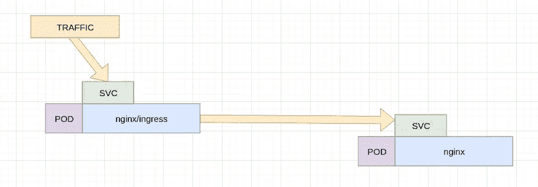

# K8 是一个小深潜

> 原文：<https://medium.com/hackernoon/k8-istio-deep-dive-c0773a204e82>

我一直在玩 **Istio** 大多是出口，但今天我想写的是**入口**。

基本上**Istio**Ingres 是一些代理(**特使**)，它们相互交谈以处理一般的访问、节流和应用程序路由。

关于 **istio** 方法真正有趣的是 sidecar 注入，想象你正在运行一个容器 execs **nginx** (port80 )S

**istio** 所做的是"**注入**一个 sidecar 容器，它运行在同一个 pod 上，这意味着与**特权**模式和 **NET_ADMIN** 功能共享内核网络名称空间。

通过这种方式，他们可以保证对服务或相互 tls 进行全面跟踪。

简单来说，它看起来像这样:


Istio workflow

这与传统的 nginx 入口有很大的不同，nginx 入口与一个可向 pod 提供 iptables 的服务对话，例如:



nginx ingress workflow

那么主要区别是什么呢？这个容器叫做 istio-proxy，它拦截 T21 流量，我对它拦截流量的方式特别感兴趣。

提示是当你看到:


这意味着在内核名称空间所代表的 struct net(或 pod)中，这个容器需要有**特权**并拥有 **NET_ADMIN** ，如果您管理 ti **SOCK** 选项，如 **IP_TRANSPARENT** 或管理 IPTables 规则，而不是针对 kube 主机，而是针对绑定 pod 的 struct net，这一点尤其重要。

因此，如果您在 8000 上创建了使用 nginx 侦听的 pod，并为其注入了 istioctl，那么边车上的 iptables 将看起来像这样(注意，您必须在启用特权模式的情况下输入它**docker exec—privileged-it 75375 F8 d4c 98 bash)**

```
root@nginx-847679bd76-mj4sw:~# iptables -t nat -S
-P PREROUTING ACCEPT
-P INPUT ACCEPT
-P OUTPUT ACCEPT
-P POSTROUTING ACCEPT
-N ISTIO_INBOUND
-N ISTIO_OUTPUT
-N ISTIO_REDIRECT
-A PREROUTING -p tcp -j ISTIO_INBOUND
-A OUTPUT -p tcp -j ISTIO_OUTPUT
-A ISTIO_INBOUND -p tcp -m tcp --dport 80 -j ISTIO_REDIRECT
-A ISTIO_OUTPUT ! -d 127.0.0.1/32 -o lo -j ISTIO_REDIRECT
-A ISTIO_OUTPUT -m owner --uid-owner 1337 -j RETURN
-A ISTIO_OUTPUT -m owner --gid-owner 1337 -j RETURN
-A ISTIO_OUTPUT -d 127.0.0.1/32 -j RETURN
-A ISTIO_OUTPUT -j ISTIO_REDIRECT
-A ISTIO_REDIRECT -p tcp -j REDIRECT --to-ports 15001
```

现在很明显，这是将所有传入流量重定向到 80 到 150001，这是 istio-proxy 的 bonud，envoy 做到了这一点，它会将流量发送到 nginx(80)。

netstat 显示:


15001 在那里，让我们看看 tcpdump:


因此，最初有流量到达端口 80，但它被重定向到本地主机:15001，这是特使，下一步实际上是将流量发送到 nginx itelf，这就是为什么我们看到一个双" **HEAD** "请求，一个发送到特使(由 iptales 强制)，一个发送到 nginx。

稍后我会再写一些关于如何设置所有入口元素的内容。