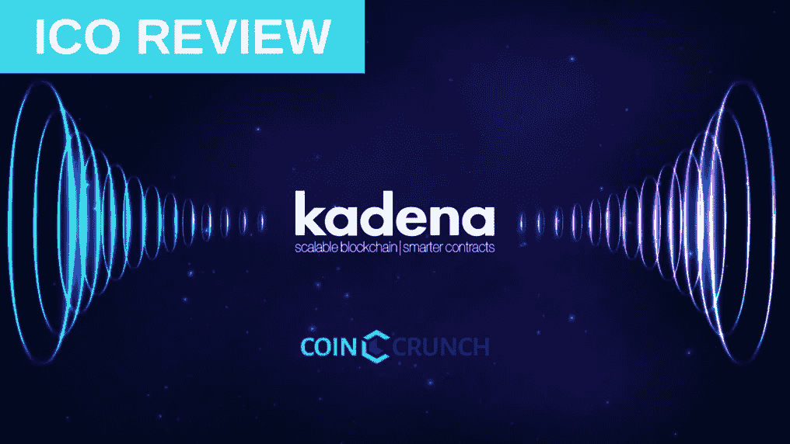
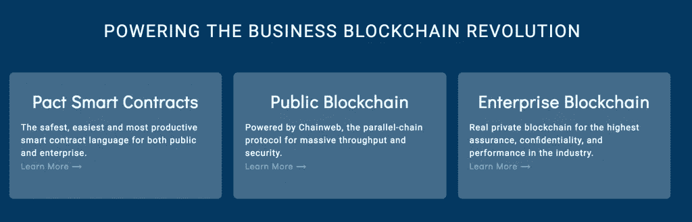
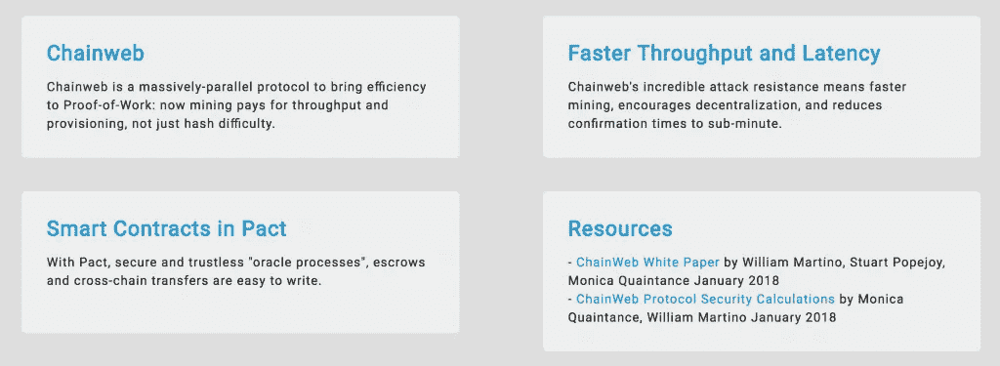
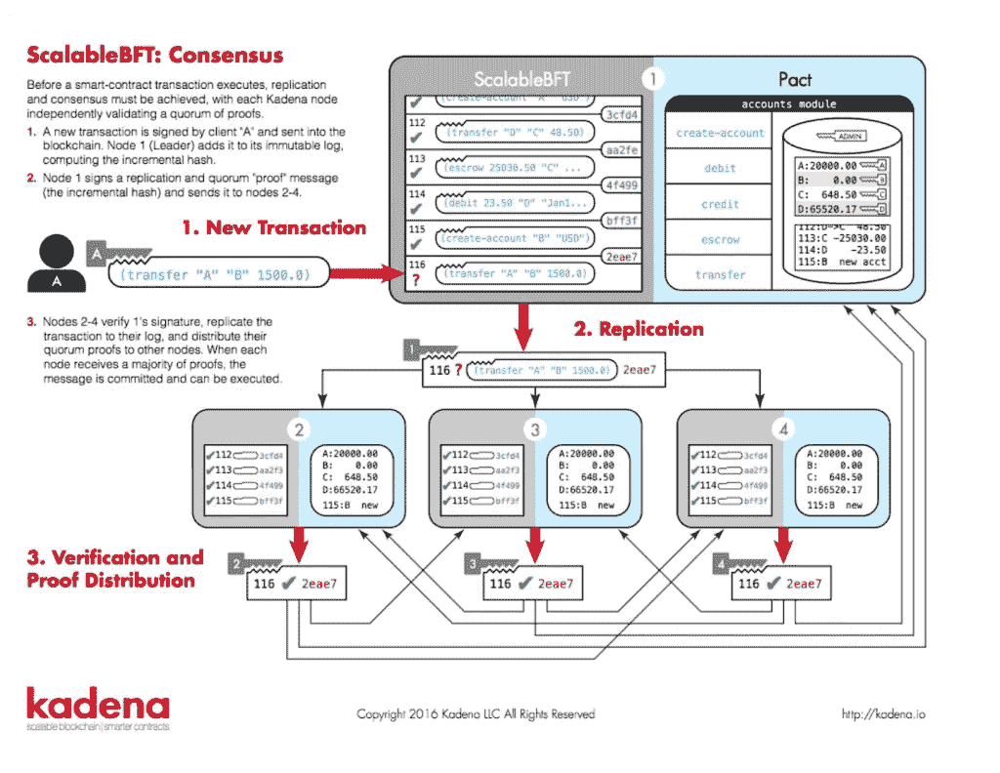

# Kadena 评论—可扩展的区块链/更智能的合同

> 原文：<https://medium.com/hackernoon/kadena-review-scalable-blockchain-smarter-contracts-71cb30e37554>

Kadena 正在使用名为 Chainweb 的新共识机制创建一个公共区块链，该机制为基于工作共识的链系统提供了一个扩展解决方案。

# 问题

*   区块链空间正以令人难以置信的快速发展。随着第二层和 dApps 的不断发展，由于可伸缩性的问题，平台遭受拥塞和长时间的事务延迟。
*   此外，试图用新的共识模型(如 Proof-of-stage(PoS ))取代 PoW 或将协议与链外网络和流程(支付通道、侧链)集成的努力降低了原始 PoW 设计的保证、审查阻力和不信任性质。
*   因此，该空间目前处于一种不确定状态，即在哪里平衡大量使用(大众采用所必需的)和安全性。

# 解决办法

*   为了解决这些当前 power 限制，我们提出了 Chainweb，一种并行链 power 架构，它将数百或数千个单独挖掘的对等链组合成单个网络，能够实现每秒超过 10，000 个事务的吞吐量。
*   与其他平台提出的共识形式不同，Chainweb 的并行网络模型在不使用侧链或仅使用区块链的特定部分来处理大量交易的情况下保持安全性。Kadena 的测试发现他们的提案具有极高的安全性，该提案旨在最终生产大约 1000 种不同的链条供公众使用。
*   在多个并行链同时工作的情况下，如果特定链被 dApp 拥塞，则可以利用不同的链来进行 ICO。
*   Kadena 的解决方案为每个链提供了主链功能，因此不是解决可伸缩性的侧链方法。

# 主要特征

Chainweb — Kadena 的“大规模并行公共区块链平台”将利用 Chainweb 协议作为其共识机制。

*Chainweb 是一种经过实践检验的并行链架构，可实现海量吞吐量。*

多个链将它们的 Merkle 根(Merkle 根是块中所有事务的所有散列的散列)相互集成，确保尽管每个链充当唯一的区块链，但它仍然可以与其他链共享信息并达成共识。

每一个链都将产生 Kadena 的令牌，Chainweb 的协议将确保同一枚硬币不能同时存在于两个链上。

Chainweb 将使用简单支付验证(SPV)来删除发送到另一个链的硬币，然后在接收链上创建硬币。

该过程是通过 SPV 进行的不可信的破坏性跨链硬币转移，发生在智能合约级别。

***无信任破坏性跨链转移流程分步指南:***

*如果丹想把他的硬币从链 A 移到链 B，他会采取以下步骤:*

*   步骤 1: Dan 的硬币目前在链 A 上，他将指定删除哪个帐户上的硬币&要销毁的硬币数量。
*   步骤 2:然后，Dan 将指定他正在向链 B 发送他的硬币，并且还包括链 B 上接收这些硬币的账户。
*   第三步:交易完成后，丹会把 Merkle 的证明拿到“创造链”去证明他确实删除了他的硬币。(此步骤在智能合同级别完成)
*   第 4 步:智能合约将运行 SPV，验证第 1 步和第 2 步中的操作已经发生，然后将硬币分配到指定的帐户。
*   第五步:“删除硬币交易 ID”然后被消费，以防止被使用两次。

# 路标

*   2018 Q1 —白皮书发布，首轮风险投资。
*   2018 年 Q2——认证投资者私人销售开始，Testnet 在 Q2 中部发布。
*   2018 Q3 — Testnet 硬分叉。
*   2018 Q4 — Mainnet 发布，主 ICO 进行。

# 代币经济学—目前不适用

# 潜在考虑因素

*   主要 ICO 将于 2018 年第四季度发布，认证投资者私人销售将于 5 月开始。

# 团队+顾问

**Stuart Popejoy** — Founder *UC Berkeley*

*   摩根大通新产品部门前执行董事。
*   在为金融行业构建交易系统和交易所骨干方面拥有超过 15 年的经验。

**Will Martino** — Founder *Yale University*

*   摩根大通区块链原型车 Juno 的首席工程师
*   在美国证券交易委员会密码工作组担任技术领导职务
*   SEC 取证分析工具包的首席工程师是否整洁

**Monica Quaintance** — Lead Engineer & Adoption Strategist *Columbia University*

*   SEC 的定量分析程序员
*   高纬环球的投资银行家
*   《出租跑道》的高级数据库工程师

**Ben Jessel** — Head of Growth *University of Reading*

*   在金融服务咨询公司 Capco 领导金融科技和创新战略。
*   在银团贷款和交易后衍生产品处理领域，领导了许多客户的分布式总账项目。
*   曾在包括埃森哲和德勤 MCS 在内的各种四大咨询公司工作，参与运营转型和技术战略。

**Vivienne Chen** — Social Media & Office Administration *Princeton University*

*   带来了在新闻、网络媒体、博客和创造性写作方面的经验，之前在 Scholastic 从事编辑工作。

**Mark Nichols** — Senior Engineer

*   Mark 带来了丰富的 Haskell 产品开发经验，在金融系统、DSL 设计和大数据方面经验丰富。

**Paul Giordano** — Advisor, Insurance

*   Paul 是行业资深人士，曾担任 Ironshore 的总法律顾问兼董事长、Syncora Holdings Ltd .的首席执行官以及 XL Capital 的金融产品和服务首席执行官兼总法律顾问。

**Wayne Martino** — Legal Counsel & Business Advisor

*   Wayne 在新兴增长行业的公司和企业家方面拥有数十年的法律和商业经验，包括商业互联网、新媒体和纳米技术的早期阶段，自 2013 年以来，他一直在加密货币生态系统领域工作。

# 合作伙伴和投资者

*   阿西莫夫风险投资公司—【asimovventures.com 
*   亚稳定首都[—metastablecapital.com](http://metastablecapital.com/)
*   CoinFund — [coinfund.io](https://coinfund.io/)
*   千瓦资本—【kilowattcapital.com 
*   multi coin Capital—[multi coin . Capital](https://multicoin.capital/)

**其他资源:**

*   Github — [Kadena LLC](https://github.com/kadena-io)
*   [Coindesk 文章](https://www.coindesk.com/evolution-kadena-first-real-private-blockchain/)
*   [解锁区块链文章](https://www.unlock-bc.com/news/2018-02-07/kadena-raises-225mm-in-first-round-of-funding-for-innovative-blockchain-platform)
*   [Cryptal 新闻文章](http://www.cryptalnews.com/kadena-funding-round-blockchain-project/)
*   [EThereum.com BTC 篇](https://www.btcethereum.com/blog/2018/03/08/jp-morgan-blockchain-spin-off-kadena-hires-new-head-of-growth/)
*   [Sammantics 文章](http://sammantics.com/blog/2016/11/29/kadena-the-first-real-private-blockchain)
*   [ChainWeb 白皮书](http://kadena.io/docs/chainweb-v15.pdf)
*   [ChainWeb 协议安全计算](http://kadena.io/docs/chainweb_calculations_v7.pdf)

# Kadena 与联合创始人 Will Martino 和其他团队成员一起编写了 TG 问答。

问:那么多平行区块链，矿工们如何保证每个链条的安全？

答:和比特币或以太坊一样，只是规模更大。大多数网络挖掘整个东西，而不是构建坏块。通过构造，包含的每个块都必须被发布

问:用户是被分配了一个连锁店，还是选择了他们自己的连锁店供应商？有什么原因会导致特定的连锁店在他们自己的链上争夺用户吗？

答:自己选择。每条链都像比特币或以太坊一样开放、无主、不可信……只是交易的链不止一条。

**问:例如，如何防止每个人选择相同的链条？**

答:拥堵，如果每个人都使用同一辆车，那么就会拥堵，费用也会攀升。

**问:所有平行链都是什么时候创建的？**

答:在创世纪，当一个硬分叉发生在分叉块。网络中的所有链都需要知道其他链存在什么+它们的对等链是谁。

问:所以所有成千上万的平行链条都是在创世纪创造的？然后，为了增加容量，有一个增加新链的硬分叉？

答:是的，不过我们会看看我们是否会推出 1k+连锁店(我想这样做，但最初可能会有些过头)，所以我们可以推出 500 家连锁店，如果网络开始拥塞，可以增加到 1000 家。

**问:嘉手纳和 ICON 相似吗？**

答:ICON 更接近 Dfinity/Cosmos，所有这些都更接近 IBM 的结构，而不是 Kadena。关于共识——ICON 使用确定性 BFT (PoS)达成共识，并使用互操作网络(基本上是分片)进行扩展。这种方法有一堆技术限制和麻烦，它是一个较长的卷积，但是 TL；dr 是这种方法对私有链很有效，但是当用于公共链时，有一个被破解的安全模型(信任身份而不是物理)+流动性问题。回复:智能合同——ICON 没有，他们有带存储 API 的 python。至于 kadena，为了公众的共识，我们有 chainweb(带上 PoW，加上一点图论，轻轻摇一摇，瞧…疯狂的高吞吐量，疯狂的高安全性，保持对物理学的信任)。至于智能合约，我们有 Pact(超级安全，超级可读，为非程序员理解而设计，可正式验证，快速开发)，它将成为下一个 SQL。

**问:只有战俘共识机制才能加入辫子吗？**

答:不，任何完全概率共识原语都可以使用。我们在报纸上登了一行关于空间证据的文章，但是被撤了。Chainweb 实际上是使用“概率努力”的一种低级方式，因为缺乏更好的术语，更有效。然而，像 PoS 这样的东西是行不通的——我的意思是，我肯定有人会尝试为它修改 PoS，但是安全模型刚刚被破解。你可以用一种你不能用于 PoS(或任何确定性 BFT)的方式来传递一个被挖掘的根所代表的保证——它们只是不把保证以同样的方式钉在物理上。

**问:已经做 PoW 的硬币可以加入辫子吗？**

答:不，braid 的配置是在发布时决定的，除非涉及硬分叉，否则不能更改。这不是一个侧链的事情。不是只有一条“一切最终都由我决定”的链，而是有 N 条链可以在一条辫子中平等地完成决定。注意:如果你想变得超级哲学，那么答案也许是，但是你会怎么做，为什么这是一个坏主意/行不通有更多的星号比这个消息有字符。

**问:Kadena 认为自己是一个可互操作的解决方案吗？**

是的。顺便说一句，我一直不明白为什么 interop 如此重要——如果你是一个私有的区块链，你可以为它使用一个 oracle 并编写一个 API(我们已经做了 30 年，并且非常擅长这个)。如果你是一个公共区块链 w/ smart contracts，只需添加 merkle proof validation(这样你就可以做链上 SPV)和瞧！通过允许用户提供不可信的证据，你现在可以在完全独立的链之间传输(从而交流)。除此之外还有一点(比如这对于比特币证明非常有效，因为 hashrate 非常高，所以顶层 hash 的难度非常大)但这就是要点。SPV 对消费者没用(只需使用 Oracle/运行完整节点)，但对区块链互操作非常有用。

无论如何，嘉手纳公众将有这种能力——或多或少的任意 SPV(不能保证它对所有 1k 代用币都有效…那是很多代用币)。此外，我们在链上 SPV 的基础上互操作，使链网工作。求解比特币 kadena interop 实际上是如何发现 chainweb 的(求解比特币的 interop-> doge coin 如何->所有不是 kadena 的硬币如何->那么 pact 如何->让我们有两个链来使问题有意义->哦，废话，如果我们使用图论，这适用于 N 个链)。

**问:这是一个可扩展的电源解决方案吗？**

答:是的……如果我告诉你可伸缩性的解决方案是 PoW 会怎么样？

这实际上有点疯狂，你为 chainweb 设置的吞吐量越高，它就越安全(因此延迟就越低)。当然，这是有界限的，但是对于有用的配置来说，这是正确的。

**问:ChainWeb 的可扩展性理论上是无限的吗？**

答:从技术上来说，这是没有限制的，因为你可以继续让直径变得更大……但是在你需要开始发现/制作直径大于 20 的新图形之前，我们会用完 fiber _way_ 的。

问:权力和经济权力有什么关系？

答:PoS 和 dpos 是一样的，经济实力法则。

转向 PoS 或 dpo 是以失去信任的系统为代价来获得可扩展性。至少有了权力，你就维持了一个不可信系统。

经济力量总会找到一种方法，在网络上最大化他们的动机，这是不可避免的。此外，我一直认为 PoS 有可能变成寡头垄断——如果 20 个人拥有令牌的大部分，并且不想失去对网络的控制，那么你给他们的价格都不够……你就有点不走运了。至少在权力上，任何人都可以成为主要参与者，如果他们在资源上花了足够的钱(开放系统)。

**问:团队和顾问令牌的授权时间表是怎样的？**

答:初始授权来自 genesis 块的投资者份额，它没有授权限制，不像平台份额有长期授权。一般来说，这些初始团队和顾问令牌的有效期在 1 个月到 1 年之间，与整个经济相比相对较小。团队和顾问的后续资助将来自平台份额，并将相应地授予——发布后 T+0 至 T+1 年根本没有授予，发布后 T+2 至 T+5 年平台份额按月线性授予。

问:团队和顾问的授权是否包含在智能合同中？

答:我们需要问问我们的律师和会计师，这样做的最佳方式是什么——我希望它被写进一份智能合同，但出于某些原因，我们可能会用另一种方式来做。

**问:你的智能合同是由独立的网络安全公司审计的吗？**

答:我们还没有做到这一点，但我们的目标是在 4 月份开源 pact 的正式验证系统 v1，所以，实际上，我们将对 FV 系统进行审计，然后在合同本身上使用 FV 系统。

**问:你们产品的代码已经发布了吗？有没有被独立的网络安全公司审计过？**

答:这基本上是前一个问题，但范围更广——它将全部开源，但是的，我们将在发布前接受审计……可能会在今年夏天。

**问:实现 100k tps 实际可行吗？**

答:是的，我认为 100k tps 链 web 配置(即 10k 链)是可行的，尽管我们首先需要大量的利用率来证明硬分叉到该容量是合理的，但我们可以做到这一点(例如，我们正在运行 50k tps 配置，即平均使用 10k tps，峰值介于 40k 和 50k tps 之间)。采矿所需的能量是一样的(每条链的难度减半，但链的数量是原来的两倍)。

**问:关于你的公开区块链和私人区块链之间的联系。有什么联系吗？他们使用相同的令牌吗？假设有 1 亿张代币可供人们购买。如果某个公司想和你建立一个私人区块链，他们会使用一套这种 100 万代币还是完全不同的东西？**

答:我们的公共和私有协议都使用相同的智能契约语言(Pact ),但是它们(有意地)一点也不相似。我们的私有链是可扩展的拜占庭容错(BFT)协议，不涉及令牌；我们的公共协议被称为 chainweb，它使用 PoW 和一些图论编织(你可以在我们的白皮书中了解它)，这就是令牌所涉及的地方。

**问:为什么 Pact 图灵不完整？**

答:Pact 不是图灵完备的，因为我们不想在智能契约中出现递归、无限循环等。

**问:你觉得闪电网让什么 Chainweb 过时了？**

答:Lightning network 是第二级扩展解决方案，而 chainweb 是第一级。所有二级解决方案(几乎)都适用于一级解决方案，所以它们并不真正竞争。你可以毫不费力地将 lightning 接入 chainweb。

**问:闪电网和 Chainweb 哪个好？**

甲:两个都好。由于流动性/集中化/注册问题，Lightning 不太适合一般的可扩展性解决方案，而且一般的解决方案应该位于堆栈的基础层，但它在特定情况下可能很有意义。

**问:嘉手纳怎么比演职员表好？Credits 声称它每秒处理超过 23 万笔交易。**

答:首先，它使用了一种经过验证的共识协议(POW)——我认为人们忘记了 POW 实际上是可行的，这是不可思议的。当论文发表的时候，这是一个很大的未知数，我觉得人们认为任何东西都可以工作。另一点:我认为，它是这样扩展的，因为它是对等的，其中你有连接的共识域(我很难相信任何顺序 exec env 可以做 230k `hello world`s let along 一些有用的东西)；问题是，如果分类帐集中在单个共有 env 中，我可以破坏其中一个连接的子共有 env，并将该破坏移动到另一个子共有 env。

**问:Chainweb 协议能超越这个水平(每秒 23 万次交易)吗？**

答:是的。我会推荐吗？可能也不需要一个很好的理由。230k tps 对于 1 级系统来说太大了。全球范围内，Visa 的峰值为 40k tps，但平均为 10k tps。很难想象我们会突破 10 万 tps。在此之前，应尝试 2 级扩展解决方案。

## 这篇文章最初刊登在我们的网站上！你可以在这里找到[。](https://coincrunch.io)

# 想要了解区块链和加密货币的最佳新闻、评论和信息，请访问 [coincrunch.io](https://coincrunch.io) 或查看我们的网站:[Youtube](https://www.youtube.com/channel/UCXyrBCWaRJzHfOtnWaR47Qw)|[Twitter](https://twitter.com/coincrunchio)|[脸书](https://www.facebook.com/realcoincrunch/) | [Reddit](https://www.reddit.com/user/coincrunchio)