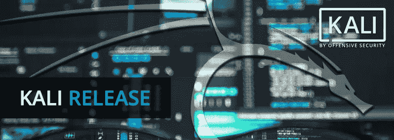
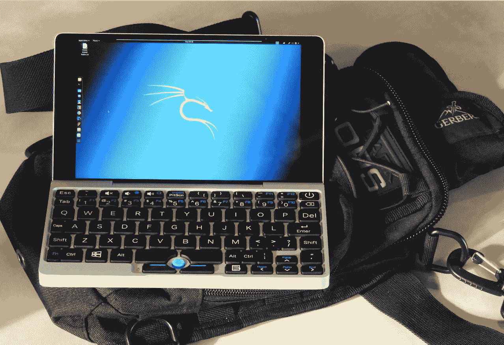
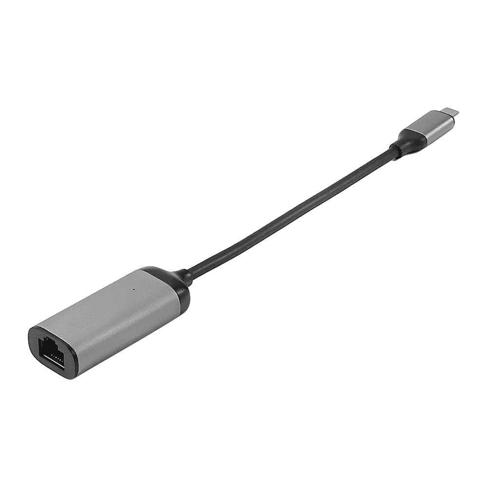
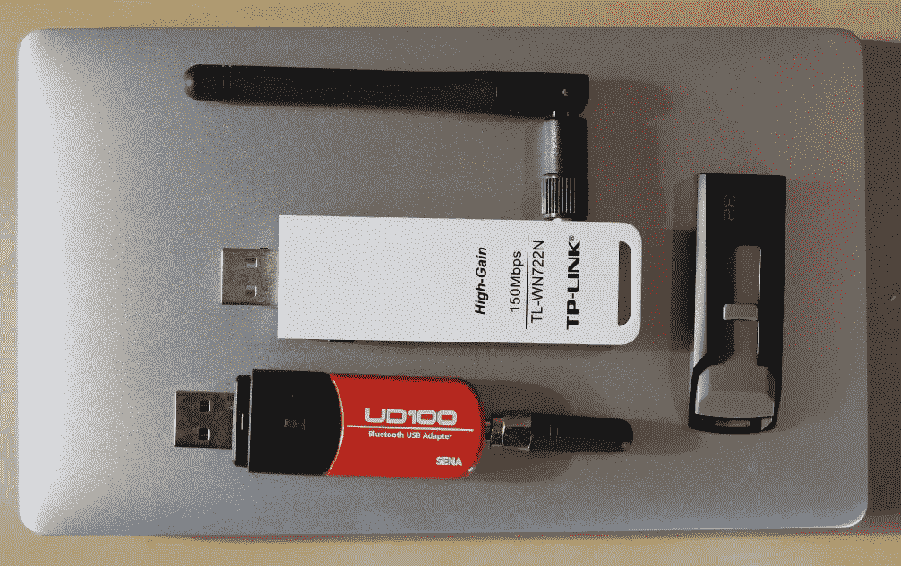

# Kali Linux 在你的口袋里与 GPD 7 迷你笔记本电脑。

> 原文：<https://medium.com/hackernoon/kali-linux-2018-2-on-your-pocket-with-the-gpd-7-mini-laptop-77b0d59dec40>



那么十年过去了，[上网本是不是终于又凉了](/@tomac/qpd-pocket-7-the-return-of-the-hacker-netbook-fe9be1b02ebf)？2009 年，个人电脑的发展达到了顶峰。上网本非常时髦，因为平台持有者尽最大努力将尽可能多的计算能力挤进尽可能小的空间。鉴于我们的智能手机变得如此强大，它们的无处不在几乎消失了。你正在阅读这篇文章的手机，或者可能在你的口袋里，或者在你的包里的手机，是一个便携式计算的发电站——但是想象一下，如果没有比它大太多的东西，你可以在上面进行实际的计算机工作。一台运行最新版本卡利 [linux](https://hackernoon.com/tagged/linux) 的超便携电脑。

今年早些时候，[购买了一台 GPD Pocket 7](https://bit.ly/2OzW1d0) ，这是一台便携式视频游戏机大小的迷你 PC，配备四核英特尔 Z8750 CPU、8Gb DDR3 RAM、128Gb 三星 eMMC 存储、制造商称应该可以运行长达 12 小时的 7000 mAh 电池、WiFi、蓝牙、HDMI 端口以及这种大小的笔记本电脑所需的一切。这款小型电脑的尺寸仅为 7.1 英寸 x 4.2 英寸 x 0.7 英寸，这使得它在合上盖子时仅比一部大型智能手机稍大一点。这东西看起来很可爱。它有风格化的苹果风格的金属外壳，而不是更常见的塑料外壳，但你是否能真正把 GPD 放在你的口袋里取决于你的口袋有多大。GamePad Digital (GPD)是一家位于中国深圳的科技公司。在其他产品中，他们已经开发了几款在 ARM 架构和 x86 Windows 上运行 Android 的手持视频游戏机。虽然 Pocket 并不便宜，但也有可能以 539 美元的价格买到它，与最初的 GPD 众筹价格相同。



正如笔记本电脑和 linux 经常出现的情况一样，即使制造商提供了自己的 Linux，并且社区驱动的支持已经包含在最新版本的 Linux 内核中，硬件发布后不久的支持仍有许多不足之处。不幸的是，最新的 Kali 需要一些内核补丁和变通办法才能在 GPD 上运行。与此同时，人们正在做的是从 pendrive 安装特别的 Ubuntu 或 Xubuntu 映像([我之前写过关于](/@tomac/qpd-pocket-7-the-return-of-the-hacker-netbook-fe9be1b02ebf))，然后通过脚本安装他们需要的所有 Kali 工具，如 katoo Lin(【https://github.com/LionSec/katoolin】)，这将有效地将几乎任何基于 debian 的发行版转换成(或多或少)完全成熟的 Kali 平台。

就这样，直到[瑞森](https://twitter.com/Re4sonKernel)，一个因面向 Linux 构建的 Raspberry Pi pentest 而闻名的受人尊敬的黑客，把事情掌握在他的手中。Re4son 发布了一个为 GPD Pocket 定制的 Kali Linux 镜像，包括最新的 Kali。

现在在 GPD 中安装 Kali 就像在普通 PC 中一样简单。以下是您应该遵循的步骤:

```
Download the latest ISO image from here:[https://whitedome.com.au/re4son/download/kali-pocket/](https://whitedome.com.au/re4son/download/kali-pocket/)Write the image to a USB drive (DD, Rufus, Win32DiskImager, ..)Insert the stick into your GPD pocket, turn on and press F7 until boot menu pops upSelect boot from USB stickIn the Kali menu, select “Kali Live” and boot into desktopThere are two ways to install:
1\. The comfortable way with proper screen orientation but no encryption support
– select “Live (forensic mode)” and boot into desktop
– in Kali, run the debian-installer (if you booted into normal live mode, run GParted and unmount disks first)
2\. The 90 degree way – use this if you want to install kali in an encrypted volume
– select “Install”
– tilt your head 90 degreesNow you have to choose if you prefer to delete everything and install only Kali Linux or resize Windows and have both.RebootEnjoy
```

Pocket-Kali 映像只带有“top10”和“无线”Kali 工具集，以保持较小的尺寸。只需运行“kali-linux-full”就可以获得全部内容。

如果你选择将 Kali 与 Windows 10 一起安装，请记住，安装后 Windows 选项可能不会出现在启动 grub 菜单中。解决方案就像从根控制台运行“grb-update”并重启系统一样简单。

经过一些测试 Kali-Pi 当前版本:4.18-rc5-re4son+_1 我已经设法让 Kali 在 GPD pocket 上运行，一切正常风扇，唤醒/睡眠，WiFi/蓝牙，适当的屏幕旋转，图形和音频。

请记住，迷你 GPD 没有以太网端口，但这可以通过一个 [USB-C 千兆以太网适配器](https://www.gearbest.com/usb-accessories/pp_1020102.html?lkid=12446224)轻松解决。



由于它的大小和 Kali Linux，GPD 成为一个移动笔测试的全能设备。将它与一些外部设备(如大功率 wifi/蓝牙或 SDR 无线电接收器)相结合，将其变成最终的便携式驾驶机器。

