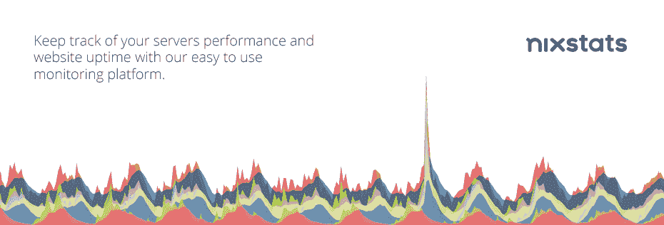
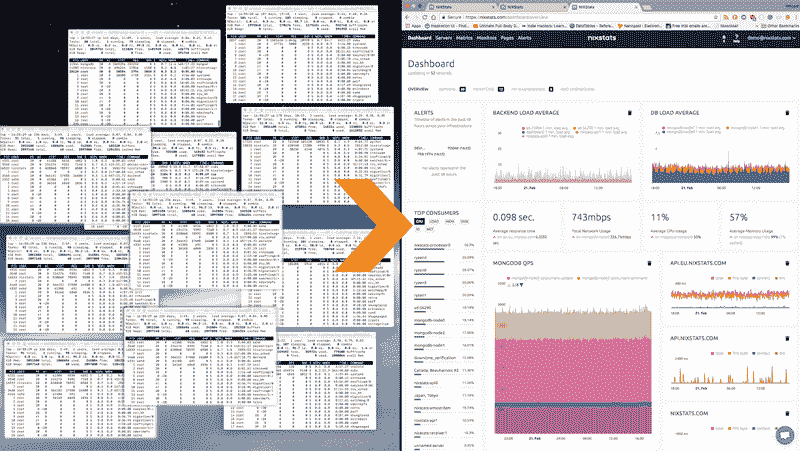
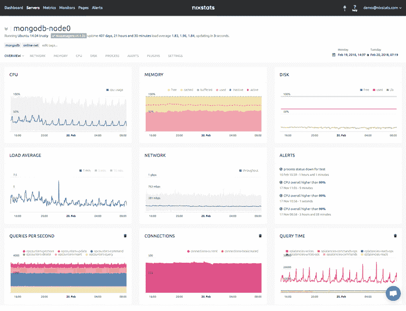
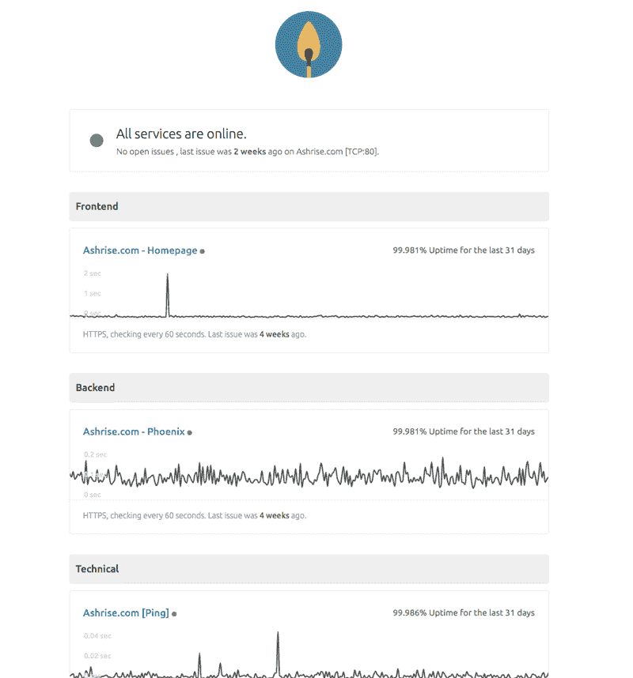

# 轻松跟踪您的服务器性能和网站正常运行时间

> 原文：<https://medium.com/hackernoon/keep-track-of-your-servers-performance-and-website-uptime-with-ease-5d606fe857b1>

[**Nixstats**](https://nixstats.com/) 是一款易于使用的服务器和监控[工具](https://hackernoon.com/tagged/tool)。您可以监控您的服务器 [CPU](https://hackernoon.com/tagged/cpu) 、内存、磁盘 I/O 和更多指标。monitoring agent 是开源的，很容易用自己的插件进行扩展，因此您基本上可以监控任何指标，并创建图表和警报。

[**凯文威廉大卫**](https://twitter.com/kwdinc) 采访了 [**文森特范梅根**](https://www.linkedin.com/in/vincent-van-megen-bb6442a/)[**Nixtstats**](https://siftery.com/nixstats)了解更多。

## 嘿，文森特，给我们讲讲 Nixstats 吧？

Nixstats 是一个服务器和网站监控服务。我们跟踪您的服务器和网站的状态，并在出现问题时向您发送警报。我们将数据存储在我们的时间序列数据库中，利用这些数据，您将能够创建自定义仪表板。

## 请多告诉我一些你想解决的问题？

最初我只是为自己建造这个。我为自己和其他公司管理了大约 50 台服务器。有一些开源和一些闭源选项，但没有一个真正拥有我想要的一切，或者非常昂贵。

我们试图构建的是一个仪表板，它是您所有数据指标的中心位置。

## Nixstats 与市场上已有的产品有何不同？

Nixstats 易于使用，监控代理易于安装，只需一个命令就可以在所有服务器上运行。无需在仪表板上添加服务器。一旦您运行安装程序，服务器将出现在您的仪表板上。

## 谁使用 Nixstats？您能告诉我们一些关于使用 Nixstats 的不同客户群的信息吗？

Nixstats 目前被各种各样的客户使用。我们有许多小型创业公司在早期阶段使用 Nixstats 来跟踪他们的指标，这有助于他们优化服务器设置。也有一些更成熟的公司在使用 Nixstats，最近我们有大量来自[**【new relic】**](https://siftery.com/new-relic)的新注册用户。

Nixstats 也被 web 和 VPS 托管公司使用，他们通常有很多服务器。目前，我们正在与其中一些公司合作，将 Nixstats 集成到他们的面板中。

## 您的客户如何使用 Nixstats？你能分享一些不同的使用案例吗？

我们的一些客户只对知道他们的服务器是否在线感兴趣。其他人需要更深入的信息，例如，他们想知道他们的数据库服务器是否没有超过 1000 个打开的连接。

## Nixstats 有没有您没有想到或预料到的独特用例？

我们的监控代理支持自定义插件，您可以创建自己的插件或使用我们现有的预制插件。我们收到了几个有趣的插件请求，比如监控打印机墨水量的插件。

## 有什么早期的“成长秘诀”或策略促成了你现在的成功吗？

开始的时候，我们是一个邀请测试版，这让球滚动得很好，在几个月内，我们有超过 500 个测试版测试人员。之后，我们引入了一个公共状态页面，这带来了更多的用户，因为它鼓励用户分享他们的正常运行时间和服务器统计数据。

## 在早期构建产品时，最大的挑战是什么？你是如何解决的？

最大的挑战是为时间序列数据找到合适的数据存储。我们已经用 [**MongoDB**](https://siftery.com/mongodb) 解决了这个问题。到目前为止，我们存储了超过 1TB 的数据，总体来说，它处理负载的能力很强。

## 你加入的最有趣的整合是什么？有什么对你特别有影响的吗？

对于 [**懈**](https://siftery.com/slack) 和 [**火箭来说。我们已经创建了一个自定义的集成，允许用户获取图表和统计数据。这是通过一个外向的 webhook 和 Rocket.Chat 的一些脚本完成的。**](https://siftery.com/rocketchat)

我们还提供短信、电子邮件、Slack、Webhooks、[**push pullet**](https://siftery.com/company/pushbullet)、Pushover、 [**Discordapp**](https://siftery.com/company/discordapp) 和[**Stride**](https://siftery.com/stride-by-atlassian)(HipChat)。

## 在我们结束之前，你运营公司所依赖的顶级产品是什么&你如何使用它们？

我们用 [Slack](https://medium.com/u/26d90a99f605?source=post_page-----5d606fe857b1--------------------------------) 进行内部沟通。谷歌应用套件**也大量用于电子邮件和其他服务。我们使用 [**亚马逊 SES**](https://siftery.com/amazon-ses) 发送电子邮件，使用[**Twilio**](https://siftery.com/twilio)**发送短信。我们真正喜欢的实时聊天是由 [**Crisp**](https://siftery.com/crisp) 提供支持的，最近我们已经升级到他们的无限计划，其中也包括一个知识库。****

*****原载于【siftery.com】**。*******