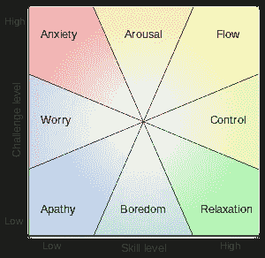

# 保持代码流动——程序员流动状态介绍

> 原文：<https://medium.com/hackernoon/keep-your-code-flowing-an-introduction-to-flow-for-programmers-3bce46486393>

Learning for life. In the pile: flow by Mihaly Csikszentmihalyi

## 优化您的编程生涯体验

我生活中最关心的事情之一是优化我的经历。我希望我的工作生活、空闲时间和人际关系充满价值、意义和乐趣。

这是一个赤裸裸的事实，从宇宙的角度来看，我们在这里的时间不长——只有几十年。地球已经有几十亿年的历史了，而我们现代的农业文明只存在了几万年。

相比之下，一个人一生的时间就相形见绌了。

我不想在这里变得病态。我只是指出，因为我们在这里的时间如此短暂，所以尽量利用它是有意义的。

我想过充满有意义经历的生活。我想尽可能多地生活在充满活力、有用、富有成效和挑战的状态中。

对我来说，这意味着努力创造一种生活，在这种生活中，我可以尽可能多地专注于我正在做的事情。作为一名程序员，我发现有无尽的机会来确保这一点！

> ***本文第一版出现在*******。
> 如果你喜欢，可以考虑下载我的*** [***编码倦怠清单***](http://codingmindfully.com/burnout-checklist/) ***。****

## *流程和代码*

*问任何一个程序员他们热爱他们的工作的什么，谈话不可避免地会转向流动状态，即使他们不使用那个术语。*

*我们都知道心流的状态——全神贯注于手头任务的时期，在这种时期，时间似乎无关紧要，通过近乎自动地运用我们精心磨练的技能，问题可以毫不费力地得到解决。*

*任何沉浸在通宵编码会议的快乐中的人都知道我在说什么。*

*对我们中的许多人来说，进入这种状态的机会是编程职业吸引力的深层部分。*

**

*编程工作，就其本质而言，提供了探索心流的日常机会。*

*对我们中的一些人来说，这是我们深情地记得的东西，可能已经从我们的生活中消失了的东西。*

*也许工作变了，也许生活环境妨碍了你——但是不管怎样,“在状态中”的感觉已经一去不复返了。*

*好消息是——心流是一个被充分研究的领域。你可以做一些事情来优化你的生活和职业，以获得心流体验。*

*在本文中，我们将深入探讨流以及它与编程的关系。我们将检查流动状态的条件。正如我们将看到的，集中注意力对心流是至关重要的，所以我们将自然地研究如何增强我们都拥有的这种能力。*

## *程序员的心流状态心理学*

*米哈里·契克森米哈(匈牙利人，发音像六分米海)写了一本关于心流状态的书。*

*他被认为是积极心理学——积极人类体验的刻意创造——的世界领先研究者之一。*

*我喜欢[他的作品](https://en.wikipedia.org/wiki/Flow_(psychology))——都是关于优化生活质量的。*

*米哈里说，心流状态的特征是“一种强烈的专注、投入、成就感和技巧感——在此期间，时间、食物、自我等等。)通常会被忽略。。*

*听起来熟悉吗？*

*在这种全神贯注的状态下，你有没有浪费一三个小时来削减一些代码？*

*你的大脑和身体似乎毫不费力地自动产生了一些东西。*

*这种感觉很美好。冲浪者、极限运动爱好者、瑜伽士都去寻找它。*

*更好的是，对心流状态的研究表明，有一系列明确的因素促进了心流状态。所以，如果你正在努力寻找你的心流，这里有一些你可以做的事情。*

*让我们一个一个来看。*

## *清晰的目标和进度观*

*当你知道你要去哪里的时候，流动是最佳的。对于程序员来说，这种方向感有几个层次。*

*在低层次上，这意味着要清楚你在接下来的几个小时或一天的工作中想要达到的结果。*

*这意味着更好的办法是明确你的编码会议的结果是什么，而不是毫无计划地一头扎进去。*

*我会经常写下目标——当你的注意力后来被分散时，这通常是有用的。*

*根据您的具体情况，确定并列出您希望创建的一组类/函数/模块，以及列出您希望您的代码通过的测试可能是有意义的。*

*如果您在敏捷或其他基于任务的环境中工作，您可以将任务用于目标定义。当你不可避免地分心时，列一个清单仍然是个好主意。*

*这个列表可能听起来有点夸张，但是它实际上允许你测量进度，这对于心流也是必不可少的。*

*我已经使用了这里描述的[焦点阻挡](http://www.stevepavlina.com/blog/2014/12/do-a-full-days-work-in-90-minutes/)技术来成功地定义目标和跟踪进展——我很想知道它是否对你有用。*

*在更高的层次上，有你正在工作的项目或系统。缺乏明确的目标或战略方向是流量杀手。*

*我们所有人都需要感觉到我们的工作是朝着合理和有意义的目标进行的。有时候，不清楚是不是这样。*

*根据你的具体情况，你必须弄清楚是否有沟通问题，或者你的项目或工作是否有更基本的东西。*

## *即时反馈*

*流动状态的特点是即时反馈。*

*反馈是用于对流程进行调整的信息。编程中适当的反馈循环只提供关于代码在做什么以及做得有多好的有用信息。*

*编程最纯粹的乐趣之一是有机会体验近乎即时的反馈。*

> *写-构建-运行周期意味着你很快就能看到你努力的结果，并立即做出调整。*

*编程中最大的挫折之一就是从事这种反馈很难获得的项目。*

*知道反馈导致心流，这里有两条建议:*

> *为了促进流动，尽早建立你的反馈回路。*

*这是自动化测试的众多优点之一。除了对防止退化非常有帮助之外，屏幕上的红色或绿色小灯也是一个即时而明显的反馈来源。*

*如果您需要更多的鼓励来开始在代码的所有级别编写自动化测试，这就是了！*

> **如果你发现自己的心流有问题，检查一下你的反馈回路。**

*我们都知道那种抱着继承来的代码坐下来，试图弄清楚到底发生了什么的感觉。在这些情况下很难找到心流。*

*在这些情况下，检查您从运行代码中获得了什么信息是有用的。*

*如果是非常黑箱化的，你怎么开始获取系统的信息？使用适当的过滤器，也许是时候打开一些日志记录了，这样你就不会信息过载。*

*如果您发现自己不得不通过许多手动步骤来获得运行一些代码的结果，那么是时候问问自己可以自动化什么了。设置和运行代码所花费的时间会严重影响您的流程。*

## *技能和挑战之间的平衡*

*流畅状态最自然地产生于技能和挑战之间的最佳点。*

**

*两者都太少，我们最终会变得冷漠。*

*技能太少，挑战太多，意味着焦虑。*

*挑战太少会导致无聊。*

*程序员不断学习和再学习如何平衡技能和挑战。*

*编程是一个以学习为主的职业。如果你不喜欢学习新技能，你可能是入错行了！*

*获得这种平衡来优化心流可能很棘手，因为你并不总是负责你的任务，这意味着挑战水平可能不合适。*

*试着接受那些你知道会有挑战，但你有信心能完成的任务。与你的团队成员一起确保这两个条件都得到满足——让他们明白你渴望学习。*

*如果你一直发现自己缺乏某项技能，那么可能是时候进行一些有意识的练习了。*

*在开始一项工作之前，我使用的另一个策略是首先研究我的不确定性。如果有什么事情我不知道怎么做，我会在开始一项工作之前先查一下。这样我就避免了分心的谷歌黑洞…说到这个！*

## *处理分心的事情*

*心流产生专注的注意力，并且依赖于它。分心是流动杀手。*

*我们的注意力是一种复杂而有限的资源。以至于我将在以后的文章中专门讨论它。丹尼尔·戈尔曼写了一本关于它的书。*

*分心有两个来源——外部和内部。*

## *外界干扰*

*外部干扰更容易控制。*

*通常的建议是——把你的手机调到飞行模式。*

*关闭电子邮件和信息系统。*

*戴上耳机，同意你的团队不被打扰。*

*如果你还没有使用 Leechblock 或 StayFocusd，可以考虑一下。它们会帮助你养成更好的冲浪习惯。*

*如果这听起来不可能，那就无情地坚持一段时间。我向你保证，世界不会分崩离析！*

## *内部干扰*

*内部分心可能更棘手。它们可以是身体上的、精神上的或情感上的。*

*我桌子上有一张“流程清单”。第一项和第二项是“喝一杯”和“上厕所”这解决了最常见的身体干扰。*

*精神和情感上的杂念更加微妙。我们的思维[自然会走神](http://codingmindfully.com/why-this-software-developer-teaches-meditation/)。*

*我的脑海里是源源不断的记忆和猜测。对大多数人来说都一样。很容易陷入思维循环。*

*我在键盘旁边放了一个记事本(实际上是两个——一个用于工作，一个用于私人生活)。一旦我发现自己在担心手头任务之外的事情，我就把它写下来，并打算回头再来看。我发现这经常安抚我的心灵，注意力分散的感觉自然消退。*

*我们的感受也是一个很大的干扰。情绪在很大程度上是采取某种行动的准备。*

*如果我因为某种生活环境或其他原因而情绪化，注意力可能很难保持。*

*有可能训练你的思维保持更专注，并学会在困难的情绪状态下工作。我发现[正念冥想](http://codingmindfully.com/why-this-software-developer-teaches-meditation/)非常有价值。我发现当我更多地练习冥想时，心流会自然产生。*

## *结论*

*“心流”是一种最佳的存在状态，作为程序员，我们很幸运，它能成为工作的一大部分。*

*心流状态已经被很好地研究过了，找到心流的条件在你的控制之内。如果你正在努力寻找你的心流，使用这个清单来看看问题可能出在哪里:*

*   *你知道你的目标和产出是什么吗？*
*   *你有一个清晰的计划去接触他们吗？*
*   *你是否得到了你想要的反馈以了解你做得如何？*
*   *对于手头的任务，技能和挑战之间的平衡是什么？*
*   *你在管理内部和外部的干扰吗？*

*我是一个心流迷，我在生活的每个领域寻找它，无论是在我的瑜伽练习中，写这样的文章时，还是在我削减代码的日常工作中。*

*告诉我，你的心流故事是什么？我很想知道！*