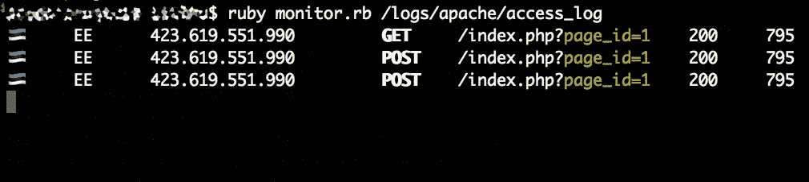

# 让你的日志和代码保持一致

> 原文：<https://medium.com/hackernoon/keep-your-logs-close-and-your-code-closer-9cc25bf9d413>

让我们来谈谈 web 应用程序和日志记录。对于大多数人来说，当谈到日志分析或日志事件时，Apache 日志格式是第一个想到的日志事件的好例子。但是 Apache 日志内容足以理解您的系统中正在发生的事情吗？让我们仔细看看。



Custom output of Apache access log

当向 web 服务器发送一个普通的 GET 请求时，一切似乎都很完美。对于以下请求

```
GET /index.php?page_id=1 HTTP/1.1
Host: www.unionselect1.eu
```

您将在 Apache 访问日志中看到适当的事件描述:

```
423.619.551.990 — — [06/Jul/2018:14:31:52 +0300] "GET /index.php?page_id=1 HTTP/1.1" 200 795 "-" "-"
```

起初，这看起来相当不错:您有时间戳、发出请求的 IP 地址、访问过的 URI，甚至还有被请求页面的 ID。还是你？

要了解日志记录是否足够，您首先必须了解您的应用程序及其在您的环境中的实现。为了说明我的例子，我将在 web 应用程序中使用流行的[灯](https://en.wikipedia.org/wiki/LAMP_%28software_bundle%29)设置和 [PHP](https://www.php.net/) 参数处理。

一个常见的错误是使用$_REQUEST 关联数组而不是 GET 或 POST 数组来获取发送到页面的参数。我不会深入讨论这些差异，也不会谈论 [CSRF](https://www.owasp.org/index.php/Cross-Site_Request_Forgery_%28CSRF%29) 以及这种方法可能给你的应用或客户带来的其他伤害。我只关注日志部分。

为了说明我的示例，我创建了一个包含以下内容的网页:

```
<?php
printf("Current page ID is %d", intval($_REQUEST['page_id']) ); 
?>
```

作为最后一个请求的结果，页面上的输出应该是:“当前页面 ID 是 1”。到目前为止一切顺利，对吧？

让我们提出另一个请求。这次让我们执行一个 POST 请求:

```
POST /index.php?page_id=1 HTTP/1.1
Host: www.unionselect1.eu
Content-Length: 9
Content-Type: application/octet-stream application/x-www-form-urlencodedpage_id=2
```

并检查日志文件中的相应条目。该事件如下:

```
423.619.551.990 — — [06/Jul/2018:14:40:13 +0300] "POST /index.php?page_id=1 HTTP/1.1" 200 795 "-" "-"
```

然而，页面上的输出告诉我们“当前页面 ID 是 2”。为什么页面上的页面 ID 与访问日志事件中的不同？似乎使用了 POST 参数，但是为什么呢？我会说的，但首先。

我们如何获得日志的正确信息，也就是说，我们如何记录应用程序使用的正确的 page_id？一种方法是记录 POST 参数。这将为我们提供完整的有效负载，但这可能会在日志记录方面给你带来额外的开销(例如，当记录 POST-ed 的文件内容时)，或者在将所有 POST 请求参数(包括用户名、密码、信用卡号等)保存到日志文件时，可能会产生合规性问题。但是这是可行的，例如使用参数过滤。这能解决问题吗？

让我们试试另一个例子:

```
POST /index.php?page_id=1 HTTP/1.1
Host: www.unionselect1.eu
Cookie: page_id=3
Content-Length: 9
Content-Type: application/octet-stream application/x-www-form-urlencodedpage_id=2
```

这一次，我把饼干加到了等式中。是的，您是对的:日志文件仍然显示

```
423.619.551.990 — — [06/Jul/2018:14:44:05 +0300] "POST /index.php?page_id=1 HTTP/1.1" 200 795 "-" "-"
```

但是这次页面上的输出显示“当前页面 ID 是 3”。似乎这一次，应用程序使用了 Cookie 值。

一个解决方案是记录所有的 cookie 参数，但是记录的数量只会增加，这对您有帮助吗？如果在某个时候您要查看日志，您仍然需要了解应用程序使用了哪些参数。

为了说明，这里有一个小测验:下面的请求会在页面上显示什么，您会在日志事件中找到什么？

```
POST /index.php?page_id=1&page_id=4 HTTP/1.1
Host: www.unionselect1.eu
Content-Length: 29
Content-Type: application/octet-stream application/x-www-form-urlencodedpage_id=2&page_id=5
```

*(提示:页面显示 5)*

但是这个怎么样？

```
POST /index.php?page_id=1&page_id=4 HTTP/1.1
Host: www.unionselect1.eu
Cookie: page_id=3; page_id=6
Content-Length: 19
Content-Type: application/octet-stream application/x-www-form-urlencodedpage_id=2&page_id=5
```

*(提示:不是 6，是 3)*

# **等等，这是什么巫术！？！**


Generated at [https://imgflip.com/memegenerator/Jackie-Chan-WTF](https://imgflip.com/memegenerator/Jackie-Chan-WTF)

回答 Jackie:这与三个因素有关:

1.  事实上，代码使用了前面提到的$_REQUEST 数组，该数组结合了 GET、POST 和 COOKIE 数组，从而使您能够从同一个数组中访问所有请求参数。
2.  PHP.ini 中的“request_order”参数描述了 PHP 寄存器获取、发布和 Cookie 变量到$_REQUEST 数组中的顺序。
3.  PHP.ini 中的“variables_order”设置了 EGPCS(环境、Get、Post、Cookie 和服务器)变量解析的顺序。

换句话说:糟糕的软件开发实践和应用服务器配置的结合可能会导致这样一种情况，即记录的信息可能没有表达应用程序的行为。相同的代码在不同的服务器上可以有不同的工作方式，这取决于 PHP 在服务器上的配置，使用不同的请求参数(取决于它们的顺序)。

# **有什么解决办法？**


By secretlondon123 (originally posted to Flickr as way out) [CC BY-SA 2.0], via Wikimedia Commons

1.  在应用程序中使用日志记录，并记录程序实际使用的输入值。登录 Apache 也是一个好主意(例如，记录带有意外输入值的攻击等)，但是如果您想了解应用程序中正在发生的事情，您必须登录应用程序级别并尽可能接近数据处理。
2.  一个朋友曾经告诉我:“*一个好的程序做它应该做的事情。一个安全的程序只做它应该做的事情。只使用预期的参数作为输入值，并且只使用来自预期来源的参数。因此，在需要 GET 和 POST 时，不要使用 REQUEST，而是使用 GET 和 POST。*
3.  了解您的系统，了解您的设置，并在实践中测试您的实施。当您正在解决一个事件并且已经在分析日志时，没有时间去弄清楚“哪个参数做了什么”。你必须事先知道你的应用程序是如何工作的。