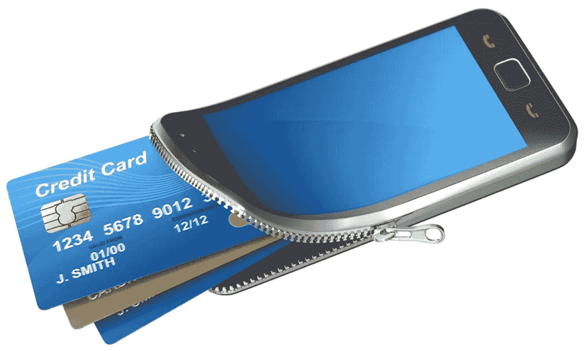
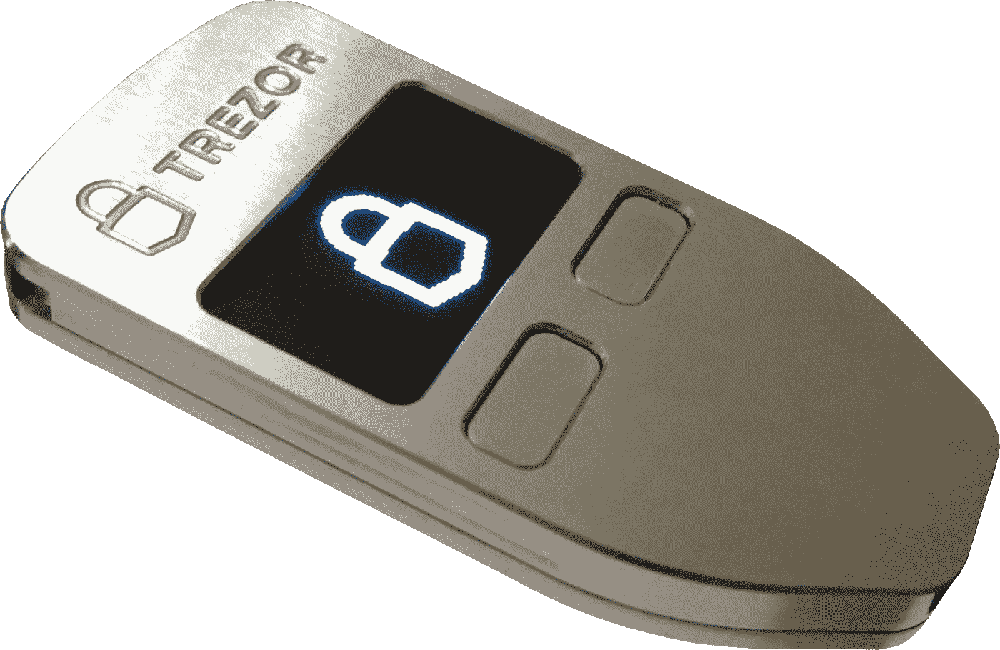

# 保护您的加密货币免受黑客攻击

> 原文：<https://medium.com/hackernoon/keeping-your-cryptocurrency-safe-from-hackers-f1cddfce905e>

image source: kisspng.com

在第二次世界大战期间，众所周知，瑞士军方在瑞士各地挖掘了 20，000 多个掩体和防辐射掩体，以保护其人民免受潜在的核攻击。

虽然大多数这些掩体仍然存在，但大多数已经被遗弃，只有少数出于历史目的被保留下来。

但现在 2018 年，碉堡们似乎找到了一个与当初建造的目的完全无关的新的。Niklas Nikolajsen 是一名瑞士企业家，也是瑞士比特币公司(Bitcoin Suisse)的创始人，他将赌注押在了地堡上，认为地堡是存放加密资产和采矿设备最安全的地方。

根据[彭博的说法，](https://www.bloomberg.com/news/articles/2018-06-27/crypto-whale-s-swiss-bitcoin-bunker-wants-banks-wealthy-clients)这位瑞士企业家和他的商业伙伴菲利普·冯穆斯希望吸引高净值个人和机构投资者的业务。

这两个人通过他们的公司[瑞士加密金库](https://swisscryptovault.ch/)，非常认真地对待这个想法，甚至考虑聘请专业服务公司普华永道来评估他们金库的安全性。

除了掩体保护，该公司还将提供加密和多重签名授权。

根据 Nikolajsen 的说法，“密码社区的下一个阶段是让更多的机构进入这个领域。只有当有一种超级安全的方式来存储资产和私钥时，他们才会这么做。

虽然这对于大型加密持有者来说可能是一个好的选择，但对于普通加密持有者来说并不需要，除非核攻击是他们最关心的问题之一，那么在他们的后院挖一个掩体比付钱给一家数千英里以外的公司来为他们做更好。

普通的密码所有者可以通过将密码存储在专门制作的离线设备中来保护他们的密码不被窃取和丢失。

冷钱包是只能物理访问的离线存储设备。另一方面，热门钱包是在线存储的，可以通过互联网访问。冷钱包相对于热钱包的优势在于，后者无法在线访问，因此不容易被黑客攻击。

image source: kisspng.com

冷钱包的一个很好的例子是由 Satoshilabs 设计的名为 [Trezor Wallet](https://trezor.io/) 的设备。该设备自称是你手中的私人银行，只需 100 美元。ChainBits 的这篇评论详细解释了 Trezor 钱包的工作原理。

另一方面，Bitfinex、北海巨妖和 Bithumb 等比特币交易所利用热钱包来存储客户的资产。

据美国消费者新闻与商业频道报道，Bithumb 最近被黑客攻击，超过 3000 万美元的硬币被盗。自攻击发生以来，总部位于韩国的加密交易所宣布，它正在将所有用户的资产转移到安全的冷钱包中。这只是在热门钱包中发现的安全问题的一个例子。

然而，这并不意味着它们对密码持有者完全无用。使用它们的最好方法是把你的大部分加密资产放在一个冷钱包里，把一些日常使用的放在一个热钱包里。这解释了为什么瑞士加密库提供多重签名授权选项以及掩体。

说到热门钱包，多重签名授权技术被认为是最安全的选择，因为它需要至少两个私钥的授权才能进行交易。钱包提供商要么给加密的所有者两个私钥并保留一个，要么雇佣可信的第三方来保留一个密钥。

这种方法基于这样一个前提，即在受到攻击的情况下，攻击者几乎不可能获得这三个密钥。然而，这种方法也有其缺陷，当[黑客访问 Bitfinex 上基于](https://www.cnbc.com/2018/06/05/cryptocurrency-exchange-bitfinex-briefly-halts-trading-after-cyber-attack.html) multi-sig 的钱包并窃取价值数百万美元的比特币时，我们就看到了这一点。

随着密码行业的持续增长，针对密码交易所的网络攻击可能会持续上升。因此，您有必要探索各种可用的热钱包和冷钱包选项，以确保您的资产完全安全。