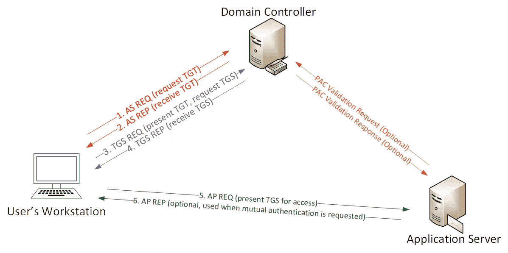

# Kerberoasting！

> 原文：<https://medium.com/hackernoon/kerberoasting-f080cd03e8cd>

让我们在这里谈论一些旧的安全性。Kerberos！这是一对夫妇岁，但可悲的是仍然工作。Kerberos 是 windows 和 ad 网络的身份验证系统。有一个漏洞可以让我们直接从域控制器获得加密不良的有价值的登录散列，这是在你有一个经过验证的用户时完成的，所以这不是主要的方法，但一旦你有了立足点，你就可以转向一个更有用的帐户。让我们简要分析一下 kerberos 是如何工作的，这是从[https://adsecurity.org/?p=3458](https://adsecurity.org/?p=3458)借来的

用户使用用户名和密码登录。

1a。密码转换为 NTLM 哈希，时间戳用哈希加密，并作为身份验证票(TGT)请求(AS-REQ)中的身份验证者发送到 KDC。
1b。域控制器(KDC)检查用户信息(登录限制、组成员等)&创建票据授予票据(TGT)。

2.TGT 经过加密、签名并交付给用户(AS-REP)。*只有域中的 Kerberos 服务(KRBTGT)可以打开和读取 TGT 数据。*

**3。当请求票据授予服务(TGS)票据(TGS-REQ)时，用户向 DC 出示 TGT。DC 打开 TGT &验证 PAC 校验和——如果 DC 可以打开票&校验和检验，TGT =有效。TGT 中的数据被有效地复制以创建 TGS 票证。**

4.TGS 使用目标服务帐户的 NTLM 密码散列加密并发送给用户(TGS 代表)。

5.用户通过适当的端口连接到托管服务的服务器，并提交 TGS (AP-REQ)。该服务使用其 NTLM 密码散列来打开 TGS 票证。

6.如果客户端要求相互身份验证(想想 MS15–011:二月份添加 UNC 强化的组策略补丁)。

除非需要 PAC 验证(很少)，否则该服务接受 TGS 票证中的所有数据，而不与 DC 通信。

好吧，那么让我们就在这里开始吧。我们将在装有 powershell 和 active directory 模块的 windows 平台上完成这项工作。
返回结果将类似于“MSSQLSvc/adsmsdb 01 . ad security . org:1433”，那么“MSSQLSvc”就是 SPN 类型。SPN 实际上是初始扫描的重要部分，因为我们希望找到特定类型的 SPN。如:
AGP server:往往对所有 GPO 拥有完全控制权。MSSQL/MSSQLSvc:对 SQL 服务器的管理权限，该服务器通常包含有趣的数据。
FIMService:通常对多个 AD 林具有管理权限。
STS:可以提供后门 VMWare 访问的 VMWare SSO 服务。
要进行实际的查询，我们可以使用 Get-ADUser cmdlet:

> get-aduser-filter { admin count-eq1 }-prop * | select name，created，passwordlastset，lastlogondate

我们还可以使用 PowerView 的 Get-NetUser cmdlet:

> Get-NetUser -AdminCount |选择名称，创建时间，pwdlastset，lastlogon

一旦我们有了一个 SPN，我们就可以查询易受攻击的散列类型

> $ SPN name = ' MSSQLSvc/adsmsdb 01 . ads security . org:1433 '
> Add-Type-assembly name System。IdentityModel
> 新对象系统。identity model . tokens . Kerberos requestorsecuritytoken-argument list $ SPN name

然后，我们可以使用“$ klist”来获取散列的列表，从那里我们可以使用 mimikatz 来导出。

> $ mimikatz
> $ kerberos::列表/导出

然后，我们只需将 hash 放入带有单词列表的 hashcat 中，就可以开始了。
遗憾的是，这一漏洞已经存在 4 年多了，仍然存在。为了缓解这一问题，建议确保服务帐户密码超过 25 个字符(并且不容易被猜到)。此外，启用日志记录，然后将该日志信息放入 SIEM，您可以在其中查找特定的“4769 事件”和 Ticket_Encryption_Type=0x17。祝你好运！

链接:【https://adsecurity.org/?p=2293】https://adsecurity.org/?p=3466:“使用 Kerberoast 破解 Kerberos TGS 票证——利用 Kerberos 危害活动目录域”
:“偷偷摸摸的持久性活动目录诡计#18:为以后的 Kerberoast 删除管理帐户上的 SPN。”