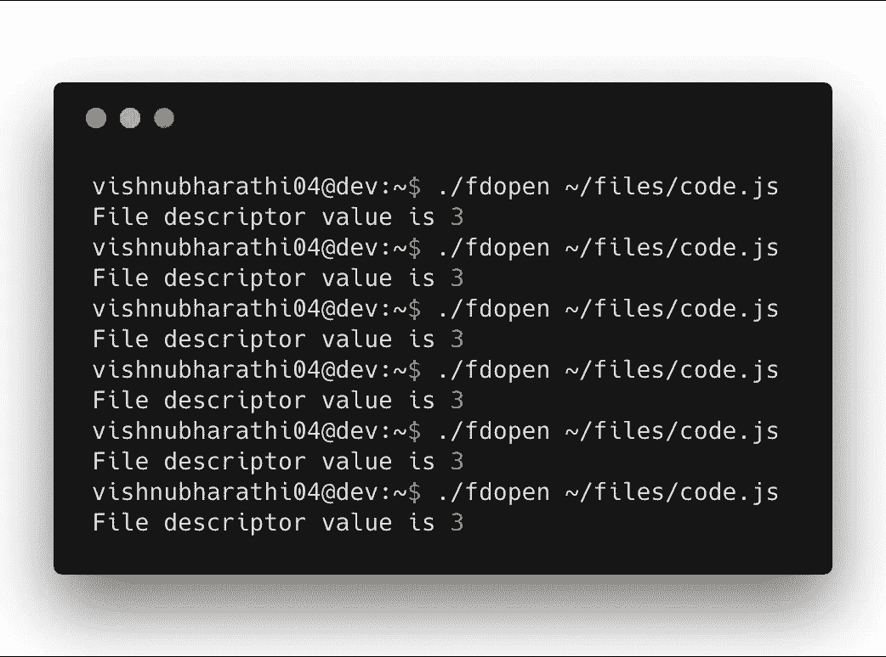
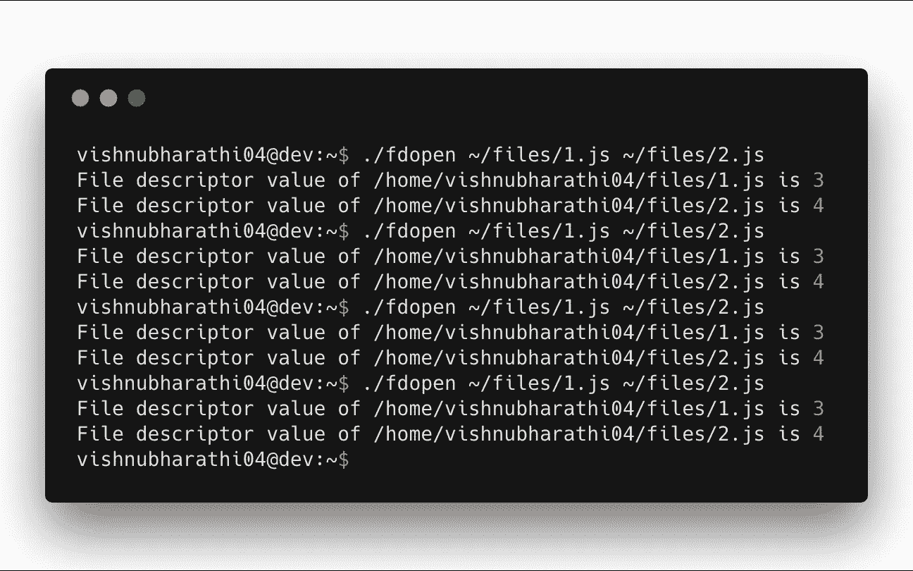
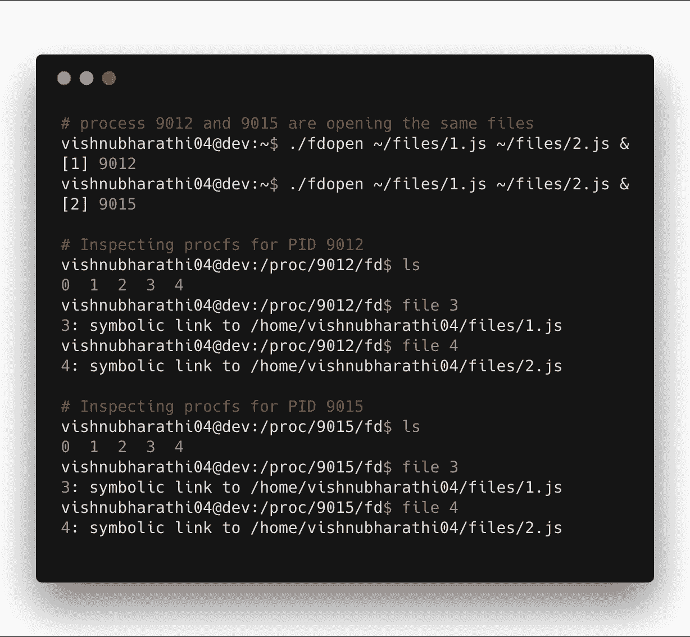
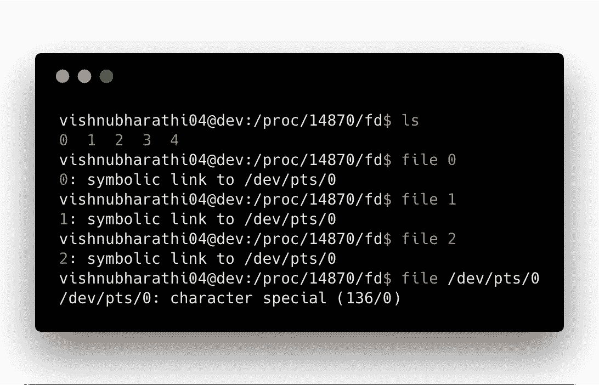

# 内核是我的朋友—第 1 部分

> 原文：<https://medium.com/hackernoon/kernel-is-my-friend-part-1-30a322d057e>

Photo by [Roderico Y. Díaz](https://unsplash.com/photos/qiNgutAfRpY?utm_source=unsplash&utm_medium=referral&utm_content=creditCopyText) on [Unsplash](https://unsplash.com/search/photos/kernel?utm_source=unsplash&utm_medium=referral&utm_content=creditCopyText) — This reminds me of the times I do `ls /proc` in my terminal.

## 文件描述符的乐趣

2018 年初，我希望了解一下 [Linux](https://hackernoon.com/tagged/linux) 和系统[编程](https://hackernoon.com/tagged/programming)的总体情况。也就是说，和内核做朋友！于是，我开始阅读[Linux 编程接口](http://man7.org/tlpi/)。这是我在阅读这本书并揭开 Linux 神秘面纱的过程中所写的系列博文的第一部分。

这篇文章试图理解来自 Linux 编程接口的课程[文件 I/O:通用 I/O 模型](http://man7.org/tlpi/)的某些部分。

## 文件类型

我听说过“Linux 中的一切都是文件”这种说法。但是，我了解到 Linux 中有不同类型的文件。

## 系统调用

系统调用是要求内核为我们做一些工作的一种方式。例如，这是帮助在 Linux 中处理文件的四个基本系统调用

*   打开——嘿内核，你能为我打开一个文件吗？以便该流程可以对其进行处理。
*   嘿，内核，你能读一下我保存在`~/cool/stuff/is/here.js`中的这段神奇的代码吗？
*   写——嘿内核，你能帮我把我很长的作业写到这个文件吗？
*   关闭——嘿内核，我做完作业了，请关闭文件。我们会出去逛逛，做些其他有趣的事情。

## 文件描述符

文件描述符是一个非负整数，用于引用文件。

当进程调用`open()`系统调用时，会返回一个文件描述符，该文件描述符可用于其他系统调用，如读、写、关闭。

当我第一次读这一课时，我错过了仔细观察的一件有趣的事情是(这可能是一个重要的关键点)

> 每个进程都有自己的一组文件描述符

让我们试着一步一步地理解这一点。

## 一个过程，一个文件

让我们写一个程序，只打开一个文件并打印它的文件描述符值。

我创建了一个二进制文件，并执行它一次读取一个文件。这基本上就是一次从一个进程中读取一个文件。

The file always gets the file descriptor value of 3 always

## 一个进程，多个文件

现在，让我们试着一次从一个进程中打开多个文件

files got allocated with sequential integer values

文件获取文件描述符编号的方法就是基于这个简单的想法

> SUSv3 指定如果 open()成功，它保证为进程使用编号最小的未使用文件描述符。
> 
> 迈克尔·克尔风险。Linux 编程接口:Linux 和 UNIX 系统编程手册(第 73 页)。没有淀粉压机。Kindle 版。

## 多个进程，多个文件

这是有趣的部分。如果多个进程同时访问相同的文件，会发生什么情况。那么文件描述符是如何分配的呢？

Numbering is done at a process level

这证明了我们开始时的说法，

> 每个进程都有自己的一组文件描述符

进程 9012 打开`1.js`分配 fd 3 和`2.js`分配 fd 4。进程 9015 没有什么不同，它做了同样的事情。因为这些是那些进程中编号最小的未使用文件描述符值。

既然我们已经走了这么长的路，我脑海中有趣的问题是，如果两个进程试图同时写入打开的文件，会发生什么情况。(我猜，这个大概值得下次再来回答吧！)

## 标准文件描述符

我已经听说过这些名字，令我惊讶的是，它们只是文件描述符。

当创建一个进程时，它似乎会自动打开 stdin、stdout 和 stderr 文件，并分别分配 fd 编号 0、1、2。

我进一步尝试查看这些文件在哪里。但我最终得到了一些我还不知道的东西。(厉害了！我们有事情要考虑)

character special? ¯\_(ツ)_/¯

## 神秘的事物

*   如果两个进程试图同时读取一个打开的文件会发生什么？
*   如果两个进程试图同时写入一个打开的文件会发生什么？
*   什么是`/dev/pts/0`？
*   什么是文件类型“特殊字符”？

(如果你有机会解决这些问题，请发表评论)

感谢阅读。我在博客文章的结尾引用了我最喜欢的泰米尔文学作品《Tirukkuṛaḷ》中的诗句。

> செய்தக்க அல்ல செயக்கெடும் செய்தக்க
> 
> செய்யாமை யானும் கெடும்.
> 
> *— திருக்குறள்*

翻译过来的意思(用我的话来说):做了不该做的事的人会出问题，不做该做的事的人也会出问题。