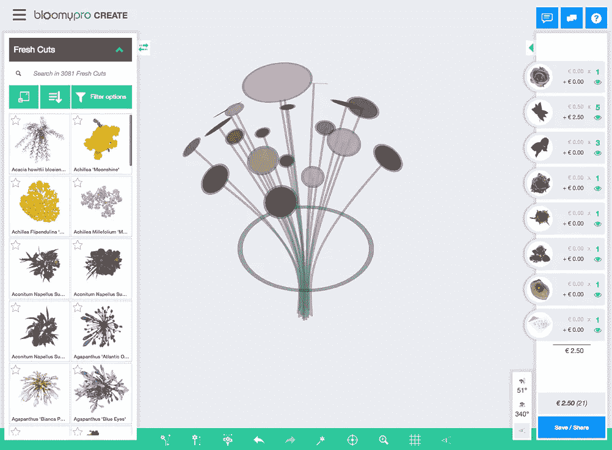
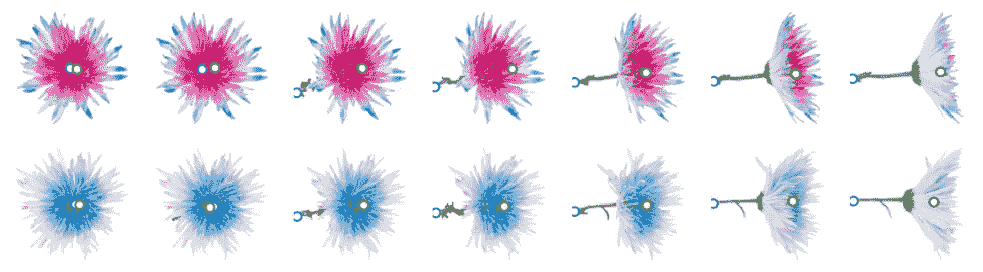
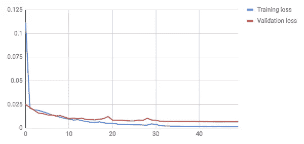
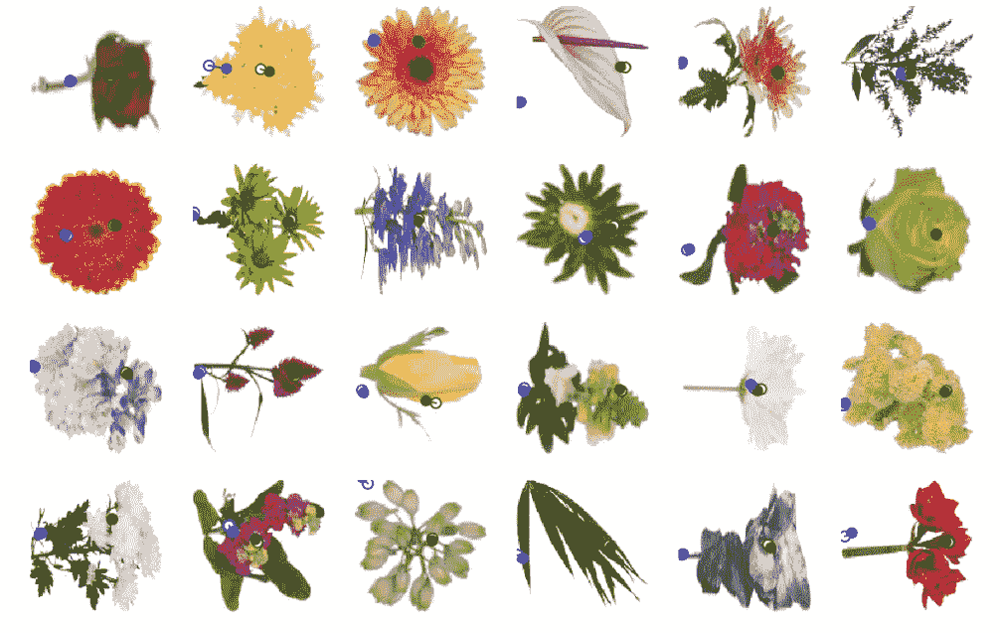

# 基于深度学习的花卉图像关键点检测

> 原文：<https://medium.com/hackernoon/key-point-detection-in-flower-images-using-deep-learning-66a06aadc765>

在这篇文章中，我们描述了如何使用卷积神经网络(CNN)来估计花卉图像中关键点的位置。需要诸如茎位置和花位置的关键点来在 3D 模型上呈现这些图像。

## 布鲁姆普罗

首先，让我们介绍一下我们的客户:布鲁米。他们的软件平台 [BloomyPro](https://bloomypro.com/) 允许用户在浏览器中使用 3D 模型设计他们的花束。它被养殖户、零售商、批发商和花卉产业的供应商所使用。

他们可以完全在网上完成这个过程，而不是制作一个真正的实物花束，拍一张照片然后发给客户。这为他们节省了大量的时间和金钱。



The BloomyPro User Interface

为了能够与真实花束的照片竞争，创建的图像必须尽可能逼真。这是通过从多个角度使用花卉的真实照片并在 3D 模型上渲染它们来实现的。

对于每一朵新的花，他们从 7 个不同的角度拍摄照片。在照相亭里，花是由马达自动旋转的。


The flower photo booth

相比之下，图片的后处理还没有完全自动化。目前数据库中有成千上万的鲜花，每天都有新的鲜花加入。将此乘以角度数，您将获得大量需要手动处理的图片！

后处理步骤之一是在图像上定位 3D 模型需要附着的几个关键点。最重要的是茎位和花顶位。这现在是手动完成的。我们的解决方案旨在自动化这一步骤。

## 资料组

幸运的是，成千上万的图片已经用关键点进行了人工注释。所以我们有大量的训练数据可以处理！



Annotated images at different angles

上面是来自训练集的一些带注释的花。它从几个不同的角度展示了同一朵花。茎的位置是蓝色的，花的顶部位置是绿色的。

在一些照片中，茎的起点被花本身隐藏了。在这种情况下，我们需要一个“有根据的猜测”,茎最有可能在哪里。


Example with hidden stem

## 网络体系结构

因为模型必须输出一个数字而不是一个类，所以我们本质上是在做回归。CNN 最出名的是分类任务，但也可以在回归上表现良好。例如 [DensePose](https://arxiv.org/pdf/1802.00434.pdf) 使用基于 CNN 的方法进行人体姿态估计。再比如这篇[关于面部关键点检测的文章](https://towardsdatascience.com/detecting-facial-features-using-deep-learning-2e23c8660a7a)。

我不打算解释卷积网络的一般工作原理，如果你感兴趣，你可以阅读这篇文章中的 CNN 基础知识:

[](https://adeshpande3.github.io/A-Beginner%27s-Guide-To-Understanding-Convolutional-Neural-Networks/) [## 理解卷积神经网络的初学者指南

### 卷积神经网络。听起来像是生物学和数学的奇怪结合，还有点 CS 的成分，但是…

adeshpande3.github.io](https://adeshpande3.github.io/A-Beginner%27s-Guide-To-Understanding-Convolutional-Neural-Networks/) 

网络从几个标准卷积块开始。这些块由 3 个卷积层组成，后面是最大汇集、批量标准化和丢弃层。

*   **卷积**层包含许多过滤器。每个过滤器都像模式识别器一样工作。接下来，卷积块有更多的过滤器，所以它可以找到模式内的模式。
*   **Max-pooling** 降低图像的分辨率。这限制了模型中的参数数量。通常，在图像分类中，我们对某个物体在图像中的位置不感兴趣，只要它在那里。在我们的例子中，我们感兴趣的是位置。尽管如此，拥有几个最大池层不会影响性能。
*   **批量标准化**层帮助模型更快地训练(收敛)。在一些深度网络中，没有它们，训练完全失败。
*   **Dropout** 随机禁用节点，这可以防止模型过度拟合。

在卷积块之后，我们展平张量，使其与密集层兼容。全局最大汇集或平均最大汇集也将实现平坦张量，但将丢失所有空间信息。在我们的实验中，扁平化的效果更好，尽管它的(计算)代价是拥有更多的模型参数，导致训练时间更长。

激活两个密集隐藏层 [Relu](https://en.wikipedia.org/wiki/Rectifier_(neural_networks)) 后是输出层。我们希望预测 2 个关键点的`x`和`y`坐标，因此我们需要在输出层中有 4 个节点。这些图像可以有不同的分辨率，所以我们将坐标缩放到 0 和 1 之间，并在使用前将其放大。

输出层没有激活功能。尽管目标变量在 0 和 1 之间，但对我们来说，这比使用 [sigmoid](https://en.wikipedia.org/wiki/Sigmoid_function) 更好。

作为参考，下面是来自我们使用的 Python 深度学习库 [Keras](https://keras.io/) 的完整模型摘要:

```
_________________________________________________________________
Layer (type)                 Output Shape              Param #   
=================================================================
conv2d_1 (Conv2D)            (None, 126, 126, 64)      2368      
_________________________________________________________________
conv2d_2 (Conv2D)            (None, 124, 124, 64)      36928     
_________________________________________________________________
conv2d_3 (Conv2D)            (None, 122, 122, 64)      36928     
_________________________________________________________________
max_pooling2d_1 (MaxPooling2 (None, 61, 61, 64)        0         
_________________________________________________________________
batch_normalization_1 (Batch (None, 61, 61, 64)        256       
_________________________________________________________________
dropout_1 (Dropout)          (None, 61, 61, 64)        0         
_________________________________________________________________
conv2d_4 (Conv2D)            (None, 59, 59, 128)       73856     
_________________________________________________________________
conv2d_5 (Conv2D)            (None, 57, 57, 128)       147584    
_________________________________________________________________
conv2d_6 (Conv2D)            (None, 55, 55, 128)       147584    
_________________________________________________________________
max_pooling2d_2 (MaxPooling2 (None, 27, 27, 128)       0         
_________________________________________________________________
batch_normalization_2 (Batch (None, 27, 27, 128)       512       
_________________________________________________________________
dropout_2 (Dropout)          (None, 27, 27, 128)       0         
_________________________________________________________________
flatten_1 (Flatten)          (None, 93312)             0         
_________________________________________________________________
dense_1 (Dense)              (None, 256)               23888128  
_________________________________________________________________
batch_normalization_3 (Batch (None, 256)               1024      
_________________________________________________________________
dropout_3 (Dropout)          (None, 256)               0         
_________________________________________________________________
dense_2 (Dense)              (None, 256)               65792     
_________________________________________________________________
batch_normalization_4 (Batch (None, 256)               1024      
_________________________________________________________________
dropout_4 (Dropout)          (None, 256)               0         
_________________________________________________________________
dense_3 (Dense)              (None, 4)                 1028      
=================================================================
Total params: 24,403,012
Trainable params: 24,401,604
Non-trainable params: 1,408
_________________________________________________________________
```

你可能会问:为什么是 3 个卷积层？或者为什么是 2 个卷积块？我们在超参数搜索中将这些数字作为超参数。连同诸如密集层数、漏失水平、批量标准化和卷积滤波器数量等参数，我们进行了随机搜索，以找到超参数的最佳组合。

为什么是随机搜索而不是网格搜索？这有点违背直觉，但在实践中，这会让你的钱得到更好的回报。参见[这篇关于超参数调整的文章](https://www.oreilly.com/ideas/evaluating-machine-learning-models/page/5/hyperparameter-tuning)。

对于训练，我们使用学习率为`0.005`的 [Adam 优化器](https://machinelearningmastery.com/adam-optimization-algorithm-for-deep-learning/)。当确认损失在几个时期内没有改善时，学习率自动降低。

作为损失函数，我们使用均方差(MSE)。因此，大错误比小错误受到更多的惩罚。

## 培训和绩效

这些是训练 50 个时期后的损失(误差)图:



Loss plots

在大约 8 个时期之后，验证损失变得高于训练损失。直到训练结束，验证损失仍然减少，因此我们没有看到模型强烈过度拟合的迹象。

测试集的最终损失(MSE)为`0.0064`。MSE 可能很难理解。平均误差(MAE)更容易向人类解释。

> MAE 是**`**0.0017**`**——**这意味着预测平均误差 1.7%**

**下面是测试集的几个例子。白色圆圈包含目标关键点，实心圆圈包含我们的预测。在大多数情况下，它们非常接近(重叠)。**

****

**Some images from the test set**

## **部署**

**模型的性能足够好，可以增加产品的价值。关键点现在用于在上传新的花朵图像时设置默认坐标。在大多数情况下，不需要手动调整！**

**模型本身通过 API 公开，并打包在 docker 容器中。这个容器是通过 bitbucket 管道建立在 push 之上的。经过训练的重量也包含在 docker 图像中。因为你不想在 Git 中存储大文件，我们使用 Git LFS 来存储它们。**

## **进一步的改进**

**我们有一些改进的想法，但还没有时间去实施:**

1.  **目前，一个单一的模型正在评估这两个关键点。为每个关键点训练一个特定的模型可能会更好。这有一个额外的好处，您可以在以后添加新的关键点，而不必重新训练整个模型。**
2.  **另一个想法是考虑照片的角度。例如通过将其添加为密集层的输入。你可能会争辩说，角度改变了任务的性质，所以提供这些信息可能有助于网络。按照这种思路，为每个角度训练一个独立的网络也是有益的。**

## **后续步骤**

**除了设置关键点之外，后处理过程还包含更多的步骤。例如设置茎的颜色。3D 引擎绘制与照片的茎颜色相匹配的人造茎。我们希望同样的技术也适用于这种情况。**

## **结论**

**通过这项研究，我们证明了使用细胞神经网络检测花卉图像中关键点的可行性。所使用的方法可能也适用于其他领域的后处理任务，如产品摄影。**

**有什么问题吗？请在评论中告诉我们。如果你喜欢这篇文章，请点击拍手按钮，这样更多的人可以阅读这个故事！**

> ****关于** [**人工产业**](https://www.artificialindustry.com/) **:** 我们帮助创业者将他们的想法快速高效地转化为成功的在线业务，从而改变世界。我们通过为客户创建(数据)原型和 MVP 来做到这一点。**