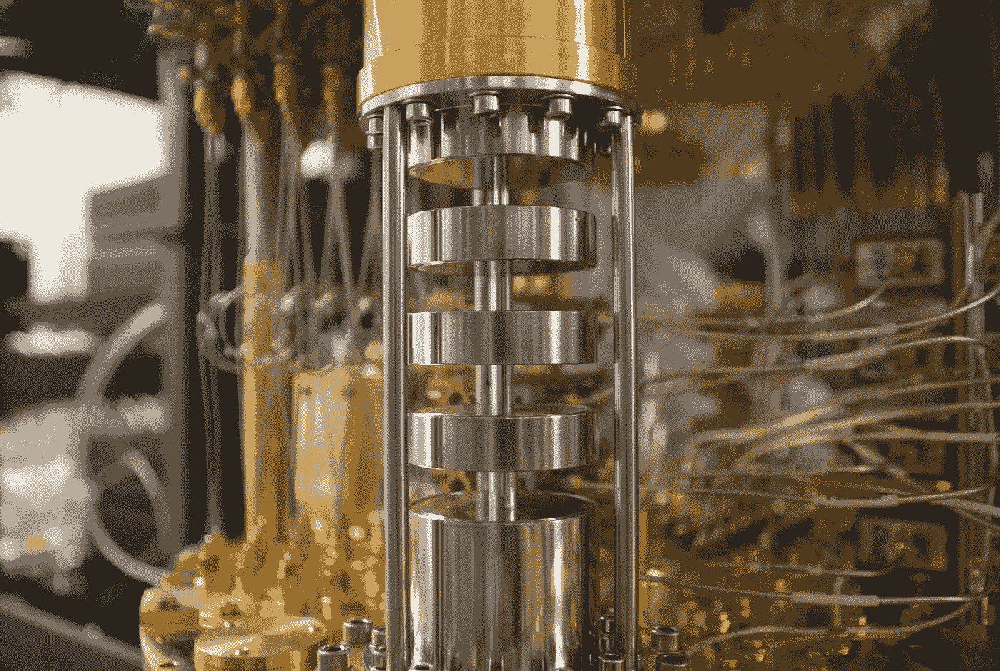
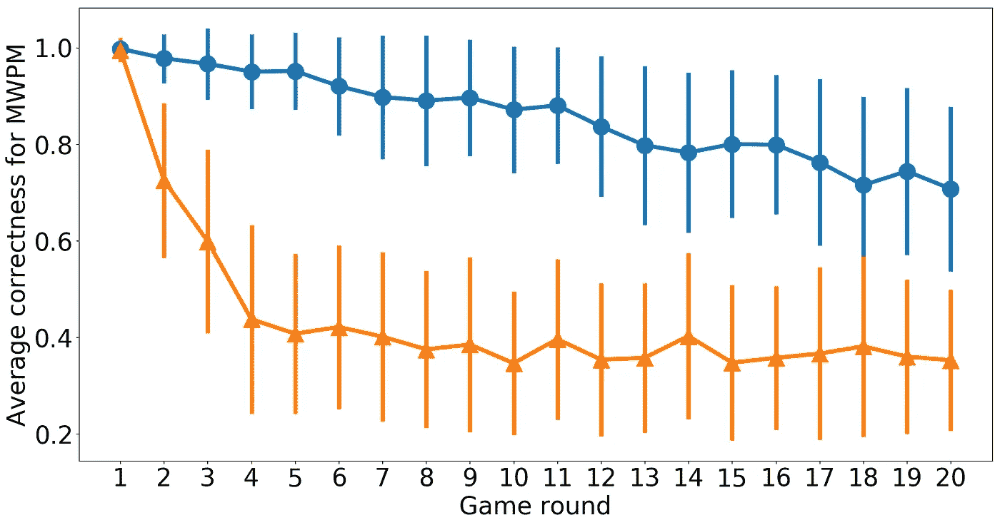
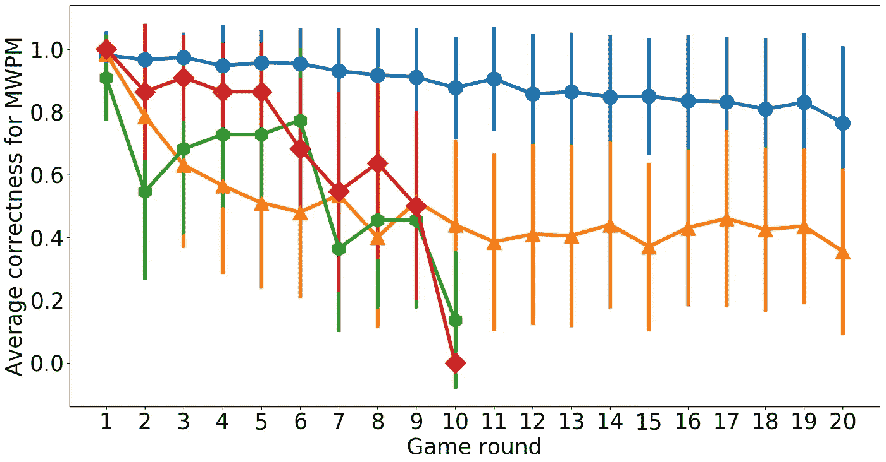
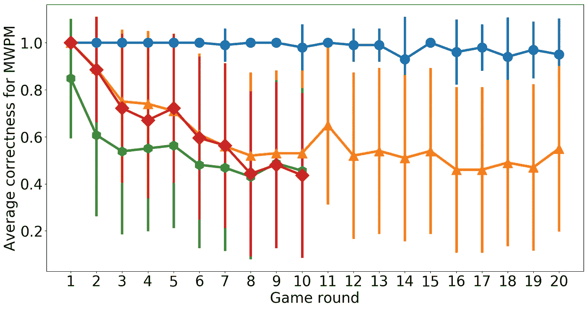
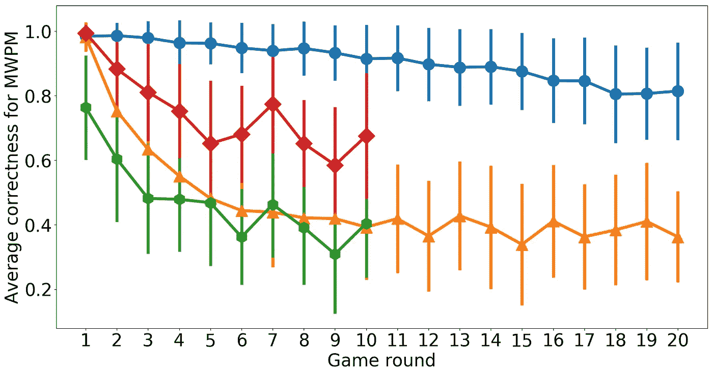
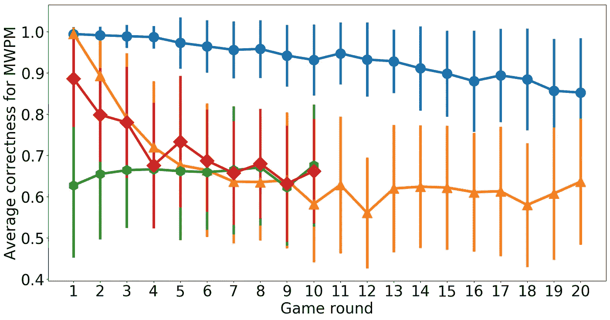

# 踢量子处理器的轮胎

> 原文：<https://medium.com/hackernoon/kicking-the-tires-of-quantum-processors-2b18750916dd>

[https://www.flickr.com/photos/ibm_research_zurich/33078431702/](https://www.flickr.com/photos/ibm_research_zurich/33078431702/)

如果你的计算机里有 n 个比特，那么它们可能会存储 2ⁿ可能的比特串。通过在这个巨大的可能性空间中绘制合适的路线，你的计算机可以解决几乎任何问题。

如果你有一台带有量子比特的[量子计算机](https://hackernoon.com/tagged/quantum-computer)，也有无限可能。但它允许的不仅仅是位串:量子力学概念，如叠加和非定域性也可以使用。这些允许新的和更微妙的方式在空间中移动，给我们新的和更有效的路线从输入到输出。量子计算机将为我们解决许多领域目前难以解决的问题提供切实可行的解决方案。

目前，实际上还没有制造出能够实现这一承诺的设备。但是肯定有原型，它们需要测试。那么我们应该尝试什么呢？

我们可以做的一件事就是生成一个完全随机的量子程序。这将生成随机的位串作为输出，但是它们不会以相等的概率出现。取而代之的是，将会有小的变化，提供它们量子本质的特征。

事实上，对于足够大的原型量子计算机，这种随机生成的位串是任何常规计算机都无法复制的。这意味着我们可以用这项任务来证明量子计算机可以做普通计算机做不到的事情。这不是一个非常有用的任务，但对于原理证明来说已经足够好了。

这是谷歌实现所谓的*量子计算优势*的计划。尽管他们可能还需要一段时间才能成功。首先，在普通计算机无法模拟量子比特之前，你的设备中需要有相当多的量子比特。

 [## 谷歌、阿里巴巴就“量子霸权”的时间表争论不休

### 谷歌的量子计算研究人员一直在计划一个派对，但来自中国的竞争团队的新结果…

www.wired.com](https://www.wired.com/story/google-alibaba-spar-over-timeline-for-quantum-supremacy/) 

当前的原型设备通常小到足以模拟。但是，除了没有足够的量子位之外，对于这项原理验证任务来说，它们也有点太嘈杂了。概率微小变化的细节取决于我们生成的随机程序。因此，如果有额外的随机效应，由于设备的缺陷，我们将无法验证我们有我们需要的输出。那么我们就有了一个无聊的、非常容易复制的随机位串生成器。

那么，我们如何在随机电路中衡量当前器件的性能呢？我们如何能轻易地区分我们想要创造的量子随机性和将会破坏它的噪音？

一种选择是编写一个充满随机操作的程序，但它实际上什么也不做。我们可以通过一系列的循环来完成随机的事情，然后立即撤销。这测试了我们想要运行的程序的所有方面，但是确保了输出应该是众所周知的并且易于验证。

这基本上就是我在刚刚发表的一篇论文中所做的。我测试了两个不同制造商生产的四种现有设备: [IBM Research](https://quantumexperience.ng.bluemix.net/qx/experience) 和 [Rigetti](https://rigetti.com/) 。

 [## 具有随机电路的量子处理器的基准测试

### 尺寸在 10-100 量子位范围内的量子处理器现在越来越普遍。然而，随着尺寸的增加…

scirate.com](https://scirate.com/arxiv/1806.02736) 

让我们快速看一下结果应该是什么样子。

因为这是一篇博客文章而不是一篇论文，所以我不会告诉你 MWPM 是什么的细节。但是要知道，它的平均正确性提供了一个很好的方法来衡量输出有多接近一些好的和合理的东西。

如果我们积极地试图产生混乱的随机位串，我们希望看到它迅速衰减到一个收敛的值。这正是我们看到的上面的橙色曲线，它模拟了一个随机程序。

蓝色曲线是我们撤销程序中几乎所有随机操作的曲线。这意味着我们希望看到一个更慢的陷入混乱的过程。上图中出现了这种情况，因为这是一个无噪声设备的模拟。但是我们会看到一个真正的量子处理器原型吗？

我们将从目前在云上最小的设备开始:IBM 的 5 量子位设备，被称为*特纳里夫*，或其朋友称为 *ibmqx4* 。

这里的橙色和蓝色和以前一样，尽管程序构建时考虑了 ibmqx4 的特殊能力。

我们在 ibmqx5 上运行的作业陷入混乱的速度应该比蓝线还要慢。因此，如果它下降得更快，我们知道这是因为噪音的破坏性影响，而不是我们实际上想要看到的量子效应。

我们得到的结果用绿线表示。如你所见，它下降得相当快。事实上，比完全随机的电路要快。噪音显然是相当强大的。

这部分是因为如今我们倾向于期望计算机是完美的。我们接受给定的输出，并相信创造它的所有晶体管都在做它们应该做的事情。

对于量子计算机，我们需要将我们对计算机的态度拨回到几十年前。我们需要预料到意想不到的事情，并想办法解决不完美的地方。

这是红色曲线显示的。我们对输出做了一点简单的后处理来清理东西。这大大减缓了陷入混乱的速度，并使输出更接近我们的预期。因此，ibmqx5 当然有潜力做好事，我们只需要记住为之奋斗。

现在让我们为一个更大的设备做同样的事情:Rigetti 的 *8Q-Agave* 。正如你可能从名字中猜到的，它有 8 个量子位。

我们看到了与以前相似的数量特征。虽然绿色曲线应该比蓝色曲线下降得慢，但它陷入混乱的速度比橙色曲线的完全随机程序还要快。尽管我们的错误缓解再次清理了问题，如红色曲线所示，但它仍然给出了类似于完全随机程序的结果。

现在让我们把量子比特数翻倍，去找 IBM 的 *Rueshlikon* ，也被称为 *ibmqx5* 。

希望你开始知道你在这些图表中寻找什么。红色曲线是制作类似蓝色曲线的最佳尝试。至少，它应该比橙色的衰减得慢得多。对于这个设备，蓝色曲线确实明显高于橙色(这很好)，但仍然明显低于橙色(不太好)。

最后，我们用 Rigetti 的 *19Q-Acorn* 达到 19 个量子位。

这和它的兄弟姐妹*8Q-龙舌兰*有些相似。但是这个设备和我们目前看到的其他设备有一个主要的区别。它们都有从 1 开始的红色曲线，表明这些设备在运行短程序时非常善于避免噪声。对于 *19Q-Acorn* ，红色曲线从 0.9 开始。因此，即使从一开始，也有一定程度的噪音是很难解决的。

现在你对当前的量子处理器是如何工作的有所了解了。如果你听说过关于量子计算机将如何破解所有密码并创造天网的恐怖故事，希望你现在能再次轻松入睡。进入量子计算领域是一个非常令人兴奋的时刻，也是一个参与其中的好时机，但未来十年将会涉及到许多找出错误在哪里以及如何处理它们的工作。

如果你想知道更多，但不想看我的论文？别担心，我会掩护你的。上述研究中使用的随机电路被设计成一个益智游戏的基础。所以你可以用我的研究中使用的数据来玩游戏。这也将帮助您了解更多关于设备的信息，而不仅仅是设备上的噪声。查看下面的链接。

 [## decodoku/A _ Game _ to _ Benchmark _ Quantum _ Computers

### 在量子设备上实现的简单谜题

github.com](https://github.com/decodoku/A_Game_to_Benchmark_Quantum_Computers/blob/master/README.md)  [## 使用一个简单的益智游戏来测试量子计算机

### 自去年以来，我们已经看到了许多关于原型量子计算机的重大公告。从像 IBM 这样的大公司…

medium.com](/@decodoku/understanding-quantum-computers-through-a-simple-puzzle-game-a290dde89fb2) 

你也可以通过亲自使用来更好地了解这些设备。都在云上，可供大众运行作业(19Q-Acorn 除外，最近退役)。点击以下链接，开始这些设备的编程之旅。

 [## QISKit

### GitHub 是人们构建软件的地方。超过 2800 万人使用 GitHub 来发现、分享和贡献超过…

github.com](https://github.com/QISKit)  [## 里盖蒂

### Forest 为开发人员免费提供了高达 26 量子位的模拟器 Quantum Virtual Machine 和私有…

www.rigetti.com](https://www.rigetti.com/forest) 

[*在推特上找到我*](https://twitter.com/decodoku)