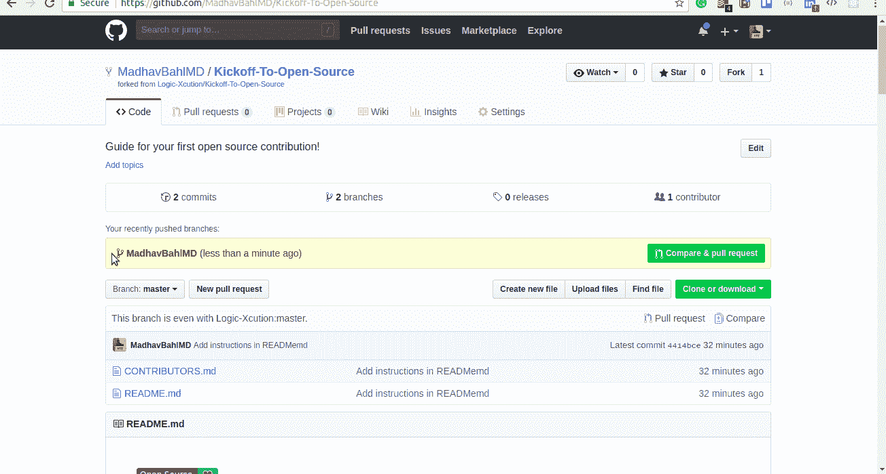

# 开始开源！

> 原文：<https://medium.com/hackernoon/kickoff-to-open-source-e6928cf0037b>


I think, fundamentally, open source does tend to be more stable software. It’s the right way to do things.
— Linus Torwalds

> 本文可以作为教程开始[开源](https://hackernoon.com/tagged/open-source)投稿。它包含了我在一次网络研讨会“开源启动”中使用的内容。
> 网上研讨会以如何开始开源贡献为主题，涵盖了 [Git](https://hackernoon.com/tagged/git) 和 GitHub 的基础知识。你可以在[http://madhavbahl.tech/opensource/](http://madhavbahl.tech/opensource/)观看演示。不久将会有更多的网络研讨会、会议、教程视频和文章，您可以通过电子邮件直接获得通知，[点击此处](http://madhavbahl.tech/subscribe/)订阅。

# 为什么要开源？

听到“开源”之后，我们首先想到的是自由软件，不是吗？大多数人都有商业头脑，追求利润，但是开源是免费的，对吗？尽管如此，仍然有一个庞大的开源开发者社区，这背后有无数令人敬畏的原因。


不管你是个人、组织、小企业还是非营利组织，开源都是你最感兴趣的。有很多理由让你开始一个开源项目，或者作为个人开始开源贡献。我最喜欢的一些原因是:

*   世界各地的人都可以为您的代码做出贡献
*   保持了非常好的代码质量
*   减少重复工作(您可以将许可证放入您的存储库中)
*   展示你的才华和能力

我喜欢开源的原因是，

*   提升社区(永远记住，“**我们通过提升他人**”)

## 简单的话…

你能在 GitHub 上找到的每一个项目(当然不是私有的)都是开源项目。

**所以，**要做贡献，你只需要找到一个适合自己的项目，一个可以去做的课题。

# 开源是💚

是的，我很高兴传播这种爱的感觉。

*   你贡献的越多，你得到的意识和想法就越多！
*   和一些超级棒的人一起合作做项目
*   你会遇到志同道合的人，扩大你的人际网络
*   不能修复一个错误！？请求帮助

# 有什么必备知识吗？

一般来说，人们有一种思维模式，他们需要在每个(或任何一个)领域都非常专业，才能开始开源贡献。这是不对的！即使你是初学者，有 Git 和 GitHub 的基础知识，也可以开始投稿。


Photo taken from [https://www.wired.com/2013/03/github/](https://www.wired.com/2013/03/github/)

在继续之前，我强烈建议您应该对 Git 和 GitHub 有一个基本的了解。如果你是这方面的新手，你可以阅读我的 2 部分教程系列:

## [GIT-Good Part-A:你好 GitHub](https://codeburst.io/git-good-part-a-e0d826286a2a)

[](https://codeburst.io/git-good-part-a-e0d826286a2a) [## GIT Good:GIT 和 GitHub 的实用介绍(你好 GitHub)

### 这是一个关于 GIT 和 GitHub 的两部分系列，→ GIT-Good Part-A:你好 GitHub GIT-Good Part-B:我们信任 GIT！你…

codeburst.io](https://codeburst.io/git-good-part-a-e0d826286a2a) 

## GIT-Good Part-B:我们信任 GIT！

[](https://codeburst.io/git-good-a-practical-introduction-to-git-and-github-in-git-we-trust-f18fa263ec48) [## GIT Good:GIT 和 GitHub 的实用介绍(在 GIT 中我们信任！)

### 这是关于 GIT 和 GitHub 的两部分系列，GIT-Good 部分-A:你好 GitHub → GIT-Good 部分-B:我们信任 GIT！你…

codeburst.io](https://codeburst.io/git-good-a-practical-introduction-to-git-and-github-in-git-we-trust-f18fa263ec48) 

阅读完这两篇文章后，您可以观看这个 YouTube 视频来深入了解 Git 命令。

# 准备好了。就位。走吧。

遵循这 6 个基本步骤，在 2 分钟内做出你的第一个开源贡献。

## 第一步:找到你的项目

很明显，开始开源的第一步是找到一个开源项目来做贡献！

要么你可以去贡献一些开源组织的项目，如 fossasia 等。或者，你可以从这些网站上找到你想做的项目/问题。

*   [issuehub.io](http://issuehub.io/) —一个基于您所需的语言或问题标签帮助您查找项目/问题的网站。
*   [代码分类](https://www.codetriage.com/)——另一个搜索问题的有用工具
*   [待价而沽](https://up-for-grabs.net/#/) —初学者可以解决的问题项目列表
*   [仅限首次者](https://www.firsttimersonly.com/) —一个标有“仅限首次者”的问题列表。
*   [令人敬畏的首次公关](https://github.com/MunGell/awesome-for-beginners)——一个令人敬畏的新手友好项目列表。

虽然你可以从上面提到的资源中找到项目来做贡献，但最好是找到任何开源组织并开始为他们的项目做贡献。

你可以在这里找到一些好的开源组织。

此外，你可以找到一些好的组织，他们的项目被选为今年的 GSoC，并开始为他们的项目做出贡献。

[](https://summerofcode.withgoogle.com/organizations/) [## 谷歌代码之夏

### 编辑描述

summerofcode.withgoogle.com](https://summerofcode.withgoogle.com/organizations/) 

# 按照接下来的步骤

**你可以在这个练习库中做出你的第一个开源贡献:**[https://github.com/Logic-Xcution/Kickoff-To-Open-Source](https://github.com/Logic-Xcution/Kickoff-To-Open-Source)

[](https://github.com/Logic-Xcution/Kickoff-To-Open-Source) [## 逻辑执行/开源启动

### 你的第一份开源贡献的开源指南！

github.com](https://github.com/Logic-Xcution/Kickoff-To-Open-Source) 

一旦你找到了你想参与的项目，遵循以下 **5 个简单的步骤。**

## 步骤 2:派生存储库

通过单击页面顶部的分叉按钮，分叉此回购。这将在您的帐户中创建此存储库的副本。


## 步骤 3:克隆存储库

将回购克隆到您的机器上。进入你的 GitHub 账户，点击克隆按钮，然后点击复制到剪贴板图标。

打开终端并运行以下 git 命令:

```
git clone "Copied URL"
```


## 步骤 4:创建一个分支

转到您克隆 repo 的目录。
使用`git checkout`命令创建一个新分支

```
git checkout -b <branch-name>
```

为了保持标准，我们将分支机构的名称设为**用户名**

例如:

```
git checkout -b MadhavBahlMD
```


## 第五步:做出改变！解决问题！提交这些更改！推到 GitHub！

进行必要的修改，提交并把你的代码推送到 GitHub。在这里，我们在 CONTRIBUTORS.md 中添加我们的用户名、姓名和简历

要进行提交和推送更改，

```
git add .
git commit -m "Add [username] as a contributor"
git push origin <branch name>
```


## 步骤 6:打开一个拉取请求

如果你去你在 GitHub 上的库，你会看到一个`Compare & pull request`按钮。点击按钮并提交拉取请求！

很快您的更改将被审查，如果更改是合法的，PR 将被合并！



## 就这么简单！

恭喜你，你刚刚做了你的第一次公关。欢迎来到开源世界。

## 步骤 7(可选):保持您的 fork 与原始存储库同步

首先，切换到主分支，主分支是主要的工作分支，应该有最新的代码！

```
git checkout master
```

现在，添加原始回购的网址作为一个新的遥控器，比如说`original`

```
git remote add original git@github.com:Logic-Xcution/Kickoff-To-Open-Source.git
```

这是告诉 git 这个项目的另一个版本存在于指定的 url 中的一种方式，我们称之为`original`。一旦变更被合并，获取原始存储库的新版本。

```
git fetch original
```

现在，您需要将我的存储库的新版本合并到您的主分支中。

```
git rebase original/master
```

现在您可以将这些更改推送到您的 GitHub repo:

```
git push origin master
```

此外，由于您的更改被合并，您的回购被更新，您为您的贡献创建的分支不再需要，您可以删除它！

```
git branch -d <brach-name>git push origin --delete <branch-name>
```

通过执行第 7 步，您可以确保项目的副本与原始项目相同，以避免将来出现任何冲突。

# 好了

觉得文章有帮助？

 [## 在线程序员|订阅

### 编写代码的学员|想学习编程和开发的人的向导、老师和导师，订阅成为第一个收到我消息的人。

http://madhavbahl.tech](http://madhavbahl.tech/subscribe/) 

订阅 LeanProgrammer，成为第一个从我这里获得未来更新通知的人。


如果你想讨论什么，随时联系我，:D

如果您能给我反馈、建议或询问，我会非常高兴。此外，我喜欢交新朋友，我们可以成为朋友，只要给我发邮件。

> 非常感谢你一直读到最后。如有需要可以联系我:
> 邮箱:theleanprogrammer@gmail.com
> 网页:[http://madhavbahl.tech/](http://madhavbahl.tech/)
> Github:[https://github.com/MadhavBahlMD](https://github.com/MadhavBahlMD)
> LinkedIn:[https://www.linkedin.com/in/madhavba*HL/*](https://www.linkedin.com/in/madhavbahl/)