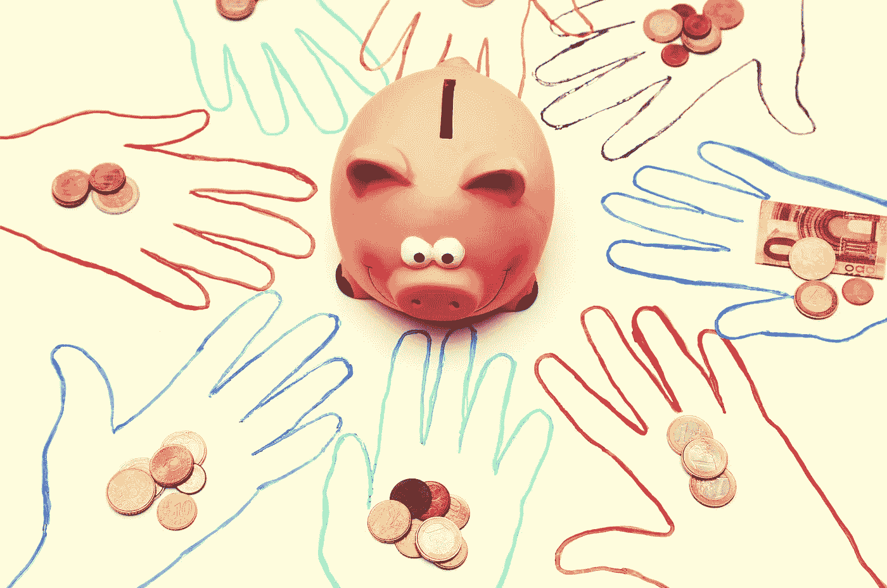
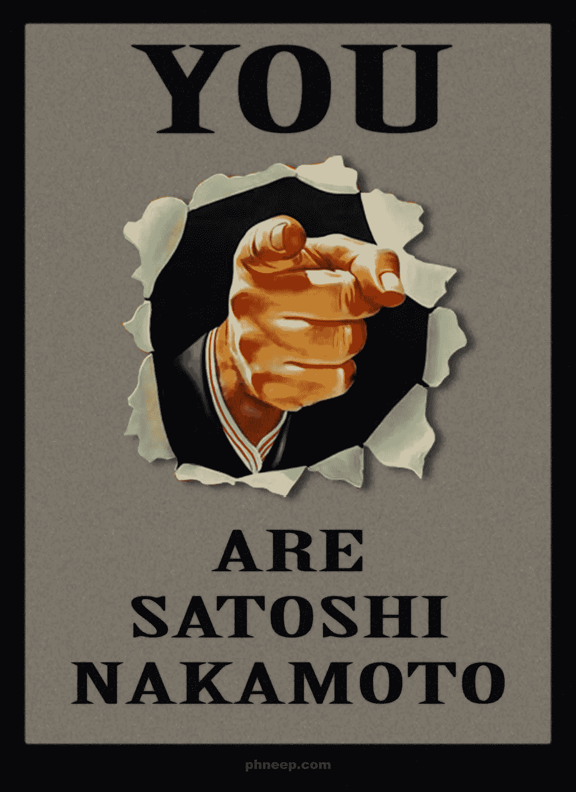
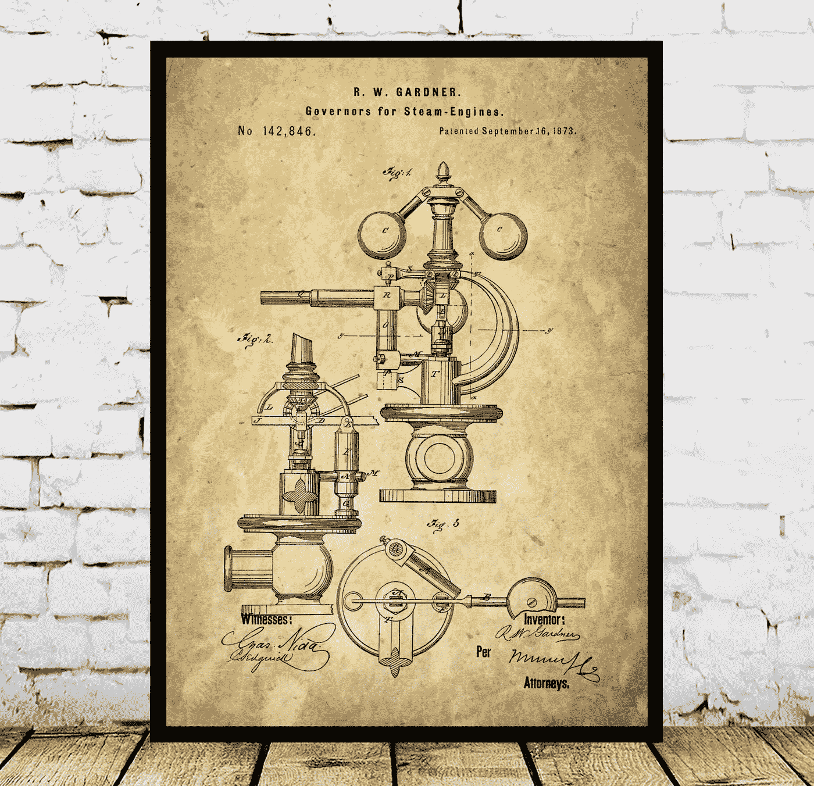
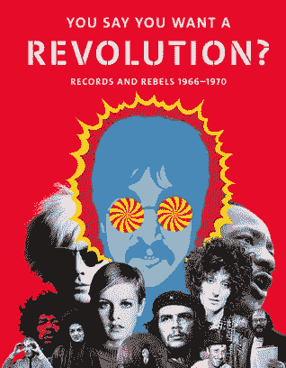
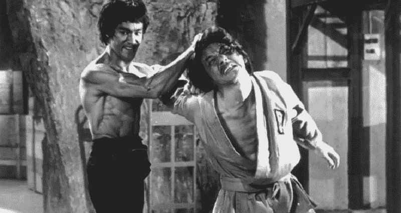
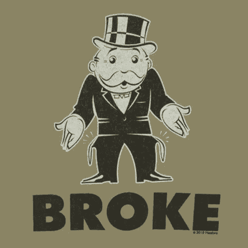
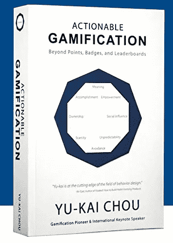
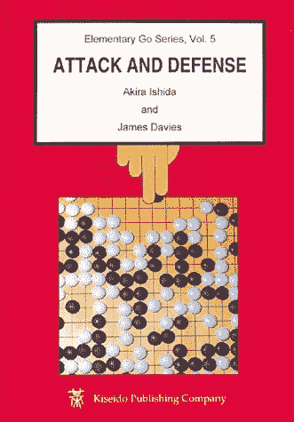
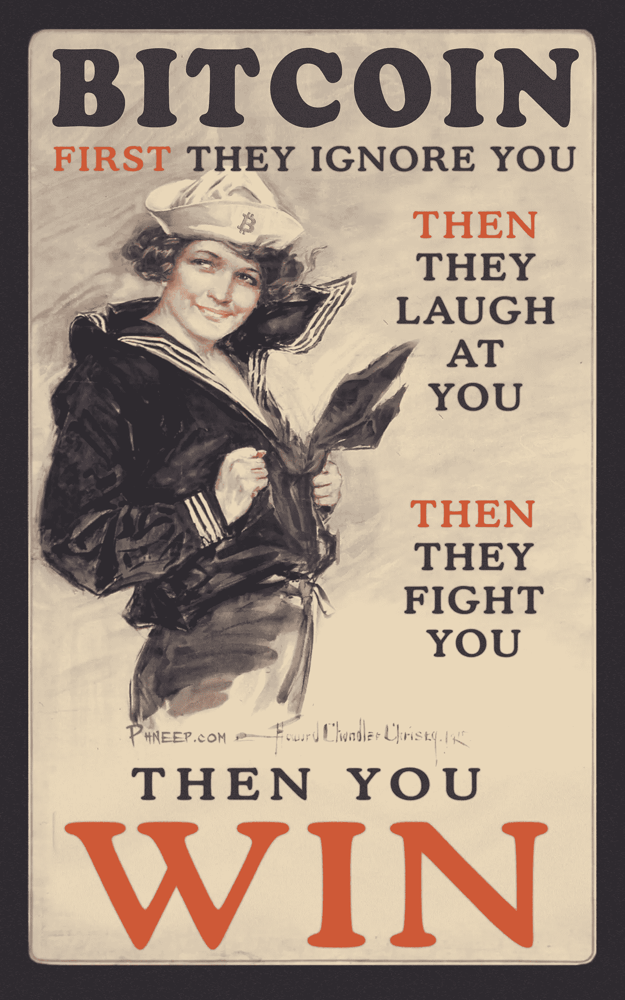
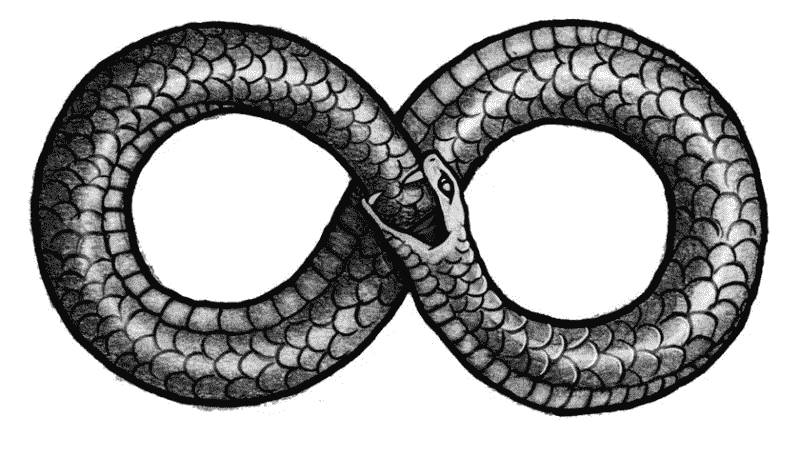

# 杀死 Kickstarter:加密黑仔应用蓝图

> 原文：<https://medium.com/hackernoon/killing-kickstarter-the-crypto-killer-app-blueprint-4c5c326ee1a6>

什么是完美的加密杀手应用程序？

许多项目认为他们已经搞定了，但是让我们面对现实吧:

Crypto 的杀手级应用仍然在行动中失踪。

我已经[谈过几次杀手级应用](https://hackernoon.com/gamifying-the-delivery-of-money-c55c25cecaee)和，但今天我将更进一步。我将免费赠送一个价值数百万美元的商业创意。

我们将向您展示如何利用一个加密版本来对付大型、受欢迎的企业，并消灭它们，使它们完全不可能与您竞争。

你可以在六个月内让它运转起来。

我为什么要把它送人？

因为我就是干这个的。

我把开源带到了商业和思想层面。我每天醒来都会有一个新的商业想法，但我没有时间或欲望去完成它们，所以我只是把它们扔进宇宙中。我宁愿五十个团队明天就开始工作，而不是一个团队。竞争使市场变得更强、更快。

所以拿着它，带着它跑，早点退休。

如果你成功了，想送我一堆纪念品作为感谢，我不会阻止你，但不管怎样，我都很好。

好吧。准备好了吗？我们走吧。

# **比特币呢？**

不过，在这里等一下。比特币不是已经是杀手级应用了吗？

有些人这么说，他们没有错。这是不受任何中央权力机构控制的钱，它设法在一个敌对和混乱的环境中生存和繁荣。

但是谁想就此打住呢？

这就像说我们发现了火，所以我们今天就到此为止。

嘿，伙计们，我们已经解决了灯泡的问题，但是对于电，我们绝对没有别的办法。

我们什么都考虑到了。我们完了。

号码

我们甚至还没有想到加密中的一切。我们还没有结束。

[Awesome art from Phneep](http://www.phneep.com/projects/bitcoin-propaganda-part-2/).

当然有怀疑者写的尖刻文章，他们说区块链不会做任何该死的事情，但这是相当短视的。很长一段时间，人工智能被认为是一派胡言。几十年来，它崩溃了，燃烧了。神经网络无法在 tic tack toe 获胜，更不用说[疯狂复杂的围棋](https://www.netflix.com/title/80190844)游戏，它们当然也不会[驾驶汽车](https://selfdrivingcars.mit.edu/)。

那些反对者现在在哪里？像其他勒德分子一样被扔进了历史的垃圾箱。

历史是清楚的。如果你赌科技会失败。

事实上，我挑战任何人指出一个在过去实际上失败的大技术。在这里不要便宜。不要指出像虚拟男孩这样的单一产品或者失败的技术迭代，而要指出 T2 失败的整个技术类别。

我这么说是什么意思？

游戏机是技术类的。雅达利 2600 和索尼 Playstation 都是迭代。家庭录像是一个类别。Betamax、VHS、DVD 和 DVR 都是这种技术的翻版。

类别很重要。迭代只是风中之尘。

找到失败的[技术迭代是非常容易的。大坝决堤。桥梁倒塌。T 的线路不通。协和式飞机坠毁。但是大坝、桥梁、电话线和飞机的柏拉图式的形式永存。最终有人得到了正确的迭代。](https://www.technologyreview.com/s/401465/10-technology-disasters/)

在亚马逊在图书方面取得成功之前，很多人试图在网上销售商品。VR 失败了好几年，直到 [Oculus Rift](https://www.oculus.com/) 。

蒸汽机经历了一个世纪的反复试验。

It steam engines when it’s steam engine time. [Get this awesome art here](https://www.stanleyprinthouse.com/listing/482755498/steam-engine-patent-steam-engine-poster).

第一台工作中的[蒸汽泵，由托马斯·萨弗里](https://www.thomasnet.com/articles/custom-manufacturing-fabricating/steam-engine-history)获得专利，倾向于爆炸。萨弗里在 1698 年提出了他对这项技术的看法。又过了 70 年，詹姆斯·瓦特在 1765 年的革命性设计使这项技术真正起飞，他在 1712 年将詹姆斯·纽科门的早期设计的能效提高了一倍。

尽管取得了突破，它仍然花了 11 年多的时间才上市。

对于每个说 crypto 已经有足够的时间去创新的人来说，请记住，我们在这方面才刚刚起步八年。真正的创新需要几十年的挫折和失败，即使人类发展的步伐继续越来越快。

我们太沉迷于每隔几分钟就有一个新的小玩意或突破，以至于我们有时会错过看不见的背景故事。

每一次突破都有一百万个孤独的小时和一百万次失败。

我们变得不可思议的不耐烦和不切实际，期待奇迹来得太快。技术开始时缓慢而稳定，然后在一波增长中爆炸式增长。这是指数曲线，但它从来没有人们想象的那么快。从精彩的文章[金钱心理学](http://www.collaborativefund.com/blog/the-psychology-of-money/)中选取这个例子:

“IBM 在 20 世纪 50 年代制造了 3.5 兆字节的硬盘。到了 20 世纪 60 年代，东西已经发展到了几十兆字节。到 20 世纪 70 年代，IBM 的温彻斯特硬盘容量达到了 70 兆字节。然后，随着存储容量的增加，驱动器的尺寸成倍缩小。20 世纪 90 年代初，一台典型的个人电脑拥有 200-500 兆字节。

然后……*重击*。东西爆炸了。

1999 年——苹果公司的 iMac 配备了 6g 硬盘。

2003–Power Mac 上的 120 gigs。

2006 年–新款 iMac 的 250 场演出。

2011 年—首款 4tb 硬盘。

2017–60tb 硬盘。

现在把它放在一起。从 1950 年到 1990 年，我们增加了 296 兆字节。从 1990 年到今天，我们增加了 6000 万兆字节。"

加密还有很长的路要走。它会实现的，但是我们必须有耐心和毅力。

但这并不意味着我们必须等待 crypto 彻底改变一切，让*现在就开发一些杀手级应用*。

我越想这件事，就越觉得我们错过了一些非常明显的唾手可得的果实:

加密 Kickstarter。

所以让我们开始吧。

# **第一步:停止试图改变世界**

今天，我们奖励大胆大胆思考的加密项目。

[Everyone wants to change the world](https://amzn.to/2McaE48).

像以太坊、 [EOS](https://hackernoon.com/eos-goddess-of-the-crypto-dawn-4b2959c03a35) 、NEO、IOTA 和 [Radix](https://www.radixdlt.com/) 这样的项目正在试图彻底改造从支付处理到身份、DNS、存储和消息传递的一切。毫无疑问，从长远来看，这是加密真正起飞的方式。无所不能的综合分散平台和厨房水槽将在未来十年甚至更长时间内改变我们的生活、工作和娱乐方式。

但是如果通向第一个杀手级应用的道路要简单得多呢？

所有这些平台的问题是他们试图重新发明轮子。当然，现在的网络有上百万个漏洞，从大公司的统治地位到无休止的漏洞和安全漏洞，再到完全没有隐私。

但是有时候轮子不需要重新发明。已经足够好了。

要建立一个有利可图的企业，你不需要建立一个最终的、成为主宰世界的平台，同时提出一个新的商业模式和一个前所未见的应用程序。

你只需要造一个稍微好一点的捕鼠器。

Kickstarter 已经是一个非常棒的捕鼠器，所以我们将模拟它的优势和劣势，我们将利用它的优势，攻击它的劣势。

世界上许多最成功的企业都不是革命性的，它们只是旧的和已建立的商业模式的新版本。弄清楚如何更好地倒垃圾，如何更好地买书，如何更好地叠衣服，你就有可能成为大赢家。

以优步为例。这让打车变得容易多了。看起来优步对我们订车的方式做了大量的改变，但事实并非如此。

它做出了三大改变:

1)它创建了一个评级系统，这样你就可以和一个陌生人一起进入一辆汽车，而不会觉得自己要被一个疯子用刀捅了。有时坏事仍会发生，但我们忽略了这样一个事实:出租车也发生了同样的事情 *和* *这种事情发生得更频繁*不管人们告诉你什么可怕的消息，关于大、坏、邪恶的优步。

2)它实现了点对点的拼车，打破了所有汽车都归中央集权公司所有的模式，从而让这些公司背负了巨额债务、风险和初始资本敞口。这使得他们几乎没有钱来创新，因为他们不得不放弃这么多现金来购买所有的汽车。一旦优步把它变成自带设备，他们就完蛋了。

3)最后，它实现了汽车路线的自动化。一名出租车调度员曾经做过这样的工作，尽可能快地发送车辆，但规模并不好，即使是最好的出租车公司也容易出现经常性的路线错误，如出租车不准时出现或根本不出现。电脑在这方面做得更好更快，它会随时告诉你车在哪里！

就是这样。就是这么做的。

找出问题并为这些问题创造一个真正的解决方案，你就拥有了一个成功的企业。

简单吧？

没那么多，因为你需要对另一家企业如何运作、如何失败以及如何修复它有一个杀手级的洞察力。

但这是可以做到的。让我们看看如何。

# **第二步:使用有效的方法**

现在我们知道我们正在建立一个加密 Kickstarter。那么我们如何建造它呢？

我们从使用已经运行良好的开始。

如果你正在尝试重新制作 HTTP 和流媒体视频，你将面对一座高得你可能永远也爬不上去的山。这并不是说网络不能做一些重大的改进。如此多的网络已经变成了可怕的破碎的安全模型和零日攻击的反乌托邦噩梦。但修复这一遗产并不容易。

如果容易的话，我们早就做了。

就目前而言，网络可能是我们能做的最好的事情。

数百万工时、数十亿行代码和数以万计的公司和项目造就了今天的网络，当你想重写这一切时，你就要从头开始。

那不仅仅是一座要攀登的大山，那是珠穆朗玛峰的平方。

那么，为什么要尝试去爬山呢？

忘记等待以太坊或 [EOS 来改变分布式存储的本质和成本](/eosio/start-an-eos-meetup-in-your-community-761be355fce)。亚马逊已经有了[的廉价存储](https://aws.amazon.com/ebs/)。不要等着别人重新发明 HTML。网页设计是一门成熟的科学，网页服务器也是如此。当然，也有一些缺点，但是我们已经知道如何用 Docker 容器和 Kubernetes 构建一个运行在公共云上的大规模、可伸缩的分布式 web 集群。

把重新发明轮子留给超级雄心勃勃的项目。你只需要一个很棒的网站，然后你就可以在这个基础设施之上建立一个优秀的支付系统。

# **第三步:给你的目标打指纹**

要收购一家现有企业，我们需要从里到外研究这家企业。所以让我们稍微了解一下我们的目标。

Kickstarter 有一个简单的商业模式。他们通过众包筹集资金。创作者提出一个概念，做所有的广告和推广，人们加入这个平台，给他们钱。对于他们的捐赠，他们会得到一些小饰品，如贴纸或海报，或者如果产品上市的话，可以提前获得产品。

[Kickstarter 抽取总额的 5%](https://www.kickstarter.com/help/fees)支付处理器从每笔质押中抽取 3% + 20 美分。

与 ico 不同的是，他们从 SEC 获得了一个针对小规模、非授权投资者的例外。这意味着，如果你像一个笑话一样破产了，你仍然可以毫无问题地在众筹 Goliath 上为下一个棋盘游戏捐款。ICOs 应该注意到这个例外，因为众包做得好不会引起中央权力的愤怒，甚至会让他们为你的特定业务重写规则。

Kickstarter [公布了关于有多少项目获得资助以吸引创作者掷骰子并发起他们自己的活动的统计数据](https://www.kickstarter.com/help/stats)，但这似乎是所有时间的统计数据，而不是每年的。

其他网站利用这些数据挖掘他们的业务。因为该公司不是上市公司，我们无法查阅提交给美国证券交易委员会的文件。这让我们更难知道他们到底在烧多少钱，但我们可以很容易地弄清楚一些事情。

根据 ICO partners 的数据， [Kickstarter 在 2017 年为项目](http://icopartners.com/2018/01/kickstarter-2017-year-review/)成功筹集了 601，102，946 美元。因为他们拿了那笔钱的 5%,所以他们有 3000 万美元的原始收入。

不幸的是，我们不知道他们要花多少钱才能赚到所有的钱。据我们所知，他们几乎不能收支平衡。

如果你真的打算建立这项业务，你就必须搜索网络，深入挖掘，尽可能多地了解他们的支出，这样你就能算出他们每年的净收入。

为了简单起见，我们在这里猜测只是为了我们自己的业务和这篇文章有一个目标。让我们假设我们全力以赴，做了艰苦的工作，我们发现他们每年要花费 2000 万美元用于工资、物资、数据中心和所有其他保持现代企业正常运转的事情。

这给我们留下了 1000 万美元的净利润。同样为了简单起见，我们在这里不考虑税收，尽管这绝对应该纳入你对任何目标竞争对手的分析中。

既然我们对自己的业务有所了解，我们就要找出它的弱点。

# **第四步:找到弱点**

任何现有的成功企业都是有利有弊的混合体。

也许他们在制作软件方面很厉害，但是他们的订购过程在幕后完全是一团糟。也许是一家连锁餐厅知道如何制作令人垂涎的三明治，但他们无法从供应链中节省更多成本，或者他们无法在不侵入宇宙和加快时间的情况下更快地制作这些美味的三明治。

任何企业都会受到其所处时代的限制。

他们只是在尽最大努力使用手中的工具。有些问题是他们无法用当前的技术或他们那个时代最好最聪明的想法解决的。所以他们凑合着。他们找到了掩盖这一弱点的方法，尽可能提高效率，但最终却遇到了一个他们无法逾越的真正瓶颈。

在一段时间内，这并不重要。

直到它发生。

当一项新技术出现时，它会改变游戏规则。它改变了现实中可能性的本质。它开辟了从未想象过的道路。

我们已经说过，加密还有很长的路要走，但它已经有了一些内置的优势，如果传统企业仍然被束缚在法定货币上，它们就无法与之竞争。那是我们的尖端。

那么，crypto 已经做了哪些传统企业做不到的事情呢？

第一个也是最明显的是它降低了费用。

[传统支付提供商](https://www.formstack.com/payment-gateway-comparison)对每笔交易收取 2.9% + 30 美分的费用。稍后你会发现 2.9%其实是个骗局，它更接近 4.5%或 5%。我们将运行这些数字，并仔细看看究竟是为什么。

[Kickstarter 列出的支付处理费为每笔抵押贷款 3% + .20 美分](https://www.kickstarter.com/help/fees)，尽管它明确表示支付金额最高可浮动 5%。

看起来可能不是这样，但随着时间的推移，中间商损失了很多钱。它加起来很快。

相比之下，在我查看比特币的当天，比特币的平均费用为 0.4825%。比特币现金的平均费用在 0.0982%左右。以太坊进来 0.0991%。这只是硬币的一小部分。他们中的一些人的费用非常低，并把保持超低费用作为重点。

当然，这些费用会有波动，但由于有很多密码，我们可以给捐赠发送者一个选择，选择一个费用最低的。我们还可以让我们的应用程序设置我们愿意支付的费用，即使整个网络波动，也能保持稳定。

我们在商业模式上也有很大的优势:如果我们的支付需要一点时间，那也没关系。我们不是在这里买咖啡。如果你要买一杯咖啡，你想马上拿到，但卖家需要等待网络完成交易，如果是比特币，可能需要 10 分钟甚至更长时间。

但 Kickstarter 中的钱会被托管，直到创作者达到一定的门槛，才会发放给创作者。通过加密网络获得付款需要 10 分钟或 10 小时都没有关系，因为托管对最终用户隐藏了这一点。我们可以只对成功的认捐进行积分，如果它在一段时间内没有清除，我们可以稍后再回到他们那里。

这意味着你的第一个优势是削减了那些中间商的成本，这意味着更多的钱流向了创作者和你的企业，而不是支付网关。

更好的是，Kickstarter 无法降低费用，因为他们完全完全依赖支付提供商。这些都是费用，他们不能仅仅推出一个新的 Visa 或 Paypal 来竞争。

他们被传统的商业模式束缚住了，而你的低收费是一种自然而然的优势，会慢慢地把传统业务饿死。

现在想象一个加密的 Kickstarter。

我们已经击败了他们的 3% + 20 美分。我们平均领先他们 2.5%。2.5%可能看起来不算多，但这是在 20 万美元的基础上又增加了 5000 美元，而且随着你获得的加薪越来越高。

实际上比那更糟。3%是一个骗局，让费用看起来比实际低，同时拿走你更多的钱。

一如既往，数学是我们的朋友，所以让我们做数学。

当有人在 Kickstarter 上捐赠 10 美元时，支付处理器会收取 30 美分(3%)，在这 3%的基础上再加上 20 美分，这样总交易费就达到了 50 美分，这使得交易费达到了惊人的 5%。

现在让我们保持简单，想象所有的捐款都是 10 美元。

这意味着在 200，000 美元的加注中，创造者损失了 10，000 美元。

哦，这还是在他们向 Kickstarter 支付 5%的费用之前。Kickstarter 把你已经失去的东西拿出来。在你加注 20 万美元时，你失去了 10K，剩下 19 万美元。Kickstarter 获得 9500 美元，剩下 180500 美元。

你损失了将近 10%的费用。

哎哟。

现在让我们给 Kickstarter 来一拳，在最疼的地方削减他们的费用。

我们将收取 4.5%而不是 5%。

看起来我们赚的钱少了很多，运营一个大型网站和基础设施的成本基本相同，但实际上我们并没有失去太多，我们在这个过程中有所收获。因为每笔捐赠中有更多的钱会捐给我们从更大的资金池中抽取的创造者。

让我们再次计算一下，这次使用 crypto，比特币的平均费用为 0.4825%。

200，000 美元的加注中有 960 美元是交易费，因此创建者还有 199，040 美元。现在，Crypto Kickstarter 扣除了 4.5%的费用，获得了 8956 美元的费用，这样创作者就有 190083 美元。

我们的收入略低于 Kickstarter，但这给了我们额外的优势，让他们竞争起来非常痛苦。他们现在不得不从微薄的利润中削减 5%,而且没有地方可以削减。他们在切骨头。

现在让我们反其道而行之，让情况变得更糟。

在我们获得牵引力之后，我们会提高价格。

我们收取 6%和*仍然进来* *少给创作者。*我们获得了 11，942 美元，创作者仍然在我们的平台上创造了更多，这是一个重要的优势。

为了竞争，Kickstarter 需要降低他们的费用，因为越来越多的人逃离这个平台，转向他们的加密竞争对手，这进一步降低了他们的底线。

但不止于此。现在我们要血洗了。

# **第五步:带来痛苦**

让我们抓住要害。

我们已经通过采用比特币、Dash 和以太坊等成熟的加密技术，抛弃肮脏的法币，以残酷的效率打击了 Kickstarter 的商业模式。

现在，让我们使用我的游戏化金钱理论推出我们自己的基于奖励的密码，并一劳永逸地消灭它们。

See [gamification in action](https://amzn.to/2JAIdOE) for your business.

这就是我们把视频游戏设计师开创的概念带到现实世界的地方。奖励和惩罚驱动着系统，驱动着使用系统的人的行为。

推/拉。胡萝卜加大棒。

首先，我们列出了所有有益于系统的行为，比如推荐和大额捐赠。

小心点。这并不容易。听起来很简单。你需要对经济学、博弈论、概率论、心理学等等有全面的了解。

你必须清楚地看到并理解你正在建立的整个微观经济体系，所有参与者的所有行为，好的和坏的。你必须想象如何一步一步地成长。

你必须想办法摧毁它，这样你才能保护它。

这是关于鼓励我们想要的，劝阻我们不想要的。所以，慢慢来，好好想想。

Everything is [attack and defense](https://amzn.to/2y01NPO). Learn Go to control your mind.

当然，我们希望更多的人加入我们的平台，所以我们会奖励那些把人们介绍到网络中的人。但我们不希望人们欺骗系统，注册一堆傀儡地址，这样我们就能确保只有进来消费的人才会被计算在内。我们的智能合约将奖励托管一段时间，并随着人们增加我们平台的能力而释放它们。

我们也希望有更多的创作者，所以当新的创作者通过建立他们的第一个项目并获得最初的捐款时，我们会给他们一些奖励。

我们希望更多的人给予，我们希望他们给予更多。这意味着大捐赠者也能获得大回报。

大创作者让我们赚了最多的钱，所以最大的项目可以得到我们的奖励。

达到里程碑的项目，如第一笔捐款、前 25%、50%和 75%的项目会获得奖励，但我们会托管这些奖励，直到它们获得资金并达到所有里程碑，或者我们会让人们利用系统，获得奖励，然后在项目完成前退出项目。

这引出了重要的一点。对于每一个奖励，我们必须想象所有攻击它的方法，这样我们就可以设计反作弊规则，就像电子游戏一样。

这种情况一直在持续，一系列分层的智能合约让网络为我们而动，推动和拉动每个人。

当然，这是一个绝对杀手的原因是因为 Kickstarter 无法用法定货币做到这一点。他们需要去买一堆菲亚特，结果却把它送人了，进一步打破了他们越来越薄的底线。

但是有了加密技术，我们就可以凭空印制钞票了。我们不需要买它。我们把它印出来。

如果人们发现它有价值，它就会变得有价值。

除了我们赋予它的价值，任何东西都没有价值。我们都相信美元有价值，确实如此。就这么简单。为什么会有人认为我们的密码有价值？

因为我们的加密 Kickstarter 风靡全球。

哦，当然，事情不是这样的。但是让我们想象一下这个小密码引擎的整个故事。

# **从想法到现实**

起初，Kickstarter 嘲笑我们的小公司。

我们到底要和谁较量呢？其他人复制了这种模式，但失败了，或者只是成为二流的众包平台。我们是模仿者，无名小卒。

第二，我们使用的是加密技术，他们根本不知道。

[Another killer Phneep poster](http://www.phneep.com/projects/bitcoin-propaganda-part-2/). Oh and [Ghandi never actually said this](https://www.snopes.com/fact-check/first-they-ignore-you/) but it’s better than what he did say and so we go with it.

“密码？开什么玩笑？”在象牙塔里自鸣得意的高管们说。“除了网虫的钱什么都没有。只针对罪犯和毒贩。没人会把那个地方当回事。”

他们继续啜饮着花式裤子咖啡店的美味咖啡，看着明年的计划，前方只有蓝天。

但我们没有照搬他们的模式。我们正在改进它。

起初，我们的网站并不完美。比 Kickstarter 更丑更诡异一点。但是我们的开发人员一直在使用成熟的 DevOps 模型对它进行改进。然后有一天就足够好了。

那就是人们开始看待它，考虑它的时候了。

也许一个有影响力的人被 Kickstarter 拒绝了，因为他们不喜欢他做的东西，所以他来到了我们的平台。很快，被他关于网站简化的界面和易用性的正面推文所吸引，其他人也在跟进。

很快，它每天都有新的追随者。它开始制造新闻，最初是一些独家新闻，没什么大不了的，但也没什么可轻视的。

然后重大突破就来了。

一位经验丰富的 Kickstarter 创始人厌倦了高昂的费用，带着他的新杀手级产品来到我们的平台，并在几周内获得了 30 万美元的比特币。

现在新闻铺天盖地。

这位资深人士大谈特谈他在新平台上多留了多少钱。当然有一些小问题，但整个过程中支持团队都非常有帮助，不像其他平台，他只是大海中的一滴水。他喜欢它。

现在其他人也想加入。它在推特、脸书和 Reddit 上疯传。

与 Kickstarter 不同的是，注册的人会得到一些东西，而不是某个项目的 t 恤或贴纸。他们获得了一枚真正的通用奖励硬币，突然，这个系统像野火一样流行起来，Kickstarter 正在争夺。

现在这不是一个笑话。这是一种威胁。

Kickstarter 发起攻击，可能是专利和律师，他们试图获得一些我们已经做好的东西，但我们击退了他们，法官扔掉了他们毫无意义的诉讼，因为我们的风投对这个不断增长的业务加倍下注。

现在 Kickstarter 真的有麻烦了。他们扔了一个干草机，但没打中。人们会被解雇。

很难回答的问题。为什么我们没有预见到这一点？我们怎么会错过这个？

“谁负责我们的区块链？”一位绝望的高管尖叫道，他有三个孩子和一大笔抵押贷款，现在正面临裁员。

“没有人，”答案来自它。“你说这是个笑话。只是为了罪犯和人渣。你告诉我们要终止这个项目，解雇所有的密码开发人员。”

然后，当他们开始计算数字时，他们会意识到自己犯了一个巨大的错误。

无处可砍。Crypto Kickstarter 的收费比他们高，但他们仍然有更好的底线。

因此，他们开始削减必要的工资，从已经紧张的支持人员和刚从大学毕业并渴望帮助的年轻工程师的小人物。

现在他们陷入了死亡漩涡。

他们在流失人才。在街上的话是“裁员”，他们是放射性的。

他们有更多的停电，因为没有人保持灯亮着。这是超负荷工作，每个人都做两到三份工作，所以他们开始辞职，情况变得更糟，恶性循环。

人们开始抱怨支持变得多么糟糕。他们在推特和脸书上发布了这个消息。YouTube 上关于它的激烈争论。

一天比一天糟糕。

最后，一个 Kickstarter 的大人物试图在一角硬币上旋转，开发他们自己的密码，但这不是他们的专长。他们不知道自己在做什么。他们习惯于控制，而事情却失控了。他们不想要开源资金，所以他们从一家大公司购买一些专有的 crapchain，希望他们能够竞争，但这是垃圾，因为他们不明白在这个领域没有一个优秀的人为那些家伙工作。

他们的密码失败得很惨，因为没有二级市场，也没有人想要它。就像有人朝你扔硬币一样。他们的钱不值钱。

那是死亡拨浪鼓。他们能听到死神来抓他们和他们建造的一切。

他们已经失去了最后也是最后的优势，失去了前几年的战争资金。

更糟糕的是，他们在一个破碎的解决方案上搞砸了。现在无路可逃了。没有出口。

就这样，他们走了。

# **永无止境的循环**

不需要太多。

企业无时无刻不在消亡。

The never ending story.

一个新的竞争对手不知从哪里冒出来，对旧模式进行了精彩的模仿，但突然间一切都太晚了。老恐龙被包围了，也失去了武器。他们都是中层管理者，即使好主意打在他们脸上，他们也不会知道。

他们认为他们的商业模式是一条无人能跨越的护城河，但这是一种错觉。很少有公司有真正的护城河，即使是最宽的灰尘也不会永远存在。

正当他们需要最敏捷的时候，他们却陷入了自己恐惧和怀疑的深渊。

加密技术会悄悄出现在像这样的企业中，而他们看不到它的到来。它会让很多很多人放松警惕，在他们的岗位上睡着了。

然后有一天他们会醒悟过来，他们创办新公司的唯一方法就是非常非常认真地对待 crypto。

突然间所有的开发商都非常抢手。你不能雇佣最好的人，因为你的竞争对手已经雇佣了。

在商业世界和生活中，生与死的循环就是这样进行的。

你不能对抗未来。

你要么接受它，要么去死。

############################################

## 如果你喜欢我的作品，请访问我的个人主页，因为没有它，这个博客就不会存在。

## 顶级赞助人可以独享这么多东西:

*   **每篇文章、播客和私人谈话的早期链接。**你比任何人都先阅读和聆听！
*   **一个月月虚拟的和我见面并问&一个。**问我什么我都会回答。我也分享我正在做的一切，并给你一个幕后看我的过程。

## 访问传说中的硬币表 Discord，您会发现:

*   **市场来电**来自我和其他专业技术分析大师。
*   **币**只**私聊**。
*   **私人海龟滩频道，程序员们在这里分享各种版本的** [**密码海龟交易员策略**](https://hackernoon.com/my-super-secret-crypto-turtle-strategy-revealed-ae7492fb01a6) **等信号和交易软件**。
*   T21，看看我和其他专业人士是如何解读市场的。

###########################################

## 来[看看关于这篇文章的播客](http://dailyposthuman.com/why-everyone-missed-the-most-mind-blowing-feature-of-cryptocurrency-2/)在我的新节目 [The Daily PostHuman](http://dailyposthuman.com/) 上，涵盖了加密、人工智能、科技、未来、历史、社会等等！

###########################################

## 有时人们希望我帮助设计他们的系统或建议他们的项目。我很少这样做，但一些令人惊叹的项目不时引起我的注意。

## 如果你想让我感兴趣，确保它是改变世界的技术，并且你有一个真正的预算(也不仅仅是你的代币)，一个计划和一个合理的时间表。在蝉[在 iamcicada.com]遇见我。没有附件。附件直接扔进垃圾桶。

## 如果我没有回答，那是因为我的日程已经排满了。

## 请不要往心里去。

## 我首先是一个作家。项目和建议不是我的重点。

############################################

# 经常有人问我会不会在这个博客上为他们做一篇推广文章。答案绝对不是。无论如何都不行。如果我写你，那是因为我想写你。本博客不出售。

###########################################

关于我:我是一名作家、工程师和连续创业者。在过去的二十年中，我涉及了从 Linux 到虚拟化和容器的广泛技术。

## [加入我的读者群，你可以免费得到一本我的第一部小说《蝎子游戏》。读者称之为“神经癌的第一次严重竞争”和“黑色侦探会见约翰尼记忆术。”](http://meuploads.com/join-my-readers-group/)

## 最后，你可以[加入我的私人脸书小组，Nanopunk Posthuman 刺客](https://www.facebook.com/groups/1736763229929363/)，在这里我们讨论所有的科技、科幻、幻想等等。