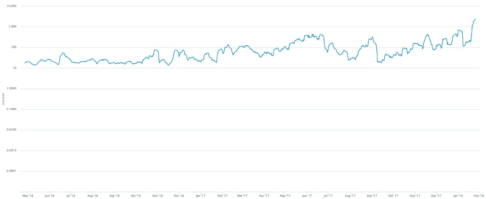
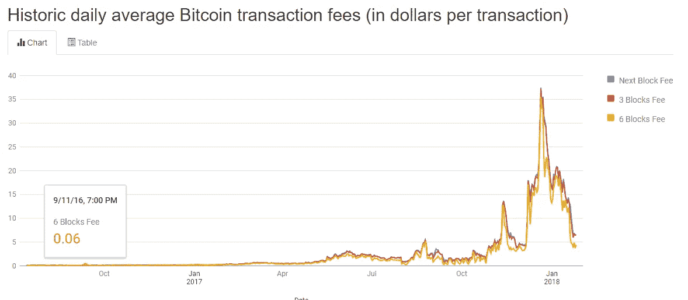
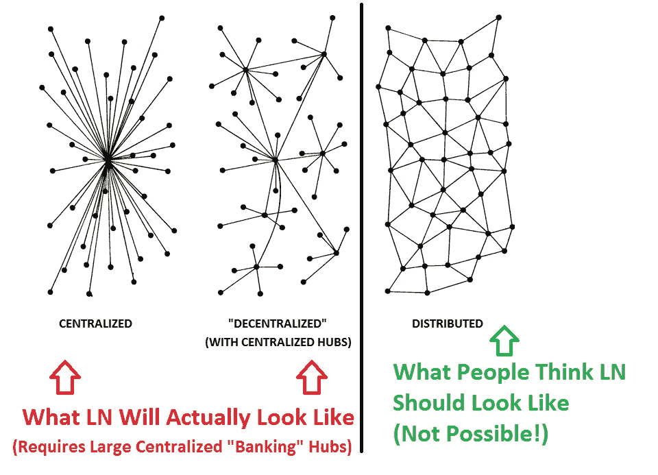

# 杀死国王——如何终结比特币的统治(上)

> 原文：<https://medium.com/hackernoon/killing-the-king-how-to-end-the-reign-of-bitcoin-part-1-771afebffc0f>

你以前很酷！回到 2016 年，你的平均交易成本是 6 分钱！你的确认时间只有 20 分钟！怎么回事，比特币？

## *在这个简短的系列中，我们将看看为什么比特币注定要失败，它如何从整体上伤害加密货币，以及新的统治者将如何上台。*

# 是时候杀死国王了。

作为整个加密货币资产集团的主要交易对，比特币被视为分布式账本技术的“数字黄金”。与菲亚特和股票等传统资产不同，加密货币的价值并不是基于对任何单一政府或公司的信任，而是基于对加密技术可以用来实现安全可靠的交易方式的信任。这种意识形态代表了从对人的信仰到对数学的信仰的转变；与世界上任何地方的陌生人进行交易而不依赖任何类型的第三方的自由，伪造财富无法破解的系统，以及曾经发生的每笔交易的不可改变的历史。

不幸的是，像大多数其他加密货币一样，它无法扩展。

看看下面的图表，显示了[比特币](https://hackernoon.com/tagged/bitcoin) [网络](https://hackernoon.com/tagged/network)处理交易所需时间的对数增长，以及这些交易多年来的平均成本。

Average Transaction Time for Bitcoin Transaction Confirmations, sourced from [https://blockchain.info/](https://blockchain.info/)

Sourced from [https://bitcoinfees.info/](https://bitcoinfees.info/)

与它的许多后代相比，比特币的效率低得令人沮丧。交易比以往任何时候都更慢，成本也更高，让用户问*“这太糟糕了！接下来是什么？”*

# 扩大比特币网络有两种主要方法:

## 闪电网络:

与 Raiden 或 Trinity 类似，这种解决方案只是将负载从比特币网络转移到改进的链外解决方案。这个提议的解决方案正在为许多主要的加密货币平台开发，虽然它看起来很有前途，但有人说闪电网络在数学上是不可能的。

## 更大的块:

让比特币的每个开采区块处理更多交易似乎是一个简单的解决方案。今天的比特币块被限制在 1MB，如果我们将它增加到 10MB，我们可以有十倍多的交易，对不对？

[**以下是简单增加块载荷的潜在问题:**](https://en.bitcoin.it/wiki/Block_size_limit_controversy#Arguments_in_opposition_to_increasing_the_blocksize)

*   硬分叉需要等待足够的共识。
*   灾难性共识失败的风险
*   如果需要，可以在短时间内部署能够达成共识的紧急硬分叉。
*   由于传播速度较慢，孤儿率放大、更多重组和双重花费。
*   “拥塞”问题可以通过包括事务驱逐在内的内存池改进来解决。
*   无论多大的最大块大小都无法支持主区块链上的所有未来交易(各种类型的离链交易是唯一的长期解决方案)
*   快速块传播要么显然不可行，要么(如 IBLT)会产生集中控制。

虽然这种解决方案是可行的，但它在技术上等同于贴创可贴。

# 这就是结局

关于它没有两种方法。加密领域曾经的“数字黄金”已经不受欢迎了。尽管它曾经是加密货币的代言人，并引入了分布式账本和数字资产的概念，但现在是时候引入更有前途的技术了。

在下一期，我们将看看比特币是如何直接和间接伤害加密货币整体的。感谢阅读！