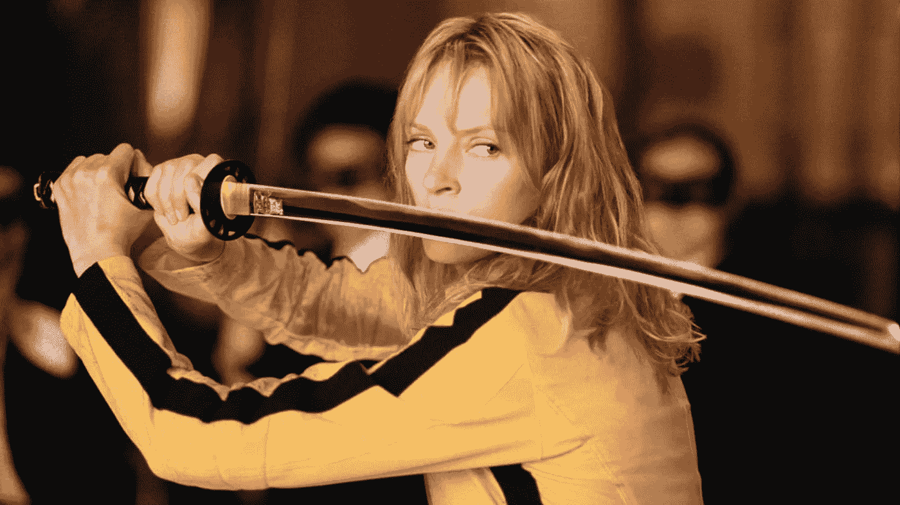

# 杀死中间人

> 原文：<https://medium.com/hackernoon/killing-the-middle-man-7b6c6118fa17>

Kill Bill — but you probably knew that already

在数十篇关于区块链能做什么的文章之后，我们在考虑新项目时仍然错过了许多可能性。我写这篇文章是为了引起人们对区块链独有的一个特征的注意。

区块链就是去中心化。在每一个真正的区块链项目中，系统和技术取代了中介。这很重要，也是系统民主化的核心:

*   中间商拿走了大部分利润。这就是他们如何继续做生意。
*   中间用户执行他们自己的规则，你必须遵守这些规则才能留在游戏中。想象一下通过 PayPal 向朋友汇款，但注意到该国家尚不支持 PayPal。
*   中间人架构本质上比对等系统慢，因为系统中包含了一层额外的复杂性。

用汤姆·古德温的话说:

> “世界上最大的出租车公司优步没有车辆。世界上最受欢迎的媒体所有者脸书不制作任何内容。最有价值的零售商阿里巴巴没有库存。而世界上最大的住宿提供商 Airbnb 并不拥有房地产。”

区块链可以打破所有这一切——如果车主因驾驶而获得报酬，内容创作者因其内容而获得报酬，房地产所有者因出租其财产而获得报酬，那么就不需要中介了。如果你能把钱汇给任何人，就不需要等待中间人确认交易。

# 增强创造力

正如[罗斯·贝尔德](https://www.benbellabooks.com/shop/innovation-blind-spot/)所说:

> “在现实世界中，资金流向最方便找到或最熟悉的想法，而不一定是最好的想法”。

风险投资基金的产品能解决他们所理解的问题，而且他们主要是白人、男性和受过精英教育的人，他们会资助背景相同的人。

在人工智能领域，人们感觉机器人会抢走他们的工作。但是反方观点认为，人工智能只承担多余的工作，让人们更多地发挥他们的*创造力*。区块链也有类似的效果。

如果任何人能够因为他们直接创造的东西而获得报酬，他们就可以专注于自己最擅长的事情，而不是为了获得认可而奋斗。

艺术就是一个很好的例子。

想象一下艺术家想要举办一场音乐会。目前，他们依赖于活动组织者，这些组织者只有在“有利可图”的情况下才会接受他们，就像作者依赖于出版商一样。但是有了区块链，聪明的合同可以完成这项工作，这将是球迷有发言权；而不是出版商或活动组织者。这方面的一个很好的例子是 [KickCity](https://kickcity.io/) ，它让粉丝看到那里有什么，并完全基于艺术家提供的内容来推广他们选择的项目。

# 中间人到底在做什么？

这并不是说中间人是纯粹的敲竹杠者——他们也为生态系统带来价值。escrows、争议、评级和支持等系统是专业生态系统的组成部分。区块链倾向于抽象这些服务，并将它们放在技术中，并以其防黑客的性质拥抱其真实性。但也有区块链项目指定中间人来解决这些问题。Matchpool 就是一个很好的例子；它激励人们为他们的专业知识储备充当中间人。因此，它创造了一种民主制度，在这种制度下，你们双方都从中间人的服务中受益，同时又不会因为中间人而失去你们努力的很大一部分。

# 区块链真的分权了吗？

虽然区块链的体系结构是基于分散的，但网络上仍有许多节点暗示着“集中效应”。例如，加密交易所是加密货币世界的集中网关。因此，他们承担着集中项目的相同风险，包括[被黑](https://blockgeeks.com/guides/cryptocurrency-hacks/)。

此外，在我见过的许多区块链项目中，仍有一部分费用流向展示该系统的公司，有时是在每笔交易中。也就是说，这些数字比中央集权的数字要少得多。此外，在区块链的项目中，原创者更受赞赏。

例如，DADA.nyc 提供了一种艺术品销售模式，每次艺术品被(再)出售时，自动向艺术品的原艺术家支付一定份额(至少 30%)，这是其他任何技术都不可能做到的。

# 结束语

我认为区块链是一种思维方式。除了大肆宣传，民主化是一股强大的进步力量。脸书允许每个人轻松地联系和分享他或她的想法，这就是它受欢迎的原因。YouTube 允许任何人创建一个“电视频道”。凡是给群众带来力量的，都欢迎留下来。

区块链天生就提供了这一点。