# UX 动态印刷——原理、模式和入门

> 原文：<https://medium.com/hackernoon/kinetic-typography-quickstart-guide-for-devs-designers-d5c6b5545ade>

## 利用动作设计、讲故事和文本来传达复杂的想法并增加用户参与度

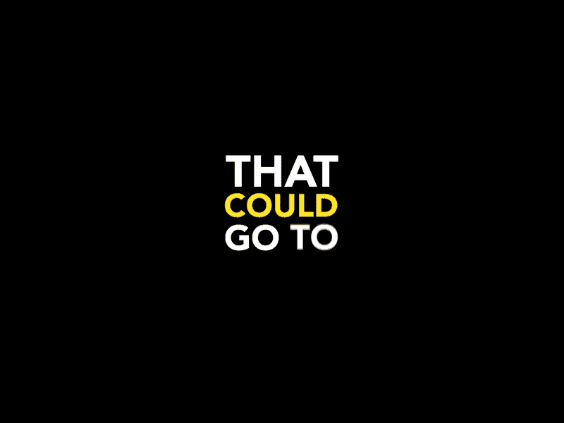

[Ninglin](https://dribbble.com/shots/3333238-Kinetic-Typography-for-Happy-Part-1) — Dribbble

# **内容**

1.  基础知识— *运动与流动排版，及物性理论*
2.  图案— *激发你的创造力*
3.  设计动态组合的原则
4.  *开始使用— *针对设计师**
5.  *面向开发人员的*入门**

# *基础*

*动态印刷是移动字体的艺术。它是运动设计的应用，通过印刷视觉来讲述故事和唤起情感。这是一种时间排版的形式(随着时间的推移而呈现的字母/单词)，不同于连续呈现(静态排版元素的顺序呈现)。*

*动态印刷有两种主要类型:*

***动态排版** —排版元素在 2d 或 3d 平面内相对于彼此移动，但不一定转化为新元素。单词和单个字符以保持可读性的方式在屏幕上进入、退出、增长、收缩和移动。*

*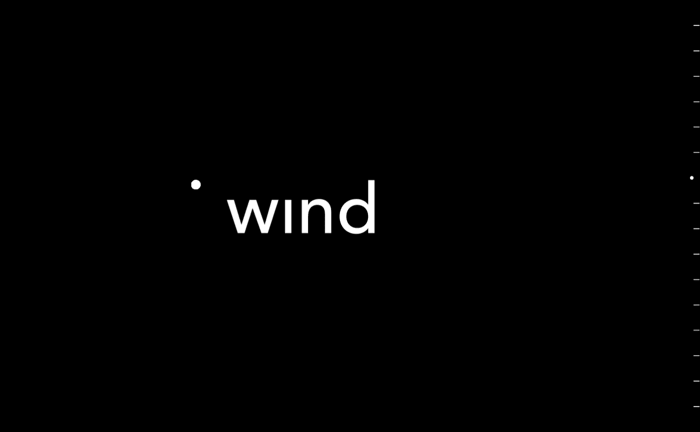*

*[Digital Synopsis](https://digitalsynopsis.com/design/type-in-motion-typography-animation/)*

***流畅排版** —将排版元素转化为非排版形式。单词和字符可以转换成形状和其他单词，而不仅仅是改变它们在页面上的位置或相对属性。*

*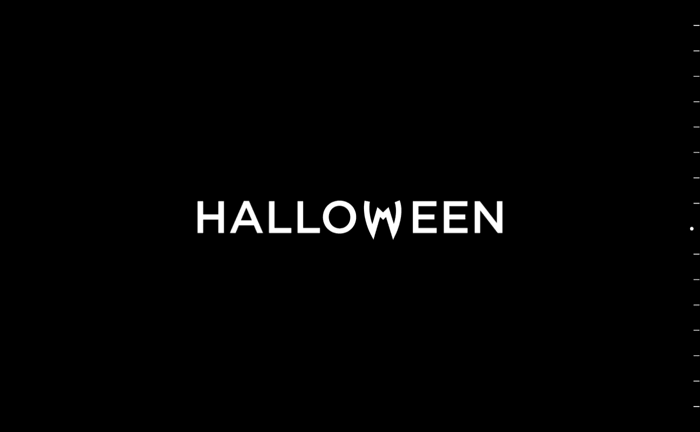*

*[Digital Synopsis](https://digitalsynopsis.com/design/type-in-motion-typography-animation/)*

*这两个流派的基础是 [**及物性理论**](https://journals.sagepub.com/doi/abs/10.1177/1470357216684080?journalCode=vcja)**——理解人类如何从物体状态的转变中推断意义和联系的系统功能方法。它研究我们如何通过运动和流动性的应用使意义更加明确。***

# ***模式***

*   *****创建/销毁** —印刷元素可以使用转化为印刷元素的形状/图案的集合来创建。同样，这些元素可以被解构、分解和破坏。***

******

***Creation — [David Stanfield](http://dribbblepopular.tumblr.com/tagged/David-Stanfield)***

*   *****进入/退出** —排版可以通过过渡引入视图，可以从背景中出现，也可以从容器外部滑入。出现的顺序逐步引导用户通过句子(如果是单词的组合)。***

***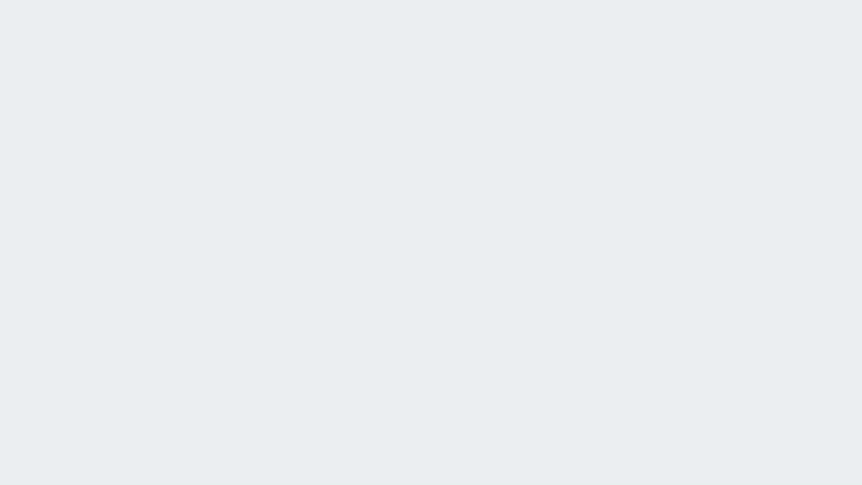***

***Enter/Exit in PowerPoint — [Skillshare Course](https://www.skillshare.com/classes/How-To-Create-Amazing-KINETIC-TYPOGRAPHY-In-PowerPoint/650429262)***

*   *****变形** —字体可以变形为非印刷元素。这可以在隐喻意义上使用，或者在单词和图形元素之间转换。通过关注元素本身的结构变化，变形不仅仅是颜色或位置的变化。***

***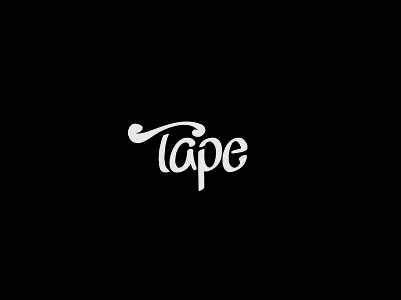***

***Morphing by [TAPE](https://dribbble.com/tapestudio)***

***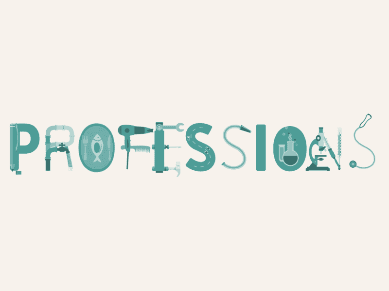***

***Morphing State Transition — [Al Boardman](https://alboardman.tumblr.com/post/101929451796/professions-animated-type)***

*   ***创造性的隐喻——个人角色可以呈现现实世界的特征。例如，某些字体上的衬线可以变成行走的脚。***

***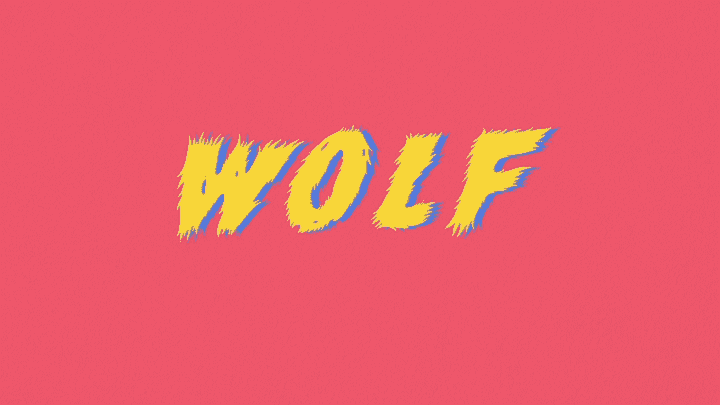***

***Inventive Metaphor — [Hyemin Hailey Lee](http://www.designbyhyemin.com/lenka/)***

*   *****弧线/路径运动** —当文本沿着直线或曲线路径移动时，沿着弧线或抽象线的运动。***

***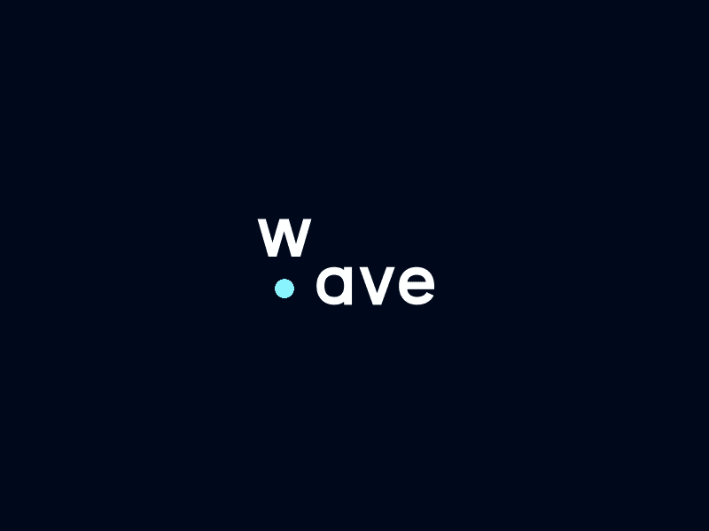***

***[dudenas](https://dribbble.com/shots/3107804-wave)***

*   *****讲故事**——用动作来讲故事或补充叙述(例如。抒情视频)。这在产品中很少见，但在一些使用滚动或交互性来触发动作的产品营销网站上可以找到。***

***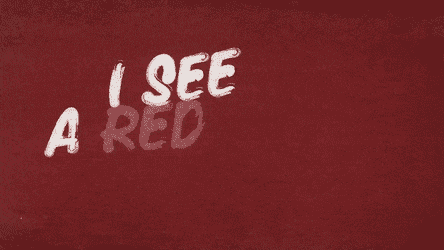***

***The Rolling Stones — [Paint It, Black (Official Lyric Video)](https://gfycat.com/clearcutglisteningcattle)***

***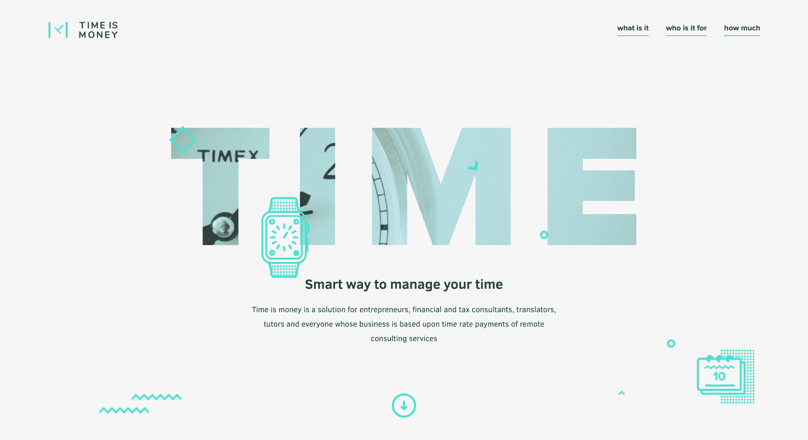***

***Storytelling — [Web Ascender](https://www.webascender.com/blog/2018-web-design-trends-were-loving-with-examples/)***

*   *****发出动作信号**——发出更大动作信号的细微动作。这对于将用户的注意力吸引到动画的开始点非常有效。***

***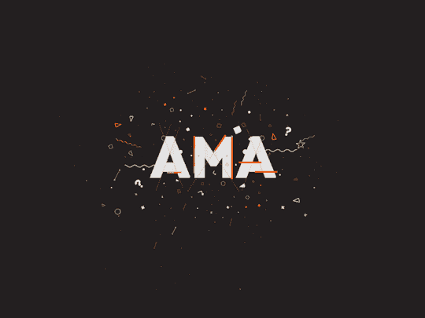***

***Signaling Motion — [David Stanfield](http://dribbblepopular.tumblr.com/tagged/David-Stanfield)***

# ***原则***

***以下是设计动态排版时需要考虑的一些指导原则:***

*   *****保持相关性** —各个印刷元素相对移动。这种相对主义与传统的运动设计截然不同，在传统的运动设计中，你不需要保持线性的顺序。***
*   *****优化可读性** —读者可以轻松准确地阅读数字文本。在自然语言中，文本的可读性取决于其内容(其词汇和语法的复杂性)及其表示形式(如字体大小、行高和行长等印刷方面)。***
*   *****优化效果持续时间** —效果的持续时间应足以唤起用户的目标情绪、理解或反应，但不能更多。***
*   *****管理情绪** —有效的动作和移动可以唤起用户的各种情绪。确保你真正理解你的色彩、过渡和物理状态的变化是如何与观众的情绪状态相互影响的。***
*   *****保持线性** —人类仍然以线性方式阅读。字母和单词出现或消失的顺序应该保持这种线性。***
*   *****动作敏感度**——我们都喜欢非常流畅、现代的动画..还是我们？随着动画变得越来越复杂和侵入性，运动敏感度变得越来越受关注。我推荐这篇关于[设计安全动画](https://alistapart.com/article/designing-safer-web-animation-for-motion-sensitivity)的文章。***
*   *****优化可访问性**——了解那些有屏幕阅读器、颜色敏感度和其他障碍的用户。使用动态排版作为一种强调元素的方式，但不要分散你产品的核心可用性。***
*   *****带宽限制** —用户不希望坐着等待动画加载或在 20 秒而不是 3 秒内读完一句话。确保你考虑到带宽限制，包括技术带宽(互联网)和个人带宽(注意力)。***
*   *****回退状态** —如果动画加载失败或者您发现超时问题，那么最好的做法是使用静态回退状态。***

# ***面向设计师的入门指南***

## ***Adobe 后效***

***业界领先的工具之一，用于创建行业专业人士使用的复杂动态排版。通常需要比其他软件更高的学习曲线，但有一个强大的社区和大量的支持。***

*   ***Cocombee Studio 的 [**动态排版快速入门教程**](https://www.youtube.com/watch?v=kr36RNQVFLg)—一个使用 Adobe After Effects 的综合教程，带有可下载的课程材料。***
*   ***Jesse Rosten 的 [**动态排版高级教程**](https://www.youtube.com/watch?v=fOi5P1qxrM4)—使用 Adobe After Effects 的动态排版高级教程。***

## ***Microsoft PowerPoint***

***将动态排版应用于演示和简单导出的最实用方法之一。对于实际的生产 web 应用程序，不建议这样做。***

*   ***[**PowerPoint 动态排版 4 部分教程**](https://www.youtube.com/watch?v=EoFq-er4loI)**PowerPoint School——在这个 PowerPoint 动画教程中，你将学习如何在 PowerPoint 中制作动态排版动画。*****
*   *****[**Abhinav Rawal 关于 PowerPoint 中蒙版和动态图形的 3 部分教程**](https://www.youtube.com/watch?v=TpWJ94_bjaw)——使用 PowerPoint 创造性地应用蒙版、分层和高级动态排版*****

## *****苹果主题演讲*****

*****对于 Apple 用户，您还可以在 keynote 中创建动态排版。不过，如果你有 PowerPoint，那么你可能会更喜欢它，因为它被更广泛地采用，在 PC/Mac 上都可用。*****

*   *****[**如何在 Keynote 中使用动态排版动画**](https://business.tutsplus.com/tutorials/use-kinetic-typography-in-keynote--cms-31786) 作者 Andrew Childress——Keynote 动态排版的 60 秒教程*****

## *****CSS 动画库*****

*****如果您喜欢玩 CSS 和一些简单的 JS 框架，那么这些库会很有帮助:*****

*   *****[**animate . css**](https://daneden.github.io/animate.css/)**——非常简单、轻量级的 CSS 沙盒区域过渡*******
*   *******[**AniJS**](https://anijs.github.io/) —无需编码即可应用排版动画的库*******

## *****替代桌面软件*****

*   *****[**Apple Final Cut Pro**](https://www.apple.com/final-cut-pro/motion/)**【运动】** —一款强大的运动图形工具，可以轻松地实时创建电影 2D、3D 和 360 度字幕、流畅的过渡和逼真的效果(仅限 Mac)。您可以查看 Final Cut Pro X 的这篇[排版教程。](https://www.youtube.com/watch?v=QmcrXuHWCpY)*****
*   *****[**喧嚣炒作**](https://tumult.com/hype/) —创造美好的 HTML5 网页内容。用 Tumult Hype 制作的互动网页内容和动画可以在台式机、智能手机和 iPads 上运行。不需要编码。*****

******注意:我不包括 UX 的原型制作工具，如*[*Principle*](http://principleformac.com/)*或*[*Framer*](https://framer.com/)*，你仍然可以使用它们来进行动态排版——尽管这些工具通常更适合更广泛的 IxD 原型。******

# *****面向 Web 开发人员的入门指南*****

*****市场上有各种各样的 JavaScript 动画库。以下是生产应用中常用的一些最流行的轻量级 JS 库:*****

*   *****[**GSAP**](https://greensock.com/gsap) —专为现代 web 框架设计的专业级 HTML5/JS 动画，专为跨浏览器兼容性而优化。*****

*****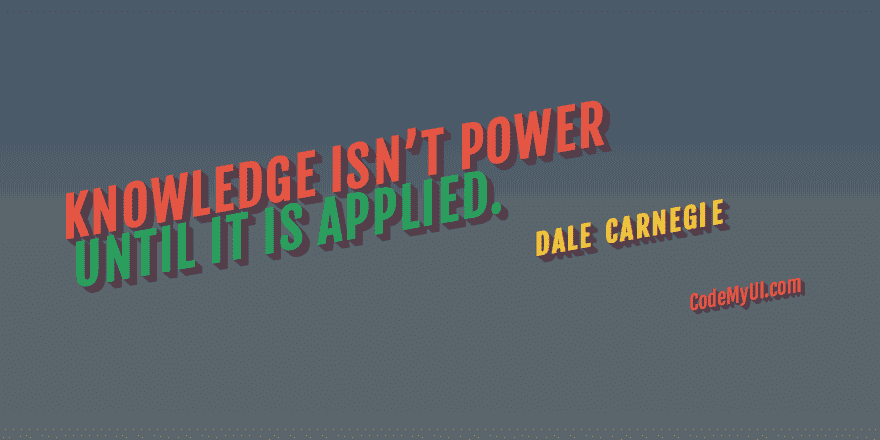*****

*****GSAP Animation — [CodeMyUI](https://codemyui.com/tag/gsap/)*****

*   *****[**text tilate . js**](http://textillate.js.org/)—一个简单的 CSS3 文本动画插件。你可以将 CSS 动画应用于任何文本(试试他们网站上的演示)。*****
*   *****[**pop motion . io**](https://popmotion.io/)—一系列简单的动画库，提供令人愉悦的界面。可以使用 Vue、React、React Native 或任何 JavaScript 环境。*****
*   *****[**react 揭示文本**](https://github.com/adrianmcli/react-reveal-text)**——**一个小 React 库，用于在 React 中制作文本揭示的动画。*****
*   *****[**React Spring**](https://github.com/drcmda/react-spring)——React app 中构建动画的行业标准之一。非常容易集成，如果使用得当，通常是轻量级的。*****

*****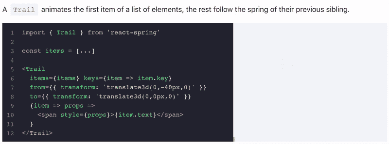*****

*****React Spring*****

*   *****[**Airbnb 洛蒂**](https://airbnb.design/introducing-lottie/) — Airbnb 面向 iOS、Android 和 React Native 的开源动画库，可实时渲染 After Effects 动画，并允许原生应用程序像使用静态资产一样轻松地使用动画。*****

*****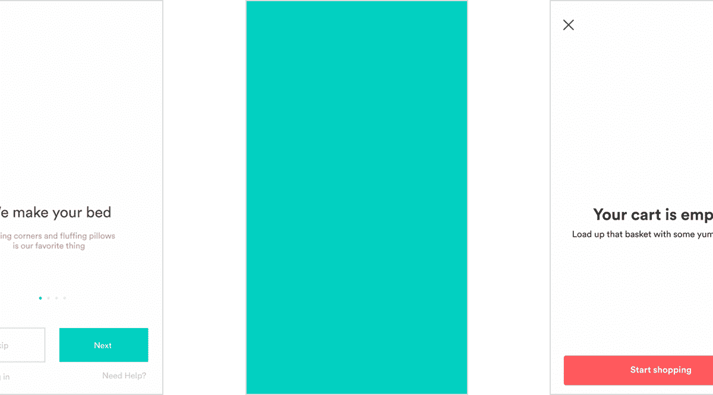*****

*****Airbnb Lottie — [The Verge](https://www.theverge.com/2017/2/1/14478220/airbnb-lottie-animation-app-library-open-source)*****

*   *****[**Velocity . js**](http://velocityjs.org/)—Velocity 是一个动画引擎，API 与 jQuery 的 *$相同。animate()* 。不管有没有 jQuery，它都可以工作。它非常快，并且具有彩色动画、变换、循环、easings、SVG 支持和滚动功能。它是 jQuery 和 CSS 转换的最佳组合。*****

*****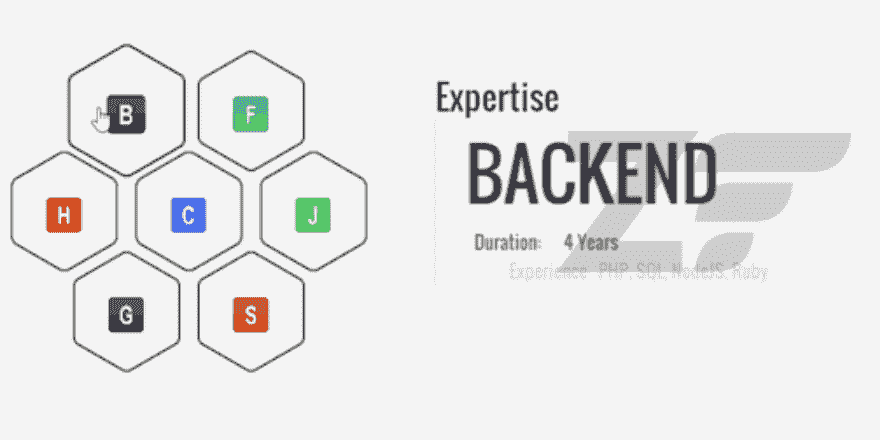*****

*****Velocity.js — [CodeMyUi](https://codemyui.com/tag/velocity-js/)*****

> *******非常感谢您花时间阅读本文:)。我经常写各种各样的设计和技术主题，所以欢迎继续关注。*******
> 
> *******快乐设计！*******
> 
> *******-贾斯汀*******