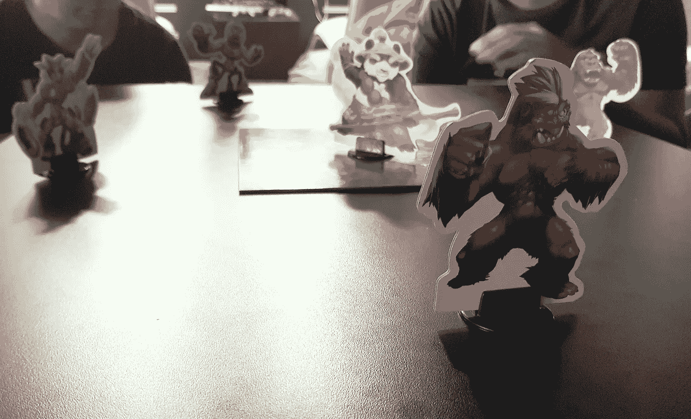

# 一场精彩的回顾展！

> 原文：<https://medium.com/hackernoon/king-of-tokyo-retro-1df39c4d9068>

这种形式是一种实验，来自我喜欢的两件事，玩棋盘游戏和与团队合作。一个受欢迎的棋盘游戏是东京之王，它的游戏机制可以作为一种互相反馈的方式被重用。这是一个有趣而愚蠢的想法，可能在现实世界中行得通。所以我做了任何敏捷者都会做的事情，我尝试了一下，并写下了我所学到的。

以下是我们的做法和您需要开始做的事情。首先，你需要一本《东京之王》。启动电源！资料片不是必须的，但是很好，因为它给了人们更多的[怪物](https://hackernoon.com/tagged/monsters)可以选择。接下来你需要的是团队可以坐在一起的空间，并且在他们之间有一块板子。最后一件事就是回顾会上你的团队或球员。

接下来的部分将描述活动的不同部分以及我们是如何完成的。

# 选择你的怪物！

plenty of monsters to choose from

活动的第一部分是签到活动。我们首先让团队的每个成员选择一个怪物作为他们游戏的角色。指导的一部分是选择一个你觉得代表你或者代表你对上一次迭代的感觉的怪物。有很多角度可以说明团队成员与怪物的关系。对于那些熟悉游戏的人来说，他们知道怪物的某些特征，对于一些人来说，这只是怪物的整体外观，而一些人则基于卡片中显示的背景或场景。

在每个人都选择了他们的怪物后，他们向小组展示他们选择的怪物，然后解释为什么选择那个怪物。这有两个目的:首先是让成员分享他们自己的一些事情，其次是让他们为下一部分做好准备。

# 该玩了！

Actual photo from one restrospective

解释游戏规则是下一步，在每个人都完成选择你的怪物活动后马上就要做。我们使用的规则如下

1.  每个玩家每轮有一次机会，游戏将持续至少 3 轮。第三轮过后，队伍将决定是继续比赛还是停止比赛。
2.  在一个玩家的回合开始时，他或她将掷一次骰子。掷骰子的结果将决定玩家将采取的行动。不同的动作是玩家必须给出的不同类型的问题或反馈。这些操作描述如下。
3.  第一个掷爪的玩家会自动进入东京。在另一个玩家掷出一个爪子后，东京内的玩家可以选择离开，掷出爪子的玩家将在东京内代替他。
4.  所有不在东京的玩家将会给出反馈或者回答一个与在东京的玩家相关的问题。而在东京的人将提供反馈或回答关于整个团队的问题。
5.  当游戏正在进行时，团队中的某个人或负责回顾的人应该记下团队给出的反馈。这些将在活动的后半部分使用。

# 不同的行动

骰子有六个面，但只用了三个动作。骰子上的 1、2、3 数字将与心、爪或能量符号配对。以下是我们根据骰子进行的操作:

## 红心还是 1 号

游戏中的心代表恢复健康。在我们的版本中,“心”是你想给这个人或团队的积极反馈。一些心灵反馈的例子可以是:“嘿，约翰，我真的很感谢你昨天帮我找出那个 bug”或者“我真的很喜欢作为一个团队，我们在桌子上演奏音乐，我们可以通过我们喜欢的歌曲来建立联系”。

## 爪或#2

爪在游戏中是扣杀！行动。在我们的版本中，爪是我们指出我们应该打破的习惯的方式！或者我们做过或说过的让我们想砸东西的事情。简而言之，滚动爪子意味着玩家必须给出建设性的反馈或可以改进的东西。例如:“Donald，你真的需要在提交代码之前运行那些单元测试。你上周打破了三次构建”或“作为一个团队，我们都需要在写东西上有所改进。我们总是忘记我们说好的！”

## 能源或#3

原始游戏中的能量将被用来收集能量砖，这将允许你购买给你特殊技能的卡片。因为我们的回溯能量意味着玩家必须提出一个实验来激励团队。这方面的一些例子是:“我认为我们应该制作一个仪表板，在那里我们可以检查我们所有的测试环境”或者“我真的希望我们可以尝试在下午而不是早上站起来”。

# 行动项目时间！

三轮过后或者当队伍决定不再多打一轮时，就该开始活动的最后一部分了。最后一部分是团队检查他们的爪和能量反馈，并决定他们感受最强烈的是什么，并讨论他们希望采取的行动来解决这些问题。

# 格式的一些变化

## 在制作行动项目之前打开空间时间

在团队决定不再进行下一轮比赛后，我们通常会在空地上进行活动。我们花了很少的时间让团队成员自由交流反馈。这是为了让每个人都有机会分享一些他们可能因为掷骰子而没有得到的东西。

## 每轮比赛后换座位

这是让更多人相互提供反馈的一种方式。例如，如果在 Gina 之后轮到 Tom，那么 Tom 不太可能有机会对 Gina 采取行动。一轮后洗牌或换座位有助于缓解这种情况。

## 装载骰子

由于数字 1、2、3 与心、爪或能量相关，因此我们可以轻松地掷骰子以获得更有针对性的反馈。例如，一个正在经历困难时期的团队可能会同意 1 和 2 是心，而 3 是爪。这增加了他们互相给予积极反馈和提升士气的机会。另一方面，一个做得非常好的团队可能会希望增加精力，这样他们就可以获得更多关于如何推动自己前进的想法。

## 不能待太久！

在一个小团体中，我们这样做了，我们已经同意，如果一个玩家完成一个回合而没有被踢出东京，那么这个玩家就会被踢出。这是为了避免一个人在回顾中得到所有的注意力，也是为了平衡游戏中一轮没有人掷出爪子的机会。

## 重掷骰子

我们已经尝试允许每个玩家在整个游戏中有一次重投机会。这为一些人增加了一层策略，他们会重新滚动以避免给出他们不舒服的反馈。对其他人来说，当有人重新掷骰子并得到同样的结果时，这增加了一些喜剧价值。当他们不知道我们最后会有一些开放空间的时间时，这是最有效的。

# 我们学到的一些关键知识

1.  骰子的不确定性在游戏中给人一种兴奋感。这让人们对下一次掷骰子的结果感兴趣。这也延伸到人们对轮到自己感到兴奋。所以记录下离轮到他们还有多长时间是很重要的。
2.  让骰子告诉我们应该给出什么样的反馈会让我们走出舒适区，给出我们通常不会给出的反馈。一个例子是，如果你的团队中有一些成员不经常说话，他们也不太可能互相提供反馈。这给了他们/使他们做那件事。
3.  能量/实验反馈总是人们遇到最多问题的一个。
4.  东京内部的游戏机制允许人们对反馈更加个性化。这是在促进回顾时需要注意的事情，因为有些人可能不擅长向其他人提供反馈。谢天谢地，我从来没有遇到过这个问题。

# 最后的想法

在与几个团队合作后，我倾向于在未来再次使用它。我发现仅仅是某人拿着东京之王盒子走进回顾展的画面就足以让大多数人感兴趣，所以这在做回顾展时总是一个优势。和所有的格式一样，我不会每次都使用这种格式，因为新鲜感会逐渐消失，但我觉得这种格式会激发团队的活力，或者至少会激起他们的兴趣。

如果你也尝试过，请联系我，让我知道你的经历，我会很高兴听到它是如何为你的团队工作的！