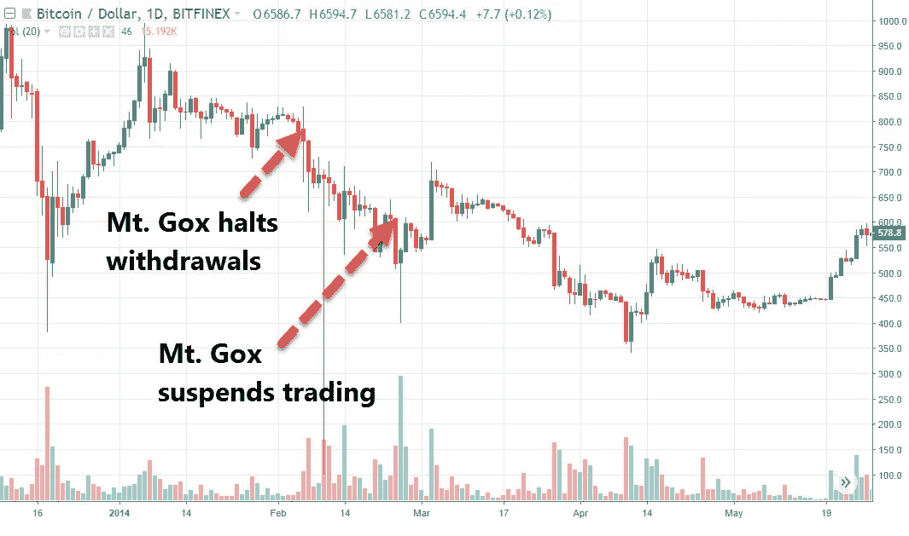

# 国王系绳和稳定的硬币战争

> 原文：<https://medium.com/hackernoon/king-tether-dethroned-36c37e3ed5bb>

# 摘要

> 由于套利交易者的工作，泰瑟(USDT)维持其盯住美元的汇率制度。如果流动性风险和/或信贷风险增加，USDT 可能会失去联系汇率制。2018 年 9 月，新稳定币入市。不久之后，关于系留银行问题的谣言开始传播。由于市场参与者撤出 USDT，USDT 开始下跌，而套利交易者由于更高的感知风险要求更高的回报。然后，在 10 月 14 日，大型市场参与者引发了 15%的 USDT 闪电崩盘。自那以后，随着大量资金流出 USDT，泰瑟公司赎回了 6.8 亿美元。Tether 没有从这些赎回中获利。9 月 29 日至 10 月 21 日期间，Bitfinex 所有货币对的日交易量下降了 83%。除非 Tether 能满足市场需求(更高的透明度和定期审计)，否则 Tether 将继续流失。

系绳是密码学中最不为人知却又最重要的课题之一。在这篇文章中，我将介绍系绳套利是如何运作的，并分析系绳最近的崩盘。

# 目录

*   什么是系绳
*   Tether 如何工作:Tether & Bitfinex
*   系绳套利&盯住美元
*   Tether's & Bitfinex 的偿付能力
*   系绳的流动性危机:让稳定的硬币战争开始
*   余波
*   Bitfinex 内部工作
*   结论

# 什么是系绳

[Tether](https://tether.to/wp-content/uploads/2016/06/TetherWhitePaper.pdf) 是通过 Omni Layer 协议在比特币区块链上发行的加密货币。这是一枚**稳定硬币**，流通中的每一枚*都由两家在香港注册的私人公司 Tether Limited 或 Tether International Limited 持有的法定货币一一支持。大部分是 USDT 的形式，由美元支持。从现在开始，我将交替使用 USDT 和系绳这两个词。*

*系绳允许用户使用与美元挂钩的加密货币，这在很大程度上消除了加密货币的波动性。与美元相比，USDT 有一个明显的优势:能够通过比特币区块链转移资金，而不是通过银行系统。通过区块链转移美元资金通常比通过银行系统转移资金更快(通常也更便宜)。*

*更重要的是，**避开银行系统**对加密交易本身非常有价值，因为银行通常对满足交易需求不感兴趣。使用系绳允许交易所将法定托管外包给系绳。避开美元还有助于交易所远离美国监管机构**的漫长触角**，让交易所在合规和人员方面节省大量资金。因此，所谓的系绳交易所(Tether exchanges，即没有法定货币的加密交易所)激增，这些交易所使用 USDT 而不是美元进行交易。*

*USDT 被广泛用于跨加密交易所套利。*

*需要注意的是，根据系绳，“ [*系绳代币以货币为后盾，但本身并不是货币*](https://tether.to/legal/) ”。但是，俗话说，如果它看起来像鸭子，游泳像鸭子，叫声像鸭子，那么它很可能就是一只鸭子。*

# *Tether 如何工作:Tether & Bitfinex*

*Bitfinex 和 Tether 是姐妹公司，拥有共同的董事、股东和管理层。Jan van der Velde 是两家公司的首席执行官。所有系绳发行在分发到其他交易所之前都要经过 Bitfinex。因此，在研究系绳时，我们也必须研究 Bitfinex。*

*为了介绍 Tether 如何工作以及它与 Bitfinex 的关系，我将大量借用 Robert-Jan den Haan 的这篇优秀的文章。其要点是:*

*   *根据 Bitfinex， **Bitfinex 是进出 Tether 的唯一网关，**即 Bitfinex 实际上是 Tether 的唯一直接客户。 *Bitfinex 和 Tether 在 2017 年末决定做出这一改变，以减轻银行处理 Tether 购买的压力*。*
*   *Bitfinex 通过将相应的法定货币存入 Tether 的银行账户，从 Tether 购买 USDT。发行时，系绳以整数形式从系绳钱包发送到 Bitfinex 钱包。*
*   *Bitfinex 是一个仅使用美元的交易所；tethers 不能用于 Bitfinex 交易。*
*   *Bitfinex 的用户可以提取 USDT 格式的美元。USDT 格式的提款实际上是 USDT 购买。客户只能在提款时从 Bitfinex 购买 USDT，而不能直接从 Tether 购买。*
*   *Bitfinex 必须维持一个 USDT 库存，以满足其用户的需求。每当 Bitfinex 的管理层做出决定时，Bitfinex 就会购买新的系绳，也就是每当 Bitfinex 的 USDT 库存不足时。*

*读者可以在 2017 年 12 月的股东 Bitfinex [季度更新](http://archive.is/T4wGA#selection-847.206-847.366)中找到更多细节。*

# *系绳套利&盯住美元*

*USDT 维持与美元的联系汇率有两个原因:*

1.  *在存款时，Bitfinex 会为用户的账户存入 1 美元的 USDT。*
2.  *当 USDT 兑美元的价格大幅偏离 1 美元时，套利者会让它回到同步状态。*

> ***套利例子**:北海巨妖 USDT 兑美元跌至 97。交易者在北海巨妖买入 USDT(使用美元)，将 USDT 转移到 Bitfinex，以 1.0 美元兑换成美元，取出美元，将美元转移回北海巨妖，产生 3%的总收入。只要价差证明运营成本和预期风险是合理的，套利者就会进行套利交易，这样做将对 USDT 兑美元产生上行压力，推动其接近 1 美元。— *更多 BTC 对美元套利的例子& BTC 对 USDT 可用* [*此处*](/@alexkruger/tether-arbitrage-the-dollar-peg-7da405f13ffc) *。**

*正是交易员执行套利的工作，使得交易资产的价值接近其基础价值。套利由不同的分支组成(至少两个分支)。为了进行套利，交易者需要一个网关来关闭套利的最后一段——在这种情况下，是一个具有工作银行关系的 Bitfinex，允许法定提款。*

***套利交易者赚的不是免费的钱，他们通过承担四种风险来获利**:*

*   *市场风险——在第一个例子中，当交易者将 BTC 转移到币安时，BTC 的价格可能下跌。通过对冲在 Bitmex 或 CME 等衍生品市场的 BTC 多头敞口，几乎可以完全消除市场风险，例如暂时做空 XBT。*
*   *执行风险—与买卖差价相关，低于运营成本，但不可预测。*
*   *流动性风险——与交易最后阶段的延迟结束相关，考虑到机会成本和资金的时间价值，这会影响盈利能力。*
*   *信用风险 Bitfinex 和/或 Tether 在 USDT 的情况。如果任何一方在交易者处理法定提款之前破产，交易者就不能用美元赎回 USDT。*

*如果可察觉的流动性风险和/或信用风险增加，则系留可能失去挂钩，并大大偏离 1 美元。换句话说，**如果对 Bitfinex 或 Tether 的信任减少，或者 Bitfinex 遭遇银行业问题，USDT 将走低**。*

*在一个完全有效的市场中，只要 USDT 完全由美元支持，这是众所周知的，并且 Bitfinex 提款过程是完全有效的，由于套利交易者的工作，USDT 的市场价格将保持接近 1 r *美元，不考虑任何买卖*。当然，这不是一个完全有效的市场，尤其是因为在固定存款/取款方面存在瓶颈(后面会详细介绍)。*

# *Tether's & Bitfinex 的偿付能力*

## *系绳的偿付能力*

*如果泰斯没有用美元全额担保 USDT，那么在[银行挤兑](https://en.wikipedia.org/wiki/Bank_run)的情况下，泰斯将会破产。对市场的感知至关重要。Tether 不想通过银行挤兑迫使他们回购所有 USDT 来证明 USDT 完全由美元担保。这对泰瑟的业务和生存非常不利。*

*因此，对余额进行审计非常重要。Tether 确实分享了由一家律师事务所进行的[第三方检查](https://tether.to/wp-content/uploads/2018/06/FSS1JUN18-Account-Snapshot-Statement-final-15JUN18.pdf)，该律师事务所声称“ ***确信 Tether 的无抵押资产超过了截至 2018 年 6 月 1 日*流通中的全额担保美元 Tether 的余额** *”。这项检查受到了许多人的严厉批评，因为它不是审计。然而，正如卡梅隆·文克莱沃斯所说:**

*简而言之，批评似乎言过其实。详见[本线程](https://twitter.com/Crypto_Macro/status/1055487804669616128)。我没有理由相信律师事务所的证明是不准确的，系绳没有完全抵押。就连加密货币投资公司 Galaxy Investment Partners 的首席执行官迈克尔·诺沃格拉茨也认为，每一条系绳对应一美元。来自“t *醚没有得到美元*的完全支持”一方的论点是站不住脚的(后面会有更多)，市场的表现就好像这些醚是完全抵押的(后面也会有更多)。*

*然而， **Tether 的管理层没有通过定期审计来解决这个问题，从而允许谣言传播，Tether 本身在其白皮书中承诺进行审计(*专业审计员将定期核实、签署和公布我们的基本银行余额和财务转账报表*)。***

*只要 Tether 不为资产和负债提供审计或证明，而不是为单个资产负债表行项目提供审计或证明，没有全额美元支持的可能性，即使非常低，也仍然存在。*

## *Bitfinex 的偿付能力*

*Bitfinex 是区块链地区的一家小型私人公司。与所有私营公司一样，它的财务状况自然属于私人信息。所有的密码交易所都是私人公司。要想了解上市公司的可比情况，我们必须了解传统市场的交易所。鉴于加密和传统市场的差异，这种比较是有缺陷的，但在加密交易所上市之前，这将是我们的全部。*

*因此，我选择了泛欧交易所来做一个基本的比较分析。泛欧交易所有 55%的营业利润率(不包括折旧和摊销)，而 20%的收入来自工资和员工福利。*

*另一方面，截至 9 月 29 日(危机开始前，交易活动仍处于低迷状态)，Bitfinex 的交易收入约为每天 77 万美元(5.48 亿美元乘以 0.28%的 T2 除以 2 T3)，一年将达到 2.8 亿美元(忽略保证金融资收入)。Bitfinex 大概有 100 多名员工，所以为了简化起见，假设有 100 名员工，并假设平均年薪为 12 万美元。这给员工带来了每年 1200 万美元的收入，约占总收入的 4%。**假设其他比率不变，Bitfinex 将有 71%的营业利润率**(不包括折旧&摊销)，每年约 2 亿美元的 EBITDA。*

*所以 Bitfinex 资不抵债的**概率很低**。除非 Bitfinex 的金库被黑了，这是有可能的。2016 年黑客攻击的细节仍然模糊不清。*

## ***偿付能力危机与流动性危机***

*按照经济学的说法，当一家公司无法通过其资产偿还债务时，就会发生偿付能力危机，而当一家公司出现暂时的现金流问题时，就会发生流动性危机。*

> *在流动性危机中，USDT 是安全的，任何崩溃无论有多严重都是暂时的。*

*假设 tethers 完全由美元支持，Bitfinex 是一家盈利的公司，两者都不会破产，因此不会出现偿付能力危机。这让市场面临潜在的流动性危机。在流动性危机中，USDT 是安全的，任何崩溃，无论有多深，都是暂时的。*

# *流动性危机:让稳定的硬币战争开始吧*

## ***泰瑟的流动性危机***

*常规的银行问题和处理法定存款和提款的低效率使得 Bitfinex 离流动性危机只有一步之遥。例如，参见 Bitfinex 的新“[改进的法定存款系统](http://blog.bitfinex.com/announcements/improved-fiat-deposit-system/)”，该系统非常慢，用户可能需要 12 个工作日才能处理完一笔法定存款。在取款方面，[这个由](https://twitter.com/IamNomad/status/1050201249319145472) [IamNomad](https://twitter.com/IamNomad) 撰写的帖子包含了多个说明最近问题的链接。简而言之，Bitfinex 是一个总是容易受到银行挤兑影响的交易所。就在那时，完美风暴来袭。*

## *新的稳定硬币*

*首先，tethers 的竞争对手,**大量新的、似乎更值得信赖的稳定硬币**涌入市场。Gemini 于 9 月 10 日推出了 [Gemini dollar](/gemini/gemini-launches-the-gemini-dollar-62787f963fb4) (GUSD)，Paxos Global 于 9 月 10 日推出了 [Paxos Standard](https://www.paxos.com/standard/) (PAX)，Circle 于 9 月 26 日推出了 [USDC](https://support.usdc.circle.com/hc/en-us/categories/360000088383-About-Circle-USDC) 。最后，我们有信任令牌项目的 [TrueUSD](https://blog.trusttoken.com/trueusd-faq-18dbc563fb67) (TUSD)。所有四个国家(GUSD、派克斯、USDC、TUSD)都执行证明储备而不是审计，就像系绳*所做的*。然而，与泰瑟不同的是，他们的总部设在美国，他们雇佣真正的审计公司，并承诺每月或每两周认证一次。与 Tether 一样，这四家公司都在 FinCEN 注册，其中两家也受纽约州金融服务局的监管[。有趣的是，Tether 在 2018 年 9 月才在 FinCEN 注册。Tether 确实有一个主要优势:它没有后门，不像 USDC 有后门。](https://www.reuters.com/article/us-cryptocurrency-dollar-paxos-winklevos/new-york-regulator-approves-winklevoss-paxos-dollar-linked-tokens-idUSKCN1LQ1O5)*

**

*FinCEN registrations*

## *银行业问题*

*其次是**银行问题传言**，始于[泰瑟银行(Noble Bank)出现财务问题](https://modernconsensus.com/noble-funding-cash-tether/)(9 月 30 日)。那是系绳失去挂钩的一天。一天后，市场获得了这一消息，Tether 遭遇了自二月份 [CFTC 相关恐慌](https://www.bloomberg.com/news/articles/2018-01-30/crypto-exchange-bitfinex-tether-said-to-get-subpoenaed-by-cftc)以来的首次暴跌(盘中下跌 5%)。*

*这些谣言很快就变成了 Tether [离开诺布尔银行](https://blog.bitmex.com/tether-q2-puerto-rico-data-noble-bank-looking-for-a-buyer/)(10 月 2 日)，Tether [不再在诺布尔银行存款](https://news.bitcoin.com/exchanges-roundup-tether-bitfinex-drop-noble-bank-bitmex-hires-coo/)(10 月 3 日)，Bitfinex 现在[在汇丰银行存款](https://twitter.com/lawmaster/status/1048515520482484224)(10 月 6 日)，Bitfinex [在汇丰银行存款是假新闻](https://news.8btc.com/zhao-dong-bitfinexs-usd-assets-have-been-moved-to-another-safer-bank)(10 月 10 日)，Bitfinex [不再在汇丰银行存款](https://theblockcrypto.com/tiny/bitfinex-suspends-all-fiat-deposits/)(10 月 11 日)，最后 Bitfinex 现在[在 Deltec 银行存款除了传言，似乎只有 Bitfinex 的存款被停止，而不是取款被停止，而且 Bitfinex 从来没有“不开户”。然而，即使撤资仍在进行，撤资过程比平时慢一点也是有道理的。](https://theblockcrypto.com/2018/10/16/tether-has-found-a-new-bank-in-the-caribbean/)*

*正如 Travis Kling 所说([来源](https://www.youtube.com/watch?v=BnKExFlVT0c)):*你有潜力让基金开始利用这种高尚的银行叙事作为武器，让市值脱离束缚，进入它们支持的稳定的硬币*。*

## *阴谋论*

*对于阴谋论爱好者来说，人们必须承认，Bitfinex 银行业的故事与新稳定硬币的到来巧合的时间是不同寻常的。同样值得注意的是，在 9 月 21 日 PAX 上市后，币安的首席执行官如何在 9 月 27 日开始公开推介系绳替代品(见[这里](https://twitter.com/cz_binance/status/1048848581950492672)、[这里](https://twitter.com/cz_binance/status/1050025449336725504)、这里[这里](https://twitter.com/cz_binance/status/1050318897612648448)和[这里](https://twitter.com/cz_binance/status/1051802880229789698))。*

## *完美风暴*

*两个星期以来，系绳谣言像野火一样蔓延，USDT 继续下跌，10 月 14 日达到 0.975 美元。随着 USDT 的下跌，比特币基地、Bitfinex 等加密法定交易所与币安等加密系绳交易所之间的价差直线上升。恐慌开始蔓延。*

***USDT 下跌是因为市场参与者离开 USDT** ，进入其他稳定的硬币和其他加密货币**，而套利交易者要求更高的回报**来执行 USDT 套利，这是由于更高的感知风险，源于真实或感知的提款问题，或者由于 [FUD 驱动的](https://twitter.com/proofofresearch/status/1048526011535708160)偿付能力担忧。*

> *交易员不太愿意套利 USDT 利差，要求更高的回报来承担套利风险。*

*与此同时，Bitfinex 的 BTC 兑美元保证金空头接近历史高点。现在要考虑的是，更少的系绳套利交易意味着 Bitfinex 上 BTC 兑美元的抛售减少，从而使账面上的报价更薄。*

*然后在 10 月 14 日，一些大型市场参与者或一组**市场参与者在两小时内引发了 USDT 闪电暴跌**从 0.975 美元到 0.85 美元，这似乎是一种寻找止损点的 [Bitmex 维护泵](https://twitter.com/Crypto_Macro/status/1032271503784660992)风格。市场参与者卖出 USDT 兑美元、其他稳定的硬币和其他加密货币。北海巨妖的 USDT 兑美元汇率达到 0.85 美元，币安的 TUSD-USDT 汇率为 1.24 美元， **BTC 的 Bitfinex 和 tether 交易所的汇率上涨了 19%-21%。比特币的泵如此之大，甚至暂时闯入了看涨的市场领域。系绳驱动的视错觉。所有的停止都随之而来。止损也蔓延到了秘密的菲亚特交易所(即非 USDT 市场):比特币基地和 Bitmex 的 BTC 价格飙升了 10%。***

*随后，Bitfinex 在次日将存款正常化的传言开始流传，而**加密价格回撤 75%** ，USDT 价格稳定在 0.94 美元到 0.95 美元的区间。崩溃开始三个小时后，价格已经稳定下来，Bitfinex 正式宣布恢复所有客户的存款(Bitfinex 从未证实存款已被停止)。这标志着完美风暴的结束。*

**

*Bitcoin prices at Bitfinex vs. Bitmex*

**

*USDT-USD at Kraken vs. TUSD-USDT at Binance*

*应注意，触发止损代表一种有效的交易策略，适用于所有市场，其本身并不意味着 [**市场操纵**](http://people.duke.edu/~viswanat/pp-article-kyle_vish_manipulation_20080100_f.pdf) (即市场操纵可能发生，也可能没有发生)。观察家经常混淆投机和操纵。*

## *价格分析*

*在完美风暴期间，菲亚特交易所的密码价格不降反升，此后一直保持在高位。由于市场是贴现机制，价格行为表明市场的 ***大多数*都默认 Bitfinex 曾经/现在没有面临偿付能力危机**。*

*当然，这是一种叙述，试图解释过去。然而，人们不应忘记，一旦出现偿付危机，Bitfinex 将下跌，导致投资者遭受重大损失，并可能引发大范围的避险行动，许多市场参与者将在菲亚特交易所兑现他们的加密。或者，我们现在是不是突然期待一个主要的加密交易所对 BTC 兑美元的行情看涨？答案是“没有”。让我们回忆一下 [Mt. Gox](https://en.wikipedia.org/wiki/Mt._Gox) 如何在 2014 年 2 月至 2014 年 4 月的两个月内将比特币价格拉低 55%(从 2014 年 2 月 6 日的 780 美元降至 2015 年 4 月 11 日的 350 美元)。*

**

*事后看来，许多人表示，随着资金从 USDT 流向比特币和 alt，系绳崩溃显然会使加密价格飙升。这是事后诸葛亮。在此之前，许多专业交易者认为 USDT 崩盘将导致加密价格暴跌。此外，**回忆一下，在之前的三次系绳恐慌中(我在本文******中详细介绍过)，其中两次比特币价格暴跌**。最后，有人可能会说，在一个完全有效的市场中，交易员离开 USDT 进入 BTC，不会对菲亚特交易所的 BTC 兑美元价格产生任何影响。***

******

***Tether saga, 2017–2018***

# ***余波***

## ***bitfinex/Tether 的反应***

***在为期两周的考验中(9 月 30 日至 10 月 14 日)，Bitfinex 继续其令人沮丧的公关做法，没有完全解决问题或指控，或者没有及时这样做。想想看，除了 10 月 15 日宣布第二天将全面恢复存款外，他们唯一的其他官方公报是 10 月 7 日的这份“对最近网上谣言的回应”。***

***此外，一旦存款恢复，Bitfinex 开始在存款页面上显示此通知，声明“*泄露此信息不仅会损害您和 Bitfinex，还会损害整个数字令牌生态系统……您被警告，此信息公开可能会产生严重的负面影响*。”***

******

## ***USDT 赎回***

***Bitfinex 有没有自己买系绳套现差价？Bitfinex 一直在套现差价吗？鉴于 Bitfinex 对自身流动性和偿付能力的了解，有人会说，如果 Bitfinex 确实有偿付能力，Bitfinex 将是套利 USDT 和美元利差的理想对象。Bitfinex 将是理想的[暴跌保护团队](https://www.investopedia.com/terms/p/plunge-protection-team.asp)。正如[哈苏](/@hasufly)所说:***

> ***“这很好，没有什么可疑的。这与上市公司在认为市场相对于其公允价格低估了它们的价值时回购股票没有什么不同。”***

***正如这篇[文章](/@hasufly/tether-is-exiting-and-nobody-noticed-a7ce6dc30c56)所指出的，自 9 月 30 日危机开始以来(直到 10 月 23 日)，Tether 一直在加速赎回 USDT， [**从 Bitfinex 钱包中取出 7.9 亿美元**](https://www.omniexplorer.info/address/1NTMakcgVwQpMdGxRQnFKyb3G1FAJysSfz) **到 Tether 钱包**，其中 6.8 亿美元是在 10 月 14 日崩盘到 10 月 19 日之间取出的。***

***然而，这些赎回并不意味着从 Bitfinex 套利，因为在 Bitfinex 存款时，美元与 USDT 以 1:1 的比例兑换，即 Bitfinex 国库钱包中所有 USDT 的 Bitfinex 成本为 1 美元。**USDT 套利由在 Bitfinex 存放 USDT 的一方完成**。因此，要让 Bitfinex 利用 USDT 进行套利，Bitfinex 需要在另一家交易所购买 USDT，并将其转移到 Bitfinex。总之，**赎回是对存放在 Bitfinex 的大量 USDT 的反应，并不代表套利。*****

***这并不意味着 Bitfinex 通过在其他交易所购买 USDT 进行套利。Bitfinex 可能是 USDT 套利交易的积极市场参与者，因为如前所述，Bitfinex 是唯一拥有完整信息的市场参与者，价差变得太大，不容忽视。那就代表没有退出骗局。此外，谁对 USDT 进行了套利交易对于市场来说并不重要，如果 Bitfinex 没有参与，其他人就会取代它的位置。***

***人们可能会认为，泰瑟公司不想赎回 USDT 来维持市场份额，然而**泰瑟公司并不决定其市场份额，而是市场需求决定的**。***

## ***稳定的硬币再平衡***

***根据 Coinmarketcap 的数据，从危机爆发前的 9 月 29 日到 10 月 21 日，USDT 的市值减少了 7.37 亿美元，降幅达 26%。与此同时， [TUSD](https://coinmarketcap.com/currencies/trueusd/) 的市值从 1.04 亿美元增加到 1.67 亿美元(+60%)，而[派克斯](https://coinmarketcap.com/currencies/paxos-standard-token/)的市值从 1200 万美元增加到 4200 万美元(+246%)。虽然 GUSD 是四个国家中最小的，但是 GUSD 的数据还不清楚。这意味着从稳定币到比特币和替代币的净流出约为 6.4 亿美元。这种分裂是未知的。***

******

## ***Bitfinex 的后果***

***Bitfinex 所有货币对的日交易量从 9 月 29 日的 5.48 亿美元下降到 10 月 21 日的 9100 万美元，降幅高达 83%。与此同时，币安的销量下降了 53%。***

******

***与此同时， [Bitfinex 的比特币冷钱包](https://bitinfocharts.com/bitcoin/wallet/Bitfinex-coldwallet)中的余额在此期间从 BTC 的 16.8 万到 BTC 的 12.9 万，**下降了 23%**，而在[北海巨妖](https://bitinfocharts.com/bitcoin/wallet/Kraken.com)、 [Bittrex](https://bitinfocharts.com/bitcoin/wallet/Bittrex-coldwallet) 和 [Bitstamp](https://bitinfocharts.com/bitcoin/wallet/Bitstamp-coldwallet) 等交易所的余额保持不变，在[币安](https://bitinfocharts.com/bitcoin/wallet/Binance-wallet)的余额增加了 8%。请注意 Bitfinex 的下跌是如何在 9 月 30 日开始的。***

******

# ***Bitfinex 内部工作***

***一些人认为，USDT 的崩溃是 Tether 的内部工作，因为自危机开始以来，Tether 赎回了 7.9 亿美元，在这个过程中赚了大约 3000 万美元(例如，见[这条由](https://twitter.com/cryptomanran/status/1054080450916990976) [Ran NeuNer](https://twitter.com/cryptomanran) 发的推文)。这种说法毫无意义，原因如下:***

1.  ***正如前一节已经解释的，**USDT 套利是通过在 Bitfinex 存放 USDT 完成的，而不是通过在 Bitfinex 国库钱包中赎回 USDT，Bitfinex 已经为此支付了 1 美元。当对 USDT 的需求下降时，Bitfinex 必须赎回 USDT，并且在这个过程中不赚钱。*****
2.  ***任何人都可以进行套利，Bitfinex 只能获得一部分套利机会，而不是全部。***
3.  ***在危机之前，Bitfinex 仅交易费一项，每 40 天就有 3000 万美元的收入，这还不包括存取款收取的 0.1%的费用。***
4.  ***在危机之前，Tether 拥有 28 亿美元的基础基金。考虑到目前的短期利率(美联储在过去两年里一直在积极提高利率)，一家管理良好的公司的现金年收益率应该至少为 2%，甚至可能更高。因此，在 28 亿美元的基础上，Tether(如果管理得当)每年至少可以获得 5600 万美元的利息。***

***正如已经讨论过的，系绳崩溃导致 Bitfinex 的交易量下降了 83%。假设销量不变，其年收入将减少 2.33 亿美元。同时，考虑到赎回，Tether 的利息年收入现在将减少 1500 万美元。因此，**Bitfinex/Tether 的管理层不需要非常聪明，就可以为了一次性赚到 3000 万美元而放弃 2.48 亿美元的年收入**。试图通过套利 USDT 来减少损失是有道理的。放弃你的生意，你的摇钱树，去赚 3000 万美元不是。***

***如果 Tether 毕竟是一个骗局，为什么不干脆用剩下的 28 亿美元运行，或者为他们国库钱包中的所有比特币和 Tether 精心策划一次自我黑客攻击？3000 万美元对他们来说应该是小钱。***

# ***结论***

***系绳崩溃来了又去。套利交易者、跑止损的大交易者、竞品稳定币、点击诱饵记者获利，而 Bitfinex/Tether 和那些恐慌的人(小交易者和投资者)亏损。***

***鉴于存在看似更好的选择，脱离束缚的趋势应该会继续。希望这种外流将是有序的。可能不是这样。我们可能会看到更多的恐慌挤兑。***

***为了止血，Tether 可以提供**市场需要的东西:更高的透明度、定期审计(即由值得信赖的审计公司进行的第三方证明)，以及更好、更及时的沟通**。正如 [CarpeNoctom](/@CarpeNoctom) [指出的](https://twitter.com/CarpeNoctom/status/1052674739968364550)、 ***Bitfinex 需要透明得多的&进攻型 PR*** 。***

# ***在你走之前…***

***如果你喜欢读这篇文章，请考虑通过点击拍手按钮来表达你的支持——越多越好，这增加了可见度。可以通过以下链接分享文章:[脸书](https://www.facebook.com/sharer.php?u=https://medium.com/@alexkruger/king-tether-dethroned-36c37e3ed5bb) | [推特](https://twitter.com/home?status=%22King%20Tether%20dethroned%22%0A%0AThis%20article%20covers%20how%20the%20Tether%20arbitrage%20works,%20explains%20Tether's%20latest%20crash,%20and%20addresses%20the%20various%20criticisms%20towards%20Tether.%0A%0Ahttps%3A//medium.com/%40alexkruger/king-tether-dethroned-36c37e3ed5bb%0A)|[Reddit](https://reddit.com/submit?url=https://medium.com/@alexkruger/king-tether-dethroned-36c37e3ed5bb&title=)|[LinkedIn](https://www.linkedin.com/shareArticle?mini=true&url=https%3A//medium.com/%40alexkruger/king-tether-dethroned-36c37e3ed5bb&title=King%20Tether%20dethroned&summary=This%20article%20covers%20how%20the%20Tether%20arbitrage%20works,%20explains%20Tether's%20latest%20crash,%20and%20addresses%20the%20various%20criticisms%20towards%20Tether.%0A&source=)|Whatsapp|[电报](https://telegram.me/share/url?url=https://medium.com/@alexkruger/king-tether-dethroned-36c37e3ed5bb&text=) | [微博](http://service.weibo.com/share/share.php?url=https://medium.com/@alexkruger/king-tether-dethroned-36c37e3ed5bb&title=%7Btext%7D) | [邮箱](mailto:?&subject=King Tether dethroned&body=https%3A//medium.com/%40alexkruger/king-tether-dethroned-36c37e3ed5bb)。你也可以在推特上关注我，保持联系。谢谢你。***