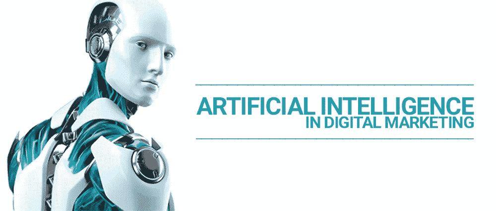
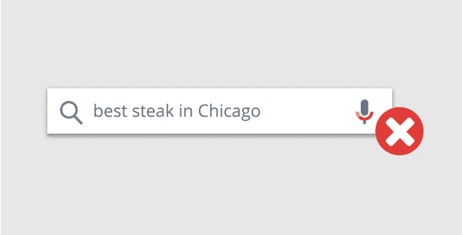
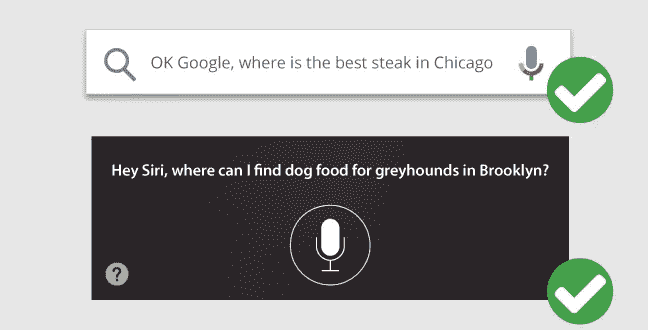
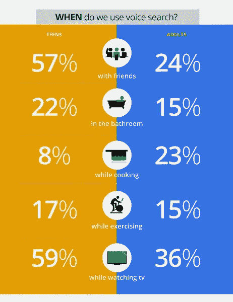

# 了解人工智能和机器学习如何塑造数字营销行业

> 原文：<https://medium.com/hackernoon/know-how-ai-and-machine-learning-are-shaping-the-digital-marketing-industry-e4ff08895825>

数字营销是一个总括术语，涵盖了在线营销的所有方面，包括内容营销、视频营销、电子邮件营销、搜索引擎营销(SEM)和其他数字形式。随着该行业在过去几年中的发展，它已经采用了人工智能(AI)、大数据和机器学习等新术语的用法。

Image Credit: Digitalready

你可能已经注意到，人工智能(AI)和机器学习已经进入几乎每个领域，以提高工作效率和减少错误，营销和广告界也不例外。虽然这项技术还没有充分发挥其潜力，但它已经大大改变了人们的生活，使之比以往任何时候都更容易。从虚拟助手到自动驾驶汽车，人工智能让人们更容易轻松地执行任务，而无需花费额外的时间。尽管有**无数的可能性有待探索** , **人工智能正在成为数字营销行业的一个强大工具**。让我们试着理解人工智能和机器学习是如何塑造数字营销行业的。

使用人工智能聊天机器人来提高 UX

世界各地的许多商业企业都熟悉实时聊天机器人，或负责与客户和客户互动的人工智能系统。甚至他们中的许多人已经在他们的网站上使用它。但你有没有想过用人工智能聊天机器人升级传统的实时聊天？如果是的话，现在正是时候。

人工智能聊天机器人可以让你的网站在互联网上脱颖而出。以下是人工智能聊天机器人相对于实时聊天的一些主要优势:

AI chatbot 会记住你的客户的访问，过去的聊天，并习惯他们的要求。换句话说，人工智能聊天机器人保留了你的客户数据，这样它们就不必在每次互动时重复自己。这将使客户体验无忧无虑

它可以全天候帮助客户，除了回答基本问题之外还能做其他事情

它可以同时处理多个客户请求

它也有助于创造个性化的广告，这些广告通常会转化为销售

它可以用来跟踪[客户的购买行为](https://www.computerworld.com/article/3053603/mobile/what-do-chatbots-mean-for-the-enterprise.html)。这将有助于商业企业改进其营销活动，促进销售

他们对顾客友好，在任何情况下都不会失去耐心。你的客户可能会生气，但你的人工智能聊天机器人会一直礼貌地对待你的客户

**#2 针对语音搜索查询优化您的网站**

随着语音搜索查询的增加，数字营销人员为自然语言长尾语音查询优化网站变得至关重要。谷歌在其博客中明确表示，几乎 [70%对谷歌助手](https://www.blog.google/products/assistant/your-assistant-getting-better-on-google-home-and-your-phone/)的请求是用自然对话语言表达的，而不是在网络搜索中文本搜索查询中使用的典型关键词。

用户不会用语音搜索

Image Credit: seopressor

相反，用户会这样说:

Image Credit: seopressor

将关键词塞进网页以提高在谷歌搜索结果页面中排名的日子已经一去不复返了，如今，识别搜索查询背后的意图变得至关重要。当优化您的网站进行语音搜索时，您可以创建页面，直接回答以“如何”、“什么”、“谁”、“为什么”和“何时”开头的问题。如果您的企业分布在多个地点，您还可以为您希望定位的每个地点创建本地登录页面。虽然所有年龄段的人都在使用语音搜索，但在探索语音搜索的各个角度方面，青少年领先于成年人。

Image Credit: [Google Blog](https://googleblog.blogspot.com/2014/10/omg-mobile-voice-survey-reveals-teens.html)

**#3 利用人工智能的力量生成个性化的营销内容**

为在线营销活动生成引人入胜的内容将是一项具有挑战性的任务，尤其是如果你想让活动个性化，并以用户为中心。通常，需要几个月的艰苦工作和战略规划才能完成一次成功的活动。然而，随着新的基于人工智能的工具的出现，在每个主题上开发自然和创造性的内容变得很容易。尽管这些工具还处于早期阶段，但它们会给数字营销人员带来市场竞争优势。想象一下，针对成千上万的客户，为他们中的每一个人使用个性化营销内容。目前，这似乎是一件不现实的事情，然而随着人工智能和机器学习的出现，不需要太多时间就可以发起如此大规模的运动，成功率很高。

**#4 更简单的预测营销**

早期的营销人员在发起任何活动之前都会做大量的市场调查。有了人工智能，营销人员不必担心艰难的营销决策，因为人工智能可以通过理解消费者的行为和活动来揭示最具影响力的洞察力。

例如，如果你运行一个 Adwords 活动，你可以使用谷歌的 [DoubleClick Bid Manager](https://www.doubleclickbygoogle.com/solutions/digital-marketing/bid-manager/) ，在其中你必须定义你的活动目标和你的目标受众，这个工具会自动推荐更好的转化策略。

**#5 个性化用户体验**

今天，许多营销工具使用复杂的算法来理解购买者的行为和决策。然而，在人工智能的帮助下，营销人员可以向用户提供个性化的体验。有了 AI，你可以根据每个客户过去的互动和购买行为，向他们显示个性化的内容。

**收尾**

人工智能和机器学习已经开始塑造数字营销行业。作为一名数字营销人员，你需要明白，无论是自动选择广告文案还是动态价格优化，人工智能都有能力做到这一切。确定你最迫切的需求，AI 可以为你完成剩下的工作。