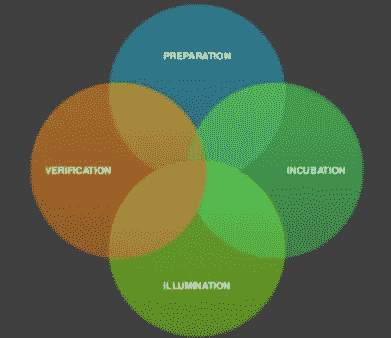
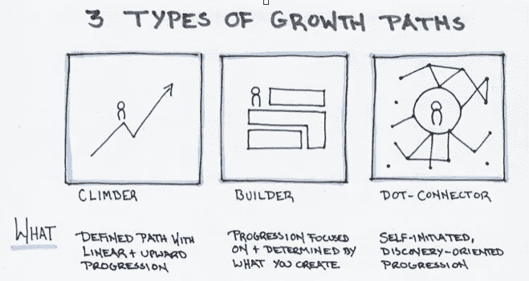
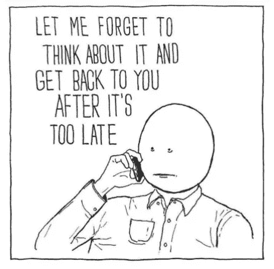
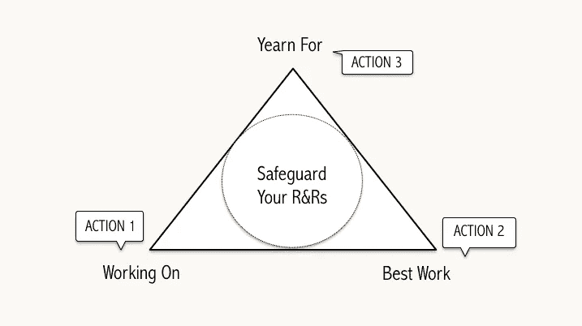

# 这就是如何优化创造力

> 原文：<https://medium.com/hackernoon/know-thy-selves-cff065e7eef4>

## 通过了解你自己来最大化你的创造力

就像一个孩子的发展阶段一样，我们在给生活带来新想法时会经历不同的阶段。

近 100 年前，社会心理学家 Graham Wallas 提出，[创造过程](https://www.inc.com/jonas-altman/what-really-drives-innovation-ideas-from-out-of-blue.html)遵循四阶段循环:*准备*(为新想法准备好你的认知肌肉)*孵化*(让你的思想放松)*(让你的想法结晶)*和*验证(*将你的想法释放到世界上)。

Graham Wallas, 1926

在一年、几周甚至几天中，我们在这些有意识和无意识的创造性工作的不同阶段之间漂浮。你一次又一次地循环往复。不久之后，你不仅会感觉到(并证实)你在做最好的工作，你还会从持续的洞察力中受益。

为了优化创造力，我们首先需要知道我们正处于创造过程的哪个阶段。然后，我们可以围绕这一点培养和保护我们的工作习惯，保持对我们的工作环境、能力、精力水平、情绪、手头的特定活动、[昼夜节律](http://www.cet-surveys.com/index.php?sid=61524)和无数其他因素的认识。这里有一些关于如何做到这一点的想法。

# 自我效能

在你准备做报告或透露你一直在努力的项目之前，你有没有感到紧张？当然，你有。这些蝴蝶，或者我喜欢称之为*生产压力*，可以让你表现出色。毕竟，自信并不能产生高绩效，只有高绩效才能产生自信。关键是对自己的技能、能力和学习能力保持谦虚的自信。

做到这一点的最好方法之一就是[做好思想准备](https://www.inc.com/jonas-altman/3-simple-things-you-should-do-from-day-1-of-your-startup.html)，大声思考，保持脆弱，并不断验证(和提高)你的表现。没有完美这种东西，只有接近精通。

在这个变化速度超出我们想象的世界里，相信自己是一种必须具备的心态。

# 自我意识

自我意识有助于你发挥最大的创造力，并发挥出最佳水平。你需要保持你的外围视野，以看到行业、学科、人、地方以及其他方面之间的联系。

了解你倾向于走哪种类型的成长道路，以便在工作和职业生涯中取得进步，这也是很有用的。诚实地说出你认同哪种风格(更重要的是，确保向外界证实这一点):

***攀登者*** *:* 形容那些通过一系列线性进展选择一条确定路径的人。想象一下一位新经理，他在公司的职位上升了很多年，进入了最高管理层。

***构建者*** :这些类型通过他们创建的东西来定义进度。这可能是一个迷恋于创作过程和创作成果的电影制作人。衡量成功的标准与其说是地位和职位，不如说是把伟大的想法付诸实践的满足感。

**:*这些人以发现为导向，通过自我启动来进步。这就是我——我正在从事我的第三份职业，我确信通过继续追随我的好奇心，我将开始我的安可职业。*

# *自我管理*

*婴儿潮一代已经退休。如果我们计算他们花在工作上的时间，大约是 10 万小时。早在 1980 年，组织理论家[查尔斯·汉迪](https://www.shutterstock.com/blog/the-handy-generation-an-eye-on-londons-coworking-spaces)预测下一代人的工作时间将减半至 5 万小时。那是我们。*

**

****我们的职业生涯越来越短****——*许多人在教育上花费的时间更长，开始职业生涯的时间也更晚。其他人更早退休。还有一些人，那些被称为独立人士的人正在实时退休。*

*工作正在被压缩——越来越多的公司将工作分解，并以新的、创新的方式进行分配。Handy 预见到了*投资组合工作者，而*预见到工作将变得更加丰富和流畅。现在习惯上认为工作包括工资和费用工作。[感情工作](/the-mission/why-im-obsessed-with-the-future-of-work-4d03cad8ea36)，礼物工作，学习工作，而颇具讽刺意味的是， [*非工作*](http://nautil.us/issue/46/balance/darwin-was-a-slacker-and-you-should-be-too) 。关键在于，现代工作者——尤其是独立工作者——必须成为管理时间的高手。*

*"我一周工作 80 小时，只是为了不用每周工作 40 小时。"Lori Greiner 和许多企业家提出了一个绝妙的主张——但还是有些令人沮丧。不管你对努力工作的看法如何，我们已经听了无数次了，那就是聪明地工作。而这真正意味着的是管理好自己，养成健康持久的习惯。*

**

*你需要在支配自己的时间和精力方面变得更有斗志，以便培养丰富的节奏来做好你的工作。许多企业家通过高度集中和高效的爆发式工作来管理他们的时间，不一定是 24 小时。对许多人来说，与自己进行两个小时的步行会议似乎是逃避，但对其他人来说，这被视为保持游戏领先的绝对明智的策略。*

*养成新习惯是很难的，最好的开始方式是把它分解成小步骤。我很惊讶有多少人早上第一件事就是查看他们的智能手机(其他人查看他们的平板电脑)。如果那是你，你可能会直接去看你的信息，掉进社交媒体的兔子洞——实际上是在你的大脑里留下注意力残留。改变这种行为实际上是相当具有挑战性的，最好的开始方式就是简单地通过[禁止卧室使用技术](http://kadavy.net/blog/posts/dan-ariely-interview/)。我向你保证，长期的好处是值得遵守纪律的。*

**

*形成新习惯的 [*线索——活动——奖励*](https://www.youtube.com/watch?v=W1eYrhGeffc) 循环是我们可以通过深思熟虑重新构建的。你不仅会觉得你有更多的控制权，还会觉得你有更多的时间。通过管理你自己和保护你的工作习惯，你不仅会发现你感觉更有控制力，而且你有更多的时间。*

*失误是会发生的，但是不要感到沮丧或者充满罪恶感——把它当成一个重塑你的工作制度和了解你自己的机会。*

# *深入挖掘并回答这些问题:*

*你在做什么？你是如何做到最好的？
你向往什么？*

**

# *参加我在伦敦[的下一次创意@工作活动](https://www.eventbrite.ca/e/creativity-at-work-tickets-53933634954)*

## *喜欢这个故事吗？请点击👏扣上扣子，分享爱*