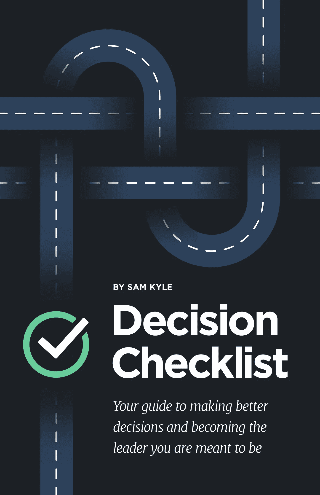

# 了解你自己:决策日志的力量

> 原文：<https://medium.com/hackernoon/know-thyself-the-power-of-a-decision-journal-abf00c22b05d>

我想我应该分享一下我即将出版的书的第一章，《决策清单:避免问题的实用指南》。

***“正规教育会让你谋生。
自我教育会让你发财
—吉米·罗恩***

我们每天可能会做出数百个甚至数千个小决定。我们决定早上穿什么，什么时候刷牙，早餐吃什么，我们是否要在星巴克的免下车餐厅点一大杯摩卡或一大杯豆奶拿铁，在哪里停车，我们是否要停下来和办公室的同事聊天。这还没等我们坐下来呢！

如果你是商业领袖、知识工作者或者企业家，那么决策就是你工作的主要部分。Cloverpop 是一个应用行为经济学和协作来帮助商人做出更好决策的云解决方案，其创始人兼首席执行官 Erik Larson 在 2016 年的 [*哈佛商业评论*](https://hbr.org/2016/03/a-checklist-for-making-faster-better-decisions) 中写道，经理们每年做出大约*30 亿*个决策！太疯狂了，对吧？拉森认为，几乎所有这些决定都可以做得更好。

我们没有做出更好的决定不是我们的错。我们带着年复一年的决策包袱步入成年。也许我们被教导要质疑自己，或者也许我们在早期没有得到我们需要的指导，去学习如何做出可靠的选择。也许我们被教导要“相信我们的直觉”

但是现在我们发现自己处于决策包袱阻碍我们前进的位置。为了发挥我们作为领导者的潜力，我们需要放下包袱，学习更好、更有效的决策方法。

## 潜力和实践之间的差距

Larson [研究了 500 名经理和主管，发现只有 2%的人在做决策时经常应用最佳实践，而很少有公司有系统来衡量和改进决策。拉森说，在做决策时，潜力和实践之间存在巨大的差距，原因有几个，包括:](https://hbr.org/2016/03/a-checklist-for-making-faster-better-decisions)

*   **历史。**直到最近，大多数经理都很难获得准确的信息，因此很难做出正确的决策。但是即使他们有准确的信息，那也不意味着他们会做出好的决定。二十世纪的经济学基于这样一种理论，即人们在获得良好信息时会做出理性选择，但由于行为经济学的最新革命，这一理论被证明是不完善的，甚至是完全错误的。此外，最流行的决策工具，利弊清单(由本杰明·富兰克林推广)已经有将近 250 年的历史了！
*   **心理学。**事实是，大多数人在做决定时都不理智。行为经济学家发现，我们使用心理捷径和认知偏见，导致扭曲并阻止我们做出更好的选择。此外，我们往往倾向于依靠直觉或直觉来做决定，当商业决策由一个群体做出时，群体思维就会接管，这增加了我们的个人偏见。
*   **技术。**虽然技术和企业软件在许多方面让我们的生活变得更加轻松，因为一些任务现在已经自动化，但技术提供的复杂而模糊的信息不一定能帮助经理和他们的团队克服挑战，做出更好的决策。仅仅通过实施更多的大数据分析软件，企业不会看到决策方面的显著改善。

如你所见，我们有自己的工作要做。在寻求做出更好决策的过程中，我们面临许多不利因素。第一步是理解这些障碍，理解它们如何影响我们。

## 缩小差距

作为领导者，我们的生死取决于我们的决定。我们是我们决策的结果，我们都有做好决策的既得利益。好的决定能让我们得到晋升，坏的决定会让我们被解雇。

导致糟糕决策的一个原因是我们不知道自己不知道什么。不仅仅是我们不了解问题，而是我们不了解自己。我们缺乏知识和自知之明，无法明智地做出决定。你知道你是怎么做决定的吗？为什么你会这样做？你有自知之明知道你的偏见什么时候会妨碍你吗？你真的了解这个问题吗？当你做决定时，你使用一致的过程吗？你对自己的决定负全责吗？

对所有这些事情的理解对于做出好的决定是不可或缺的，我希望你从这本书中学到的一件重要的事情是，通过正确的准备、正确的心态和正确的过程，你可以改善你的决定。但这需要努力、自我反省和正确的工具。

[Buy on Amazon](https://www.amazon.com/Decision-Checklist-Practical-Avoiding-Problems-ebook/dp/B07CS68KPZ/ref=sr_1_5?ie=UTF8&qid=1525266674&sr=8-5&keywords=sam+kyle)

## 决策日志

自我反省是提升自我的最重要的工具之一。为了做出更好的决策，这意味着要写决策日志。写日志不仅仅是沉思的青少年的专利。事实上，许多有成就的专业人士把写日记作为日常实践来帮助他们了解和提高自己。

我知道决策日志帮助我改变了做决定的方式。它给我提供了一个反馈回路，一个从无意识到有意识的转换机制，这是你能拥有的最有价值的东西之一。

当谈到提高我们做出更好决策的能力时，最大的挑战之一是从我们过去的决策中学习。这种情况的发生有各种各样的原因，我们将关注其中的两个。

首先，我们的思维倾向于合理化我们决定的结果，因为当我们错了的时候很难承认。很难回过头来看看我们当初做决定时有什么信息——因为很难承认我们错误选择的痛苦。我们告诉自己，糟糕的结果是坏运气的结果，而不是糟糕的过程。

第二，很难得出我们可以从中学习的因果关系，因为我们做出决定的结果和决定本身之间有一段时间。我们很少看到我们今天面临的问题是由我们几个月或几年前做的决定引起的。

当我第一次开始使用决策日志时，我很清楚我有乐观偏见。这意味着我专注于可能的积极结果，而不是预测和准备潜在的消极结果。

想想你一天的工作。也许你从九点到五点工作。你把孩子们送到学校。这是一个忙碌的早晨。你进办公室的时间比你想的晚了一点。现在是八点三十五分。你打开你的邮箱。你在九点钟有一个会议，但是在那之前你已经看了三十封电子邮件。不知不觉中，已经 8 点 55 分了，你只有 5 分钟的时间准备会议，在会议上，你应该对某件事做出决定。

所以你调出简报文件。你看了执行摘要，然后去开会。你的决定是建立在执行摘要的基础上的，这在大多数情况下是有效的。但是通常好的结果会把你引入歧途，因为你没有做幕后的工作来理解这个决定，并理解问题的动态。因此，这个结果更多地归因于运气，而且本质上是不可重复的。

这是违反直觉的，但是如果你想做出更好的决定，提高你的效率，你需要花时间思考你的决定。当我看到人们去上班，只是对收件箱里的紧急邮件作出一整天的反应时，我总是感到惊讶。他们依靠自己的智慧或快速判断来做决定。而且，你知道，90%的情况下可能行得通，但 10%的情况下行不通，而 10%结果不好的决策将会消耗你未来的大部分时间。

决策日志将帮助你放慢速度，反思和理解你的决策，并为你提供一条变得更好的道路。最后，*花时间想*通过问题会*节省*你的时间。你不仅会做出更好的初始决定，而且你会花更少的时间来清理糟糕的决定。

我鼓励你在整本书中使用决策日志。在每一章中，你都会有一份练习清单，帮助你思考和改进你的决定。

我们很少收到关于我们选择质量的反馈。没有 Yelp 的决策能力，我们可以留下评论。如果你在经营一家餐馆，顾客永远不会给你反馈，你永远不会知道意大利面酱太淡了，或者牛排太硬了。最终，顾客会停止光顾，你会破产。如果我们不反思我们的决策，我们就无法学习并做得更好。好的决定不能确保成功，但坏的决定几乎总是会导致失败。

故事是这样的:当华尔街投资策略师迈克尔·j·莫布森遇到丹尼尔·卡内曼时，卡尼曼告诉他，决策日志是测试你决策质量的最佳方式。莫布森是诺贝尔奖得主，也是以研究判断和决策心理学而闻名的心理学家。"去当地的药店买一本非常便宜的笔记本."卡尼曼告诉他的。莫布森解释道:

> 每当你做出重大决定时。。。花一点时间思考，写下你预期会发生什么，为什么你预期会发生，然后实际上，这是可选的，但可能是一个伟大的想法，写下你对这种情况的感受，包括身体上甚至情绪上的。只是，你感觉如何？

写决策日志可以防止所谓的后见之明偏差，即当我们倾向于回顾我们的决策过程时，我们会以一种让我们看起来更有利的方式扭曲它。

决策日志有助于我们收集准确、真实的反馈，了解我们在做各种决策时的想法。这个反馈也帮助我们看到什么时候我们是幸运的，我们错过了什么。有时候事情的发展和我们想象的原因大相径庭。理解我们知识极限的关键是对照我们认为会发生的事情和我们为什么认为会发生的事情来检查我们决策的结果。这个反馈回路非常强大。

你猜怎么着？我们知道的并不像我们认为的那么多。我们自欺欺人地认为我们理解了一些事情，而实际上我们并不理解。而更糟糕的是，我们往往没有办法纠正自己。我们的头脑修改历史来保存我们对自己的看法。我们告诉自己的故事混淆了我们的决定和结果之间的因果关系。解决这个问题的最好方法是决策日志。

决策日志为我们提供了质量控制。使用日志很容易，但是维护它需要自律和谦逊。

卡罗尔·卢米斯(Carol Loomis)曾经说过“写作本身让你意识到事情的漏洞在哪里。直到我看到我写的东西，我才确定我的想法。所以我相信，即使你是一个乐观主义者，当你坐下来(写东西)的时候，你的分析部分开始发挥作用。。。你会想，‘哦，那不可能是对的。’你必须回去，你必须重新思考这一切。"

## 使用决策日志

正如丹尼尔·卡内曼建议的那样，决策日志可以是一个简单的笔记本，你可以从当地药店买到。当然，如果你用谷歌搜索“决策日志”，你会在网上找到有用的模板，还有一些你可以买到的实体模板。你可以用你的日记来回答每章末尾的问题。然后，无论你是作为个人还是团队的一员，在做决定时，使用附录 B 中的决策日志模板。花点时间写下:

1.  情况或背景。
2.  决定局势的变量。
3.  你所看到的复杂性。
4.  认真考虑过的替代方案，以及*为什么*没有选择它们。
5.  用概率解释你认为可能的结果范围的一段话。
6.  解释你预期会发生什么的一段话，以及理由。(自信的程度很重要。)
7.  一天中你做决定的时间，以及你身体和精神上的感受。(比如你累了，就写下来。)

当你实施你的决策日志时，这里有一些其他的提示要记住。

*   **超越明显的事物。通常你的第一个想法不是你自己的，而是别人的想法。所以，试着超越那些简单明了的见解。**
*   在你的日记中手写。科技是伟大的，但用你自己的笔迹写下来会让你保持诚实，并有助于防止事后诸葛亮。看着电脑屏幕上的一份文件，你很容易说:“我不这么看。”看着自己的笔迹说出同样的话要难得多。
*   **具体而明确。**避免含糊的语言。如果你被困在抽象的迷雾中，你还没有准备好做决定，改变定义来适应新的信息是很容易的。写下你看到的概率。
*   **经常回顾你的日记**。我每季度回顾我的。这是这个过程的一个重要部分。它帮助你意识到你在哪里犯了错误，你是如何犯的，你不擅长什么类型的决定，等等。如果你和教练分享你的日志，他们可以检查并帮助你找出需要改进的地方。
*   记住这不仅仅是结果。也许你做出了正确的决定(在我们看来，这意味着使用了一个好的过程),但结果仍然不好。那叫做坏运气。另一方面，也许你发现你在错误的原因下获得了好的结果(即，尽管有一个糟糕的过程)，决策日志将阻止你在未来使用该过程时过于自信。

随着你对自己和自己的决定了解越来越多，这可能会令人感到羞愧。但这是好消息，因为了解我们的弱点是成为更好的决策者的第一步。

**第一章检查表:**

*   购买一个简单的笔记本，你可以用它作为你的决策日志，并使用附录中的模板作为指导，帮助你在做决策时记日志。
*   在你的决策日志中，反思你目前对自己决策技巧和过程的感受。为什么你觉得你需要改进你的决策？
*   从思考你必须做出的一个小决定开始——也许是你下一次去哪里度假，或者类似的事情。完成上面的步骤，这样你就能对如何使用决策日志有所了解。

*这是摘自* [*决策清单:避免问题的实用指南*](https://www.amazon.com/Decision-Checklist-Practical-Avoiding-Problems-ebook/dp/B07CS68KPZ/ref=sr_1_5?ie=UTF8&qid=1525266674&sr=8-5&keywords=sam+kyle)