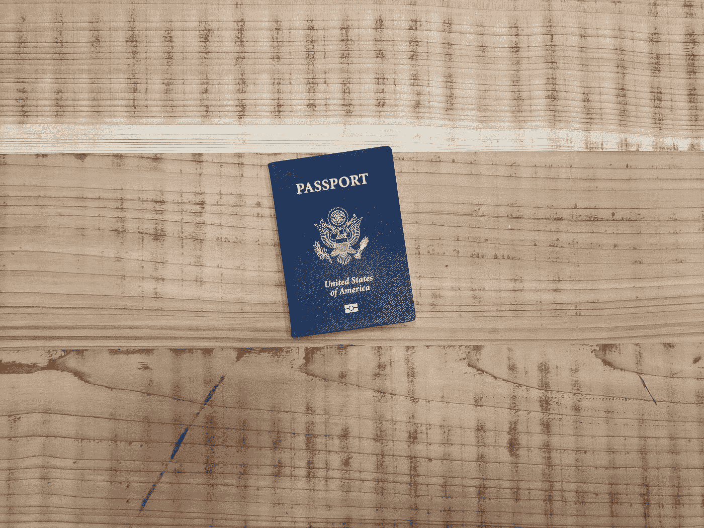

# 了解您的客户(KYC)sto 法规

> 原文：<https://medium.com/hackernoon/know-your-customer-kyc-regulations-for-stos-43c55132f196>

在与几个 sto 一起工作后，我注意到许多 sto 不理解一个合适的 KYC 应该是什么样子，以及如何正确地执行它。
在本文中，我想分享我在 [Guerrilla Buzz](https://guerrillabuzz.com) 工作的经验，以及一些最有趣和最具创新性的区块链项目，并帮助您计划和执行您的 KYC 和反洗钱流程。

了解你的客户，通常也称为“**了解你的客户**或 **KYC** 简称，是一家公司确认其客户身份并评估业务关系是否存在潜在非法活动风险的过程的名称。该术语也用于[反洗钱法规(AML)](https://www.investopedia.com/terms/a/aml.asp) 中。

必须高度重视 KYC 法规的企业的典型例子是银行、其他金融机构、发行股票的公司，以及最近通过[证券代币发行](https://guerrillabuzz.com/all-you-need-to-know-about-security-token-offerings-sto/) (STO)发行股票的公司。

# 为什么 sto 适用于 KYC 法规？

与 ico 向客户发放实用令牌不同，s to 提供所谓的安全令牌。根据美国法律，证券交易委员会将证券代币归类为证券。

这是因为它们属于豪威测试的范围，豪威测试是在 [SEC 诉豪威(1946)](https://en.wikipedia.org/wiki/SEC_v._W._J._Howey_Co.) 一案中确立的。该测试列出了以下内容，如果令牌满足以下标准，则它将被分类为安全令牌。

*   它涉及金钱或其他有经济价值的资产的投资。
*   ***投资者不止一个，业务为共同企业。***
*   ***有从投资中获利的预期。***
*   ***任何利润都是从第三方或代币推广者那里获得的。***

因为安全令牌被 SEC 归类为证券，所以它们属于 KYC 法规的管辖范围，其中 SEC 要求提供安全令牌的企业了解并确保他们可以验证其客户的身份，以便他们可以防止任何可能因 STO 而实施的欺诈活动。

# 围绕 KYC 法规的法律

当然，每个国家都有自己的一套关于 KYC 实践的法规，但是，为了简单起见，我们将重点关注美国的法规。

最初，由于 2001 年的[美国爱国者法案，美国的 KYC 法规采取了适当的形式。这最初是为了确保防止洗钱流向犯罪集团和恐怖组织。它基本上将已经颁布的 1970 年](https://en.wikipedia.org/wiki/Patriot_Act#Title_III:_Anti-money-laundering_to_prevent_terrorism)[银行保密法](https://complyadvantage.com/knowledgebase/regulation/what-is-the-bank-secrecy-act/)和 1986 年[洗钱控制法](https://en.wikipedia.org/wiki/Money_Laundering_Control_Act)的要素结合在一起。

由于所有这些法律，作为一个证券分销商，你有一定的期望。

首先，你对你的其他投资者和法律负有责任，在他们被允许在你的 STO 投资之前，准确地筛选任何潜在的投资者。首先，因为 sto 必须在 SEC 注册，你也需要通过他们的监管。大多数证券代币在美国是有限制的，也就是说，它们只能出售给合格的投资者。

**合格投资者主要定义如下:**

1.  在过去两年中每年的收入超过 200，000 美元(或与配偶一起超过 300，000 美元),并且有理由预期今年的收入也超过 200，000 美元的人。

**或者，**

2.个人或与配偶一起净资产超过 100 万美元的人(不包括此人主要住所的价值)。

合格投资者不限于这两种描述。
然而，他们是最常见的合格投资者群体。其他类别可以查看我们关于[发布 STO](https://guerrillabuzz.com/launch-an-sto/) 的指南。

除此之外，KYC 法规意味着识别和验证任何 STO 潜在投资者的身份非常重要。这意味着你必须收集感兴趣的个人的某些信息。下面包括了其中的一些例子。

*   财务状况。
*   投资者的年龄。
*   出生日期。
*   现居住地址。
*   就业率
*   年收入(也可以是前几年的。)
*   他们为什么投资？

稍后，当我们谈到如何启动和运行您的流程时，将会解释您获取这些信息的方法。当你在准备你的 KYC 程序时，最好是寻求外部法律帮助的支持。

很明显，如果你不知道一个法律问题的答案，那你就去问律师。但是，有些人喜欢自己尝试和做事情，这种情况下应该避免。如果您不确定任何与 KYC 法规相关的事情，那么您应该咨询合格的法律专业人士，他们可以帮助指导您完成整个过程。

获得法律帮助可能会非常昂贵，尽管法律帮助会比与证券交易委员会或其他政府机构的麻烦更便宜，对你的声誉的损害也更小。

# 为什么 KYC 法规很重要？

KYC 法规非常重要。这是因为，通过这些法规要求的识别和验证过程，提供安全令牌的公司可以知道他们在与谁交易。

由于能够肯定地识别每个客户，安全令牌供应遭受身份欺诈、洗钱或资助犯罪或恐怖活动的机会显著降低。

此外，能够表现出对遵守 KYC 法规的坚定承诺将极大地提高提供安全令牌的公司的声誉。此外，对其他投资者来说也有额外的好处，因为他们知道，如果所有其他投资者都受到审查和检查，他们的投资将得到更好的保护。

幸运的是，通过设计，安全令牌可以符合 KYC 法规。例如， [Polymath 的](https://blog.polymath.network/can-kyc-be-baked-into-security-tokens-on-ethereum-bb43c954cf3f)自有智能合约包含一份不断更新的合格投资者名单。由于 SEC 关于证券豁免的规定，所有的 sto 都是根据规定 D 豁免注册的。这意味着在美国，只有合格的投资者才能投资 STO，如果它是根据法规 d 提交的

因此，投资者很容易被识别，从而从遵循 KYC 程序中获得上述好处。任何人都不能持有 Polymath 安全令牌，除非他们首先被验证。

# 如何执行 KYC 程序？

## 白名单

因为 s to 在法律上更类似于[首次公开募股](https://www.investopedia.com/terms/i/ipo.asp)(IPO)而不是 ico，所以 KYC 的法规和程序非常相似。

首先，进行 s to 的企业必须进行某些检查，以核实希望在 STO 投资的人的身份。他们需要了解潜在投资者的财务状况，如前所述，这意味着创建一个“白名单”对你的 STO 至关重要。

如前所述，完全可以使用 STO 的区块链来简化这些程序。如果你要根据 D 条例豁免在美国证券交易委员会注册，那么你将只针对美国的合格投资者。你可以创建一个白名单，就像 Polymath 一样，只允许这些合格的投资者购买你的 s to。这意味着受制裁的个人和潜在的骗子将无法参与。

## 支持文档

你需要从你的潜在投资者那里得到的东西是证明文件。应该有文档来支持上面列出的所有不同的信息。但是，并不仅限于以上。该文件将用于确认试图投资者的身份。当然，您很可能会收到这些文档的数字版本，因此，您需要注意不要有任何改动，并且文档上的所有细节都要正确匹配。例如，如果两份不同的文件上有不同的出生日期，你就需要问一些严肃的问题。

您需要收到的一些文档示例如下:

*   **地址证明**
*   **年龄证明**
*   **照片身份证明(即护照)**
*   **收入证明**
*   **就业证明**

## 根据位置定制

众所周知，一些国家对加密令牌有着极其严格的规定。这意味着，你要么必须研究许多不同国家的法律情况，要么更有可能的是，你必须找到一种方法来保护你的产品。“圈护”意味着你将只选择少数几个你的代币将被发放到的国家，避免你可能不熟悉的法律部门的不确定性。

这样做有助于你避免陷入意想不到的法律困境。

## 准备审计

将来，您可能会受到政府机构的外部审计。这可能不会发生，但是，安全总比后悔好。因此，您应该考虑以审计人员易于理解的方式记录您的 KYC 和反洗钱流程，该记录还应该显示您为保持合规而采取的所有步骤。

这将有助于加快审核过程，因为您的合作将有助于加快任何调查。在一天结束时，延长审计是你需要的最后一点压力，如果你没有记录你的程序，这正是你将得到的。

**结论**

总之，KYC 对 sto 的要求与首次公开募股的要求非常相似。至少目前是这样。我们永远无法确定监管领域会发生怎样的变化。

阅读本指南后，您应该感觉已经了解了 KYC 和反洗钱法规的重要性，以及需要应用到您的程序中的不同方面。

这一点之前已经提到过，但是，我想强调一个事实，如果你对本指南中没有回答的任何问题不确定，你应该向合格的律师寻求外部帮助。