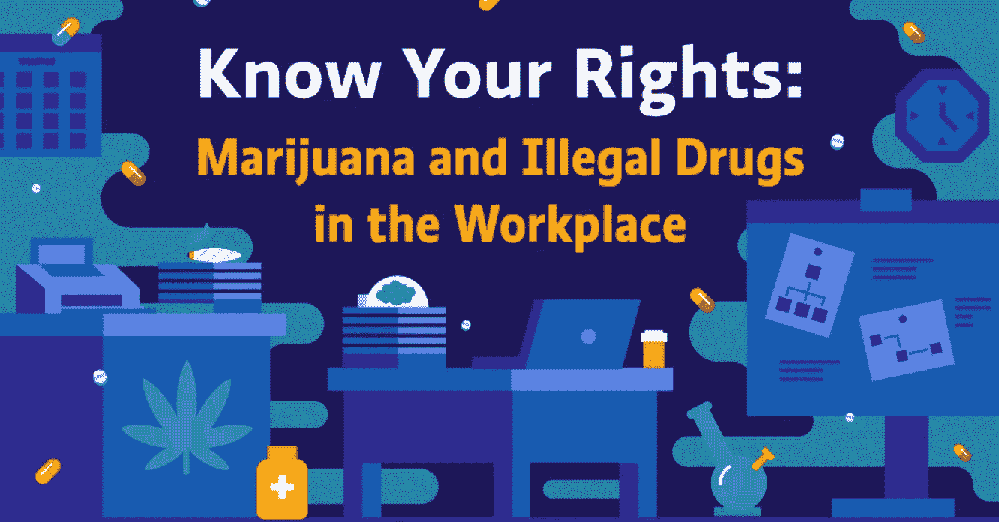

# 了解你在工作场所的权利:

> 原文：<https://medium.com/hackernoon/knowing-your-rights-in-the-workplace-f71559775ad0>

## 大麻和非法药物

超过 80%的雇主认为大麻导致低质量的求职者，随着合法化的继续，它成为各地商业领袖越来越多的担忧。从增加的运营成本，到工人的赔偿，再到醉酒的员工，当涉及到非法药物时，工作场所会出现很多问题。

与同事相比，系统中非法药物检测呈阳性的员工平均缺勤率和离岗率更高。选择对员工进行药物测试的企业领导人喜欢降低保险成本、高水平健康和安全措施、甚至提高士气和沟通的办公环境。但是，并不是每个企业都同意药物测试的有效性，有些人甚至认为它的麻烦大于它的价值。事实上，20 家公司中就有一家正在考虑将大麻从药检小组中完全剔除。无论如何，所有的雇主都有权利在合理的范围内进行药物测试，这是他们选择如何进行这些测试的关键。

在建设和保持无毒品工作场所方面，药物测试本身只是一部分。负责任、公平和注重隐私的药物测试政策是确保药物测试有效性的唯一途径，同时也让员工快乐、安全和健康。

