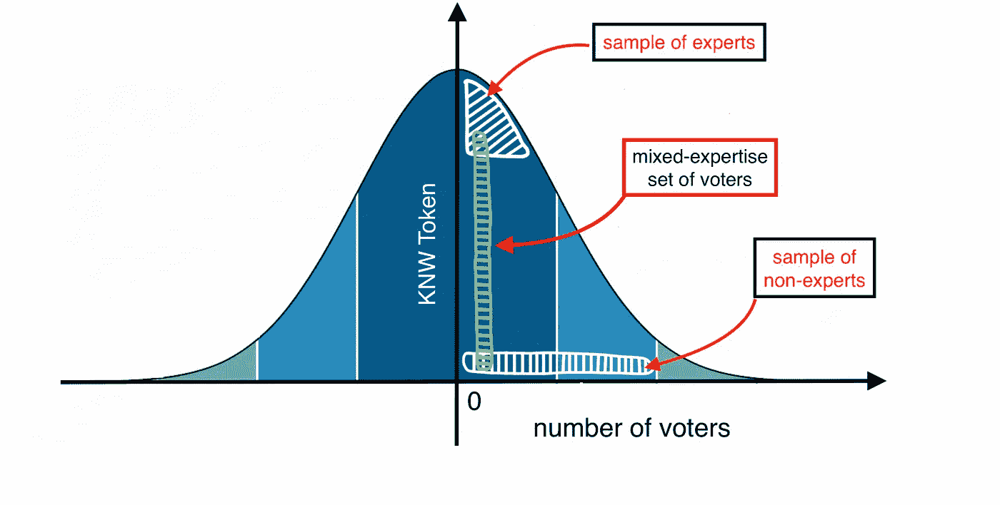

# 区块链和分布式治理的知识可提取投票——超越“越富越富”的全新分散决策机制

> 原文：<https://medium.com/hackernoon/knowledge-extractable-voting-for-blockchain-distributed-governance-radically-new-mechanisms-ed2ca47f065f>

Heather Mount (@heathermount), Source:[Unsplash](http://unsplash.com)

> 区块链是一场去中心化革命，不仅有可能改变支付活动，还可能改变未来组织的决策，以资助项目(又名 ico)、治理去中心化的企业(又名 Dao)或管理列表(又名 TCR)。决策的一个核心工具是投票，它可以被看作是一个具有额外隐私保证的共识协议。我们认为标准的民主投票机制——一人一票——是脆弱的，不能满足当代区块链应用的要求。我们提出了一种全新的机制，称为知识可提取投票，这在现实世界(反乌托邦)中是不可能的，但它可以在区块链世界(隐乌托邦)中实现。我们展示了分散自主决策情况下的通用性和实用性。

# 1.介绍

投票是让大多数当前社会和机构通过给予成员发言权而成功的关键基础。它是执行民主决策和表达意见的一般机制，不仅用于选举公职人员，还用于选择公司内部的决策。即使在区块链的世界里，投票也是为了促进对下一个区块状态的共识，比如证明利害关系，或者执行行政决策，如分散自治组织(DAOs)的情况。

世界上有不同的投票方案，但最流行的是基于一人一票的原则。这是民主的方式，因为它抓住了每个选民的权力。这种系统在过去运行良好，尤其是在北美和欧洲。它确保了候选人和决策是基于功绩而不是某个群体的财富或影响力来评判的。

不管多么熟悉，这种投票方式并不总是被使用。投票一直在不断变化和发展。一些制度给了大众发言权，另一些制度只给了少数特权阶层。例如，在古罗马，只有拥有适当遗产和财产的有钱人才能投票，而奴隶、妇女和穷人的声音却永远听不到。

我们的民主选举制度已经从令人不安的罗马精英制度中走了很长一段路。然而，这样的成功并不一定意味着它的进化结束了。最近的历史表明，目前已建立的投票系统是不完善的，很容易被利用。

> 英国退出欧盟和 2017 年美国总统选举是个人问责缺失、第三方干预和民粹主义运动如何产生灾难性后果的绝佳例子。

现在，我们比以往任何时候都更加意识到，我们所熟悉和喜爱的投票系统并不完美。事实证明，在政府选举的背景下，这种方法是无效的，如果应用于(权力下放的)公司决策，这种方法甚至会有更大的缺陷。民主投票制度的基本假设是，每个选民都意识到自己的权力和责任，并做出理性的选择。也就是说，选民根据事实做出选择，分析信息，做出自己的独立决定。投票方案是一种机制，像任何机制一样，它容易受到攻击，攻击的目的是使投票者偏离理性选择。例如，日益高涨的民粹主义浪潮(一种当代形式的攻击)影响了英国选民的判断，许多 T2 人在大选后后悔自己的选择。2017 年美国大选受到假新闻的攻击，假新闻是一种新的宣传形式，偏见了美国选民的信息库。

区块链是一场革命，代表着信息社会的解放和[彻底的去中心化](/@VitalikButerin/liberation-through-radical-decentralization-22fc4bedc2ac)。由于智能合约的载体，区块链技术带来了一系列全新的概念，如分散的自治组织，其中网络节点精神中的人们是未经许可的，自主运营，并基于一种称为共识的硬编码决策机制来执行。投票方案对于实现共识机制至关重要。他们实行自由民主的选择。因此，必须非常小心地实施一个强大的机制来抵御任何形式的攻击，就像互联网安全协议能够抵御网络攻击一样。否则民主分权治理停留在乌托邦！而且永远也不会到达神秘国度——分布式治理的终极之地！

> 一人一票方案不是分布式治理的通用机制。相反，它必须被视为分布式区块链应用协议框架中的一种机制。因此，在为民主决策部署协议时必须非常小心。

# 2.一种全新的方法:知识提取投票

## 2.1 假设

知识可提取投票的想法是基于财富分配不均的假设——这是当今现实世界的事实。它还基于这样一种假设，即富人和富人不会做出有利于社会的选择，而是为了实现效用最大化而做出的理性选择。引用维塔利克·布特林和[格伦·韦伊尔](https://medium.com/u/efb5397d83d0?source=post_page-----ed2ca47f065f--------------------------------)最近发表的关于[通过激进的权力下放获得解放](/@VitalikButerin/liberation-through-radical-decentralization-22fc4bedc2ac)的文章:

> 毕竟，一个只规范资本而不规范人的个性的系统可能无情地服务于财富而不是人性。

典型的例子是工业革命，展示了对生产率/收入感兴趣的雇主和为此受到残酷剥削的雇员之间的冲突。将决策机制完全建立在财富(用代币表示)的基础上是有局限性的，因为这可能会将拥有所需专业知识但无力参与的选民排除在外。

## 2.2 二次投票和 Sybil 攻击

史蒂文·拉利和格伦·威尔提出了一个全新的想法来缓解财富分配不公的问题。作者提出了二次投票的美丽概念(QV)。他们的想法是建立在购买选票的基础上的。更准确地说，每个选民都可以通过在一个基金中支付代币来购买任意数量的选票，但有一个条件。投票人必须支付票数的平方。然后，这笔钱按人均计算返还给选民。例如，假设一个选民打算投 10 票。然后他向 10^2=100 支付代币来获得选票。在高层次上，二次定价函数就像一种财富减速机制。拉里和韦勒已经证明，在某些假设下，QV 是一种反对多数股东暴政的机制。

虽然他们的结果适用于现实世界的决策，但将该方案转移到无需许可的区块链环境并没有带来预期的结果。区块链世界的问题是女巫攻击。区块链技术公司的设计允许一个投票者投许多匿名的身份。因此，为了积累 10 张选票，sybil 攻击者只需在不同的身份下创建 10 个帐户。这样，攻击者总共需要 10 个令牌来投 10 票。然而，我们想要强调的是，在基于许可的设置的情况下，玩家的身份是已知的，并且在系统的整个生命周期中是固定的(例如，基于授权证明的系统)，QV 可以满足期望的结果。

受 QV 背后的全新而卓越的想法的启发，我们提出了一个方案，该方案基于我们认为稀疏且更适合区块链应用的东西——即**知识——**——来实现(部分)独立于财富的决策。

> 我们建议的美妙之处在于，区块链赋予了知识符号化的权力。

## 2.2 机制设计

设计目标

每个选民都应该有发言权。这种机制不应该基于一个人的职位、财富/股份、肤色或性别。此外，这种机制不应该有所歧视，而是应该鼓励选民在做出重要决定之前进行征求分析。此外，该机制应反映社区的价值观、规范和理念。一个社区通常分享共同的意图、信念、需求和风险，从而影响参与者的身份和他们的凝聚力程度。例如，区块链社区认同权力下放的信念和需要。让一个社区与众不同的是他们在特定领域的知识。

与财富相反，知识是通过经验或教育，通过感知、发现或学习获得的。它不能在交易所买到。它不能从一个有知识的人身上转移到一个不太有知识或富有的人身上。此外，知识是不可替代的，因为知识与特定的兴趣和专长领域相关。

2.2.2 知识可提取投票

我们机制的新颖之处在于利用了双令牌模型。第一个名为 ETH，是一个标记令牌。第二个称为 KNW(代表知识)，是一个不可替代的令牌。

**协议目标:**做出决定(例如，这是一个好的新块吗)。

**协议假设:** ETH 令牌是可替换和可交易的。它们可以交换和转移。KNW 是不可替代和不可交易的。此外，它们是不可转让的，因为它们与特定的 ETH 钱包地址相关联。(这从上面的讨论中抓住了知识的直觉。)

**协议设置:**网络中的所有玩家都拥有 ETH 令牌。为了便于说明，假设每个玩家也拥有 KNW 代币。

**协议:**协议在充当提议者的 Alice 和一组社区成员(缩写为投票者)之间以如下方式运行:

*   **Challenge():** 爱丽丝下了一些赌注来开始决策。
*   **Response():** 投票者反投与投票者总数成比例的等量代币。每个选民投一票。
*   **Decide():** 法定人数(如多数，2/3)决定选举结果。作为参与这一过程的奖励，偏离法定人数选择的投票人的股份(包括 Alice 的股份，以防她提出了错误的建议)将被削减，并在获胜的投票人中分享。此外，为获胜的选民铸造 KNW 代币。反之亦然，失败的选民会受到惩罚，他们的一些选票会被烧毁。

铸造和燃烧 KNW 的奖励和惩罚的数量还有待回答。虽然具体的参数化需要更多的研究，我们建议以下下限和上限:

*   铸造 KNW 令牌的数量应与决策结果相关，并反映社区利益的密切程度。例如，假设所有投票者 100%同意该决定，那么奖励接近 1 KNW token。反之亦然，假设所有投票者中有 51%同意该决定，那么奖励应该接近 0 KNW token。在这种情况下，不清楚结果是否真正反映了社区的真实情况。
*   烧毁的 KNW 代币的数量应该与铸造的 KNW 代币形成鲜明的对比。我们建议使燃烧率与判决结果不相关，并将其固定为失败方拥有的 KNW 个令牌的平方根，即假设该方拥有 16 个 KNW 个令牌，那么在投票协议之后，它拥有 sqr(16)=4 个 KNW 个令牌。

平方根(即反二次函数)燃烧率背后的合理性是防止富裕的选民仅仅通过重复参与投票获得 KNW 代币。请注意，一个富有的选民可能不害怕失去象征性的赌注，或者通过与许多选民串通来玩弄决策的感性结果。

2.3 效用函数

到目前为止，我们描述了知识可提取投票方案的机制。仍然需要利用所获得的知识来改善投票结果。我们提出三点建议:

*   **加权投票:**KNW 令牌用于加权投票。理想情况下，知识丰富的投票者的投票将比知识贫乏的投票者的投票对投票结果产生更大的影响。这种模型的一个例子可以使用 KNW 令牌作为乘数。假设一个人有一个良好的记录，因为他在之前的几次投票中都是正确的，并且成功地解决了分布式网络中的争议。在这种情况下，他的 KNW 令牌可能是 1.5。然后，在乘数加权模型下，他的投票权标将乘以他的 KNW 权标，这将使投票比不值得信任的人(他的 KNW 权标小于 1.5)更有价值。类似地，如果他在前几轮投票中没有做出明智的决定，他的 KNW 令牌可能会小于 1(例如 0.5)。这将意味着他的选票将比过去表现得更可靠的人少得多。
*   **Selected Choice:**KNW 令牌用于识别投票者，并根据他们的专业知识对他们进行预分类。这产生了采样函数。例如，对于专家投票(即要求特定领域特定知识的决策)，采样函数将选择 KNW 最多的前 10 名投票者。对于混合专家投票(即要求公平代表所有知识群体的决策)，抽样功能从每个 KNW 级别选择等量的投票者。最后，人们可以随机选择投票者来独立于 KNW 分布投出一个组。
*   **委托选择:**KNW 令牌用于标识委托人。如同在选择的选择模型中，KWN 令牌服务于专家代表的预分类。通过活动(根据积极投票参与来衡量)和 KWN 令牌的类型(回想一下，KWN 令牌是不可替代的令牌；因为它涉及一个特定的利益、信仰或价值领域)，选民可以选择最符合他们利益的代表。

Gaussian Distribution of Voters and some example Sampling Domains (Expert — Mixed — Non-Expert)

# 3.应用程序

## 3.1.信誉与利益相关的共识证据

知识可提取投票在基于利害关系证明的协议中有应用。PoS 是一种协议类型，通过它可以在分布式系统中达成共识。以太坊正计划使用 PoS 来公平地确定区块链下一个区块的创建者；然而，该算法还有许多其他用途来解决分散企业中的不同问题。

在 PoS 中，争议由验证器解决。他们是个人，愿意并且能够把他们的一些硬币(ETH)或代币作为争端结果的抵押品。当争议得到解决时，那些押注正确结果的人将获得与其初始赌注成比例的奖励。虽然该协议相对于工作验证(在系统的整个生命周期中可能需要多几千倍的电力资源)是一个巨大的进步，但仍有改进的空间。PoS 目前的问题是，它是专门为重要的利益相关者提供频繁参与协议并获得奖励的能力。由于财富分配不均，大部分决策都留给了少数富有的利益相关者。

知识令牌可用于改善 PoS 分布式系统中的赌注机制，奖励那些认真对待其验证者角色并将其赌注基于知识而非纯粹猜测的人。它也可以用来惩罚那些在下注过程中不加思考的人。例如，假设块提议者的选择发生在 ETH 和 KNW 令牌的混合上。这样，知识平衡了财富，也让不富裕的参与者参与到共识中。

因此，KNW 令牌提供了一个激励系统，促进透明度和明智的决策。这是一个重要的部分，它可以进一步改进 PoS 算法，从而产生一种更可靠和有效的方法来解决分散企业中的冲突。

## 3.2 分级令牌管理的注册管理机构

[分级](/coinmonks/graded-token-curated-decisions-with-up-downvoting-designing-cryptoeconomic-ranking-and-2ce7c000bb51)或任何形式的令牌管理注册中心(TCR)基本上是一个以分布式方式管理的列表(即没有像 google 或 amazon 这样的中央机构)。秘密经济激励机制确保这个列表的所有者精心策划内容。TCR 可以用于许多事情，例如:将网站列入白名单、基于社区的分散式兴趣点地图、为广告商提供与其内容最相关的网站等等。用最简单的话来说，它们基本上是由对象组成的社区审查列表。

知识可提取投票使得 TCR 更加准确。在当今世界，TCR 中的对象仍然可能受到危害。对于一个对象是否应该真正在列表(注册表)中没有准确知识的大多数人可以完全凭运气压倒几个专家。然而，现在有了 KNW 机制，这种情况的可能性大大降低了。该系统可以确保专家、表现一般的专家和在过去投票中表现不佳的专家(在上图的绿色阴影区域中表示)的比例分布。这样，标记管理的列表有效地转变为知识管理的列表，并且具有这样的优势，即对于某些问题，只有合格的人才参与内容的管理。

# 4.结论

对于机构群体而言，在设计分散化、民主的区块链应用程序(如 DAO、DAICO 等)时，将以往选举中获得的真知灼见考虑在内应该是至关重要的。).肯定有改进的空间。一人一票的方案可能不是区块链项目面临的关键决策的正确过程。类似的论点可能适用于那些完全依赖于选民财富的计划。减轻普通赌注协议缺陷的全新方法(如在证明利益一致的情况下)是在财富旁边加入第二个量，即知识。每个人都应该有发言权，但也应该有某种机制来奖励那些有经验并始终做出正确选择的人。这种机制不会基于一个人的职位、他们的股份、肤色或性别。这不是歧视，而是激励选民在做出重要决定前做足功课。

# 感谢

知识可提取投票背后的想法显然受到了史蒂文·拉利和格伦·维尔关于二次投票的工作以及他们的 T2 激进市场理论的启发。事实上，他们的工作为作为 [weeve](https://medium.com/u/764176defc1?source=post_page-----ed2ca47f065f--------------------------------) 网络协议基础的开创性概念铺平了道路，并帮助我们理解经典的一人一票方案是设计分级令牌管理的设备注册和市场的有限候选方案。与 [Sidd Bhasin](https://medium.com/u/42ad7d7cabdd?source=post_page-----ed2ca47f065f--------------------------------) 和 [Vlad Cherevkov](https://medium.com/u/6dc6e3fa96?source=post_page-----ed2ca47f065f--------------------------------) 共同工作。

# 术语选择的历史注解

知识提取是像 ZK-斯纳克这样的证明系统的一个属性，可以追溯到[Goldwasser-Micali-rack off](https://people.csail.mit.edu/silvio/Selected%20Scientific%20Papers/Proof%20Systems/The_Knowledge_Complexity_Of_Interactive_Proof_Systems.pdf)由于 [Bellare 和 Goldreich](http://www.wisdom.weizmann.ac.il/~oded/PSX/pok.pdf) 关于知识证明及其正式处理的著名工作。不严格地说，知识提取器捕获了直觉，即从协议执行中可以学习证明者的知识。这正是将证明者(谁“知道”证明证人)与所有其他潜在的作弊玩家(谁不“知道”证人)区分开来的证人。在我们的机制设计中，获胜的玩家从投票中提取知识，这将他们与偏离法定人数的玩家区分开来。