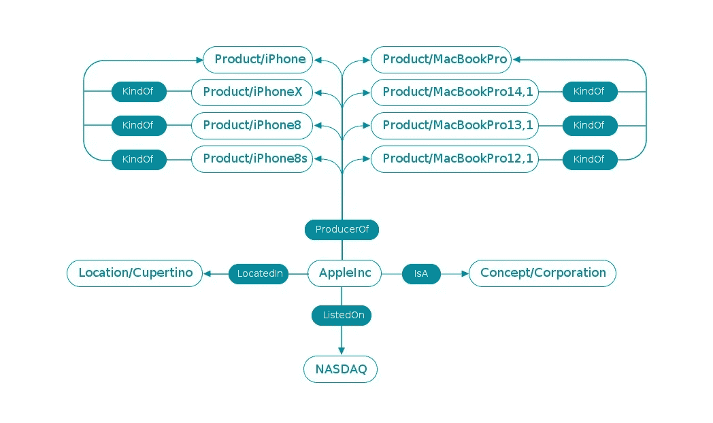

# Forge 增强机器推理的知识图。人工智能

> 原文：<https://medium.com/hackernoon/knowledge-graphs-for-enhanced-machine-reasoning-at-forge-ai-ef1ffa03af3d>

作者:托马斯·马尔科维奇博士。

# 介绍

工业规模的自然语言理解需要一个高效、高质量的知识图来完成任务，如[实体解析](https://en.wikipedia.org/wiki/Record_linkage#Entity_resolution)和[推理](https://en.wikipedia.org/wiki/Reasoning_system)。没有从语义上对信息进行推理的能力，自然语言理解系统只能进行肤浅的理解。随着机器推理和机器学习任务的需求变得更加复杂，需要更高级的知识图。事实上，以前已经观察到，当用于在小范围内增强和加速机器推理任务时，知识图能够产生令人印象深刻的结果，但是在大范围内，由于数据完整性和性能问题的混合，知识图很难发挥作用。解决这个问题并实现机器驱动的大规模语义推理是我们在 [Forge 解决的基本技术挑战之一。AI](http://www.forge.ai) 。

为了理解这项任务的复杂性，有必要定义什么是知识图。有许多学术定义在流传，但大多数都充满了术语，令人费解。简单来说，知识图就是每个顶点代表一个实体，每个边都是有向的，代表实体之间的关系的图。实体通常是专有名词和概念(例如，分别是 Apple 和 Company)，边代表动词(例如，是 A)。这些一起形成了编码语义信息的大网络。例如，在知识图中对“苹果是一家公司”的事实进行编码是通过存储两个顶点来完成的，一个顶点表示“苹果”，一个顶点表示“公司”，有向边从苹果开始并指向“is a”类型的公司。图 1 显示了这一点:

**Figure 1.** Visualized simple knowledge graph representing the fact that “Apple is a Company”

知识图编码了许多事实，每一个都通过使用有向边。每个顶点可以有许多与之相连的事实，使它最终成为一个有向多重图。这种类型的表示提供了推理查询的直观方式。例如，从图 1 所示的知识图中，我们可以推理出“苹果是一家公司吗？”通过简单地遍历图形，从“苹果”开始，走到“公司”，沿途测试边和概念。在生产中，知识图往往很大很复杂，有数百万或数十亿条边。如此大量的知识允许我们使用这些图来轻松地推理任务的语义连接，例如丰富业务相关数据和解析实体。在福吉。人工智能，我们执行这些任务作为我们的 NLP/NLU 管道的一部分，用于从非结构化文本中提取单个事件到机器可读格式。

有了知识图的工作定义，我们接下来将探索我们在 Forge.AI 这里发现的知识图的一些用例。然后，我们将探索图基础设施，以了解这些用例的动力。最后，我们将讨论路线图的一部分，探索 Forge 的下一步。人工智能及其知识图。

# 用例

在我们深入讨论基础设施、它如何工作以及我们要去哪里之前，有必要先用几个用例来为我们的知识图对话打下基础。一般来说，知识图可以用于广泛的应用，包括实体解析、依赖性分析、过滤和机器推理。在接下来的讨论中，我们将关注实体消歧和依赖性分析，这是我们在 [Forge 使用知识图的许多任务中的两个。AI](http://www.forge.ai) 。

**实体消歧**

虽然说起来简单，但实体歧义消除问题是我们在对文档进行推理时需要解决的最常见的问题之一。虽然这个问题在相关的本体已知并被完全枚举的情况下处理起来相当简单，但如果不是这样，它会很快变得困难。为了探索我们如何利用知识库来处理这个问题，让我们考虑确定下面的引用中引用了哪个“Apple”的问题:

> *“虽然该公司没有按型号分列单个产品的销量，但苹果表示，它售出了 7730 万部 iphone，低于 2017 年同期的 7820 万部。”*

显然，这是“苹果”公司，而不是“苹果”类型的水果。我们的大脑是如何决定这一点的？我们使用了上下文线索！我们知道苹果公司销售苹果手机是因为这种水果什么都卖不出去。仅基于这些上下文线索，我们就能够使用我们的推理几乎瞬间完成这项任务。ForgeAI 知识图的工作方式相同:当我们试图消除一个实体的歧义时，我们为知识图提供了一组位于同一位置的实体，这些实体为图提供了适当的上下文。然而，机器学习系统并不像我们的大脑那样工作，为了让机器学习系统根据上下文进行推理，我们需要一个知识图。然后，我们的知识图在整个图上搜索“苹果”的所有版本，并构建包含上下文信息的小图，如图 2 和图 3 所示。请注意，这是一个有噪声的字符串搜索，能够找到可能不同于原始字符串或包含作为子字符串的搜索字符串的初始搜索词版本。我们还为每个实体保留一个已知别名的查找表，别名可以是 CIK 码或股票代码。

**Figure 2.** Visualized excerpt from the Knowledge Graph that pertains to the entity Apple the fruit.

**Figure 3.** Visualized excerpt from the Knowledge Graph that pertains to the entity Apple, the consumer electronics corporation

有了这些小图，知识图然后使用机器推理来确定哪些实体是真正被引用的。有许多这样做的策略，但是我们已经发现一个贪婪的算法是有效的，该算法寻求最大化传递的上下文实体和考虑中的小图形之间的重叠。

**相关性分析**

我们发现知识图有用的另一个主要任务是依赖分析。也就是说，确定两个或多个实体之间的关系。考虑到客户陈述的兴趣，当试图确定提取的事件是否是他们关心的事情时，这是最有用的。具体来说，让我们考虑以下关于一位对三星相关新闻事件感兴趣的客户的新闻故事:

> *“俄罗斯的诺里尔斯克镍业公司已经与俄罗斯铂金公司合作，投资 44 亿美元在西伯利亚开发采矿项目。西伯利亚蕴藏着世界上一些最丰富的铂和钯矿藏。他们周三表示，两家公司将组建一家合资企业，在俄罗斯最北部的泰米尔半岛开发项目，目标是成为全球最大的贵金属生产商。”*

我当然不清楚这个故事与三星有什么联系。眼下的问题是确定这一新闻事件是否与三星有关，如果是，这种关系的性质是什么，这样我们就可以确定是否将这一事件传递给我们的客户。我们从围绕每个实体构建小图开始。有了这些图，我们就可以根据 Dijkstra 算法计算每个标记端点之间的路径。图 4 给出了这种路径的一个例子。

**Figure 4.** Visualized excerpt from the Knowledge Graph that pertains to the relationship between the Norilsk platinum group metals mine in Siberia, Russia and Samsung

我们在图 4 中看到的是，知识图认为铱是铂族金属，铂族金属在诺里尔斯克开采。我们还看到，知识图认为铱用于有机发光二极管(或 OLEDs)，而有机发光二极管恰好用于三星手机。因此，这一新闻事件可能与我们的客户有关。事实上，这一事件与我们的客户对三星的兴趣高度相关，因为铱对有机发光二极管屏幕的生产非常重要，因为它能够制造蓝色 LED。事实上，三星甚至资助麻省理工学院和哈佛大学的研究人员为有机发光二极管屏幕探索铱的替代品。

这种类型的依赖性分析说明了良好形成的知识图的力量，并且对于机器使能的语义推理是至关重要的。很容易想象这种类型的依赖性分析不仅在金融服务行业中使用，而且在供应链风险评估和核不扩散应用等广泛的工作中使用——仅举几例。

# 图形基础设施

除了标准的图特征，我们选择赋予存储在知识图中的每个事实添加边的时间和该边的置信度。时间依赖性直观地来自于对人类知识的总体随着时间的推移而增长和变化的观察。最终，这使得图表是动态的，这是人类知识本身的自然特征。

有一小部分事实，我愿意用我的生命打赌——比如奥斯顿·马修斯是多伦多的一片枫叶——还有很多事实，我愿意用 20 美元打赌——比如，1770 年发生的波士顿大屠杀。两者都是真的，但是，由于我最近阅读的大量信息，我对前者的了解比后者多得多，因此，我对此更有信心。受此激励，我们设计了我们的知识图，使得每条边都有权重，我们选择将其解释为置信度。这些数据使我们能够捕捉到对快速变化的世界建模所必需的内在不确定性，并对查询的有效性进行推理。由于该图是概率性的，当我们试图评估查询时，我们能够采用真正的贝叶斯推理，并提供查询特定的先验，以基于来源增加或减少断言的权重(例如，公司自己关于新产品发布的声明应该比 twitter 谣言增加权重)。

知识图最令人兴奋的工程挑战之一是它们的大小。拥有超过 10 亿个事实和 5000 万个顶点的知识图并不罕见；这很容易需要数百千兆字节的 RAM。比内存需求更重要的是计算基本图形属性(如顶点间的路径长度)的计算成本。我们采用了两种互补的方法来确保我们的图形算法尽可能快。首先，因为我们的边被解释为概率，所以有可能设置一个概率界限，超过这个界限我们就对图的连接不感兴趣。这允许我们只考虑高度受限的图子集上的图算法，这为我们提供了主要的算法改进。第二，我们已经设计了数据结构，通过将我们的知识图表示为稀疏的三秩张量来尽可能保持缓存一致性，以试图优化通过 CPU 的每个事实的吞吐量。

我们也有一条清晰的路线，通过利用我们所谓的图表“银河结构”来实现高效的并行化。虽然这不是所有图的普遍特征，但我们已经观察到，存在高度连通的顶点簇，这些顶点簇彼此仅弱连通。直觉上，这是有道理的。例如，考虑像多伦多枫叶队和现代粒子物理学这样的领域——这些领域之间几乎没有重叠，因此在推理多伦多枫叶队传奇人物 [Dave Keon 时，不需要推理包含两个高度互连顶点集群的图。](https://en.wikipedia.org/wiki/Dave_Keon)这种银河结构为我们提供了一条使用商用硬件实现高效并行化的光明之路。

# 我们要去哪里？

我们刚刚开始教授知识图，并向它展示如何执行基本推理。以下是我们正在添加的许多附加功能中的一些，这些功能将确保图表在未来很长一段时间内的准确性、稳健性和效率。

**概率推理**

赋予知识图对事实的有效性进行概率推理的能力，允许它持有冲突的事实或假设，并在以后有更多证据时对它们进行评估。这还可以用来评估查询的细微差别。这可以通过使用诸如软化为机器推理引擎提供动力的公理约束和构建特定于本体的贝叶斯模型等技术来实现。我们预计使用这些技术将使我们的知识图对内部错误更有弹性。

**自动事实核查**

当然，如果我们有一个事实集合，我们打算用它作为我们内部的真实来源来扩充业务数据，我们应该确保这组事实是正确的。根据我们目前的知识图规模，我们可以混合使用人工抽查和公理约束测试来执行这种事实检查(例如，一个人只能出生在一个国家)。这是评估知识图正确性的标准技术。与大多数机器学习任务一样，这是非常耗费人力的，因此也非常昂贵。此外，很难将这种技术扩展到大型图表。为了解决这些问题，我们很高兴探索与方向感知的铰链损耗马尔可夫随机场相关的技术。除了效率之外，这允许我们查看诸如“弗洛·里达之后的佛罗里达州名称”的事实并交换方向，而不是必须首先推断我们需要删除这条边，然后推断反向边应该存在。

**自动图形浓缩**

因为让人类不断地教授知识图是不可能的，我们的系统被构造成能够自己学习事实。有许多方法可以做到这一点，包括:跟踪无法解释的查询，概括局部和全局图特征以从模式中推断新的事实，以及使用语义信息。直觉上，这可能看起来像是在寻找“公司倾向于有一个 CEO”这样的模式，而我们图表中的一个公司目前没有 CEO。因此，我们应该丰富图表中与特定公司和 CEO 相关的区域。为了实现这一点，我们正在积极探索修改技术，如路径排名算法和图形嵌入方法，以及从互联网和其他来源的信息检索技术。这被证明是一条令人兴奋的探索之路。

**图形动态**

建模特定边对图中两个标记顶点的连通性的影响是理解网络弹性的基础。在知识图的背景下，这为我们提供了关于这一事实的影响的信息。直观地说，如果我们假设图中的顶点是城市，边是道路，边权重对应于这些道路的宽度(例如，0.1 是一条单车道道路，1.0 是一条 6 车道的高速公路)，那么在两个不同城市之间行驶的时间表示它们的连接强度。有许多可供选择的路线和许多宽阔的公路，我们可以说那些城市是紧密相连的。从数学上来说，这个问题可以用图上随机游动集合的两点相关函数来考虑。这些是离散的随机行走，其动力学可以用离散的格林函数来建模。通过利用随机拓扑图上的离散格林函数和离散拉普拉斯方程之间的联系，我们初步发现可以评估改变边的影响。我们很高兴将这种联系正式化和硬化，并公开这些措施来帮助生产更先进的模型。

[Forge 的知识图。AI](http://www.forge.ai) 是我们技术栈的一个关键元素，它具有令人兴奋的进一步发展潜力。我们期待在未来几个月与您分享更多见解。

注意:这篇文章最初发表在我们的博客上:[https://www . forge . ai/blog/knowledge-graphs-for-enhanced-machine-reasoning-at-forge . ai](https://www.forge.ai/blog/knowledge-graphs-for-enhanced-machine-reasoning-at-forge.ai)