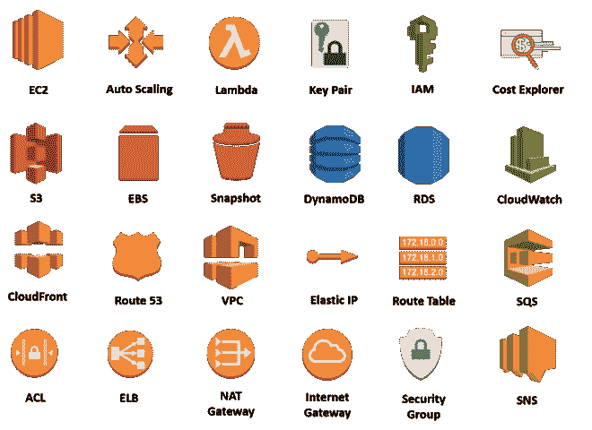
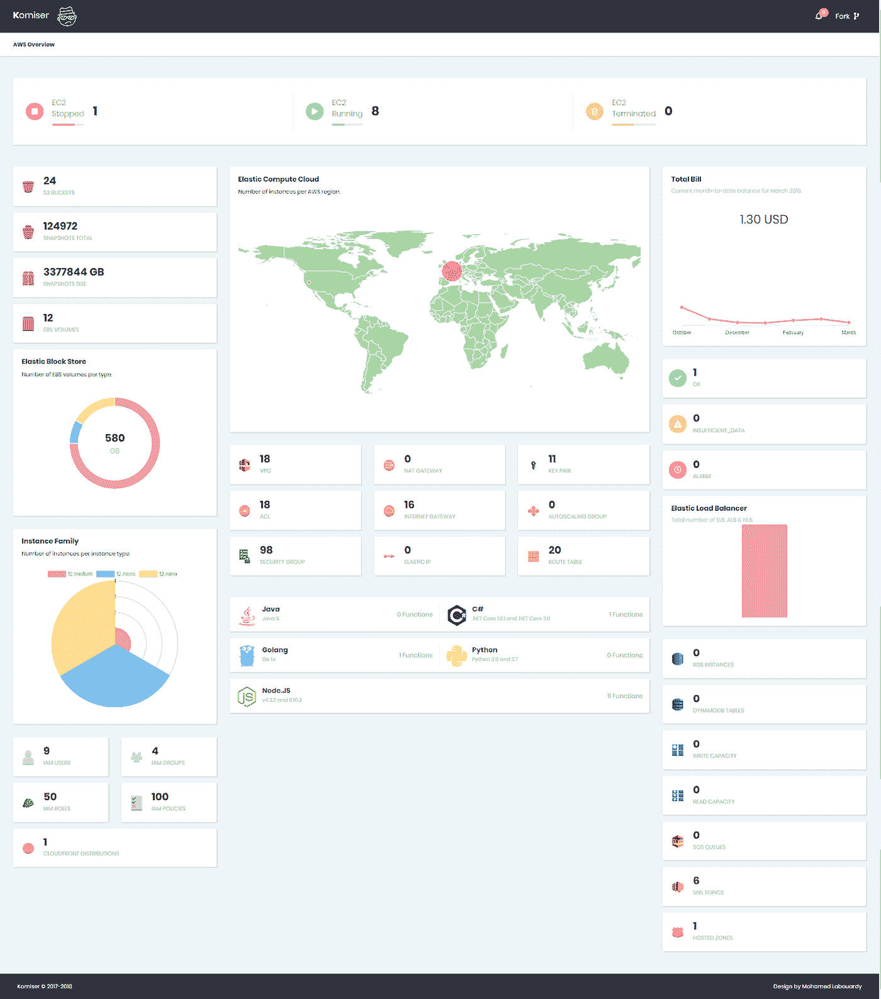

# Komiser: AWS 环境检查员

> 原文：<https://medium.com/hackernoon/komiser-aws-environment-inspector-8340946b6237>

为了在 **AWS** 中构建 **HA** & **弹性**应用，你需要假设一切都会失败。因此，您总是在多个 **AZ** & **区域**中设计和部署您的应用程序。因此，您最终会得到许多未使用的 AWS 资源(快照、ELB、EC2、弹性 IP 等),这可能会让您损失一大笔钱。

AWS 架构良好的框架的支柱之一是**成本优化**。这就是为什么您需要对您的 **AWS 基础设施**有一个全局的概述。幸运的是，AWS 提供了许多完全托管的服务，如 **CloudWatch** 、 **CloudTrail** 、**可信顾问** & **AWS Config** 来帮助您实现这一点。但是，他们需要对 AWS 平台有深入的了解，而且他们不是直截了当的。

这就是为什么我想出了 [Komiser](https://github.com/mlabouardy/komiser) 这款工具，它通过查询 **AWS API** 来获取 AWS 几乎所有关键服务的信息，如 **EC2** 、 **RDS** 、 **ELB** 、 **S3** 、 **Lambda** …在单个**仪表盘**中实时获取。

注意:为了防止请求超过 AWS API 速率限制，默认情况下，响应会在**的**内存缓存**中缓存 30 分钟**。

**Komiser** 支持的 **AWS 服务**:

**计算:**

*   运行/停止/终止 EC2 实例
*   每个区域的当前 EC2 实例
*   每个族类型的 EC2 实例
*   每个运行时环境的 Lambda 函数
*   分离的弹性 IP 地址
*   密钥对的总数
*   自动缩放组的总数

**网络&内容交付:**

*   VPC 总数
*   网络访问控制列表的总数
*   安全组的总数
*   路由表的总数
*   互联网网关总数
*   Nat 网关的总数
*   每个家庭类型的弹性负载平衡器(ELB、ALB、NLB)

**管理工具:**

*   CloudWatch 警报状态
*   计费报告(最长 6 个月)

**数据库:**

*   DynamoDB 表
*   DynamoDB 提供的吞吐量
*   RDS 数据库实例

**消息:**

*   SQS 队列
*   社交网络话题

**储存:**

*   S3 水桶
*   EBS 卷
*   EBS 快照

**安全身份&合规:**

*   IAM 角色
*   IAM 策略
*   IAM 组
*   IAM 用户

**1 —配置凭证**

**Komiser** 需要您的 AWS 证书才能通过 AWS 服务认证。 **CLI** 支持多种支持这些凭证的方法。默认情况下，CLI 将自动从其**默认凭据链**获取凭据。凭据链中的常见项目如下:

**环境凭证:**

*   *AWS_ACCESS_KEY_ID*
*   *AWS_SECRET_ACCESS_KEY*
*   *AWS_DEFAULT_REGION*

**共享凭证文件** ( **~/)。AWS/全权证书**

**EC2 实例角色凭证**

首先，创建一个新的 [IAM 用户](https://console.aws.amazon.com/iam/home?region=us-east-1#)，并为其分配以下 **IAM 策略**:

接下来，生成新的 **AWS 访问密钥** & **秘密密钥**，然后更新 *~/。AWS/凭证*文件如下:

**2 —安装**

**2.1 — CLI**

找到适合您系统的[软件包](https://github.com/mlabouardy/butler)并下载。对于 linux:

> wget[https://S3 . us-east-1 . Amazon AWS . com/komiser/1 . 0 . 0/Linux/komiser](https://s3.us-east-1.amazonaws.com/komiser/1.0.0/linux/komiser)
> 
> chmod +x komiser

注: **Komiser CLI** 经常更新，支持新的 AWS 服务。要查看您是否有最新版本，请查看[项目 Github 资源库](https://github.com/mlabouardy/komiser)。

安装 **Komiser CLI** 后，您可能需要将可执行文件的路径添加到您的 **PATH** 变量中。

**2.2 — Docker 图像**

使用官方 **Komiser Docker 图片**:

> docker run-d-p 3000:3000-e AWS _ ACCESS _ KEY _ ID = "-e AWS _ SECRET _ ACCESS _ KEY = "-e AWS _ DEFAULT _ REGION = " "—名称 komiser mlabouardy/komiser

**3 —概述**

安装完成后，启动 **Komiser 服务器**:

> komiser start —端口 3000 —持续时间 30

如果你把你最喜欢的浏览器指向 [http://localhost:3000](http://localhost:3000/) ，你应该会看到 **Komiser Dashboard** :

希望有帮助！CLI 仍处于早期阶段，因此欢迎您为 Github 上的项目做出贡献。