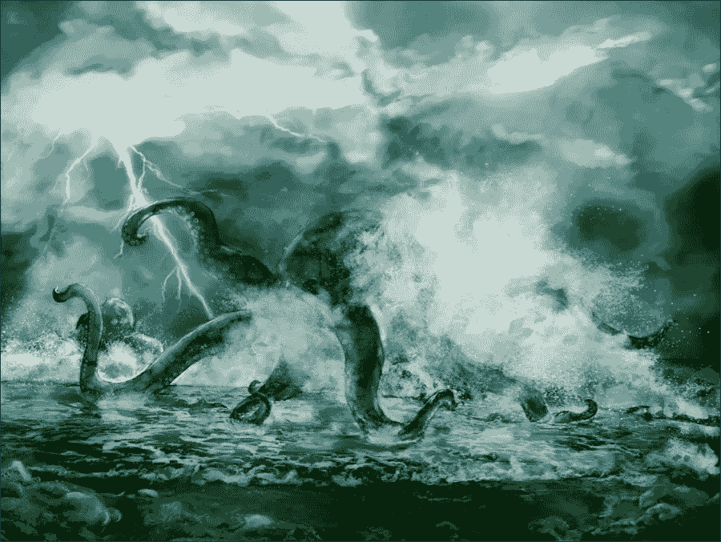
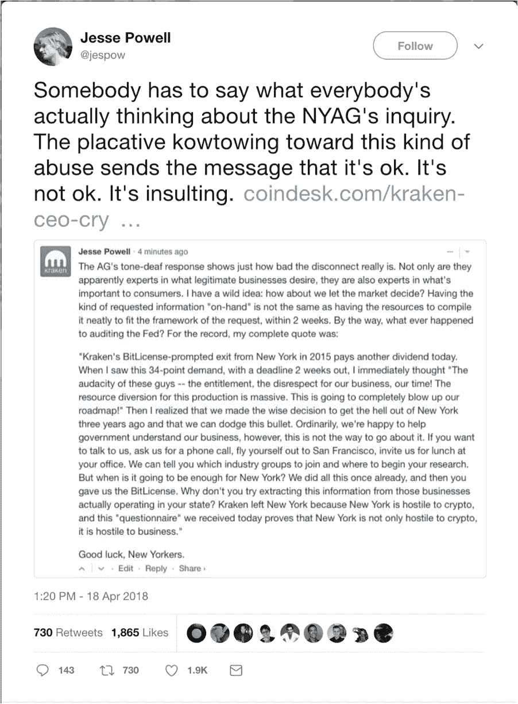
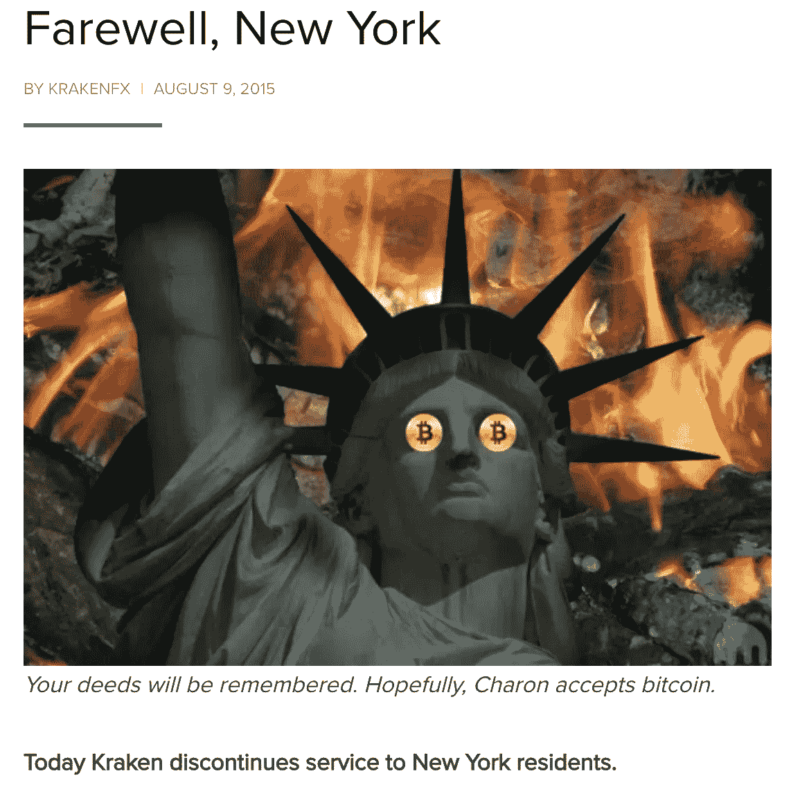

# 北海巨妖被纽约破解

> 原文：<https://medium.com/hackernoon/kraken-cracked-by-new-york-72355c1ffc33>

所谓的“交易所”被监管机构盯上只是时间问题。几个月来，这种情况一直存在。第一证券交易委员会主席 Jay Clayton [警告交易所](https://www.sec.gov/news/public-statement/statement-clayton-2017-12-11)注册或寻求豁免，例如成为经纪交易商和使用替代交易系统。然后有一个[公告](https://www.sec.gov/news/public-statement/enforcement-tm-statement-potentially-unlawful-online-platforms-trading)警告公众，交易加密货币和 ICO 公司发行的独特数字令牌的交易所将被监管或关闭。

上周，纽约总检察长加入了建筑监管的喧嚣，要求交易所通过非正式调查或传票方式提供信息。此次调查针对包括北海巨妖在内的 13 家交易所。

在这 13 家交易所中，北海巨妖是唯一一家做出挑衅性回应的交易所。北海巨妖联合创始人兼首席执行官 Jesse Powell 声称北海巨妖没有纽约客户在他们的平台上交易。用杰西的话来说，“北海巨妖离开纽约是因为纽约对 crypto 怀有敌意，而我们今天收到的这份‘调查问卷’证明纽约不仅对 crypto 怀有敌意，它对商业也怀有敌意。”

Jesse’s response to the NY Attorney General

杰西的回应是挑衅性的，特别是与其他交易所的回应形成对比，所有交易所都欢迎调查，并承诺配合司法部长。相比之下，杰西显然打算无视调查。

奇怪的是，杰西声称该调查是“对[北海巨妖]业务、[北海巨妖]时代的不尊重”，而且该调查是“资源转移”司法部长调查的性质并不那么左领域。难道不是所有合法的企业都应该随时掌握其运营的相关信息吗？那么，回应质询的问题难道不应该只是简单地回答问题吗？是什么让这成为杰西描述的“巨大”事业？

杰西对司法部长调查的看法和调查的实际意义之间存在明显的脱节。

当一家公司受到监管机构(如美国证券交易委员会或纽约州行政长官)的调查时，通常是因为监管机构对该公司在遵守法律方面的行为感到担忧。这种调查通常是执法行动的第一步。

那么，如果北海巨妖不回答这个问题，会发生什么呢？下一步属于国家行政官，他将发出停止和终止通知，要求该公司，在这种情况下，北海巨妖，遵循它。这份通知可能会要求北海巨妖停止在纽约的业务，并向投资者退款。

这个通知也可能伴随着纽约司法部的诉讼。哦好吧。也许还是回答询问比较好。或者，也许北海巨妖意识到这并不重要，因为他们无论如何都会因为没有在美国证券交易委员会或任何一个州注册就经营交易所而被关闭。

A screenshot of one of Kraken’s blog posts

在北海巨妖和杰西的辩护中，北海巨妖有可能不再为纽约居民提供服务，如果是这样的话，谁能指责一家公司因被诬告而生气呢？

根据 2015 年 8 月 9 日发布的一篇博文，北海巨妖在加密货币监管框架 BitLicense 颁布后离开了纽约州。事实上，北海巨妖只是继 BitLicense 之后停止在纽约运营的几家公司之一。其他公司包括 Genisis Mining 和 Bitpay。

在博客中，北海巨妖写道，BitLicense 是“一种如此邪恶、如此残忍的生物，甚至北海巨妖都没有勇气或力量面对它肮脏、巨大、尖尖的牙齿……尽管我们确信纽约执法部门的保护是有价值的，但它的代价超出了为纽约居民服务的市场机会。因此，我们别无选择，只能从国家撤回我们的服务。”

这种语言似乎过度描述了旨在保护投资者的立法，尽管授予 BitLicense 在加密界已被证明是有争议的。

然而，一个挥之不去的问题是:北海巨妖真的从纽约撤军了吗？时间会证明一切。或者说，监管机构的调查会告诉我们答案。不管北海巨妖是否在两年前停止了在纽约的业务，它不能回避北海巨妖在没有适当注册的情况下经营证券交易所的事实。所以它的日子屈指可数了。

北海巨妖和司法部长在这里发生的事情只是让市场遵守法律法规的下一步，其他州的监管机构也很可能加入进来。毕竟，我们国家还有 49 个州，每个州代表一个州。

除了这些监管机构之外，还有负责监管未注册证券交易违规行为的 SEC、负责监管违反《银行保密法》行为的 FINCEN 以及负责监管扣留的外国人收益的 IRS。派对上唯一缺席的是处理美元伪钞的特勤局。幸运的是，这并不适用于这种情况。

那么，面对调查，北海巨妖应该做些什么呢？对北海巨妖来说不幸的是，这似乎是一个注定要失败的事业，因为如果北海巨妖想在 SEC 注册成为交易所，他们需要经历一个可能需要数年才能获得批准的过程。与此同时，他们不能允许证券在北海巨妖交易，这实际上关闭了他们的业务。

或者，他们可以申请成为 ATS 的经纪交易商，这可能需要 6 个月或更长时间。然而，这是假设没有坏人参与其中，也没有指控北海巨妖证券欺诈的法庭案件。我相信纽约司法部长会亲自处理的。我预计纽约州行政长官将很快提交一份停止令，声称北海巨妖证券欺诈，这将结束其成为经纪交易商的机会。

这是这些所谓“交换”结束的开始。没有适当的许可证进行证券交易就是欺诈，这是显而易见的。投资者是赚钱还是赔钱并不重要。

*继 4 月份 1，000 多名与会者* [*和 2，000 多名直播观众的 ICO 2.0 峰会*](https://www.startengine.com/pages/summit) *售罄后，StartEngine 的 ICO 2.0 峰会将于 10 月 19 日在圣莫尼卡举行。第三版将会非常庞大。不要错过了，现在就* [*报名*](https://www.eventbrite.com/e/startengine-ico-20-fall-summit-tickets-45326289151) *。*

*如果你喜欢我的文章，请鼓掌 50 次，并关注我以获得更多…*