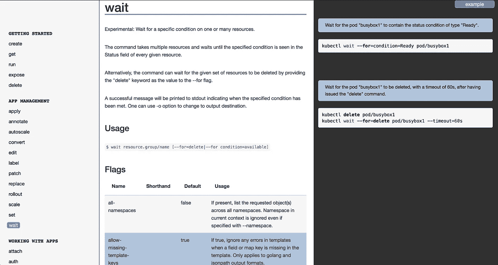

# 日积月累:像老板一样等待

> 原文：<https://medium.com/hackernoon/kubectl-tip-of-the-day-wait-like-a-boss-40a818c423ac>



The [kubectl wait](https://kubernetes.io/docs/reference/generated/kubectl/kubectl-commands#wait) command.

你如何等待`kubectl`的事情发生？我曾经在一个 shell [脚本](https://hackernoon.com/tagged/script)中使用一个`while true` [循环](https://hackernoon.com/tagged/loop)并用一个复杂的`kubectl get`命令进行检查，直到我看到某个条件，比如`condition=Ready`被满足。不再有了！:)

在这里，您将看到 [kubectl wait](https://kubernetes.io/docs/reference/generated/kubectl/kubectl-commands#wait) 命令并了解它的运行情况。

首先，让我们创建一个名为`worker`的作业，它本身做一些完全无用的事情(打印单词`blah`到`stdout`，暂停 3 秒钟十次):

```
$ kubectl version --short
Client Version: v1.12.0
Server Version: v1.11.0$ kubectl create ns waitplayground$ kubectl -n waitplayground \
             create job worker \ 
             --image centos:7 -- \
             sh -c \
             'for i in {1..10} ; do echo blah ; sleep 3; done'
```

您可以通过以下方式关注资源:

```
$ kubectl -n waitplayground get job,po
```

但是如果你想在`worker`完成后开始另一份工作呢？给你:

```
$ kubectl -n waitplayground \
             wait --for=condition=complete --timeout=32s \     
             job/worker
job.batch/worker condition met
```

请注意，上面我设置的超时(32 秒)比我期望的`worker`作业所花费的时间(大约。10 * 3 秒)。一旦`kubectl wait`命令返回，您只需要检查它的输出，然后您可以基于此做出决定，例如，启动一个相关作业或重试原来的作业。

就这样了，周末快乐，继续 kubecuddling)