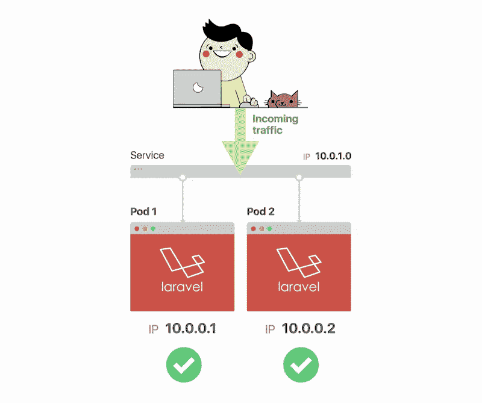
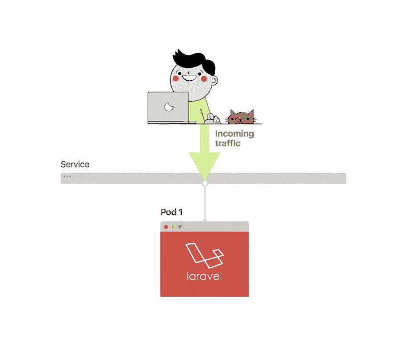
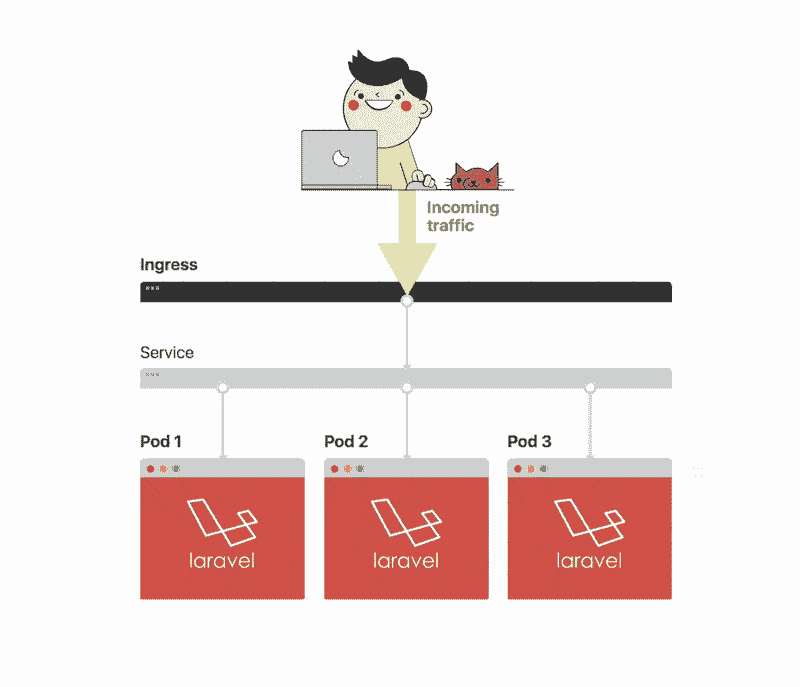

# Kubernetes:以最简单的方式部署 Laravel

> 原文：<https://medium.com/hackernoon/kubernetes-deploy-laravel-the-easy-way-a3508d8130c0>


Laravel 是一个优秀的用于开发 PHP 应用程序的[框架](https://hackernoon.com/tagged/framework)。无论你需要一个新想法的原型，开发一个 MVP(最小可行产品)还是发布一个成熟的企业系统，Laravel 都可以帮助你完成所有的开发任务和工作流程。

如何处理应用程序的部署是一个不同的故事。在设置类似于远程服务器的本地环境方面，vagger 做得非常好。然而，在生产中，您很可能需要不止一个 web 主机和一个数据库。您可能会为几个需求提供单独的服务。您还需要有适当的机制来确保应用程序始终在线，并且服务器可以有效地平衡负载。

在本文中，我将解释如何处理作为本地 Kubernetes 设置运行 Laravel 应用程序的简单需求。

# Kubernetes，为什么和什么？

Kubernetes 是一个开源系统，最初由 Google 设计，用于在集群环境中促进容器化应用程序的管理。有些人将其称为编排平台，Kubernetes 并不是这种类型的唯一可用平台。虽然，它确实有很高很快的采用率。更不用说，一旦你习惯了，它是很容易实现的。

如果你仍然想知道为什么有人可以从使用 Kubernetes 中受益，答案很简单。Kubernetes 使得跨多个项目设置和管理任意多的集群变得更加容易。

# 将 Laravel 应用程序部署到 Minikube

正如我前面提到的，我将向您展示如何将一个简单的无状态 Laravel 应用程序部署到 Kubernetes。我的目标是详细说明实现这一目标所涉及的步骤，同时解释为什么需要具体的行动。此外，我将向您展示如何快速扩展应用程序，并使用入口控制器使其在指定的主机上可用。

你可以在几个云主机提供商上运行 Kubernetes，比如 Google Cloud Engine 和 Amazon Web Services。在本教程中，您将在 Minikube 上运行该应用程序，Minikube 是一个使本地运行 Kubernetes 变得容易的工具。

与 vagger 类似，Minikube 仅仅是一个包含 Kubernetes 平台和 Docker 的虚拟机。您既需要将应用程序部署为 Docker 容器，也需要使用 Kubernetes 将它扩展到三个实例。

**申请**

我准备了一个简单的 Laravel 应用程序，你可以从 [GitHub](https://github.com/learnk8s/laravel-kubernetes-demo) 中克隆它。这只不过是一个新的 Laravel 装置。因此，您可以使用演示应用程序或创建一个新的 Laravel 应用程序来遵循这个示例。要使用演示应用程序，请将其克隆到您的项目目录中。

```
cd /to/your/working/directory git clone git@github.com:learnk8s/laravel-kubernetes-demo.git .
```

**先决条件**

要进行本演示，您需要在本地系统上安装以下软件:

1) [Docker](https://docs.docker.com/install/)

2) [库贝克特尔](https://kubernetes.io/docs/tasks/tools/install-kubectl/)

3) [Minikube](https://github.com/kubernetes/minikube/releases)

> *在 Windows 上安装和运行这些应用程序是否有问题？查看文章*[*Windows 10*](https://learnk8s.io/blog/installing-docker-and-kubernetes-on-windows)*上的 Docker 和 Kubernetes 入门，获得逐步指南。*

**Docker 图像**

Kubernetes 部署容器化的应用程序，因此作为第一步，您需要构建演示应用程序的 Docker 映像。由于本教程将在 Minikube 上本地运行，您可以从示例代码中包含的`Dockerfile`构建一个本地 Docker 映像。

```
FROM composer:1.6.5 as build 
WORKDIR /app 
COPY . /app 
RUN composer installFROM php:7.1.8-apache 
EXPOSE 80 
COPY --from=build /app /app 
COPY vhost.conf /etc/apache2/sites-available/000-default.conf 
RUN chown -R www-data:www-data /app \ 
  && a2enmod rewrite
```

此`Dockerfile`由两部分组成:

*   第一部分扩展了一个 PHP `composer`映像，这样您就可以安装应用程序的依赖项。
*   第二部分用 Apache web 服务器创建一个最终的 Docker 映像来为应用程序提供服务。

在测试 Docker 映像之前，您需要构建它:

```
cd /to/your/project/directory 
docker build -t yourname/laravel-kubernetes-demo .
```

然后使用以下命令运行应用程序:

```
docker run -ti \ 
  -p 8080:80 \ 
  -e APP_KEY=base64:cUPmwHx4LXa4Z25HhzFiWCf7TlQmSqnt98pnuiHmzgY= \     
  laravel-kubernetes-demo
```

并且应用应该在`[http://localhost:8080](http://localhost:8080.)` [可用。](http://localhost:8080.)

通过这种设置，容器是通用的，并且`APP_KEY`不是硬编码或共享的。

**在 Minikube 内构建图像**

```
cd /to/your/project/directory 
eval $(minikube docker-env) 
docker build -t yourname/laravel-kubernetes-demo .
```

> 不要忘记执行评估。在虚拟机中构建映像是必要的。您应该在当前终端中只运行一次该命令。

**部署镜像**

既然应用程序的映像已经构建好并在 Minikube 中可用，您就可以继续部署它了。

我总是首先确保`kubectl`在正确的上下文中。在这种情况下，上下文是 Minikube。您可以快速切换上下文，如下所示:

```
kubectl config use-context minikube
```

然后，您可以部署容器映像:

```
kubectl run laravel-kubernetes-demo \ 
  --image=yourname/laravel-kubernetes-demo \ 
  --port=80 \ 
  --image-pull-policy=IfNotPresent \ 
  --env=APP_KEY=base64:cUPmwHx4LXa4Z25HhzFiWCf7TlQmSqnt98pnuiHmzgY=
```

上面的命令告诉`kubectl`从 Docker 映像运行我们的演示应用程序。该命令的第一个参数只是要求`kubectl`不要从注册中心(比如 Docker Hub)获取图像，如果它存在于本地的话，在本例中它确实存在。请注意，您仍然需要登录 Docker，以便`kubectl`可以检查图像是否是最新的。

您可以通过运行以下命令来检查是否为应用程序创建了 Pod:

```
kubectl get pods
```

这将返回类似于以下内容的输出:

```
NAME                                     READY STATUS RESTARTS AGE 
laravel-kubernetes-demo-7dbb9d6b48-q54wp 1/1   Running 0       18m
```

您还可以使用 Minikube GUI 仪表板来监控集群。GUI 也有助于可视化大多数讨论的概念。要查看仪表板，只需运行以下命令:

```
minikube dashboard
```

或者获取仪表板的 URL 地址:

```
minikube dashboard --url=true
```

**曝光一项服务**

到目前为止，您已经创建了一个运行应用程序容器的部署。在集群中运行的 Pod 有一个动态 IP。如果您使用 IP 将流量直接路由到它，您可能仍然需要在每次重新启动 Pod 时更新路由表。事实上，在每次部署或容器重启时，都会为 Pod 分配一个新的 IP。为了避免手动管理 IP 地址，您需要使用一个服务。该服务充当一组 pod 的负载平衡器。因此，即使一个 Pod 的 IP 地址发生变化，服务也总是指向它。由于服务总是有相同的 IP，你不需要手动更新任何东西。



您可以通过以下方式创建服务:

```
kubectl expose deployment laravel-kubernetes-demo --type=NodePort --port=80
```

如果一切顺利，您将看到类似于以下内容的确认:

```
service "laravel-kubernetes-demo" exposed
```

运行以下命令:

```
kubectl get services
```

将向您显示正在运行的服务列表。您还可以在仪表板中的“服务”导航菜单下查看正在运行的服务。验证这种部署和服务公开的更令人兴奋的方法显然是在浏览器中查看正在运行的应用程序😊

要获取应用程序(服务)的 URL，可以使用以下命令:

```
minikube service --url=true laravel-kubernetes-demo
```

它将输出类似于以下内容的 IP 地址和端口号:

```
[http://192.168.99.101:31399](http://192.168.99.101:31399)
```

或者，直接在浏览器中启动应用程序:

```
minikube service laravel-kubernetes-demo
```

***不要错过下一个故事，实验或者提示。如果你喜欢这篇文章，请继续关注。将新内容直接发送到您的收件箱，并提高您在 Kubernetes 中的专业水平。* [*现在就订阅*](https://learnk8s.io/newsletter)**

**缩放**

就是这样。您已经成功地在 Kubernetes 中部署了应用程序。很刺激。但是做这些有什么意义呢？嗯，您只有一个部署，其中有一个 Pod 正在运行，被提供给一个具有公开的 web 服务的节点。让我们将这个部署扩展到应用程序的另外两个实例。



为了让您了解自己此时所处的位置，请运行以下命令来获取所需的和可用的 pod 列表:

```
kubectl get deploymentNAME                    DESIRED CURRENT UP-TO-DATE AVAILABLE AGE 
laravel-kubernetes-demo 1       1       1          1         57m
```

每个的输出将是“1”。您希望有三个可用的单元，因此让我们扩展一下:

```
kubectl scale --replicas=3 deployment/laravel-kubernetes-demo 
deployment "laravel-kubernetes-demo" scaled
```

完成了。您已经将第一个单元复制到了另外两个单元，这样就有三个单元运行这个服务。运行`get deployment`命令将验证这一点。

```
kubectl get deploymentNAME                    DESIRED CURRENT UP-TO-DATE AVAILABLE AGE 
laravel-kubernetes-demo 3       3       3          3         59m
```

您也可以在面板中的“窗格”下或在“服务详细信息”屏幕中看到这一点。

现在，您使用三个 pod 运行应用程序的三个实例。

想象一下您的应用程序变得更加流行。成千上万的访问者正在使用你的网站或软件。过去，您可能一直忙于编写更多的脚本来创建应用程序的更多实例。在 Kubernetes 中，您可以快速扩展到多个实例:

```
kubectl scale --replicas=10 deployment/laravel-kubernetes-demo 
deployment "laravel-kubernetes-demo" scaled
```

你可以看到使用 Kubernetes 来扩展你的网站是多么方便。

**入口**

您已经取得了巨大的成就，部署了应用程序并扩展了部署。当指向群集的(Minikube) IP 地址和节点的端口号时，您已经在浏览器中看到了正在运行的应用程序。现在，您将看到如何通过分配的 URL 访问应用程序，就像部署到云时一样。

要在 Kubernetes 中使用 URL，您需要一个入口。入口是一组允许入站连接到达 Kubernetes 集群的规则。入口是必要的，因为在 Kubernetes 中，像 Pods 这样的资源只有 IP 地址，这些 IP 地址可以由集群路由，也可以在集群内路由。这意味着它们对于外部世界是不可访问或不可到达的。



我已经在这个演示应用程序的源代码中包含了一个`ingress.yaml`文件，其内容如下:

```
apiVersion: extensions/v1beta1 
kind: Ingress 
metadata: 
  name: laravel-kubernetes-demo-ingress 
  annotations: ingress.kubernetes.io/rewrite-target: / 
spec: 
  backend: 
    serviceName: default-http-server 
    servicePort: 80 
  rules: 
  - host: laravel-kubernetes.demo 
  - http: 
      paths: 
      - path: / 
        backend: 
          serviceName: laravel-kubernetes-demo 
          servicePort: 80
```

在 Kubernetes 资源文件的基本内容中，这个文件定义了路由入站流量时要遵循的一组规则。`laravel-kubernetes.demo` URL 将指向应用程序正在运行的服务，如之前在端口 8181 上标记的`laravel-kubernetes-demo`。

没有入口控制器，入口资源就没有用，因此您需要创建一个新的控制器或使用现有的控制器。本教程使用 Nginx 入口控制器来路由流量。Minikube (v0.14 及以上版本)附带 Nginx 安装程序，您需要手动启用它:

```
minikube addons enable ingress
```

> *请注意，Minikube 下载并安装 Nginx 作为入口可能需要几分钟时间。*

一旦您启用了 Ingress 插件，您可以通过以下方式创建 Ingress:

```
kubectl create -f path-to-your-ingress-file.yaml
```

您可以通过运行以下命令来验证并获取入口信息:

```
kubectl describe ing laravel-kubernetes-demo-ingress
```

其输出类似于:

```
Name: laravel-kubernetes-demo-ingress 
Namespace: default 
Address: 192.168.99.101 
Default backend: default-http-server:80 (<none>) 
Rules: 
  Host Path Backends 
  ---- ---- -------- 
  * 
       / laravel-kubernetes-demo:8181 (172.17.0.6:8181) 
Annotations: 
  rewrite-target: / 
Events: 
Type   Reason Age  From                     Message 
----   ------ ---- ----                     ------- 
Normal CREATE 39s  nginx-ingress-controller Ingress default/laravel-kubernetes-demo-ingressNormal UPDATE 20s  nginx-ingress-controller Ingress default/laravel-kubernetes-demo-ingress
```

现在，您可以通过如上所示的 minikube IP 地址访问应用程序。要通过 URL[https://laravel-kubernetes . demo，](https://laravel-kubernetes.demo,)访问应用程序，您需要在 hosts 文件中添加一个条目。

# 这仅仅是开始

希望这篇文章能帮助你熟悉 Kubernetes。从我自己的经验来看，一旦一个人执行了几次或更多次类似的部署，事情就会变得习以为常，变得更有意义。但是我们的 Kubernetes 之旅才刚刚开始。在以后的文章中，我们将介绍更多使用存储卷来持久化状态的真实应用程序，我们还将了解如何部署到云提供商，如 Google 的云平台。在此之前，请查看这些[课程](https://learnk8s.io/training)以提高速度，甚至有可能成为认证 Kubernetes 管理员(CKA)。

# 成为 Kubernetes 中部署和扩展应用程序的专家

本文是 learnk8s 研讨会“在 Kubernetes 中部署和扩展应用程序”的一部分。

在本课程的剩余部分，您将学习如何:

*   轻松处理最繁忙的流量网站
*   将您的作业扩展到数千台服务器，并将等待时间从几天缩短到几分钟
*   了解您的应用在多云设置下高度可用，让您高枕无忧
*   通过仅使用您需要的资源，在您的云账单上节省大量现金
*   增强您的交付渠道，全天候部署应用程序

附:不要错过下一个实验，洞察力，或*折扣* : [订阅邮件列表！](https://learnk8s.io/newsletter)

*文章原载于*[*learn k8s*](https://learnk8s.io/blog/kubernetes-deploy-laravel-the-easy-way)*。io*