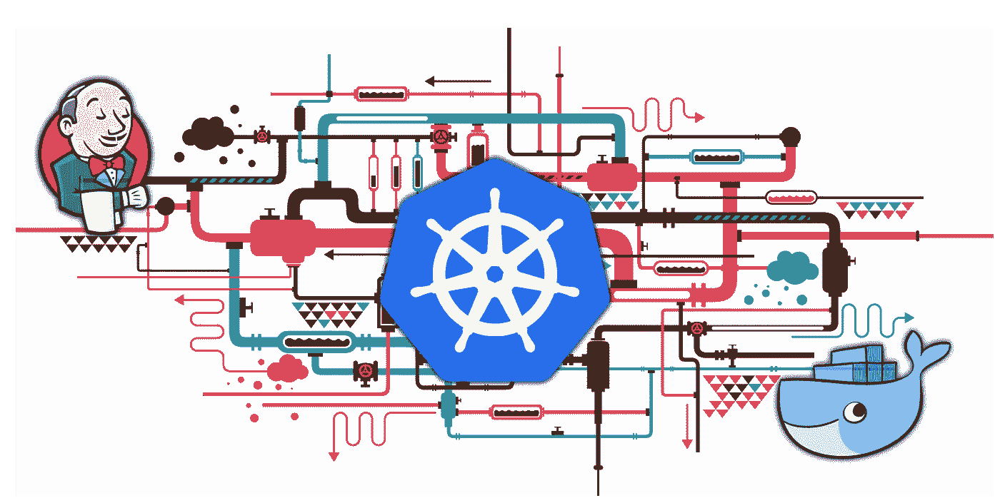
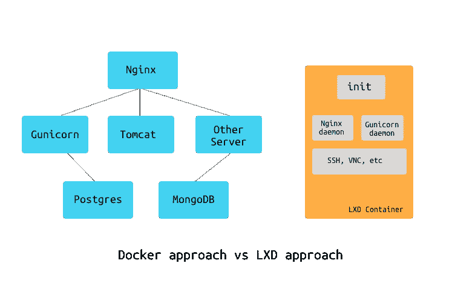
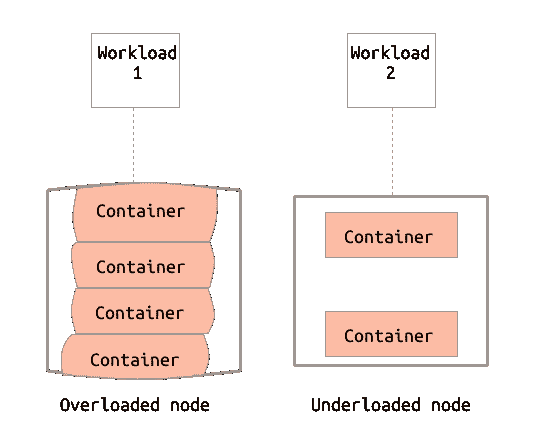
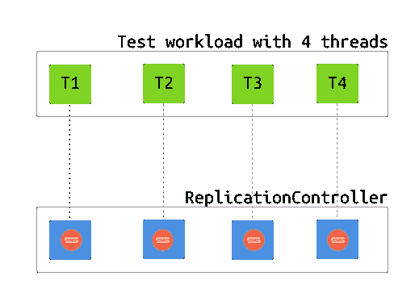
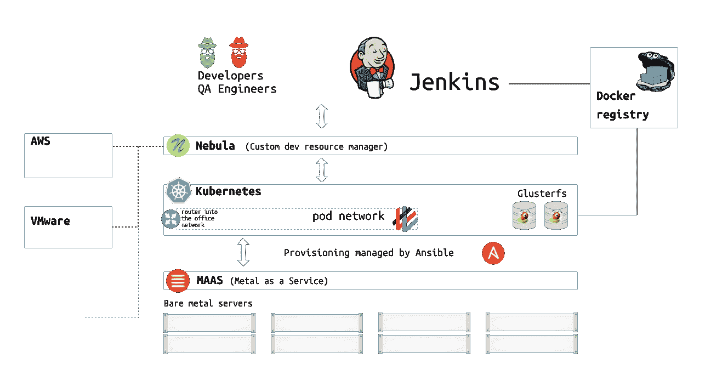

# Kubernetes 开发基础设施

> 原文：<https://medium.com/hackernoon/kubernetes-for-dev-infrastructure-40b9175cb8c0>

Kubernetes 是目前最热门的开源项目之一。这是一个生产级容器编排系统，灵感来自谷歌自己的 [Borg](http://blog.kubernetes.io/2015/04/borg-predecessor-to-kubernetes.html) ，于 2014 年发布。从那时起，成千上万的开发人员加入了这个项目，现在它正在成为运行容器化应用程序的行业标准。Kubernetes 旨在大规模运行生产工作负载，但它的能力远不止于此。在这篇文章中，我将讲述我在 [ThoughtSpot](https://thoughtspot.com) 工作时建立 Kubernetes 集群作为开发基础设施的核心组件的经历。

## 语境

[ThoughtSpot](https://thoughtspot.com) 正在为大型企业开发一个复杂的 **BI** 系统，该系统运行在另一个受 Borg 启发的编排系统 Orion 之上。它是内部设计的，当时 Docker 和 Kubernetes 都没有公开发布。

与本文相关的一些关于 ThoughtSpot 的知识是:

*   该系统由几十个服务组成，运行它们的开销相当大。数据非常少的空闲系统需要**20–30Gb**的 RAM、 **4 个 CPU** 内核和**2–3 分钟**的启动时间。
*   ThoughtSpot 出售自己的设备，通常每个集群至少有 **1TB** RAM，因此 20-30Gb 的开销对该产品来说不成问题。然而，对于开发基础设施来说，这是一个相当大的问题。
*   办公室里有很多退役的硬件可供开发人员使用。

## 动机

我最初被分配去解决一个听起来简单的问题:让集成测试更快。有数百个基于 Selenium 的工作流，它们按顺序运行，需要 10 个小时才能完成。显而易见的解决方案是将它们并行化。问题是它们没有被设计成并发运行，因此我们必须要么重构所有测试，要么为每个线程提供一个 ThoughtSpot 系统的独立副本(*a*test back end)。重新设计测试可能看起来像一个更干净的解决方案，但这需要整个工程团队付出巨大的努力，并且需要对产品进行大量与测试相关的更改，因此这是不可行的。我们已经决定采用第二种方法，这就把任务留给了我，我最终在 Docker 和 Kubernetes 的帮助下解决了这个问题:*使快速(在 2-3 分钟内)用预加载的测试数据旋转几十个测试后端成为可能，运行测试，拆除它们，重复。*

## 小路

带着这个任务，我开始寻找选择。实际上，一些基础架构已经就位:我们有一个运行在四台服务器上的 VMware 集群。当前的集成测试已经使用它来提供测试后端，但是存在一些问题:

*   它只能维持大约一百个虚拟机，之后我们将不得不购买更多昂贵的专有硬件。该公司的其他工作流已经利用了大约 80%的资源。
*   并行克隆 10 个或更多虚拟机会导致 IO 崩溃。它必须移动~ **500Gb** 的磁盘快照，而且要花很长时间。
*   虚拟机的启动时间远远超过 2-3 分钟。

虚拟化对我们来说不是一个可行的选择，所以我们转向容器。在 2016 年初，我们正在寻找两个主要选项:[**【LXC】/LXD**](https://linuxcontainers.org/lxd/)和 [**Docker**](https://www.docker.com/) 。Docker 已经是公认的领导者，LXD 2.0 只会和 Ubuntu 16.04 一起发布。然而，Docker 对小的单进程容器有强烈的偏见，这些容器必须通过网络相互对话，并以这种方式形成一个完整的系统。另一方面，LXD 提供了一些东西，看起来更像熟悉的虚拟机，具有 **init** 系统和在单个容器中运行多个服务的能力。有了 Docker，我们不得不以“LXD 方式”在整洁和使用上妥协，或者重新调整整个系统，使其在 Docker 上运行，这是不可行的。另一方面，对于 LXD，我们不能依赖 Docker 所拥有的详尽的社区知识和文档。尽管如此，我们还是决定试一试。

## LXC/LXD

我拿了四台机器，每台都有 **256Gb** RAM、 **40 个 CPU** 内核、2 个固态硬盘和 4 个硬盘，安装了 LXD，并在每个节点上配置了一个 ZFS 池。然后，我设置了一个 Jenkins 作业，该作业将构建项目，将其安装在其中一台机器上的 LXD 容器中，导出一个映像并将其推送到其他三个节点。每个集成测试工作将只做`lxd clone current-master-snapshot <backend-$i>`，运行测试并在完成后销毁容器。由于 ZFS 的[写时拷贝](https://en.wikipedia.org/wiki/Copy-on-write)特性，克隆操作现在是瞬时的。每个节点能够处理大约十个测试后端，直到事情开始崩溃。这是一个很好的结果，比 VMware 给我们的好得多，但有一个主要缺点:它不灵活，也不可扩展。每个测试作业都需要准确地知道在哪个 LXD 节点上创建后端，如果需要超过 10 个后端，它们就不合适。换句话说，没有编排系统，它是不可伸缩的。对于 LXD，当时我们只有两个选择:使用 OpenStack 或编写自己的调度程序(这是我们不想写的)。

OpenStack 支持 LXD 作为计算后端，但在 2016 年，这一切都很新鲜，几乎没有记录，几乎没有工作。我花了大约一周的时间尝试配置 OpenStack 集群，然后放弃了。幸运的是，我们还有另一条未探索的道路: *Docker 和 Kubernetes* 。

## 多克-库伯内特公司

在第一次浏览文档之后，很明显 Docker 和 Kubernetes 哲学都不适合我们的用例。Docker 明确表示“[容器不是虚拟机](https://blog.docker.com/2016/03/containers-are-not-vms/)”，Kubernetes 是为运行一个(或几个)应用程序而设计的，由许多小型容器服务组成，而不是许多庞大的单容器应用程序。另一方面，我们认为 Kubernetes 背后的运动是强大的。这是一个顶级的开源产品，有一个活跃的社区，它可以(应该)最终取代我们自己开发的产品中的编排系统。因此，我们在使 Kubernetes 适应开发基础设施需求时获得的所有知识，我们可以在以后将主要产品迁移到 Kubernetes 时重用。考虑到这一点，我们开始建设新的基础设施。

我们无法在产品中摆脱对 Systemd 的依赖，所以我们最终将所有东西打包到一个基于 CentOS 7 的容器中，并将 Systemd 作为顶层流程。这是为我们工作的基本映像 [Dockerfile](https://gist.github.com/bsod90/3796481608d79ceb332f1260806f439b) 。我们制作了一个非常重的 Docker 映像(最初是 **20Gb** ，经过一些优化后是 **5** ，它封装了 Orion (ThoughtSpots 自己的容器引擎)，然后它在 cgroup 容器中运行 20 多个 ThoughtSpot 服务，这大致对应于单个节点生产设置。这很麻烦，但却是从一无所有到有用的最快方法。

之后，我使用了一些其他的物理机器，并在它们上面创建了我们的第一个 Kubernetes 集群。在所有的 Kubernetes 抽象中，只有 [*Pod*](https://kubernetes.io/docs/concepts/workloads/pods/pod/) 与我们的问题相关，因为它实际上只是一个在某处运行的容器。对于我们的大多数测试用例，我们需要创建多个 *Pods* ，并且能够根据工作负载对它们进行分组会很有帮助。也许 [*标签*](https://kubernetes.io/docs/concepts/overview/working-with-objects/labels/) 更适合这个目的，但是我们决定开发一个*复制控制器*。 [*复制控制器*](https://kubernetes.io/docs/concepts/workloads/controllers/replicationcontroller/) 是一个抽象，它将创建许多*pod*(根据一个*复制因子*)，确保它们始终处于活动状态，另一端，接收来自 [*服务*](https://kubernetes.io/docs/concepts/services-networking/service/) 的流量，并在*pod*之间重新分配流量。*复制控制器*假设每个 *Pod* 都是平等无状态的，这样每个新的*服务*连接都可以被路由到一个随机的 *Pod* 。在我们的例子中，我们没有创建*服务*，只是使用*复制控制器*作为分组*容器*的一种方式，并确保它们在任何东西死亡时自动重新创建。然后，每个测试作业都会为自己创建一个*复制控制器*，并直接使用底层的*pod*。

## 豆荚网络黑客

我们依靠*pod*在 API 方面表现得像真正的虚拟机。特别是，我们需要对每个 *Pod* 的 SSH 访问，以及与动态分配的端口对话的能力。此外，每个 *Pod* 显然都是有状态的，因为图像封装了存储在其中的状态。这实际上意味着，我们不得不直接进入 [*pod-network*](https://kubernetes.io/docs/concepts/cluster-administration/networking/) ，而不是通过 [*kube-proxy*](https://kubernetes.io/docs/reference/generated/kube-proxy/) 使用*服务*和负载平衡。我们已经通过在 Kubernetes 主节点上启用 [*ip 转发*](https://unix.stackexchange.com/questions/14056/what-is-kernel-ip-forwarding) (将它变成一个路由器)并重新配置所有办公室路由器来路由`172.18.128.0/16` (我们的 *pod 网络*)通过 Kubernetes 主节点。这是一个**可怕的**黑客行为，永远不应该在生产环境中进行，但它允许我们快速启动开发基础设施，解决眼前的问题，并开始寻找如何在未来使我们的产品 Kubernetes 就绪的方法。

快进近两年，以下是 ThoughtSpot 的开发基础设施的现状:

*   Kubernetes 集群运行在 20 台物理机器上，总共提供**7tb**RAM 和**928**CPU 内核。
*   每个主机节点都运行 CentOS 7 和 4.4-lt Linux 内核。
*   我们用 [*编织*](https://github.com/weaveworks/weave) 作为覆盖网，路由 hack 还在。
*   我们运行一个内部 Docker 注册中心，每次主或发布分支构建成功时，CI pipeline 都会将一个产品映像上传到该注册中心。
*   我们使用 [Jenkins Kubernetes](https://plugins.jenkins.io/kubernetes) 插件在 Kubernetes 上动态提供 Jenkins 奴隶。
*   我们最近在几个节点上部署了 [Glusterfs](https://www.gluster.org/) ，并开始尝试持久性有状态服务。[这个](https://blog.lwolf.org/post/how-i-deployed-glusterfs-cluster-to-kubernetes/)和[这个](https://github.com/heketi/heketi/blob/master/doc/admin/install-kubernetes.md)是基本教程。

## 马斯河

在这个项目中，我们发现了另一个伟大的开源工具，它在管理物理硬件方面帮了我们很多。它叫做 [MAAS](https://maas.io) ，翻译过来就是“*金属即服务*”
这是一个工具，它利用 [PXE 引导](https://en.wikipedia.org/wiki/Preboot_Execution_Environment)和[远程节点控制](https://en.wikipedia.org/wiki/Intelligent_Platform_Management_Interface)，允许使用任意操作系统映像进行动态节点重新映像。在用户端，它提供了一个 REST API 和一个漂亮的 UI，这样您就可以以 AWS 的方式配置物理机器，而无需实际接触硬件。最初设置它需要一些努力，但在它存在之后，整个物理基础架构变得几乎像云一样灵活。
目前，我们通过 MAAS 配置普通 CentOS 7 节点，然后运行一个 [Ansible](https://www.ansible.com/) 脚本，该脚本升级内核，安装所有附加软件，并将节点添加到 Kubernetes 集群。([链接到要点](https://gist.github.com/bsod90/b5dda35413a4d4f1d2eaf72fd3b7b46d))

## 星云

大多数开发人员或 CI 职位不直接与 MAAS 或 Kubernetes 交互。在此之上，我们还有另一个自定义层，它将所有可用的资源聚合在一起，并提供一个 API 和 UI 来分配它们。它被称为 Nebula，它可以在 Kubernetes 以及旧的 VMware 基础架构、AWS 或物理硬件(通过 MAAS)上创建和销毁测试后端。它还实现了 *lease* 的概念:在一定时间内，将提供的每个资源分配给一个人或一个 CI 作业。租约到期时，资源会被自动回收或清理。

## LXCFS

默认情况下，Docker 从主机挂载`/proc/`文件系统，因此`/proc/stat` (meminfo、cpuinfo 等)不反映特定于容器的信息。特别是，它们不反映在 cgroup 上设置的任何资源配额。我们的产品和 CI 管道中的一些流程检查可用的总 RAM，并相应地分配它自己的内存。如果进程不检查 cgroup 的限制，它很容易分配超过容器配额所允许的内存，然后被 OOM 杀手杀死。特别是，这发生在很多 JS 丑化器上，我们把它作为产品构建的一部分运行。这个问题在这里[描述和讨论，解决的方法之一就是使用](https://github.com/moby/moby/issues/20688) [LXCFS](https://github.com/lxc/lxcfs) 。

> LXCFS 是一个小型的 FUSE 文件系统，其目的是让 Linux 容器看起来更像一个虚拟机。它最初是 LXC 的一个附带项目，但是可以在任何运行时使用。
> 
> LXCFS 将注意 procfs 中关键文件提供的信息，例如:
> 
> `/proc/cpuinfo
> /proc/diskstats
> /proc/meminfo
> /proc/stat
> /proc/swaps
> /proc/uptime`
> 是容器感知的，因此显示的值(例如在/proc/uptime 中)真正反映了容器运行的时间，而不是主机运行的时间。

## 结论

我们花了相当多的时间才弄清楚所有的事情。当我们刚开始使用 Kubernetes 1.4 时，文档和社区知识非常缺乏。我们从网上搜集信息，通过调试来学习。我们还对我们的产品做了几十处改动，重新设计了 CI 渠道，并尝试了许多本文中没有提到的其他东西。然而，最终一切都很顺利，Kubernetes 成为了 ThoughtSpot 中开发基础设施的基石，提供了急需的灵活性，并允许利用办公室中现有的所有硬件。我在 9 月份离开了公司，但是这个项目被移交给了其他开发人员，并且一直在发展。我知道许多人正试图为他们的公司建立类似的东西，所以我很乐意回答下面评论中的任何问题。

## 链接

[调试 Docker 容器缓慢的故事](https://hackernoon.com/another-reason-why-your-docker-containers-may-be-slow-d37207dec27f)

[我的工程之旅](https://hackernoon.com/my-engineering-journey-to-date-8250d69fd079)

[你的懈怠知识库](https://onebar.io)