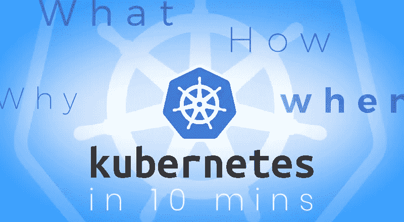
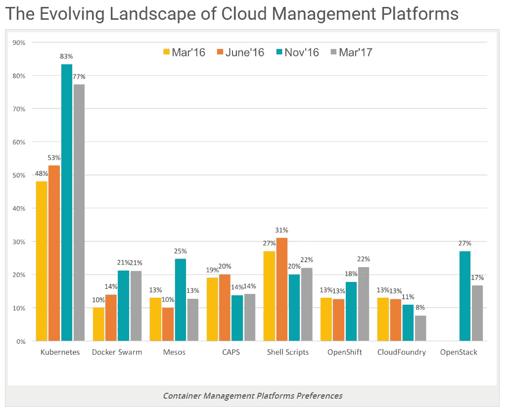
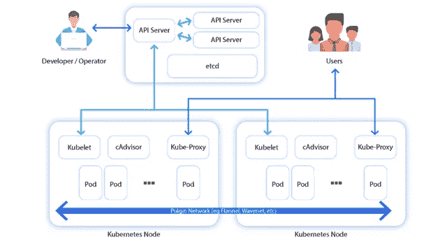
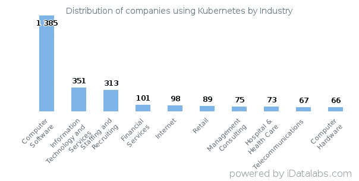

# 10 分钟内的 Kubernetes:寻找的完整指南

> 原文：<https://medium.com/hackernoon/kubernetes-in-10-minutes-a-complete-guide-to-look-for-ad0be0f8a9b8>

# Kubernetes:什么，为什么，如何，何时合理

*释放 Kubernetes 的力量，通过在任何地方部署云应用和从任何地方进行管理来简化工作负载*

随着容器在过去几年越来越受欢迎，Kubernetes 咨询公司正在重新定义软件开发、部署和维护的方式。www 上的大多数文章意味着 Kubernetes 正在掀起容器编排的风暴。我们想知道它的用法！我们在网上搜索调查，得出的结论是 Kubernetes 确实是使用频率很高的容器编排工具。

如果之前三年的统计数据是可信的，那么可以正确且毫无疑问地说 Kubernetes 是广泛使用的容器管理平台。它在容器领域占据主导地位已经有几年了。

这里的问题是如何？为什么？什么？什么时候？等等等等。

保持冷静！我们会向你解释一切。

本文不仅面向技术领导者，也面向希望通过提高效率和简化工作量来开发复杂应用程序的非技术创始人。

那么，我们开始吧。

Image Ref: [https://www.cncf.io/blog/2017/06/28/survey-shows-kubernetes-leading-orchestration-platform/](https://www.cncf.io/blog/2017/06/28/survey-shows-kubernetes-leading-orchestration-platform/)

## 库伯内特之前的场景:库伯内特是如何出现的？

**集装箱要诀**

几年前，容器是部署应用程序的最佳概念。它为开发和维护软件提供了新的视野。有了容器，软件开发人员可以很容易地打包应用程序，包括像库和其他依赖项这样的组件。它可以将一个包作为一个整体运输，而不需要传统的虚拟机。

当计算世界变得分布式，更加基于网络，更加依赖云计算；整体应用迁移到微服务。这些微服务使用户能够单独扩展关键功能，并有能力处理数百万客户。最重要的是，像 Docker container、Mesos、AWS ECS 这样的工具出现在企业中，为用户部署微服务创造了一种一致、可移植和简单的方式。

但是，一旦应用程序变得成熟和复杂，就需要在多台机器上运行多个容器。你需要找出哪一个是正确的容器，当然是在正确的时间，它们如何相互通信，处理大量的存储需求，以及处理失败的容器。手动完成这一切简直是一场噩梦！
于是，为了解决容器化应用的编排需求， ***Kubernetes 来到了场景*** 。

# Kubernetes 历史:快速概述

当 Docker 继续蓬勃发展以管理微服务和容器时，容器管理系统成为首要需求。在那段时间里，谷歌已经运行基于容器的管理基础设施很多年了，在那个时代的尖端，该公司做出了一个大胆的决定，开源一个名为 Borg 的内部项目。博格人是运行谷歌 Gmail、谷歌搜索等服务的关键。为了增强容器管理系统的功能，该公司提出了 Kubernetes，这是一个开源项目，可以大规模地自动化部署和管理多容器应用程序的过程。Kubernetes 于 2014 年年中成立，并在很短的时间内发展成为一个开源社区，来自 Google、Red Hat 和许多其他公司的工程师为该项目做出了贡献。

## 什么是 Kubernetes？

Kubernetes 是一个开源的容器管理系统，用于多个垂直行业的大型企业中执行一项关键任务。它管理

*   集装箱群
*   提供部署应用程序的工具
*   根据需要扩展应用程序
*   管理对现有容器化应用程序的更改
*   有助于优化容器下底层硬件的使用
*   使应用程序组件能够在需要时重启并在系统间移动

Kubernetes 提供了比基本框架更多的东西，使用户能够选择应用程序框架的类型、语言、监控和日志工具以及他们选择的其他工具。虽然它不是平台即服务，但可以用作完整 PaaS 的基础。

几年以来，它已经成为一个非常流行的工具，也是开源平台上最成功的故事之一。

# 库伯内特建筑:它是如何工作的？

**Kubernetes 的主从架构及其组件:**

## 库伯内特大师 **:**

它是管理整个系统的工作负载和通信的主要控制单元。它的每个组件都有不同的进程，可以在单个主节点或多个主节点上运行。其组成部分是

*   **Etcd 存储**:是 CoreOS 团队开发的开源键值数据存储，集群中的所有节点都可以访问。Kubernetes 使用“Etcd”来存储集群的配置数据，以随时表示集群的整体状态。
*   **API-Server:**API 服务器是接收 REST 修改请求的中央管理实体，充当控制集群的前端。此外，这是唯一与 Etcd 集群通信的东西，确保数据存储在 Etcd 中。
*   **调度器:**它有助于根据资源利用率调度各个节点上的 pod，并决定在哪里部署哪个服务。调度器具有关于成员可用的资源的信息以及为配置服务运行而留下的资源的信息。
*   **控制器管理器:**它在后台运行许多不同的控制器进程，以调节集群的共享状态并执行一个例行任务。当服务中有任何变化时，控制器发现变化并开始朝着新的期望状态工作。

## 工作节点:

这也称为 Kubernetes 节点或 Minion 节点，它包含足够的信息来管理容器之间的网络，如 Docker，主节点之间的通信，如按照调度将资源分配给容器

*   **Kubelet:** Kubelet 确保节点中的所有容器都在运行并处于健康状态。Kubelet 监控一个 pod 的状态，如果它不在期望的状态。如果万一节点出现故障，复制控制器会观察到这种变化，并在另一个健康的 pod 上启动 pod。
*   **容器:**容器是最低级别的微服务，放置在 pod 内部，需要外部 IP 地址查看外部进程。
*   **Kube 代理:**它充当网络代理和负载平衡器。此外，它会将请求转发到集群中隔离网络上的正确 pod。
*   **cAdvisor:** 充当助手，负责监视和收集关于每个节点上的资源使用和性能指标的数据。

# Kubernetes 的优势

## **便携和开源:**

Kubernetes 可以在一个或多个公共云环境、虚拟机或裸机上运行容器，这意味着它可以部署在任何基础设施上。此外，它可以跨多个平台兼容，使得多云策略高度灵活和可用。

## **工作负载可扩展性:**

Kubernetes 为扩展目的提供了几个有用的特性:

*   **水平基础设施扩展**:在单个服务器级别完成操作，以实现水平扩展。可以很容易地添加或删除新的服务器。
*   **自动伸缩**:基于 CPU 资源或其他应用程序指标的使用，您可以修改正在运行的容器的数量
*   **手动缩放**:您可以通过命令或界面手动缩放正在运行的容器数量
*   **复制控制器**:复制控制器确保集群在运行状态下有指定数量的等效 pod。如果万一，吊舱太多；复制控制器可以移除额外的 pod，反之亦然。

## 高可用性:

Kubernetes 可以处理应用程序和基础设施的可用性。它处理:-

*   **健康检查** : Kubernetes 通过不断检查模式和容器的健康状况来确保应用程序不会失败。Kubernetes 提供自我修复和自动更换，如果一个 pod 由于错误而崩溃。
*   **流量路由和负载均衡** : Kubernetes 负载均衡器将负载分布在多个负载上，使您能够在偶然流量或批处理期间快速平衡资源。

## 专为部署而设计:

容器化能够加速构建、测试和发布软件的过程，有用的特性包括:-

*   **自动推出和回滚** : Kubernetes 在不停机的情况下为您的应用处理新版本和更新，同时还监控推出期间的运行状况。如果在此过程中出现任何故障，它会自动回滚
*   **Canary 部署** : Kubernetes 并行测试新部署和先前版本的生产，即在扩大新部署之前，同时缩小先前部署。
*   **编程语言和框架支持:** Kubernetes 支持 Java、.网络等。并且也得到了开发社区的大力支持。如果应用程序能够在容器中运行，那么它也可以在 Kubernetes 中运行。

## 一些需要寻找的东西

Kubernetes 提供 DNS 管理、资源监控、日志记录、存储协调，并且将安全性作为首要任务之一。例如，它确保密码或 ssh 密钥等信息安全地存储在 Kubernetes secrets 中。新功能不断发布，可以在 Kubernetes GitHub 上找到。

## Kubernetes 提供了哪些特性来处理有状态容器？

Kubernetes StatefulSets 提供了卷、稳定的网络 id 和从 0 到 N 的顺序索引等资源。来处理有状态容器。卷就是这样一个关键特性，它使得能够运行有状态的应用程序。支持两种主要类型的卷是:-

**临时存储卷:**临时数据存储不同于 Docker。在 Kubernetes 中，所有在 pod 中运行的容器都考虑了容量，数据存储在容器中。但是，如果豆荚被杀死，体积会自动删除。

**持久存储:**在这里，数据终生保留。当 pod 死亡或被移动到另一个节点时，该数据将仍然保留，直到被用户删除。因此，数据是远程存储的。

## Kubernetes:为开发云应用奠定基础

一些容器管理和编排工具，如 Apache Mesos with Marathon、Docker Swarm、AWS EC2 Container service 等，提供了很好的功能，但重量比 Kubernetes 轻。

DockerSwarm 与 Docker 运行时紧密捆绑在一起；因此，很容易从码头工人转移到蜂群，反之亦然。Mesos with Marathon 可以部署任何类型的应用程序，而不仅仅局限于容器。当前的 AWS 用户可以轻松访问 AWS ECS。

随着这个框架的成熟，他们开始在特性和功能方面与其他工具进行复制。但是，Kubernetes 是独一无二的，由于其架构、创新和大型开源社区，它将继续受欢迎。

Kubernetes 通过使团队能够跟上软件开发的需求，为 DevOps 铺平了道路。如果没有 Kubernetes，软件开发团队需要写下他们自己的软件部署，手动扩展并更新工作流。在大型企业中，庞大的团队独自处理这项任务。Kubernetes 有助于利用容器的最大效用，并支持开发云应用，而不管特定于云的需求如何。

除此之外，企业正在使用 Kubernetes，因为它可以部署在公共云环境中公司预先存在的数据中心内，甚至可以作为服务运行。因为 Kubernetes 抽象了底层基础设施层，所以开发人员可以专注于开发应用程序，然后将它们部署到任何这些环境中。这增加了该公司对 Kubernetes 的采用，因为它可以在内部运行，同时继续构建任何云战略。

## Kubernetes 的真实使用案例

*   口袋妖怪 Go(pokémon Go)-在线多人游戏是展示 Kubernetes 力量的流行游戏之一。在发布之前，这款游戏被认为是最受关注的游戏。但在发布后，它获得了超过预期 50 倍的流量。通过使用 Kubernetes，Pokémon Go 能够进行高度扩展，以满足意外的需求。
*   **培生**-**培生是广受欢迎的全球教育公司之一，服务 7500 万学习者，其目标是到 2025 年达到 2 亿。但是当他们往上爬的时候，他们面临着扩大和适应在线观众的困难。他们需要一个平台来帮助扩展和适应在线受众，并更快地交付产品。因此，由于其灵活性，他们部署了 Kubernetes 容器编排。实施该平台后，工作效率和交付速度有了显著提高。在数据中心调配物理资产需要九个月的时间，现在只需几分钟。**
*   Pinterest-**Pinterest——一个非常受欢迎的社交网络平台，成长为 1000 个微服务，拥有各种各样的工具和平台。该公司希望部署最快的生产路径，而不让开发人员担心基础设施。该团队寻找像 Kubernetes 这样的容器编排平台来简化复杂基础设施的整体部署和管理。部署 Kubernetes 后，该公司减少了构建时间，效率达到了顶峰。**

## **使用 Kubernetes 的顶级行业**

****

**Ref link: [idatalabs.com/tech/products/kubernetes](http://idatalabs.com/tech/products/kubernetes)**

## **想用 Kubernetes？您现有的架构需要改变吗？**

****启动过程可能需要一些时间:**当您创建一个新的部署时，您需要等待您的应用程序启动，然后它才可供最终用户使用。如果开发过程要求开发新的实例，这可能是一个障碍。在迁移到 Kubernetes 时，您需要对代码库进行一些更改，以使启动过程更加高效，从而使最终用户不会有不好的用户体验。**

****迁移到一个无状态的应用程序需要很大的努力:** Kubernetes 能够在部署过程中伸缩 pod。但是，如果您的应用程序不是集群化的或无状态的，那么这个功能是没有用的，因为额外的 pods 不会被配置，也不能被利用。在 Kubernetes 中利用无状态的过程是不值得的，因为您需要在您的应用程序中重新配置。**

## **结论**

**在很短的时间内，Kubernetes 已经发展成为一个经济强国。由于它提供了各种各样的好处，各种规模的大多数公司都希望开发产品和服务来满足不断增长的需求。Kubernetes 能够在公共云和私有云上工作，并使其成为使用混合云的企业最喜欢的工具之一。如果这种情况继续下去，我们甚至可以看到更多的公司投资 Kubernetes 和集装箱管理系统。**

**那么，你是在寻找 [Kubernetes consulting](https://www.spec-india.com/services/devops-consulting/) 来改造现有的集装箱管理系统还是从头开始开发一切？与我们联系。**

***这篇文章最初发表在我们的博客* [*这里*](https://www.spec-india.com/blog/kubernetes-in-10-minutes-a-complete-guide-to-look-for/)**