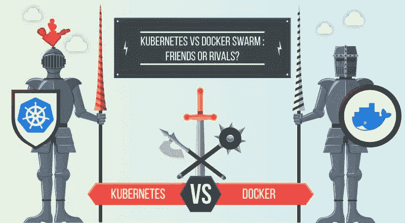
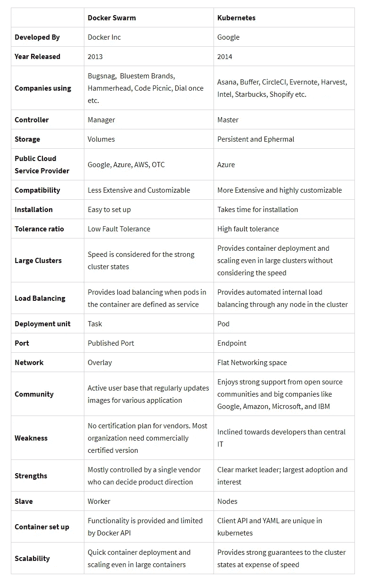

# Kubernetes vs. Docker Swarm:完整的比较指南

> 原文：<https://medium.com/hackernoon/kubernetes-vs-docker-swarm-a-complete-comparison-guide-15ba3ac6f750>

关于 Kubernetes 和 Docker 有无数的辩论、讨论和社交话题。如果你没有深入研究过，你会认为这两种开源技术都是在争夺容器霸权。先说清楚，Kubernetes 和 Docker Swarm 不是对手！两者各有利弊，可以根据您的应用需求来使用。

***在这篇文章中，更多的光是洒在:***

*   【Kubernetes 和 Docker 如何改变了软件开发的时代？
*   *它如何革新了 DevOps 咨询的方式？*
*   *虽然它们是不同的，但它如何将开发和集成的过程统一起来？*
*   *该场景有哪些限制？*

如果您正在寻找现代云基础设施的开发或寻找 DevOps 实现，那么必须了解 Kubernetes 和 Docker 的完整概念。这篇全面的文章将带你从头开始***Kubernetes vs . Docker Swarm***的旅程，并帮助你回答每一个重要的问题。

**让我们从，**

## 集装箱、集装箱化和集装箱编排——快速介绍

**容器**是包含应用程序代码、配置和依赖关系的软件包，可提高运营效率和生产力。在这里，您可以确切地知道它将如何运行，这意味着它是可预测的、可重复的和不可变的。容器的兴起是 DevOps 即服务的巨大推动力，可以克服当今面临的最大安全障碍。

**容器化**通过在操作系统级别进行虚拟化，创建基于内核的隔离封装系统，使应用程序可移植。容器化的应用程序可以放在任何地方，无需依赖或需要整个虚拟机即可运行，消除了依赖性。

但是，如果有多个容器呢？

这里需要容器编排！

**容器编排**是通常可以部署多个容器来通过自动化实现应用程序的过程，称为容器编排。像 **Kubernetes 和 DockerSwarm** 这样的平台是容器管理和容器编排引擎，使用户能够指导容器部署并自动更新、健康监控和故障转移程序。

这听起来很不错，但是如何实际使用工具和构建容器呢？

让我们从 Docker 开始

# 码头工人

> **“在任何地方构建、发布和运行任何应用程序”**

Docker 是一个容器管理服务，它帮助开发人员设计应用程序，并通过使用容器使创建、部署和运行应用程序变得更加容易。Docker 有一个内置的容器集群机制，称为“群体模式”使用 swarm 模式，您可以使用 Docker 引擎在多台机器上启动应用程序。

# Docker Swarm——管理 Docker 容器的工具

Docker Swarm 是 Docker 自己针对 Docker 容器的原生集群解决方案，其优势在于紧密集成到 Docker 的生态系统中，并使用自己的 API。它监视分布在服务器集群中的容器数量，是创建集群 docker 应用程序最方便的方式，无需额外的硬件。它为你提供了一个小规模但有用的 Dockerized app 的编排系统。

## 使用 Docker Swarm 的优点

*   **运行速度更快:**当您使用虚拟环境时，您可能已经意识到这需要很长时间，并且包括启动和启动您想要运行的应用程序的繁琐过程。有了 Docker Swarm，这不再是问题。Docker Swarm 消除了启动完整虚拟机的需要，使应用程序能够在虚拟和软件定义的环境中快速运行，并有助于 DevOps 的实施。
*   **文档提供了每一点信息:**Docker 团队在文档方面脱颖而出！Docker 正在快速发展，并为整个平台赢得了巨大的掌声。当版本在很短的时间间隔内发布时，一些平台不维护/不注意维护文档。但是 docker swarm 从来不会向它妥协。如果信息仅适用于 docker swarm 的特定版本，文档将确保所有信息都得到更新。
*   **提供简单快速的配置:**Docker Swarm 的一个关键好处是，它简化了事情。Docker Swarm 使用户能够轻松地将自己的配置放入代码中并进行部署。由于 Docker Swarm 可以在各种环境中使用，因此需求不受应用程序环境的限制。
*   **确保应用程序是隔离的:** Docker Swarm 确保每个容器都与其他容器隔离开来，并拥有自己的资源。可以部署各种容器来运行不同堆栈中的独立应用程序。除此之外，Docker Swarm 会在每个应用程序运行在自己的容器上时清除应用程序。如果不再需要该应用程序，可以删除其容器。它不会在您的主机操作系统上留下任何临时或配置文件。
*   **版本控制和组件重用—** 使用 Docker Swarm，您可以跟踪容器的连续版本，检查差异或回滚到之前的版本。容器重用前面各层的组件，这使得它们非常轻量级。

## 使用 Docker Swarm 的缺点

*   **Docker 是平台相关的:** Docker Swarm 是一个 Linux 竞争平台。尽管 Docker 支持 Windows 和 Mac OS X，但它利用虚拟机在非 Linux 平台上运行。一个被设计为在 Windows 上的 docker 容器中运行的应用程序不能在 Linux 上运行，反之亦然。
*   **不提供存储选项:** Docker Swarm 不提供将容器连接到存储的便捷方式，这是主要缺点之一。其数据量需要在主机上进行大量临时准备和手动配置。如果你希望 Docker Swarm 解决存储问题，它可能会解决，但不是以一种有效和用户友好的方式。
*   不良监控: Docker Swarm 提供了关于容器的基本信息，如果您正在寻找基本的监控解决方案，那么 *Stats 命令*就足够了。如果你在寻找比 Docker Swarm 更先进的监控系统，它绝对不是你的选择。虽然也有像 CAdvisor 这样提供更多监控的第三方工具。用 Docker 本身实时收集更多关于容器的数据是不可行的

# 为了避免这些不足，可以使用 Kubernetes

> **自动化容器部署、扩展和管理平台**

当一个应用程序是用跨越几台机器上的许多容器的不同组件开发的时候，就需要一个工具来管理和编排这些容器。这只有在 Kubernetes 的帮助下才可行。

Kubernetes 是一个开源系统，用于管理集群环境中的容器化应用程序。正确使用 Kubernetes 有助于 DevOps 即服务团队自动扩展应用程序，并在零宕机的情况下进行更新。

## 使用 Kubernetes 的优点

*   **它的速度快:**当谈到持续部署新功能而不停机时；Kubernetes 是一个完美的选择。Kubernetes 的目标是以恒定的正常运行时间更新应用程序。它的速度是通过一些功能来衡量的，您可以在保持可用服务的同时每小时运送一次。
*   **坚持不可变基础设施的原则:**在传统方式中，如果多个更新出现任何问题，您没有任何关于您部署了多少更新以及错误发生在哪个点的记录。在不可变的基础设施中，如果您希望更新任何应用程序，您需要用新的标签构建容器映像并部署它，用旧的映像版本杀死旧的容器。这样，你将有一个记录，并了解你做了什么，以防万一有任何错误；您可以轻松地回滚到上一个映像。
*   **提供声明式配置:**用户可以知道系统应该处于什么状态，以避免出错。源代码控制、单元测试等。这些传统工具不能用于命令式配置，但可以用于声明式配置。
*   **大规模部署和更新软件:**由于 Kubernetes 的不可变、声明性本质，扩展很容易。Kubernetes 为伸缩目的提供了几个有用的特性 **:
    -水平基础设施伸缩:**操作在单个服务器级别完成，以应用水平伸缩。最新的服务器可以毫不费力地添加或分离。
    **-**-**自动缩放:**根据 CPU 资源的使用情况或其他应用程序指标，您可以更改正在运行的容器的数量
    **-手动缩放:**您可以通过命令或界面手动缩放正在运行的容器的数量
    -**-****复制控制器:**复制控制器确保集群在运行状态下具有指定数量的等效容器。如果万一，吊舱太多；复制控制器可以移除额外的 pod，反之亦然。
*   **处理应用程序的可用性:** Kubernetes 检查节点和容器的健康状况，并在 pod 由于错误而崩溃的情况下提供自我修复和自动替换。此外，它将负载分布在多个 pod 上，以便在意外流量期间快速平衡资源。
*   **存储卷:**在 Kubernetes 中，数据是跨容器共享的，但是如果容器被杀死，卷会被自动删除。此外，数据是远程存储的，如果 pod 移动到另一个节点，数据将一直保留，直到被用户删除。

## 使用 Kubernetes 的缺点

*   **初始流程需要时间:**创建新流程时，您必须等待应用程序开始运行，然后用户才能使用它。如果您正在迁移到 Kubernetes，需要对代码库进行修改，以使启动过程更加高效，这样用户就不会有不好的体验。
*   **迁移到无状态需要很多努力:**如果您的应用程序是集群化的或无状态的，那么额外的 pods 将不会得到配置，并且将不得不在您的应用程序内重新进行配置。
*   **安装过程很繁琐:**如果你没有使用任何云提供商，比如 Azure、Google 或 Amazon，很难在你的集群上安装 Kubernetes。

# Kubernetes vs Docker Swarm:快速总结

# Docker 和 Kubernetes 不一样；但不是对手

**让我们看看**如何

如前所述，Kubernetes 和 Docker 都在不同的层次上工作，但都可以一起使用。Kubernetes 可以与 Docker 引擎集成，以执行 Docker 容器的调度和执行。因为 docker 和 Kubernetes 都是容器编排器，这意味着它们都可以帮助管理容器数量，也有助于 DevOps 的实现。两者都可以使运行集装箱化基础设施所涉及的大部分任务自动化，并且都是开源软件项目，受 Apache Licence 2.0 管理。除此之外，两者都使用 YAML 格式的文件来控制工具如何编排容器集群。当两者一起使用时，Docker 和 Kubernetes 都是部署现代云架构的最佳工具。有了 Docker Swarm 的豁免，Kubernetes 和 Docker 都是相辅相成的。

Kubernetes 使用 Docker 作为主要的容器引擎解决方案，Docker 最近宣布它可以支持 Kubernetes 作为其企业版的编排层。除此之外，Docker 还批准了经过认证的 Kubernetes 程序，这确保了所有的 Kubernetes API 都能按预期运行。Kubernetes 使用 Docker Enterprise 的特性，如安全图像管理，其中 Docker EE 提供图像扫描，以确保容器中使用的图像是否有问题。另一个是安全自动化，在这种情况下，组织可以消除效率低下的问题，例如扫描图像以查找漏洞。

# Kubernetes 和 Docker:哪个可以是完美的选择？

## **使用 Kubernetes if，**

*   您正在寻找成熟的部署和监控选项
*   您正在寻找快速可靠的响应时间
*   您希望开发一个复杂的应用程序，并要求无限制的高资源计算
*   你有一个相当大的集群

## **使用 Docker if，**

*   您希望开始使用该工具，而无需在配置和安装上花费太多时间
*   您正在寻找开发一个基本的和标准的应用程序，这是足够的默认 docker 图像
*   在不同的操作系统上测试和运行相同的应用程序对您来说不成问题
*   你想要 docker API 的体验和兼容性

## 最后的想法:Kubernetes 和 Docker 是朋友

无论你选择 Kubernetes 还是 Docker T1，这两者都被认为是最好的，并拥有相当大的差异。在这两者之间做出决定的最佳方式可能是考虑哪一个您已经更了解，或者哪一个适合您现有的软件堆栈。如果你需要开发复杂的应用程序，使用 Kubernetes，如果你想开发小规模的应用程序，使用 Docker swarm。此外，选择正确的是一项非常全面的任务，完全取决于您的项目需求和目标受众。

*尽管如此，如果你不清楚你的要求或有任何疑问，我们可以帮助你！我们有* [*熟练的开发专家*](https://www.spec-india.com/services/devops-consulting/) *，他们精通各种技术，可以帮助您选择最好的。或者，如果你想在这个博客上添加任何东西，或者你对此有疑问，今天就联系我们吧！*

*这篇文章最初发表在我们的博客* [*这里*](https://www.spec-india.com/blog/kubernetes-vs-docker-swarm-a-complete-comparison-guide/)