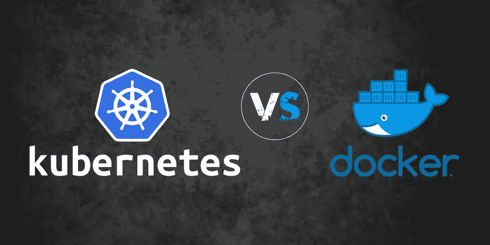
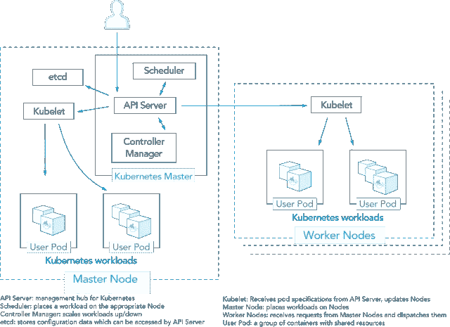
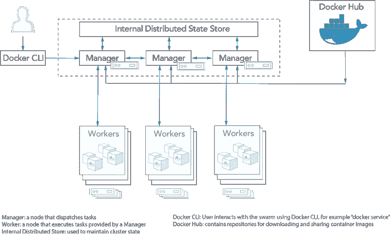
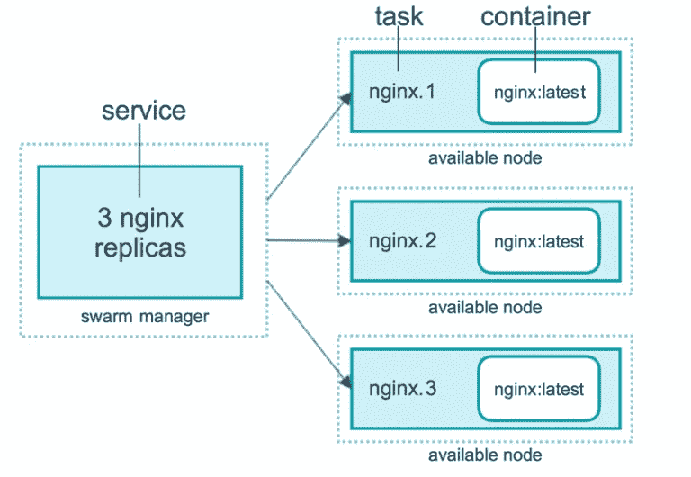
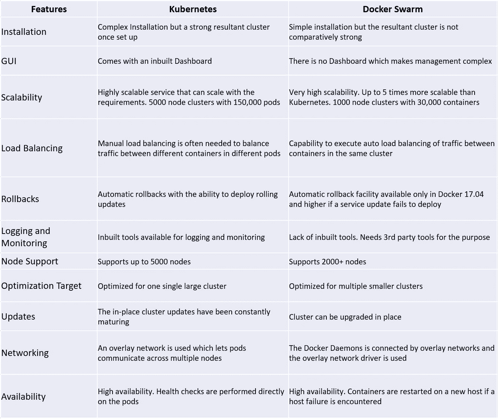

# Kubernetes vs Docker Swarm —全面比较

> 原文：<https://medium.com/hackernoon/kubernetes-vs-docker-swarm-a-comprehensive-comparison-73058543771e>

Kubernetes Vs Docker Swarm

近年来，容器变得相当流行。它们帮助开发人员保持跨各种平台的一致性，从开发到生产过程。

因此，与传统的虚拟化相比，它们允许开发者对他们的产品有更多的控制。这是通过在内核级执行隔离来实现的，不需要任何客户操作系统。这为等式引入了许多优势，例如更快的部署、更高的可伸缩性以及开发环境之间更接近的对等性。

虽然在容器编排方面，市场上有许多重要的应用，包括 Mesosphere 和 Amazon ECS，但这篇博客旨在对其中两个流行的应用进行比较— [Kubernetes](https://kubernetes.io/) 和 Docker Swarm。

**什么是 Kubernetes**

Kubernetes 由谷歌开发，于 2014 年推出。本质上，它是一个 it 管理工具，专门设计用于简化使用容器的工作负载的可伸缩性。它能够自动部署、扩展和操作应用程序容器。

通过使用 Kubernetes，您将能够定义您的[应用程序](http://www.cuelogic.com/iot/iot-app-development)应该如何运行，以及它们与其他应用程序交互的方式。Kubernetes 为用户提供了接口和可组合的平台原语，具有高度的灵活性和可靠性。

[Source](https://platform9.com/wp-content/uploads/2017/06/Nodes_Illustration-1024x743.png)

虽然 Kubernetes 在过去被认为是高度复杂的，但各种工具和升级已经逐渐使它变得更加用户友好。例如，Helm Project 这样的工具提供了统一的[软件](https://www.cuelogic.com/custom-software-development)打包方法，有助于扩展版本控制，并极大地简化了应用程序分发和部署的复杂性。

Kubernetes 中的集群包括几个组件，如:

●**pod:**它们是同一节点上的一组容器，它们被一起创建、调度和部署。

● **标签:**这些是键值标签，它们被分配给像 pod、服务和复制控制器这样的元素来标识它们。

● **服务:**这些用于给 Pod 组命名。因此，它们可以充当负载平衡器，引导流量运行容器。

● **复制控制器:**这些是专门为确保在任何给定时刻，一定数量的 pod 副本被调度和运行而设计的框架。

**什么是 Docker Swarm**

Docker Swarm 已经成为打包和分发容器化应用程序的流行开源标准。本质上，它是 Docker 的原生集群。Docker 主机池可以变成一台虚拟主机。

[Source](https://platform9.com/wp-content/uploads/2017/06/docker-architecture-1024x617.png)

Docker Swarm 围绕四大原则进行设计:

●通过 Docker 通用控制平面单一界面提供简单而强大的用户体验

●具有单点故障的弹性架构

●向后兼容现有组件(与现有用户高度相关)

●自动生成证书，确保安全

Docker Swarm 现在与 Docker 引擎完全集成。它还利用了标准的 API 和网络进程。它内置在 Docker CLI 中，您可以通过多个易于掌握的命令来执行大量任务。

群集是由以下组件组成的节点群集:

● **管理器节点:**这里涉及的任务包括控制协调、集群管理和任务分配。

● **Worker 节点:**这里的功能包括运行 manager 节点分配的容器和服务。

● **服务:**这给出了一个蓝图的描述，通过这个蓝图，一个单独的容器可以跨节点分布它自己。

● **任务:**这些是单个容器放置它们的工作的槽。

由于是开源的，Docker 的社区版本——Docker CE——迅速崛起，因为它与开发人员和自己动手的运营团队高度相关。另一方面，Docker 企业版主要用于运行关键任务应用程序。如果你打算走码头工人这条路，这里有一些你可以期待的好处:

●认证的 Docker 图像和插件

●能够利用具有不同选项级别的 Docker 数据中心

Docker 图像上的漏洞扫描结果

Docker 的官方支持

Docker 产品的这种重组使公司能够在公司目标和社区需求之间取得平衡。这是有意义的，因为 Docker 在过去因为向 Docker 引擎添加功能而成为批评的受害者。通过分离产品，公司可以在保持社区版不变的情况下使用企业版。

但这也在宏观上造成了一个问题。由于 Docker Swarm 是一家风险投资支持的公司，它需要货币化。这意味着一些最好的特性将会一直被开源社区付费和保留。

另一方面，Kubernetes 得到了谷歌的支持，谷歌能够负担得起向用户群扩展优质功能，并且不会直接为此收取任何费用。

这有助于 Kubernetes 的发展。

**Kubernetes Vs Docker Swarm——看看区别**

虽然这两种工具都通过限制硬件使用来节省资源，以满足业务资源需求，但它们之间有一些明显的差异，需要在选择一条道路之前进行全面的分析。

让我们来看看它们:

**1。设置、安装和集群配置**

Photo by [Markus Spiske](https://unsplash.com/@markusspiske?utm_source=medium&utm_medium=referral) on [Unsplash](https://unsplash.com?utm_source=medium&utm_medium=referral)

**Kubernetes** :在测试平台上安装 Kubernetes 很容易。不过，如果你打算大规模运行它，需要更多的计划和努力。每个步骤都需要运行特定的命令，包括:

●启动集群

●定义环境

●定义一个使容器能够相互作用的 pod 网络

●设置仪表板

●托管集群

Docker Swarm : Swarm 使用 Docker CLI 运行它的程序。因此，为了构建环境和配置，只需要学习关于一套工具的知识。由于 Swarm 程序在你当前的 Docker 上运行，你可以选择加入 Swarm。

**2。构建和运行容器**

**Kubernetes** : Kubernetes 拥有自己的 API、客户端和 YAML 定义，体现了独特性。这些与标准的 Docker 等价物形成强烈对比，因为不可能使用 Docker Compose 或 Docker CLI 来定义容器。

Docker Swarm :使用相同的 Docker CLI，只需一个命令就可以旋转新的容器。虽然 Swarm API 支持多种与 Docker 一起工作的工具，但如果 Docker 缺乏特定的操作，这可能会被证明是一个麻烦。

**3。记录和监控**

Photo by [Fotis Fotopoulos](https://unsplash.com/@ffstop?utm_source=medium&utm_medium=referral) on [Unsplash](https://unsplash.com?utm_source=medium&utm_medium=referral)

**Kubernetes**:Kubernetes 中包含内置工具，用于记录和监控。日志记录有助于通过分析过去的记录/日志来了解失败的原因。另一方面，监控使我们能够持续了解节点的健康状况以及它们所包含的服务。

Docker Swarm : Swarm 缺乏内置工具来处理日志和监控的能力。不过，您可以利用第三方工具来实现这一点。工具麋鹿就是这样一个例子。另一方面，像 Reimann 这样的工具可以用于监控。

**4。可扩展性**

Kubernetes :众所周知，在保持集群强度方面，Kubernetes 比 Swarm 略胜一筹。尽管由于所涉及的复杂性，它的可扩展性不如 Swarm。一组统一的 API 增加了 Kubernetes 的复杂性，同时还非常关注集群状态。

虽然说到自动伸缩，Kubernetes 在竞争中遥遥领先，因为它可以分析服务器负载，并根据您的需求进行伸缩。这使得交通管理变得轻而易举。

众所周知，Swarm 比 Kubernetes 更具可扩展性。对于大型集群和高集群填充阶段，容器可以部署得更快。只需一个更新命令就足以部署新的副本。

另一方面，Swarm 的自动缩放和 Kubernetes 一样流畅，但是 AWS 自动缩放在 StackStorm 的帮助下是可能的。其思想是当集群负载填满时，创建额外的工作节点，然后将它们添加到集群中。

**5。GUI**

**Kubernetes** :如果你坚持使用仪表盘，Kubernetes 就是你的终极选择。所提供的 GUI 是一个可靠的仪表板，可以用来毫不费力地控制集群。如果你不是来自技术背景，这将是一个巨大的福音，因为它不需要任何技术上的努力，而且说明是用简单的英语。

**Docker Swarm** : Docker 主机和 Swarm 集群可以在第三方工具的帮助下进行管理，例如 [Portainer.io](https://portainer.io/) 提供了一个简单的管理 UI。另一方面，Docker 企业版中的通用控制面板为您提供了管理集群的界面。

**6。负载平衡**

Kubernetes :当容器箱被定义为服务时，Kubernetes 允许负载平衡。除此之外，您还需要手动配置负载平衡设置。只有一组特定的 pod 和策略允许访问每项服务。

Docker Swarm 提供了一个内置的负载平衡工具。同一个集群中的所有集装箱都加入了一个公共网络。这允许将任何节点连接到任何容器。

**对照表**

**利弊**

Kubernetes 的优点

●开源和模块化解决方案

●能够在任何种类的操作系统上运行

●使用 pod 轻松组织服务

●由谷歌开发，他们带来了多年宝贵的行业经验

**Kubernetes 的缺点**

●安装和配置对于第一次使用的人来说可能过于复杂

●不兼容任何现有的 Docker CLI 和编写工具

**码头工人群体的优点**

●有效且更容易的初始设置

●集成和使用现有的 Docker 工具

●轻型安装

●开源解决方案

**码头工人群起而攻之**

●根据 Docker API 的可用性，功能有限

●有限的容错能力

最终裁决——Kubernetes 还是 Docker Swarm？

今天，Kubernetes 是一个更优秀、更强大的市场竞争对手。

Docker 管理层做出的一些决定已经导致了对单个开发人员用例的严重削弱。开源社区的需求还没有得到满足，独立企业版提供的最佳特性只是增加了混乱。结果，社区的支持减少了。另一方面，Kubernetes 已经成为最受欢迎的开源项目之一。在蓬勃发展的社区支持下，它在高速地不断发展和改进。

同时，Kubernetes 在技术上优于 Docker Swarm。pod 级别更好的健康检查规定、更好的容器调度和扩展、具有基于角色的访问控制的名称空间，以及控制服务之间的进出流量的网络策略，这些都为 it 提供了优势。甚至[云提供商](https://www.cuelogic.com/cloud-computing-services/)也选择转向 Kubernetes 托管服务。

**结论**

我希望所有这些信息将帮助您达成一个最佳的商业集装箱化工具的最终解决方案。

你认为哪种集装箱服务/工具最适合你，为什么？