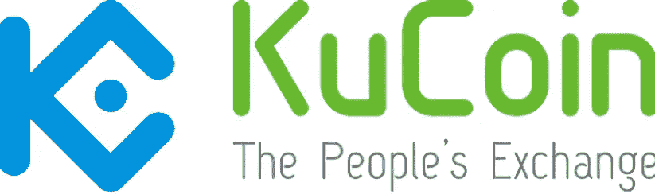

# KuCoin 用户现在可以用 Shrimpy 管理他们的投资组合

> 原文：<https://medium.com/hackernoon/kucoin-users-can-now-manage-their-portfolios-with-shrimpy-e579a7809713>

> 人民已经说话了。他们想和库柯恩一起吃虾肉。

Shrimpy 用户爱 [KuCoin](https://www.kucoin.com/#/?r=Jdgs8c) 。多样化的资产选择和对 NEP-5 令牌的支持使它成为我们平台的一个有吸引力的补充。今天，我们向所有 Shrimpy 用户推出 KuCoin。

[立即注册](https://www.shrimpy.io/)，开始通过 Shrimpy 管理您的 KuCoin 资产。免费使用，容易上手。

 [## Shrimpy 简介—投资加密的最简单方式

### Shrimpy 是为忙碌的人提供的简单的投资组合管理网站。Shrimpy 采纳聪明投资者的想法…

hackernoon.com](https://hackernoon.com/introduction-to-shrimpy-the-easiest-way-to-invest-in-crypto-fbb546b5e649)  [## 再平衡与 HODL:技术分析

### 这项研究的目的是描绘一幅公平的画面，说明再平衡作为一种策略如何符合霍德林。为了…

hackernoon.com](https://hackernoon.com/rebalance-vs-hodl-a-technical-analysis-6f341b0db9cd) 

不要忘记在[推特](https://twitter.com/ShrimpyApp)和[脸书](https://www.facebook.com/ShrimpyApp)上关注我们的更新，并在[电报](https://t.me/ShrimpyGroup) & [不和谐](https://discord.gg/gXyy95y)上向我们令人惊叹的活跃社区提问。

*捕虾队*