# swift 中的 KVO 和 KVC

> 原文：<https://medium.com/hackernoon/kvo-kvc-in-swift-12f77300c387>

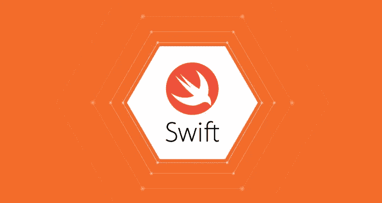

*   **简介:**

程序的流程取决于我们在代码中使用的各种变量的值。根据程序中变量的值，我们可以根据需要导航执行流程。

例如，如果我们使用任何集合类型，当集合被修改或更改时，很难执行逻辑。即当添加、删除或修改新项目时。我们仍然可以用很多方法处理这种情况。

其中之一是使用通知中心，通知我们，每当发生变化的财产价值。但是，如果想要检查我们代码中的许多属性，这种(使用通知中心)方式会导致我们使用大量代码来调用我们需要检查的所有属性。在这种情况下，另一种更好的方法是(也是苹果在其库中大量使用的)被称为**(键值观察)，这也与另一种称为**【KVC】**(键值编码)的强大机制直接相关。**

*****注意:任何我们想要观察变化的属性必须是 KeyValueCoding (KVC)投诉。*****

***这两个 KVO & KVC，提供了一种高效的方式来编写我们的代码。现在让我们从 KVC 开始，然后是 KVO。***

*   ****KVC:****

****KVC** 是一种编码形式，允许你间接访问一个对象的属性，使用字符串代替属性的访问器或者直接访问变量来访问它们。要启用这种机制，您的类必须遵守 NSKeyValueCoding 非正式协议。(或者)**

***键值编码是一种间接访问对象属性的机制，使用字符串来标识属性，而不是通过调用访问器方法或通过实例变量直接访问它们。***

> **例如:**类配置文件:NSObject {****
> 
> ****var firstName: String****
> 
> ****var lastName: String****
> 
> *****var custom Profile:Profile*****
> 
> ****}****

**如果我们想在类 init()或类文件中的某个地方为上面声明的变量赋值，通常我们会这样做:**

> **self.firstName = "Robert "**
> 
> **self.lastName = "Stark "**
> 
> **与 KVC；我们确实喜欢以下内容:**
> 
> ***self . setvalue:****Robert****for key:****first name*******//self . setvalue:*****Any***for key:***key/key path*****
> 
> *****self . setvalue:“****Stark****”for key:“****last name****”*****
> 
> ****要检索 KVC 属性的值，我们使用如下方式:****
> 
> ****let Robert last name = self . value(forKey:*"****last name****"*****

****上述 KVC 的工作方式类似于在 swift 中使用字典。对吗？****

****在这里，在 KVC；我们不是直接*将值分配给属性*，或者使用对象的(#如果可用) *setter 方法，而是简单地**将**值分配给 ***键/键路径。*** *所以我们用* ***键和值*** *，这种技术叫做* ***键值编码(KVC)。********

******注:** *有一种协议被称为* ***NSKeyValueCoding 非正式协议*** *，它与****【KVC】****一起强制工作。* ***我们的跟班必须确认这个协议，以便使用 KVC&****。****n 对象*** *确认本协议。所以*在**基础**框架中定义的并且继承自 ***NSObject*** 的每个类都符合***NSKeyValueCoding***协议。****

*   ******什么是 key & KeyPath？******

******键:** *简单地说就是* ***键*** *"指定一个单独的属性，我们要从* ***中设置一个值或者从*** *中获取一个值。所以其* ***名称*** *应该与* ***属性的名称相同。*******

> ****ex:*self . setvalue:****Stark****for key:****last name*******

*******KeyPath:***A***KeyPath***由点语法跟随子串构成，所以不是单个单词/串。****Key-path****代表* ***一个对象的所有属性*** *，* ***直到达到所需的值/属性*** *。******

*****例如:*****

> *****var myProfile: **个人资料*******
> 
> ******self . setvalue:"****拜拉席恩****" for key:"***my profile。*custom profile . last name*T41*******

*****KVC :*****

*   *****这里，我们将创建一个单一视图应用程序，与 KVC 和 KVO 一起工作。这个项目有两个示例项目，但是我们在这里探索的那个与任何 UI 都没有关系。另一个是当文本改变时更新 ViewController 视图上的 UILable。项目链接会在底部分享，你可以自己轻松探索。*****
*   *****首先，在 swift 中创建单一视图应用程序*****
*   *****要使用 KVC，我们的类需要符合 *NSKeyValueCoding 协议。所以通过向 NSObject 确认，我们可以实现这一步。UIViewController 已经确认了这个 NSObject，所以我们可以从这个协议调用方法，而不需要任何设置。******
*   *****在 Xcode 中，在您的项目中创建一个新的 swift 文件，名称为 Children with NSObject 作为基类(Children 从 NSObject 继承)。然后在该类文件中，通过将' ***@objc dynamic*** '关键字放在声明*的前面，声明名为' *name'* 和' *age'* 的两个属性。那么我们为什么需要这样做呢？？？******

*****→在 swift 中，有许多关键字/属性有助于编译、运行时规范、访问控制等。例如:@逃避、@可用等。同样，它还定义了一系列声明修饰符，以修改属性/类成员的声明。例如，通过用' ***final'*** 关键字标记类声明，我们通知编译器该类不能被子类化。这允许编译器进行一些优化来提高性能。***‘动态’***也是我们在 swift 中使用的声明修饰符。*****

*******动态分派**，是 Objective-C 中的一个很酷的特性。它简单地意味着 Objective-C 运行时在运行时决定它需要调用特定方法或函数的哪个实现。例如，如果一个子类覆盖了它的超类的一个方法，动态调度会计算出该方法的哪个实现需要被调用，是子类的还是父类的。这是一个非常强大的概念。*****

*****Swift 尽可能使用 Swift 运行时。结果是它可以进行许多优化。虽然 Objective-C 完全依赖于动态调度，但 Swift 只有在别无选择的情况下才会选择动态调度。如果编译器能够在编译时指出它需要选择方法的哪一个实现，它就可以通过退出动态调度来赢得几纳秒的时间。*****

*****Swift 运行时尽可能选择其他选项，如**静态**和**虚拟调度**，而不是**动态调度**。这样做是为了提高性能。静态和虚拟调度比动态调度快得多。尽管我们谈论的是纳秒，但最终结果可能是戏剧性的。我们已经习惯的许多特性都是因为动态 Objective-C 运行时才成为可能的，包括核心数据和键值观察。*****

# *****动态调度*****

*****通过将'***【dynamic '***声明修饰符应用于一个类的成员，你告诉编译器应该使用动态分派来访问那个成员。*****

*****通过用' ***dynamic'*** 关键字作为声明的前缀，该声明被隐式地标记有 ***objc*** 属性。 ***objc*** 属性使声明在 Objective-C 中可用，这是 Objective-C 运行时调度它的一个要求。*****

********动态'*** 声明修饰符只能用于一个类的成员。结构和枚举不支持继承，这意味着运行时不必弄清楚它需要使用哪个实现。*****

*****因此，要在 swift 中使用 KVC 和 KVO，对于我们希望在 KVO 观察的属性，我们需要用@objc 动态关键字来声明它们。*****

*   *****现在，我们的**子类**中有两个属性，在初始化方法中初始化/定义它们。*****

*****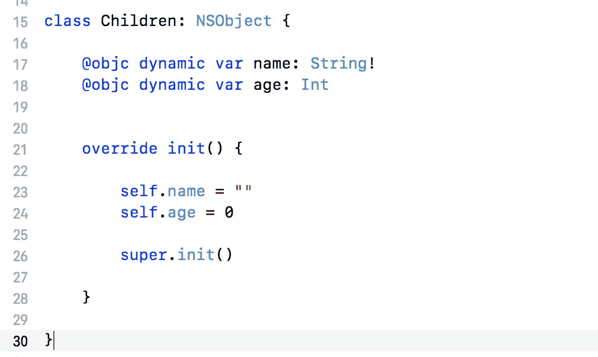*****

*   *****现在，在 ViewController 类文件中，声明如下所示的三个子实例:*****

*****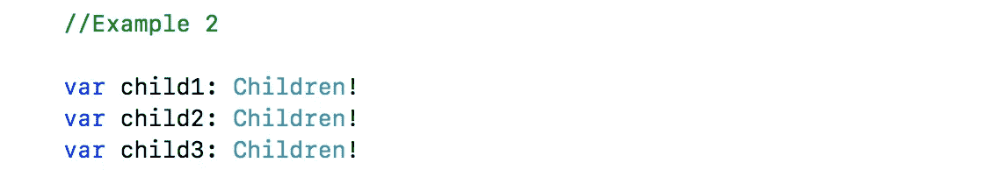*****

*****首先我们使用' *child1'* 的宾语。在 viewDidLoad()方法中，我们初始化 child1 对象，然后为其属性赋值。*****

*****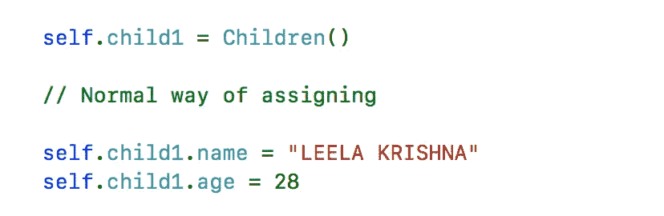*****

*****如果您打印' *child1'* objects 属性，如姓名和年龄，您将在结果中获得指定的值。*****

*****现在，我们将使用 KVC 方法来做同样的事情。*****

*****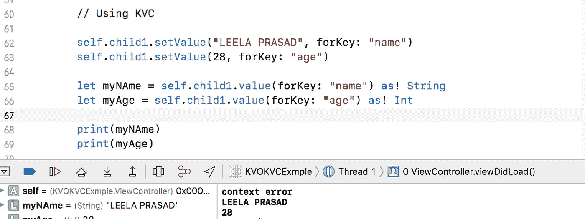*****

*****在上面的代码片段中，在前几行中，我们使用 *setValue:forKey:* 方法为这两个属性设置了所需的值。注意关键字字符串与属性的名称相同。*****

*****接下来，我们执行完全相反的任务。我们使用 *valueForKey:* 方法从属性中提取值，并将它们分配给两个局部变量。然后我们在控制台中打印这些值。结果和上一个一样。*****

*****注意:如果我们给属性名不同的键，应用程序将崩溃。当编写符合 KVC 标准的代码时，非常重要的一点是要小心，确保关键字符串与属性名匹配，否则应用程序就会崩溃。这不是直接处理属性的情况，因为没有机会在它们的名字上犯任何错误；在这种情况下，编译器会抛出一个错误，促使我们修复它。*****

*****综上所述，我们已经了解了如何编写 KVC 风格的代码，以及如何使用键来设置和获取值。在下一部分，我们将完成这个项目。*****

*******使用关键路径:*******

*****现在转到 Children 类，添加以下属性。*****

> *****@objc 动态 var child:孩子？*****

*****在 *viewDidLoad* 方法中。现在，添加初始化相关对象并赋予其初始值的下一行:*****

*****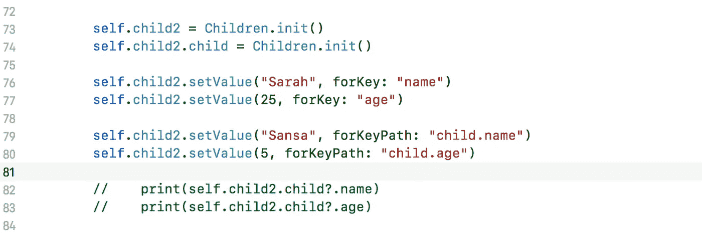*****

*****在上面的代码片段中，在前几行中，我们刚刚初始化了' *child2 '* 对象及其' *child'* 属性。接下来，我们为 **child2** 的属性 **name** 和 **age** 设置值。对于 **child2** 的 **child** 属性，我们使用 key-path 来设置值。仔细观察。我们可以检索这些值来检查赋值是否成功:取消对打印语句的注释。*****

*******现在我们来看看如果孩子的孩子也有孩子会怎么样…*******

*****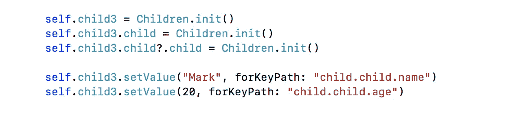*****

*****如果您想要检查值/结果，请使用上面代码片段的打印语句。*****

*****到目前为止，我们学习了如何使用键和键路径编写 KVC 投诉代码。接下来，我们将学习观察资产的价值变化:*****

*****KVO :*****

*****在这里，我们将看到应该采取什么行动，以便能够跟踪属性的变化。首先，让我以列表的形式向你介绍实施 KVO 所需的步骤:*****

*****1.要观察其属性的类必须符合 KVO 标准。这意味着:*****

*   *****根据我们在简介和上一节中看到的内容，该类必须符合 KVC 标准。*****
*   *****该类必须能够自动或手动发送通知(我们将在后面看到更多)。*****

*****2.将用于观察另一个类的属性的类应该设置为*观察者*。*****

*****3.一个名为 ***的特殊方法 observe value(forkey path key path:String？对象:任何？，更改:[NSKeyValueChangeKey : Any]？，context:unsafmutablerawpointer？)*** 应该落实到观察类。*****

*****让我们一个一个来看。当我们想要观察一个属性的变化时，最重要的事情是让*让*我们的类观察这些变化。这或多或少是通过临时通知( *NSNotifications* )来完成的，但是使用了另一种方法。这个方法就是***add observer(<# T # # observer:ns object # # ns object #>，forkey path:<# T # # String #>，options:<# T # # NSKeyValueObservingOptions #>，context:<# T # # unsafmutablerawpointer？# > )********

*****这里我们观察到一个 **child1** 对象的 **name** 和 **age** 属性的值变化。所以在 viewWillAppear()方法中，为 child1 对象添加观察者。*****

*****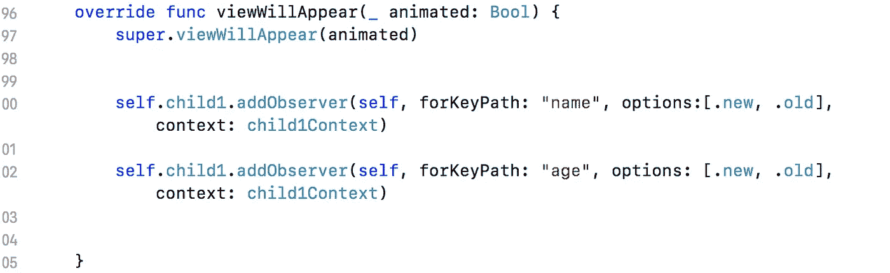*****

*****上述方法接受的参数是:*****

*   ******addObserver* :这是观察类，通常是*自身*对象。*****
*   *****我猜你能明白这是干什么用的。它是您用作键或键路径的字符串，并且与您想要观察的属性相匹配。请注意，您可以在这里指定一个键或一个键路径。*****
*   ******选项*:一组*NSKeyValueObservingOptions*值。*****
*   ******上下文*:这是一个指针，可以作为我们观察的属性变化的唯一标识符。通常这被设置为*零*或*零*。稍后我们会看到更多相关内容。*****

*****既然我们已经使我们的类能够观察上述两个属性的任何变化，我们必须实现*observevaluforkeypath:of object:change:context:*方法。它的实现是强制性的，并且有一个很大的缺点。这是每个 KVO 变化都需要的事实，如果你观察许多属性，那么你必须写很多的 *if* 语句，以便对每个属性采取适当的行动。然而，这很容易被忽略，因为 KVO 的好处大于这一限制。*****

*****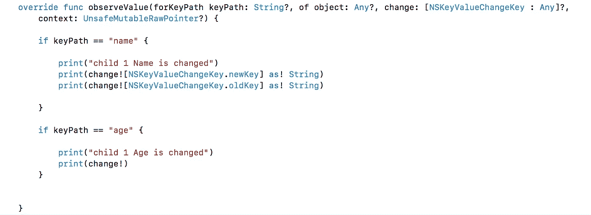*****

*****每当添加到观察者的属性值发生变化时，就会调用上述方法。这里通过 key-path 参数，我们打印了 name 和 age 属性的新值和旧值。*****

*****要测试此功能，请将 UIButton 的操作连接到 viewController，并在该操作方法中添加以下代码行:*****

*****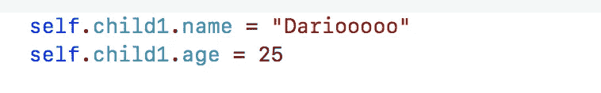*****

*****超级！在我们为 *child1* 对象的 *name* 和 *age* 属性设置了新值之后，我们收到了通知，我们请求显示的消息显示在调试器上。如您所见，以前的值和新值都包含在字典中。*****

*****从 *change* 字典中，你可以提取任何你想要的值(如果需要的话)，但是最重要的是它非常容易被通知属性的变化。*****

*****在按钮操作方法中添加以下代码行，并运行程序。*****

*****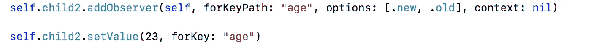*****

*****如果您观察结果，我们会收到两个关于对 *age* 属性进行更改的通知。但这似乎令人困惑，因为即使我们知道每个通知所属的对象，我们也无法通过编程来确定发送通知的对象。那么，我们如何面对这一点，我们如何通过编程来 100%确定被更改的属性所属的对象呢？*****

*****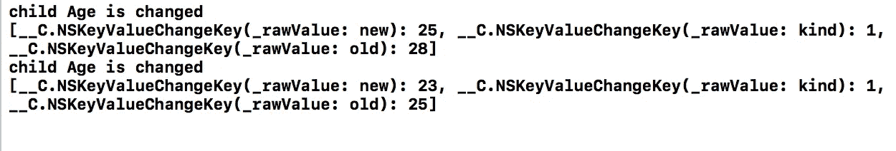*****

*****以上问题的答案是一:我们将利用 ***addObserver 的 ***context*** 参数(<# T # # observer:ns object # # ns object #>，forkey path:<# T # # String #>，options:<# T # # NSKeyValueObservingOptions #>，context:<# T # # unsafmutable erawpoint# > )*** 法。我之前已经提到过，上下文的目的是唯一地识别一个属性上的变更，所以它是我们所拥有的最好的工具。*****

*****这里，我为每个 child1 和 child2 定义了两个上下文:*****

*****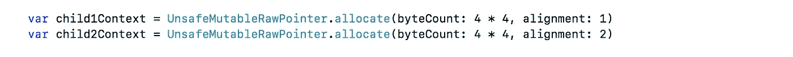*****

*****注意，每个被观察属性的上下文值必须是一个全局变量，因为它必须可以从 *addObserver…* 和*observeValueForKeyPath…*方法中访问。*****

*****现在修改 child1 和 child2 中的代码，通过传递上下文参数来添加观察者方法。然后我们需要修改 observe 方法，如下所示:这样我们可以在传递的上下文参数的帮助下识别更改的属性。所以我们设法以编程方式指定每个更改的属性。*****

*****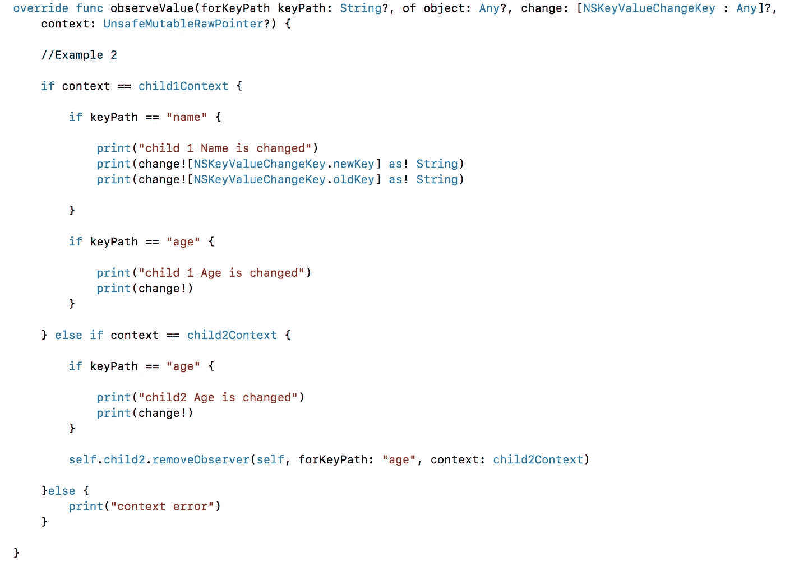*****

*****最后，在我们到达本章末尾之前，在某些时候删除您添加的观察者也是非常重要的。没有食谱告诉你应该在哪里做那件事。例如，在许多情况下，在处理了接收到的通知之后，在*observeValueForKeyPath:of object:change:context:*中这样做是很有用的。在其他情况下，您应该在解除视图控制器时这样做。一般来说，这取决于你的应用程序的结构。在本例中，我们将在*viewwillddissapear:*方法中完成。就是这里:对于 ***child2，*** *我在上面的片段中去掉了观察者。******

*****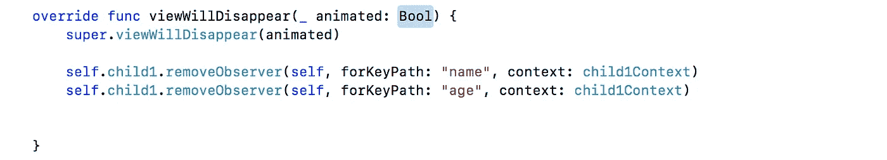*****

# *****自动和手动通知*****

*****默认情况下，当您使用 KVO 进行观察时，系统会在每次属性发生更改时发送通知。这在大多数情况下是合适的，但是有时候我们不希望在一个变化发生后得到通知，而是在多个属性发生一系列变化之后或者在稍后的时间。幸运的是，iOS SDK 为我们提供了一些非常方便的方法，让我们可以控制通知，所以我们可以在实际需要的时候手动发送它们。在我们进入更多的细节之前，让我说一下，使用你接下来将要看到的方法并不是强制性的。相反，如果真的有必要，你可以实现它。*****

*****现在进入正题，为了控制属性更改时发送的通知，您必须实现*automatically notifiesobserverforkey:*类方法。它接受的参数是您需要控制通知的属性的键的字符串表示，并且它返回一个布尔值。如果您不希望在被观察属性的值被更改后发送通知，那么该方法必须返回 false。在任何其他情况下，您应该让 iOS 决定通知。*****

*****实际上，让我们假设当*子类*的*名称*属性改变时，我们不希望发布通知。记住这一点，下面是该方法在*子类*中的实现*****

*****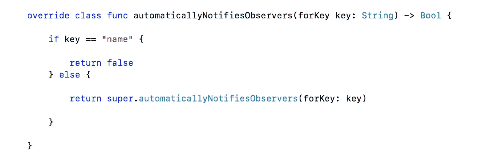*****

*****在 *else* 子句中，我们使用 *super* 类调用相同的方法，以便让 iOS 处理我们在这里没有显式添加的所有键，并且我们返回的值是我们在最后返回的值。*****

*****如果您此时运行应用程序，您会发现调试器上没有出现关于名称更改的消息。当然，这是我们所渴望的，所以我们已经设法实现了我们的目标。但是，我们真的做到了吗？*****

*****嗯，正如您所理解的，通过在上述方法中为特定的键返回 false，我们仅仅成功地阻止了相关通知的发送。当然，这并不意味着手动通知，这意味着根本没有通知！为了在我们决定这样做时发送通知，我们必须使用另外两种方法。它们是 *willChangeValueForKey:* 和 *didChangeValueForKey:* 。使用它们时，必须先调用 *willChangeValueForKey:* ，然后将新值赋给属性，最后调用 *didChangeValueForKey:* 。要测试手动操作，请在 viewcontroller 的 action 方法中添加这些行。*****

*****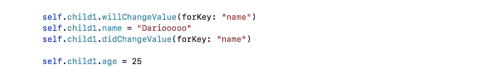*****

*****如果您现在运行应用程序，关于名称更改的消息会出现在调试器上，这意味着我们已经成功地手动发送了通知！*****

*****实际上，通知是在调用了 *didChangeValueForKey:* 方法之后发送的，因此将该方法放在您认为适合接收通知的任何地方。*****

*****这正是我们一直期待的应用程序！正如您所看到的，我们已经成功地控制了通知发送点，而且只需一点点努力！请注意，在 *willChangeValueForKey:* 和 *didChangeValueForKey:* 方法之间，可以分配多个属性值。*****

*****如上所示， *willChangeValueForKey:* 和 *didChangeValueForKey:* 方法不是必须使用的。它们也可以在*子类*中实现(或者在你自己的类中)。*****

*****请点击[此处](https://github.com/penumutchuprasad/KVOKVCExmple)查看上述教程描述的项目。*****

*****参考资料:*****

1.  *****[http://Michael-brown . net/2017/swift-and-kvo-context-variables/](http://michael-brown.net/2017/swift-and-kvo-context-variables/)*****
2.  *****[https://www . app coda . com/understanding-key-value-observing-coding/](https://www.appcoda.com/understanding-key-value-observing-coding/)*****
3.  *****[https://cocoacasts.com/key-value-observing-kvo-and-swift-3](https://cocoacasts.com/key-value-observing-kvo-and-swift-3)*****
4.  *****[https://www . ralfebert . de/IOs-examples/swift/property-key-value-observer/](https://www.ralfebert.de/ios-examples/swift/property-key-value-observer/)*****
5.  *****[https://blog . Scott logic . com/2015/02/11/swift-kvo-alternatives . html](https://blog.scottlogic.com/2015/02/11/swift-kvo-alternatives.html)*****

*****如果你喜欢我的教程，请在**媒体**上关注我。可以通过 [**我的-twitter**](https://twitter.com/Leelakrishn4) 或者 [**linkedIn**](https://www.linkedin.com/in/leela-prasad-penumutchu-b44023157/) 账号联系我。*****

*****感谢阅读。通过更多的教程会很快变得更好。*****

*****再见！！！*****