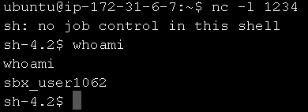
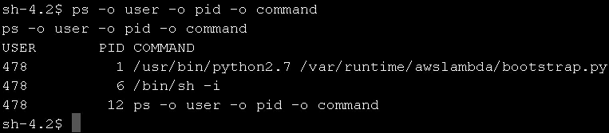
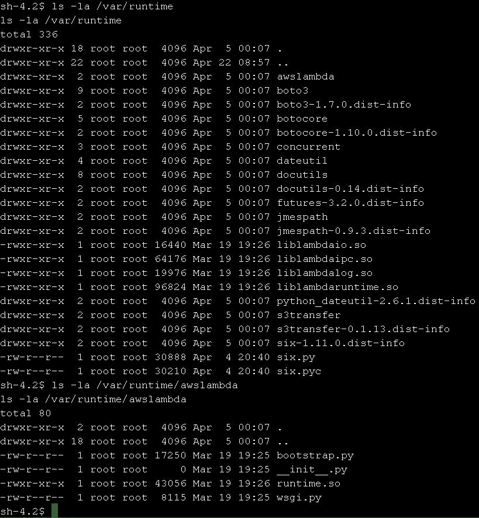
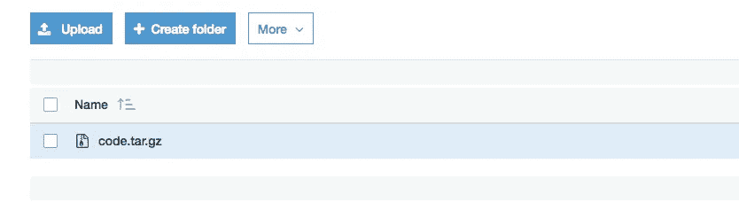
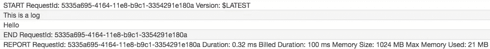

# Lambda 内部:探索 AWS Lambda

> 原文：<https://medium.com/hackernoon/lambda-internals-exploring-aws-lambda-462f05f74076>


Diving deep down. Photo by [Talia Cohen](https://unsplash.com/@taliacohen?utm_source=medium&utm_medium=referral)

本文是两部分系列的第一部分。下一部分是[就在这里！](/epsagon/aws-lambda-internals-part-2-going-deeper-1e12b9d2515f)

[AWS Lambda](https://aws.amazon.com/lambda/) 是一个快速可伸缩开发的优秀环境。作为一名开发人员，我喜欢使用它。Lambda 的主要优势是你可以专注于你的代码。不用再考虑网络服务器、机器、可伸缩性和其他你不关心的问题。上传你的代码，说出咒语(又名无服务器调用)，你的代码就被执行了。但是，你可以忽略那些东西，并不代表你必须要忽略，对吧？

我相信了解您的环境会是一个方便的工具，而且也会很有趣，所以我决定探索 Lambda 环境。有几个故事回顾了 Lambda 环境的规范，但我的最终目标是不仅分析 Lambda 的容器，还要分析 Lambda 本身的代码。我想完全理解负责执行我的代码的代码。


Focus sometimes means blurring out the rest. Is that really what we want? Image: [Paul Skorupska](https://unsplash.com/@pawelskor)

尽管我从事了多年的安全研究，我还是决定以开发人员的心态来解决这个问题。为什么？我想更好地了解 Lambda，以便更有效地使用它，并从中获得一些乐趣。

# 入门指南

为了开始我的研究，我首先必须进入 Lambda 的容器。此外，我必须找到执行我的 Lambda 的代码。如果你不关心这个，想直接跳到我发现的内容，你可以跳到 [Lambda Internals](#931f) 。

## 得到一个壳

我发现获取 Lambda 容器外壳的最简单方法是使用一个 Lambda，它向服务器打开一个反向外壳。让 Lambda 连接一个有公共 IP 的服务器的最简单的方法是什么？当然是部署一个有弹性 IP 的 [EC2](https://aws.amazon.com/ec2/) ！谢谢你，亚马逊。

这是 Lambda 的代码:

然后，我使用 netcat: `nc -l 1234`在我的 EC2 上设置了一个监听服务器

最后，我创建了一个包含我的 IP 和端口的事件(称为 event.json ),并使用[无服务器框架](https://serverless.com)触发了我的 Lambda:

```
cat event.json | serverless invoke -f shell
```

不出所料，我们成功了！



Simple Lambda shell

## 下载运行时

好吧，得到一个壳很容易。毕竟，Lambda 让我们几乎可以做任何我们想做的事情，包括在 Lambda 中执行 bash 命令。接下来，我想检查执行我的代码的代码放在哪里，下载它并开始评估它。

我做的第一件事是运行`ps`命令来检查哪些进程正在运行:



Process running on a Lambda container

在`ps`中，我们可以看到，我们运行的用户可以访问的唯一进程(除了我们从 Lambda 中调用的 shell 和`ps`)是位于/var/runtime/awslambda 中的 [python](https://hackernoon.com/tagged/python) 脚本。这可能就是执行我们代码的脚本！所以我做的下一件事是检查该目录的内容:



The content of the /var/runtime and the /var/runtime/awslambda directories

目录内容看起来很有前景，就下载吧！如果你的背景和我一样是安全研究，你可以考虑用 hex / base64 /将文件打印出来，上传到 FTP 服务器上，以便获得它们。但是等一下——我们正在 AWS 上运行！有一个简单得多的方法。

因为我们有内置 Lambda 的 boto3(或者 aws-sdk，如果你运行 node 的话),获取代码最简单的方法就是把它上传到一个 [S3](https://aws.amazon.com/s3/) 桶！下面是我用来下载 Lambda 运行时环境的所有代码的 Lambda:

在创建一个包含 bucket 名称的事件并执行 Lambda 之后，我们得到的是:



AWS S3 interface. We can see the tar we uploaded from the Lambda

所以现在我们有了 Lambda 的运行时代码。让我们看看我们能从中学到什么。

# λ内部构件

通过快速浏览我们下载的代码和二进制文件，我们已经对系统有了很好的了解。我们接触到管理 Lambda 执行的三个主要组件:

1.  awslambda/bootstrap.py —控制 lambda 调用的 Python 包装器。等待第一个触发器初始化 Lambda，然后初始化并调用它。之后，进入等待事件和调用 Lambda 的循环(如果需要，再次初始化模块)
2.  AWS lambda/runtime . so—bootstrap . py 导入的 Python 兼容共享对象。充当包含 Lambda 运行时管理核心的其他共享对象的 pythonic 接口。
3.  liblambda*。so——负责 IO、IPC、log 和 Lambda 运行时的四个库。最有趣的一个是 liblambdaruntime.so，它负责管理 Lambda 的所有繁重工作:接收触发事件，在 Lambda 执行开始/停止时向*切片器*(负责为我们的 Lambda 分配 CPU 时间的组件)发送事件，解析 X 射线的跟踪 id 等等。

在对系统有了一个大概的了解之后，让我们开始玩我们发现的组件吧！在本文中，我将深入一个利用 bootstrap.py 满足我们需求的例子。

## 检测 bootstrap.py

想象一下，你想有一个监控系统，收集你所有的 Lambdas，并显示在一个集中的位置。您可能希望在所有调用中将给定格式的附加消息打印到 Cloudwatch 日志中；或者所有的 Lambda 在每个 Lambda 的开头从 S3 下载一个共享资源。这些只是你必须通过使用函数调用或装饰器在每个 Lambdas 的开头添加代码的几种情况。

但是如果有其他方法呢？在这里的 [Epsagon](https://epsagon.com) ，我们开发了一个为无服务器[架构](https://hackernoon.com/tagged/architecture)量身定制的监控工具，我们想要找出是否有更好的方法来检测每个 Lambda 调用。我们的目标是实现 100%的调用覆盖率，同时对插装 Lambda 的现有代码进行最小的更改。

在查看 bootstrap.py 时，我发现有两个函数依次调用我的 Lambda: `handle_event_request`和`handle_http_request`。我选择把重点放在`handle_event_request`上，但是你可以把同样的原则应用到`handle_http_request`上。我创建了一个叫做`instrumenter.py`的 Python 模块。在导入时，该模块指示每个 Lambda 调用在开始时打印一个日志(当然，这可以根据需要进行更改)。

这是可能的最简单的包装器(例如，应该使用更好的参数处理),但是对于本研究的目的来说，这已经足够了。我做的下一件事是定义一个简单的 Lambda 来导入这个库:

而且成功了！



Our wrapper instrumented the Lambda invocation and added the log

这种新方法允许库跟踪和处理 Lambda 调用，只需对代码做很小的修改:一行`import`！这对我们 Epsagon 非常有用，希望对其他人也是如此。

## 结论

探索 Lambda 内部既有趣又有成效。我们设法在 Lambda 的容器上执行命令，下载 Lambda 的运行时环境，甚至检测任何 Lambda 调用！我将继续探索 Lambda 的环境，接下来深入研究二进制库。如果你想阅读更多关于无服务器的话题，请告诉我，敬请关注！

这里是[链接](https://github.com/epsagon/lambda-internals)到一个开源项目，包含我在探索中使用的所有代码。对于整篇文章中的大多数例子，我使用 Python，但是在项目中也有一些匹配的 Node.js 实用程序。如果你觉得有用，请告诉我！