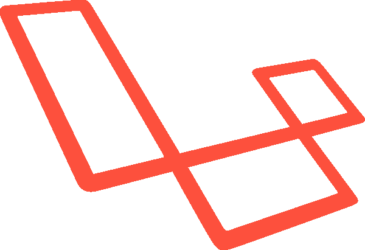
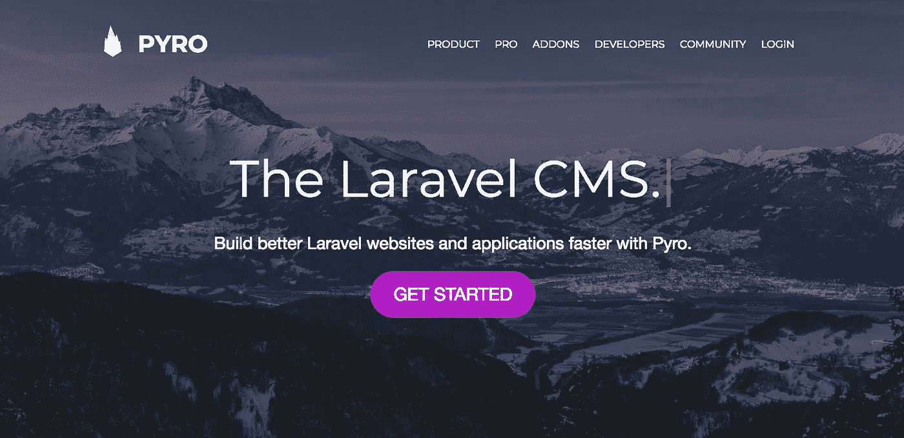
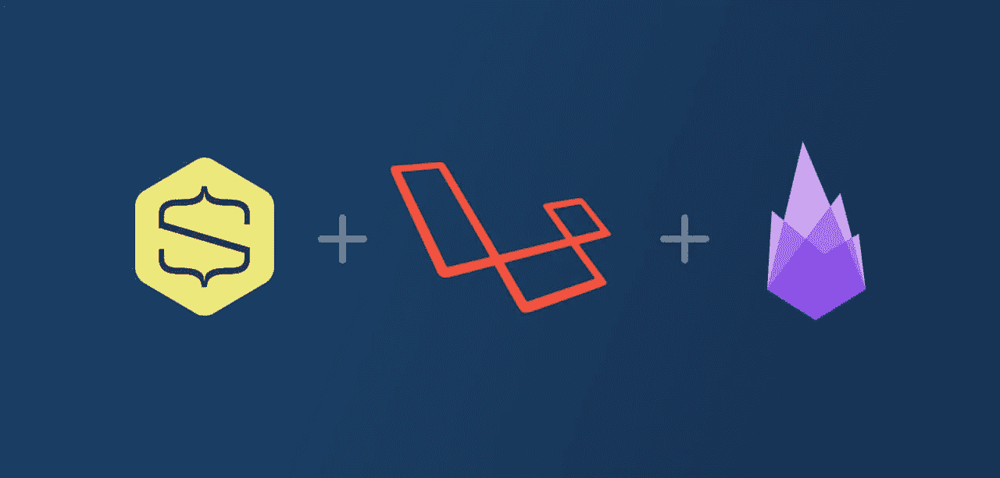
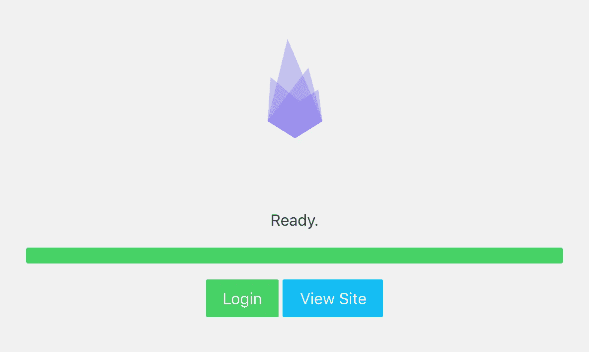
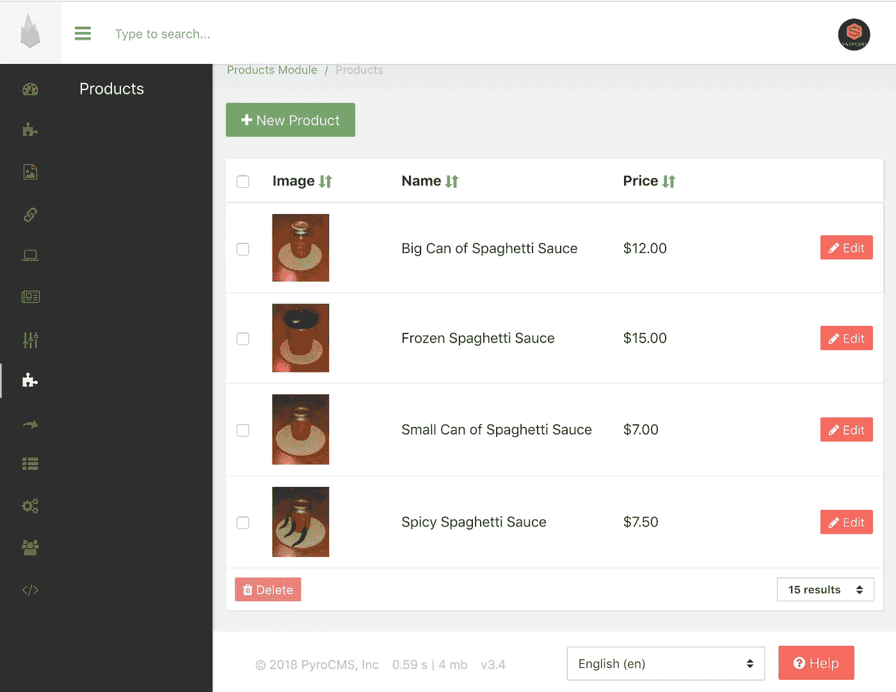
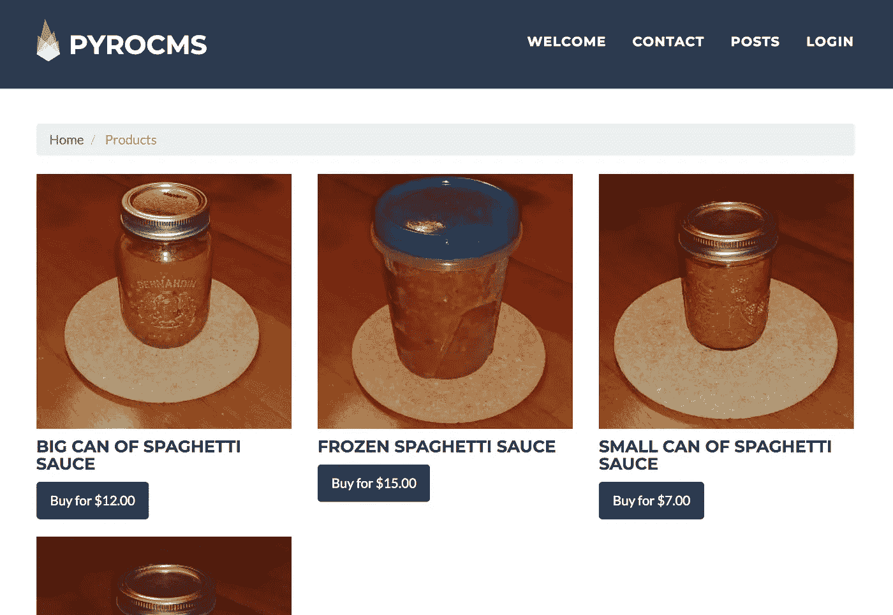
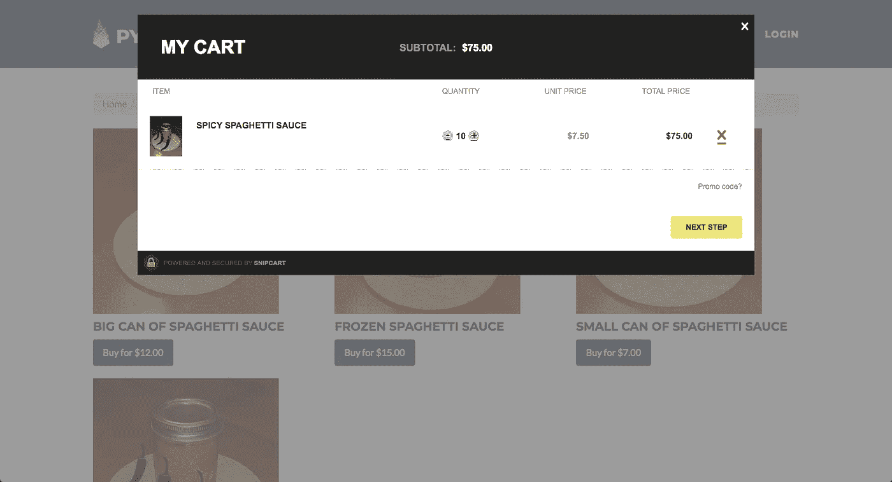

# 使用 PyroCMS 的 Laravel 电子商务教程[现场演示]

> 原文：<https://medium.com/hackernoon/laravel-e-commerce-tutorial-with-pyrocms-live-demo-538bf0a703f4>


Photo by [Julien Millet](https://unsplash.com/photos/HYBOqyse6EU?utm_source=unsplash&utm_medium=referral&utm_content=creditCopyText) on [Unsplash](https://unsplash.com/search/photos/lava?utm_source=unsplash&utm_medium=referral&utm_content=creditCopyText)

“我厌倦了所有对 PHP 的厌恶。你可以用任何语言写 sh*tty 代码。”

那是我们队里唯一的 PHP 后卫，兰亭。

"大多数时候，问题出在程序员身上，而不是编程语言."

又是他——基本上是对的。

“有没有试过用 Laravel 做点什么？*牛逼*框架&社区。”

自从我早期编程以来，PHP 取得了巨大的飞跃。我也没有花时间跳回到它的现代环境中(忙着[涉足 Vue.js](https://snipcart.com/blog/progressive-migration-backbone-vuejs-refactoring) 重构&原型)。

所以今天，这正是我要做的。

怎么会？**通过创建一个 Laravel 电子商务网站**。

我将使用 Laravel 驱动的 PyroCMS & Snipcart 来帮助我做到这一点。

碰巧这个周末我做了一大堆意大利面酱。我永远也吃不完，所以为什么不在网上卖剩余的呢！

在本教程中，我将向您展示:

*   如何建立一个 PyroCMS 演示网站
*   如何给 PyroCMS 添加电子商务面板
*   如何在项目前端显示 Snipcart 产品
*   如何在 PyroCMS 中使用 webhooks 和 Laravel 控制器
*   如何在结帐时使用 Snipcart 的自定义验证

看看我生疏的 PHP 技能能否盖过我的厨艺。

# Laravel &电子商务:快速上下文



对于那些还不知道的人: **Laravel 是一个开源的 PHP web 框架，用于构建网站& web 应用**。

它有一个平滑的学习曲线，消除了一些用 PHP 构建的怪癖，有许多现代的内置库。有人说它相当于 Ruby on Rails PHP。

*想在开始这个 tuts 之前熟悉一下 Laravel 吗？查看* [*这篇文章*](https://selftaughtcoders.com/from-idea-to-launch/lesson-17/laravel-5-mvc-application-in-10-minutes/)*——向你展示如何在 10 分钟内构建一个简单的 MVC 应用程序<。*

有了 Laravel，你可以利用 [Composer](https://getcomposer.org/) 来管理依赖&包。许多有用的软件包将允许你快速跟踪你的 Laravel 应用程序或网站开发。想想调试、认证、API 交互等等。像[Packagist](https://packagist.org/)&[packapyst](https://packalyst.com/)这样的网站是找到有用的 Laravel 软件包的很好的资源。

# Laravel 上的电商？

当然，还有针对 Laravel 的电子商务包。像 [Mage2](https://github.com/mage2/laravel-ecommerce) 和 [Aimeos](https://github.com/aimeos/aimeos-laravel#aimeos-laravel-package) 这样的热门应用可以帮助你在 Laravel 应用上设置电子商务功能。

因此，你在 Laravel 的电子商务选择非常多:

1.  使用 Laravel 的框架从头开始构建您自己的电子商务应用程序。
2.  使用电子商务包来扩展您的应用程序。
3.  选择一个 Laravel 驱动的 CMS，并添加自定义电子商务。

**第一个？耗时**。我可以在拉勒维尔做一个完整的电子商务应用程序。但是我没有时间从头开始编写代码——我需要一个 MVP 来尽快测试意大利面酱市场！

**第二个？居然有意思**。我们可能会在另一篇文章中这样做！

**第三个？这就是我们在这里做的。它将通过有用的捷径加快我们的发展(PyroCMS 搭建网站；Snipcart 抽象电子通信逻辑&后端)。**

我真的很高兴能在这个演示的 Laravel 项目中操作。与我们的许多 jam stack/static site tut 不同，为我们的商店处理任何后端逻辑都很容易。

*编者按:如果你正在用 Laravel 建立一个简单的订阅业务，请查看* [*Laravel 收银台*](https://laravel.com/docs/5.5/billing) *，或者* [*我们自己的订阅功能*](https://docs.snipcart.com/configuration/recurring-and-subscription-plans-definition) *。*

# 关于 PyroCMS 的一句话



我以前使用 PHP CMS 的经历并不是很好。然而，我听说过很多关于 Pyro 的好东西。因为我需要一个 Laravel 驱动的工具来做这个 tuts，所以选择它是显而易见的。

[PyroCMS](https://pyrocms.com/) 是专门为 Laravel 打造的 PHP CMS。它是麻省理工学院许可下的开源软件，配备了许多有用的功能。

本着透明的精神，以下是其他基于 Laravel 的 CMS:

*   十月 CMS ( [见我们的 tuts](https://snipcart.com/blog/snipcart-octobercms-ecommerce-tutorial-got) )
*   AsgardCMS
*   熔岩
*   典型的
*   Statamic ( [参见我们的 tuts](https://snipcart.com/blog/integrating-e-commerce-on-statamic-flat-file-cms) )

# Laravel 电子商务教程:构建 PyroCMS 演示商店



## 先决条件

对于本教程，您需要:

*   对 PHP 作为编程语言的基本理解
*   安装了 PHP 和 [Composer](https://getcomposer.org/) 的网络服务器
*   这个项目的数据库(我正在使用 MySQL)
*   [一个 Snipcart 账号](https://app.snipcart.com/register)(测试模式下永远免费)

# 步骤 1:安装 PyroCMS

首先用 Composer 搭建一个 PyroCMS 项目。

`composer create-project pyrocms/pyrocms pyro_demo`

将 web 服务器的根文件夹设置为项目的`public`文件夹。确保它可以写入`public/app`、`bootstrap/cache`和`storage`文件夹。熟悉 Laravel 的人会认出它的目录结构。如果你是 PyroCMS 的新手，准备好被它的快速运行所折服吧。

访问您的网站，使用内置的安装程序来配置 Pyro 与您的网站信息和数据库设置。



现在您可以从`composer.json`中移除`anomaly/installer-module`依赖项，然后运行`composer update`。

# 步骤 2:为产品构建电子商务面板

尽管我们有一个 Laravel 项目可以玩，PyroCMS 建议将新的功能分割成*插件*。对于一个大项目来说，为不相关的功能添加一些插件是一个好主意。这里，我们将使用 [artisan 命令](https://laravel.com/docs/5.0/commands)创建一个产品模块:

```
php artisan make:addon snipcart.module.products
```

这将生成文件夹`addons/{your site slug}/snipcart/products-module`。从现在开始，大部分路径都是相对于这个文件夹的。

Pyro 的核心是流的概念——本质上是内容的集合。我们的插件定义了一个我们与 artisan 一起搭建的`products`流:

```
php artisan make:stream products snipcart.module.products
```

这些命令产生了一些新元素。让我们先来看看我们的 addon 中的`migrations`文件夹，在这里我们只需要添加一些东西就有了一个完整的产品管理后端。

继续在`{date}_snipcart.module.products__create_products_fields.php`中定义产品的字段。它们是使用[内置的烟火](https://pyrocms.com/documentation/categories/field-types)字段类型定义的。

我们的产品将有 SKU，名称，价格，描述，图像和标签:

我们还必须将它们添加到`{date}_snipcart.module.products__create_products_stream.php`中的`$assignments`参数中，这样它们就会出现在我们的管理表单中。

我们可以在控制台输入`php artisan addon:install products`来安装插件。这足以在 CMS 管理中添加/编辑产品！

> *如果您以后要对迁移进行更改，您可以使用* `*php artisan migrate:refresh --addon=products*` *来刷新它们。*

但是我们还可以做更多的事情来改善编辑体验。

让我们在产品列表中添加产品图片。编辑`src/Product/Table/ProductTableBuilder.php`中的`$columns`:

我们可以通过使用字段的名称来显示字段的存储值，或者通过使用*赋值*来格式化它。后者计算字符串，并允许我们为字段值调用 presenter 方法(这里:`currency`显示美元符号，`preview`显示调整大小的图像)。

看起来不错！



# 步骤 3:在 PyroCMS 网站上展示产品

我们将使用 [Twig](https://twig.symfony.com/) 的模板引擎添加一个视图，然后用一个控制器和 route 连接它。创建使用默认布局的产品视图，并在`resources/views/products/index.twig`中添加一些引导类:

接下来是`src/Http/Controller/ProductsController.php`中一个非常简单的控制器:

对于路线，将`products`路线添加到`src/ProductsModuleServiceProvider.php`中为管理员生成的路线中:

我们走吧！如果我们参观`/products`看起来不错:



我们还需要一个链接到这个页面。通过创建文件`{project root}/resources/{site slug}/addons/pyrocms/starter-theme/views/partials/navigation.twig`覆盖导航模板:

这里我们复制了原始模板，并简单地添加了:

# 步骤 4:集成 Snipcart 和 PyroCMS

只需几个步骤就可以将这些购买按钮转换成[正确定义的 Snipcart 产品](https://docs.snipcart.com/configuration/product-definition)。

首先，我们需要一个地方来存储我们的 API 密钥。通过创建文件`resources/config/setting.php`为模块添加一个设置条目:

该设置可在*设置模块>模块>产品模块*下的管理中访问。

我们准备覆盖`{project root}/resources/{site slug}/addons/pyrocms/starter-theme/views/partials/scripts.twig`中的`scripts`模板，以添加 [Snipcart 所需的文件](https://docs.snipcart.com/getting-started/installation):

要将 Snipcart 的物品属性注入购买按钮，修改`ProductPresenter`以在`src/Product/ProductPresenter.php`中添加一个`buyButton`方法:

这个文件中有很多内容(尤其是如果您是 Pyro 新手的话):

1.  在 Presenter 的构造函数中通过依赖注入接收`HtmlBuilder`
2.  使用我们来自`$this->object`的产品条目
3.  使用 Pyro 的`FilesModule`工具构建裁剪图像的 URL
4.  将所有产品数据转移到各自的 Snipcart 属性
5.  最后构建按钮(`<a ...>`)元素

我们现在可以在`resources/views/products/index.twig`中更新我们的产品视图，给演示者打电话:

```
{{ product.buyButton('Buy for '~product.price.currency(), {'class': 'btn btn-primary'})|raw }}
```

我美味的意大利面酱现在可以买到了！

# 步骤 5:在结帐时添加自定义验证

在网上卖食品——或者其他任何东西——经常会遇到各种各样的挑战。例如，冷冻食品不能长途运输。额外的辛辣食物必须附有警告。诸如此类。

因此，首先让我们通过使用我们新的[定制验证特性](https://docs.snipcart.com/javascript-api-reference/custom-validation)来添加一些虚拟检查。我们将防止顾客点对他们来说太辣的产品:

该代码过滤掉`cart-content`页面上的验证事件，并向带有`spicy`标签的产品添加一个错误。它进入`resources/js/validation.js`，我们给`scripts.twig` : `{{ asset_add("scripts.js", "snipcart.module.products::js/validation.js") }}`添加另一行。

现在去冷冻物品检查和拉勒维尔土地

我们之前制作的 ProductsController 实际上扩展了一个 Laravel 控制器，添加了一些来自 PyroCMS 的好东西。当您查看来自 PyroCMS 的`BaseController`的源代码时，您会看到来自`Illuminate`名称空间的所有东西都连接到控制器。现在让我们通过直接扩展基本的 Laravel 控制器并只添加我们需要的东西来创建一个简单的 [shipping webhook](https://docs.snipcart.com/webhooks/shipping) 。

在`src/Http/Controller/ShippingController.php`中创建该控制器:

所以`ShippingController`只使用来自`Illuminate`的类。这是一个普通的老式 Laravel 控制器，它检查 Snipcart 的输入数据，并确定我们是否必须返回错误消息或运费。与`ProductsController`一样，我们在模块的服务提供者中添加了一个路由:`'webhooks/shipping' => 'Snipcart\ProductsModule\Http\Controller\ShippingController@webhook',`。

# 现场演示和 GitHub 回购

我们完事了。

我们在这里讨论了很多东西。但是它应该让您大致了解如何将 Snipcart 与 PyroCMS 集成，并使用 Laravel 的更多常规功能。



> [*参见 GitHub 上的开源回购*](https://github.com/snipcart/snipcart-pyrocms-demo) *。*
> 
> [*看现场演示这里*](http://snipcart-pyrocms-demo.herokuapp.com/products) *！*

# 结束语

这个项目和管理界面在不到 3 个小时的时间内就运行了，我之前没有任何使用 Pyro 的经验。整个过程花了两天时间。主要是因为我真的想通过从模块中注入我们的脚本标签来集成 Snipcart，而不是编辑主题模板。

我有一个爆炸建设这个 tuts 的管理。我不认为这个过程可以变得更容易，所以称赞 Pyro！

由于不太了解 Laravel，我很难区分 PyroCMS 的结束和 Laravel 的开始。您必须熟悉 PyroCMS 的源代码，以描绘出如何完成那些仅通过查看文档不容易理解的事情的方法。

如果我有更多的时间花在这个演示上，我会探索管理员的许多内容管理功能。很多可以直接从管理完成，没有太多的代码。一个很酷的测试是将产品分配给特别标记的博客帖子！

*本帖最初发表在* [*Snipcart 博客*](https://snipcart.com/blog/laravel-ecommerce-tutorial-pyrocms-demo) *和* [*本报快讯*](https://us5.list-manage.com/subscribe?u=c019ca88eb8179b7ffc41b12c&id=3e16e05ea2) *。*