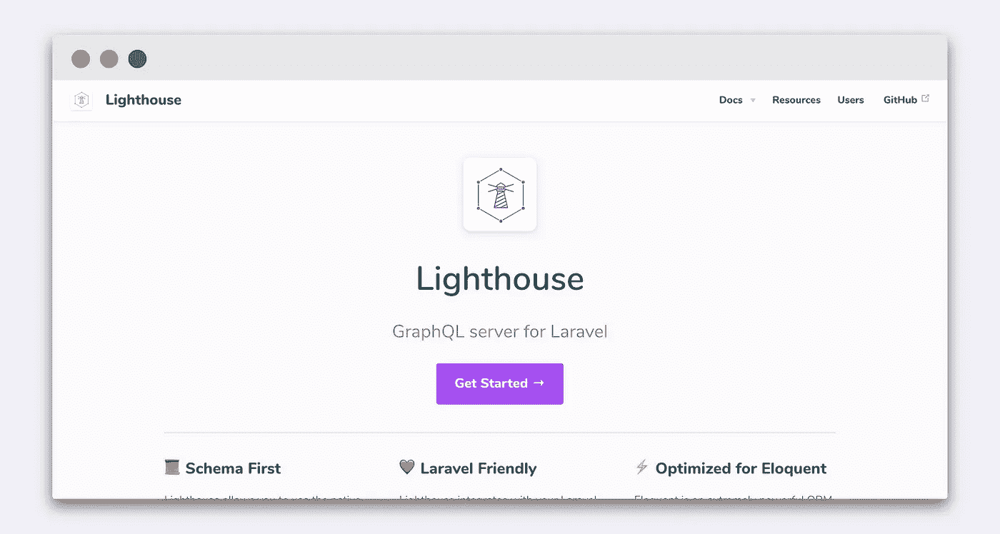

# Laravel GraphQL Gotchas

> 原文：<https://medium.com/hackernoon/laravel-graphql-gotchas-1d32f69b997b>



对于我正在进行的一个新项目，我必须用 Laravel 编写一个 GraphQL API。我引入了 Lighthouse GraphQL 服务器包，几周前,[Laravel News 报道了这个包,](https://laravel-news.com/lighthouse-graphql-server-for-laravel)并开始跟踪文档。虽然大多数事情都像我预期的那样工作，但我花了相当多的时间调试一些没有并且没有在任何地方记录的问题，所以在我弄清楚它们之后，我认为这篇文章可以帮助面临相同情况的其他人。

# 密码长度检查

想象一下，你有一个创建用户的变种，来创建用户。它使用`@bcrypt`指令(由 Lighthouse 提供)让我们的生活变得更简单:代码如下:

```
type Mutation {
     createUser(
         name: String @rules(apply: ["required"])
         email: String @rules(apply: ["required", "email", "unique:users,email"])
         password: String @rules(apply: ["required", "string", "min:6", "max:255"]) @bcrypt
     ): User @create(model: "App\\User")
}
```

您可能会认为包含两个字符的密码会引发错误，但它实际上是有效的。显然，客户端散列密码，然后执行验证。作为一种变通方法，您可以通过执行`php artisan lighthouse:mutation CreateUser`将迁移的逻辑移动到一个控制器，然后手动散列并创建一个用户。

```
**<?php** namespace App\Http\GraphQL\Mutations;use App\User;
use GraphQL\Type\Definition\ResolveInfo;
use Nuwave\Lighthouse\Support\Contracts\GraphQLContext;class CreateUser {
     public function resolve($rootValue, array $args, GraphQLContext $context = null, ResolveInfo $resolveInfo)
     {
         return User::create([
             'username' => $args['username'],
             'email'    => $args['email'],
             'password' => bcrypt($args['password']),
         ]);
     }
 }
```

# 政策

Lighthouse 提供了一个`@can`指令来检查用户是否被授权执行指定的操作，但是它只对通用模型有效(这意味着您可以检查用户是否有创建模型的权限，但是您不能检查对单一模型的删除等权限)。解决这个问题的方法是，再次将您的变异/查询移动到一个控制中，并检查那里的权限。

```
**<?php** namespace App\Http\GraphQL\Mutations;use App\SecureResource;
use GraphQL\Type\Definition\ResolveInfo;
use Nuwave\Lighthouse\Support\Contracts\GraphQLContext;class DoSecureStuff {
     public function resolve($rootValue, array $args, GraphQLContext $context = null, ResolveInfo $resolveInfo)
     {
         abort_unless(request()->user()->can('update', SecretResource::find($args['id']));
         // do stuff
     }
}
```

# 组织路由

如果你在一个相对较大的项目中使用这个库，你的`schema.graphql`可能是一个+200 LOC 的烂摊子。如果你想稍微整理一下，你可以把它分成更小的文件，比如`user.graphql`或者`pages.graphql`，然后把它们包含在你的主模式中:

```
#import user.graphql
#import pages.graphql
#import something-else.graphql
```

但是要小心！只能有一个`Query`和一个`Mutation`类型。你必须扩展其他的:

```
extend type Query {
    pages: [Page!]! @paginate(type: "paginator" model: "App\\Page")
}extend type Mutation {
    deletePage( id: ID! @rules(apply: ["required"]) ): User @delete(model: "App\\Page")
}
```

# 调试 GraphQL 错误

这个库非常难以调试，因为 GraphQL 处理程序捕捉所有错误以避免客户端失败，并返回`null`而不是结果。为了克服这个问题，您可以更新包的配置文件(`lighthouse.php`):

```
/*
     |--------------------------------------------------------------------------
     | Debug
     |--------------------------------------------------------------------------
     |
     | Control the debug level as described in [http://webonyx.github.io/graphql-php/error-handling/](http://webonyx.github.io/graphql-php/error-handling/)
     | Debugging is only applied if the global Laravel debug config is set to true.
     |
     */
-    'debug' => Debug::INCLUDE_DEBUG_MESSAGE | Debug::INCLUDE_TRACE,
+    'debug' => Debug::INCLUDE_DEBUG_MESSAGE | Debug::RETHROW_INTERNAL_EXCEPTIONS
```

# 结论

虽然它仍然需要一些工作，但是这个包使得用 Laravel 开发 GraphQL APIs 变得非常容易。而且，如果你在一个项目中使用这个库，我建议你花五分钟的时间给合作者写一封感谢信。他们一定会很感激的！

*原载于* [*我的博客*](https://miguelpiedrafita.com/laravel-graphql-gotchas/) *。*