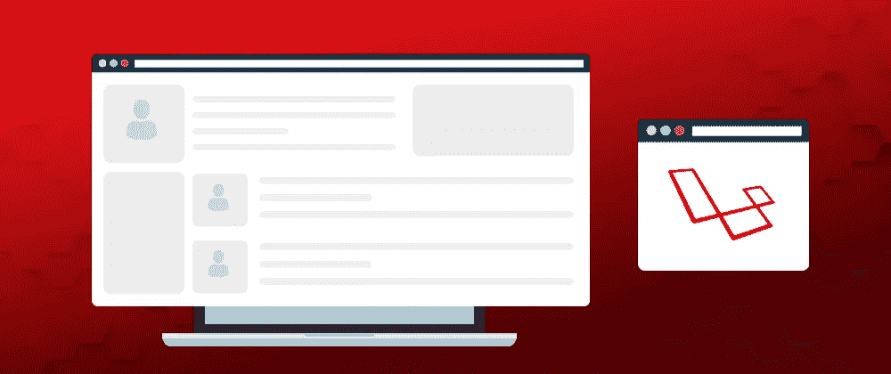
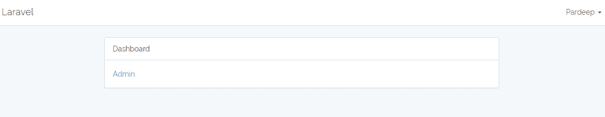
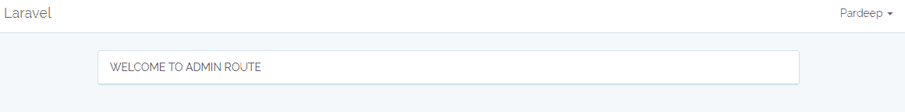
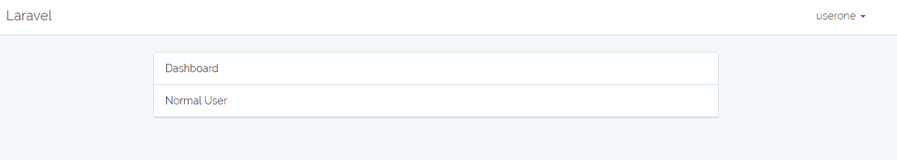

# 使用中间件在 Laravel 5.5 中创建多重认证

> 原文：<https://medium.com/hackernoon/laravel-multiple-authentication-80daa855322b>

每个 web 应用程序都有一组预定义的用户，他们具有不同的角色和权限。为了验证用户，应用程序需要有身份验证模块或功能。使用中间件，您可以很容易地在 Laravel 中实现多重认证。



在本文中，我将演示中间件的功能。更具体地说，我将展示如何验证管理员用户和普通用户。

# 中间件

在网络应用中，开发人员经常需要在特定 URI 的请求命中期间实现一些功能。实际上，它就像开发人员在用户请求和应用程序响应之间放置的层。 **Laravel 5.5 中间件为此提供了一个非常灵活的应用编程接口**。此外，开发人员可以很快实现定制中间件。他们只需要发射一个指令，拉沃尔就准备好了。自定义逻辑被放在一个函数中，并在应用程序中定义。

# 先决条件

出于本教程的目的，我假设您在 web 服务器上安装了一个 PHP 应用程序。我的设置是:

*   PHP 7.1
*   关系型数据库
*   Laravel 5.5

为了确保我可以专注于教程而不会被服务器设置和管理问题所困扰，我决定将我的 Laravel 应用程序托管在 Cloudways 托管服务器上，因为它们负责服务器级别的问题，并且有一个强大的开发堆栈，该堆栈是为托管 Laravel 而优化的[。](https://www.cloudways.com/en/laravel-hosting.php)

# 创建 Laravel 项目

如果您在 Cloudways 之外的主机提供商上或在本地主机上，请打开 Command 终端并输入以下命令来创建 Laravel 应用程序:

```
composer create-project — prefer-dist laravel/laravel blog “5.5.*”
```

# 配置数据库

成功安装 Laravel 应用程序后，下一步是数据库配置。让我们开门。 **env** 文件和 **config/database.php** 文件，并在这些文件中设置数据库凭据。

# 设置管理中间件

接下来，在数据库/迁移/…user.php 中打开用户迁移，并为 Admin 更新以下字段。

```
$table->boolean(‘isAdmin’)->nullable();
```

# 运行迁移

创建数据库并添加配置设置后，运行以下命令在数据库中创建表。

```
Php artisan migrate
```

# Laravel Auth

Laravel 提供了一个用于注册和登录的内置认证系统。只需在终端输入以下命令:

```
Php artisan make:auth
```

# 创建中间件管理员

通过键入以下 Laravel 命令创建一个中间件:

```
php artisan make:middleware Admin
```

接下来，转到 **app/Http/中间件/admin . PHP。**您会注意到该文件已经包含了 Laravel 提供的样板代码。在这段代码中，您只需要处理一个函数，即**句柄()。**用以下代码更新本功能的代码:

```
public function handle($request, Closure $next){if(auth()->user()->isAdmin == 1){return $next($request);}return redirect(‘home’)->with(‘error’,’You have not admin access’);}
```

现在，在 **app/Http/Kernel.php 中注册这条路线。**使用以下内容更新$ routeMiddleware 属性:

```
<?php// Kernel.phpprotected $routeMiddleware = [‘auth’ => \Illuminate\Auth\Middleware\Authenticate::class,‘auth.basic’ => \Illuminate\Auth\Middleware\AuthenticateWithBasicAuth::class,‘bindings’ => \Illuminate\Routing\Middleware\SubstituteBindings::class,‘can’ => \Illuminate\Auth\Middleware\Authorize::class,‘guest’ => \App\Http\Middleware\RedirectIfAuthenticated::class,‘throttle’ => \Illuminate\Routing\Middleware\ThrottleRequests::class,‘admin’ => \App\Http\Middleware\Admin::class,];.?>
```

# 配置受管理保护的路由

接下来，我将为 admin 创建路由。打开 **routes/web.php** 文件，在其中输入以下代码:

```
Route::get(‘admin/routes’, ‘HomeController@admin’)->middleware(‘admin’);
```

# 创建控制器

让我们打开**app/http/controller/home controller**，更新以下方法。

```
public function index(){return view(‘home’);}public function admin(){ return view(‘admin’); }
```

# 创建主视图

设置好受保护的管理路径后，打开**资源/视图/home.blade.php** 文件并更新以下代码:

```
@extends(‘layouts.app’)@section(‘content’)<div class=”container”>@if(\Session::has(‘error’))<div class=”alert alert-danger”>{{\Session::get(‘error’)}}</div>@endif<div class=”row”><div class=”col-md-8 col-md-offset-2"><div class=”panel panel-default”><div class=”panel-heading”>Dashboard</div><?php if(auth()->user()->isAdmin == 1){?><div class=”panel-body”><a href=”{{url(‘admin/routes’)}}”>Admin</a></div><?php } else echo ‘<div class=”panel-heading”>Normal User</div>’;?></div></div></div></div>@endsection
```

在这段代码中，我使用了**if(auth()->user()->is admin = = 1)**来检查用户配置文件。如果是**管理**、**、**将导航到管理区。否则，它将重定向到用户区。

# 创建管理视图

在视图文件夹的**根中创建一个名为**admin.blade.php**的视图，并向其中添加以下代码:**

```
@extends(‘layouts.app’)@section(‘content’)<div class=”row”><div class=”col-md-8 col-md-offset-2"><div class=”panel panel-default”><div class=”panel-heading btn-primary”>WELCOME TO ADMIN ROUTE</div></div></div></div>@endsection
```

# 管理员授权

要设置 admin auth，首先通过 Laravel register 注册一个用户，然后将 **isadmin** 的状态更改为“1”。接下来，登录应用程序:



# 用户授权

以下是用户身份验证的结果:



我希望现在您可以轻松地在 Laravel 项目中设置多重身份验证。如果你需要帮助，请留言，我会尽快回复你！