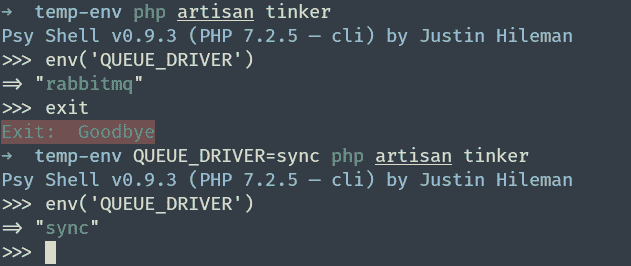

# 如何临时更改 Laravel 环境变量而不更新？环境文件

> 原文：<https://medium.com/hackernoon/laravel-tips-how-to-temporarily-change-a-laravel-environment-variable-without-updating-the-env-ebc3b42d1804>

想象以下场景:您正在开发一个 laravel 应用程序，它将一些作业分派到一个队列中。您在日志文件中注意到一个特定的作业抛出了一个异常，但是您不能直接调试它(例如用`dd()`),因为这个作业被其他地方的一个工人使用了。

调试这个问题的一种方法是将您的`.env`文件中的`QUEUE_DRIVER`环境变量改为`sync`，进行调试，然后在您完成后恢复更改。

或者假设您有一个测试数据库，您需要首先在其上运行迁移，并且您需要更新`.env`文件以首先使用测试数据库，运行迁移，然后恢复更改。

如您所见，在这两种情况下，我们需要做的只是临时更新环境变量。通常，更新`.env`文件需要一些时间(您甚至可能需要清除配置或重启一些工作程序)。

幸运的是，可以将一个环境变量传递给 linux 命令，这些变量将只用于当前的执行。

在前面的示例中，我们要做的就是执行如下命令:

`QUEUE_DRIVER=sync php artisan my-artisan-command-here`

你可以用 tinker 自己测试一下。

您甚至可以像这样传递多个环境变量:

`QUEUE_DRIVER=sync DB_DATABASE=testing php artisan my-artisan-command-here`

如您所见，这并不是 laravel 特有的技巧，只要您发现自己需要临时更改环境变量，就可以使用它。

我希望你会觉得这有用。

