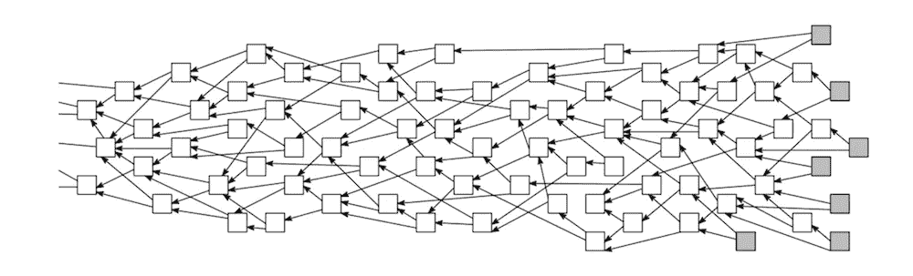
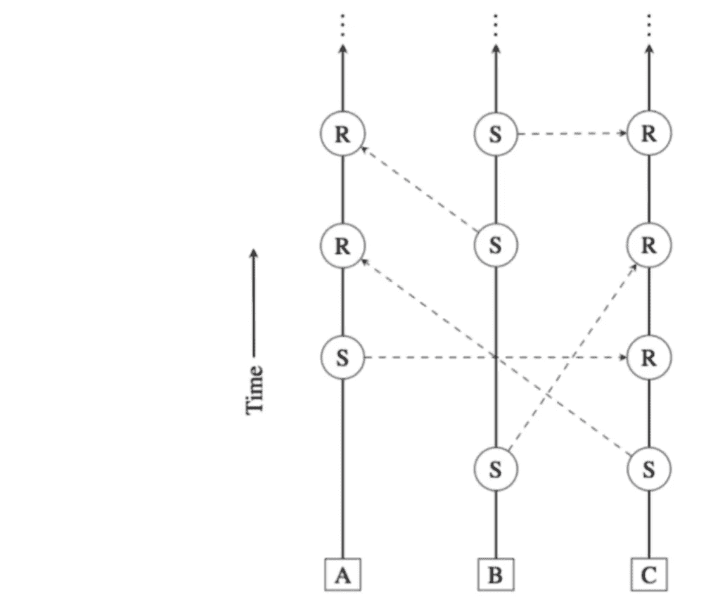

# 不同加密货币中的潜伏期和终结性

> 原文：<https://medium.com/hackernoon/latency-and-finality-in-different-cryptocurrencies-a7182a06d07a>

## 一笔交易第一次确认需要多长时间，有没有达到不可逆的状态？

在过去的 9 年中，我们已经看到了几种解决分布式分类账的一般问题的方法。在分析这些共识协议时，有许多指标需要考虑，但在本文中，我将重点关注其中的两个:

*   **等待时间** —从交易的创建到最初确认其被网络接受所花费的时间(以及接受的置信度如何随时间增加)；
*   **终局性**——交易一旦*完成*，就无法恢复(或变更)的属性。基本上，这是参与转让的各方可以认为交易已经完成的时刻。终局性可以是*确定性的*或*概率性的*。

设计现实生活中的支付系统时，低延迟至关重要。当你用密码购买星巴克咖啡时，你不会真的想等 10 分钟。对于小额付款，商家可能会在交易最初确认时接受付款，前提是他们对付款最终会被接受有相当高的信心。

然而，对于大额资金转移，资金接收方可能希望等待交易变得不可逆转。或者至少，足够的时间应该过去，直到达到*概率*终结。

在金融行业，机构需要知道，最好是尽快知道，他们是否真正拥有某些资产。如果使用公共分布式账本技术(DLT)来存储所有权信息，机构还需要确保无法恢复某项交易，从而失去所有权。

接下来，我将介绍一些最流行的共识协议，分析它们的延迟，并检查它们是否达到终结，以及这如何影响它们的安全性。

# 比特币

比特币协议被设计成大约每 10 分钟添加一个新块。当一个新的事务被创建时，没有办法确认它，直到它被包含在一个块中。因此，比特币的等待时间非常长，对于最终用户来说，甚至从比特币 ATM 机中取款也是一个耗时的过程。

关于终结性，这听起来可能令人惊讶，但大多数基于区块链的协议(包括比特币)不具有确定性终结性。对于任何给定的块，理论上有可能在该块之前开始的更长的链将通过网络传播。由于协议规定节点应始终接受最长的链作为有效链，这意味着初始链中不属于第二个更长的链的所有块都将被丢弃。

然而在实践中，有一个非常简单的方法可以让*在概率上*认为一个交易是最终的:只需等待 **6** 确认模块。看看这个数字背后的逻辑很有意思。

让我们假设有一个攻击者控制了总采矿能力的三分之一。如果我们看一下[当前的挖掘池](https://btc.com/stats/pool?pool_mode=day3)，这个假设是相当现实的，我们可以看到，我们有一个池几乎持续地控制着几乎 30%的散列能力。如果攻击者想要针对某个特定的事务，那么在创建该特定事务的那一刻，攻击者就开始挖掘替代链。

我运行了比特币[白皮书](https://bitcoin.org/bitcoin.pdf)最后呈现的代码，是 Satoshi 自己写的。我得到了以下关于交易不被攻击者撤销的概率的结果:

*   等待 1 个确认块后约 30.3%
*   大约 77.6%在等待 6 个确认块之后
*   等待 10 个确认模块后，约为 90.2%
*   等待 45 个确认块后，约为 99.99%

考虑到普遍认为 6 个确认块就足以认为一个交易是最终的，一旦 6 个确认块被添加到诚实链中，以下是根据攻击者控制的散列能力的百分比显示安全级别的一些数字:

*   如果攻击者控制了 8%的哈希能力，大约为 99.99%
*   如果攻击者控制了 25%的哈希能力，则大约为 95%
*   如果攻击者控制了 33%的哈希能力，则大约为 78.68%
*   如果攻击者控制了 40%的哈希能力，则大约为 49.6%
*   大约 4.06%，如果攻击者控制了 49%的哈希能力

从上面的两张图表中可以看出，随着更多的确认块被添加到链中，概率接近 1，并且随着诚实方控制更多的网络散列能力，概率增加。交易方可以选择他们自己的确认块数，以确保交易永远不会被恢复，但大多数人接受的普通值是 6(大约。1 小时的等待时间)。

# 主要的

在基于区块链的协议中，事务进入一个池，当一个挖掘器设法解决散列难题时，它可以选择在下一个块中哪些事务将被网络接受。

在 Stellar 协议中，网络节点独立地为每个交易投票，而不是拥有一个未经确认的交易池。当然，每当有事务发生时，让每个节点都与其他单个节点进行通信并不能真正扩展。

为了解决潜在的可扩展性问题，Stellar 允许每个节点选择它信任的其他节点的子集，并只咨询那些关于新事务的节点。只要对网络有足够的信任，就会达成共识，投票就是最终的。

延迟和终结同时发生，但该协议对信任的依赖意味着*他们实际上正在解决一个不同的、比比特币更弱的问题*。他们的网络目前只有大约 30 个节点，因此可扩展性仍然是一个有待在[未来](https://hackernoon.com/tagged/future)网络增长时证明的问题。现在，投票大约需要 5 秒钟。

# 极微小

IOTA 是第一批挑战区块链整个想法的项目之一，提出了他们自己的分布式账本技术。

IOTA’s Tangle is a Directed Acyclic Graph (DAG)

他们项目的承诺是:

*   *可伸缩性*:由于事务的并行验证，它应该能够实现高事务吞吐量
*   *去中心化*:它没有挖掘器，取而代之的是每一个事务都被用来确认和验证之前的两个事务。
*   *无交易费*:相反，IOTA 要求每笔交易都有一些简单的工作证明

按照协议的设计方式，没有实际的终结，但是随着其他事务在其上创建，一个事务变得越来越确定。所以有点类似于久而久之的区块链，交易被拒绝的概率降低了。

围绕 IOTA 项目的一个大问题是，他们实际上依赖于他们的基金会拥有的一个名为“协调者”的节点。之所以需要协调器，是因为攻击者很容易获得超过三分之一的总散列能力。

该团队声称这绝不是集中的，但我不敢苟同。如果只有一个步骤出现单点故障，则**系统不分散**，即使协议的所有其他步骤都分散。IOTA 目前仅在协调器被网络中的所有其他节点信任的情况下工作。

# 纳米(以前的 RaiBlocks)

Nano 是另一个有趣的项目，它使用一种新的方法来维护分布式账本——他们称之为 block-lattice。

基本上，每个帐户都有自己的链，用于维护应用于该特定帐户的有序交易列表。

货币转账涉及到两个交易的创建:一个是汇款人的账户，另一个是收款人的账户。只有当两个事务都被网络确认和接受时，传输才完成。

因为交易没有明确的投票，所以 Nano 没有任何终结系统。每当发现重复花费，就启动投票程序。没有什么可以阻止网络使用他们的投票权随时修改账户链，所以你可能会在转账开始后几周内失去你的钱。

关于 Nano 协议还有几个其他的安全问题(其中一些甚至在他们的白皮书中提到了)，但是就本文的范围而言，我只想集中讨论它们的不确定性。与比特币或 IOTA 不同，时间的流逝并不能保证交易的不可逆转性，这使得它成为最弱的协议之一。

# 眨眼

在[眨眼](https://blink.network/)时，我们试图从所有其他协议的弱点中学习，并提出了我们自己的共识协议，即**高度可扩展**并具有**低延迟**，同时保持**去中心化**和**安全**。

该协议的主要基本思想之一是独立的交易可以独立地应用于分类帐。每个账户都有一个名为 *locker* 的监管节点，负责维护该账户的交易顺序。

最初，只有两个储物柜(针对两个受影响的帐户)接受并签署交易。因此，交易的初始确认是在**300–600 毫秒**之后。拥有高吞吐量(我们当前的原型支持每秒 20 000 个事务)意味着事务费用将会很低——如果没有达到最大吞吐量，可能等于 0。

> *低延迟加上低费用使现实生活中的支付和微交易成为可能。*

在一个事务最初由两个节点签名后，随着节点的同步，它会通过网络传播。经过的时间越长，接收和应用过去事务的节点的百分比就越高。经过一段时间后，网络会对过去某个时间的整个州进行投票。设法到达大多数节点的事务将被包括在投票中，从而达到终结。在我们当前的原型实现中，这发生在不到 5 秒的时间内。

## 感谢您花时间阅读这篇文章。如果你对我们在 Blink 的工作感兴趣，请查看我们的官方[媒体页面](https://medium.com/blinknet)，在那里你可以找到更多关于我们协议内部工作的帖子。