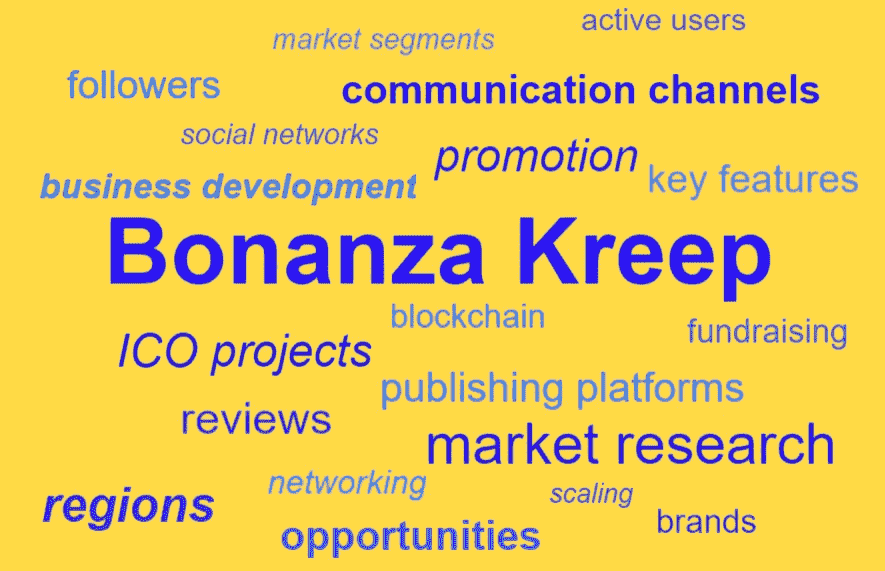
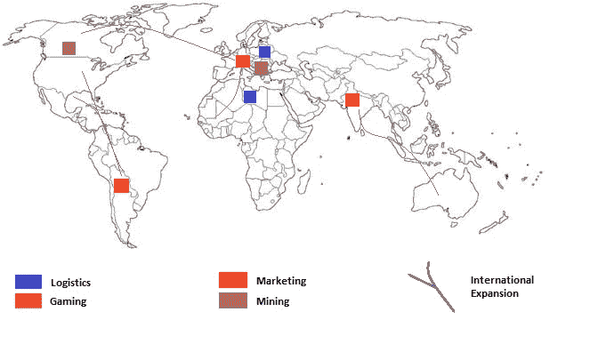
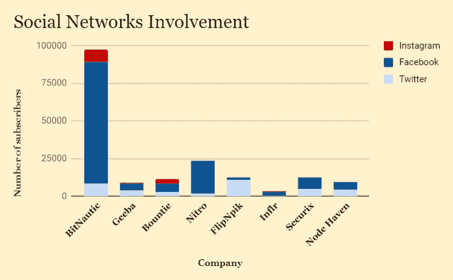

# 区域加密货币的最新趋势:透过区域特殊性的视角看 ico

> 原文：<https://medium.com/hackernoon/latest-regional-cryptocurrencies-trends-icos-through-the-lenses-of-the-regional-particularities-f39d107dca7a>

加密货币通常与国际金融解决方案相关联。虽然这是许多区块链项目的真实情况，尤其是在这项技术发展的最早期阶段，但近年来在其他领域出现了相当多有前途的加密企业。加密货币开采已经成为其自身利润丰厚的行业。区块链技术的其他用途还包括营销、物流和游戏领域，利用智能合约实现可靠透明的交易，绕过中间商的昂贵服务。由于此类项目与实体经济更直接相关，它们也更倾向于本地化，尤其是在早期阶段。因此，可以观察到一些有趣的趋势，关于哪种加密项目最终在给定的区域最受欢迎。

虽然这在一定程度上是一个机会问题，但当地的具体情况和市场条件在形成这些趋势方面也起着重要作用。为了研究它们，我们考虑了影响世界不同地区商业的文化和社会经济因素。我们还研究了前面提到的四个主要领域，以及区块链技术在每个领域解决的具体问题。我们选择了几个有代表性的已完成和未完成项目作为例子，展示他们的技术和商业模式如何使他们很好地适应他们最初寻求的目标地区，并检查他们地理战略背后的逻辑。最后，我们还研究了这些项目如何通过社交媒体接触到最初的投资者和客户。

**各地区潜力最大的细分市场**

北美和拉丁美洲在文化和经济条件上有很大的不同。尽管如此，也有理由谈论一些共性——广阔的空间、高度的经济多样性和某种进取精神，这种精神很好地推动了加密货币的出现。对创新和经济独立的强烈兴趣为区块链经济的增长创造了必要的条件。所有这些因素都促进了加密货币采矿项目的流行(特别是在加拿大，因为它拥有廉价的能源和凉爽的气候)。Node Haven 是一个总部位于美国的项目，旨在向广大公众提供尖端的采矿硬件，也利用了所有这些趋势。个体经济活动和独立的趋势也体现在某些分散的、面向消费者的营销形式的流行上。例如，Inflr 提出了一种以区块链为中介的影响者营销模式，该模式将首先在巴西推出，让受欢迎的社交媒体用户更容易通过推广产品赚钱。然而，如果它在那里成功了，它似乎也有可能在西半球的其他地方被接受。

BonanzaKreepChart: ICO geography. The most potential market segments and prospects to extend the operations.

欧洲有一个复杂的市场，部分是由其相对严格的监管规定定义的——包括 GDPR，它涉及用户数据安全，因此与任何加密货币项目都高度相关。这种高标准的权利保护可能会给初创公司带来一些困难，但也增加了他们对投资者的可信度，这应该会使加密行业受益匪浅。总部位于欧洲的区块链项目在目标和概念上相当多样化，并试图专注于非常具体的利基市场。Securix 就是加密货币挖掘领域的一个这样的产品，其目标几乎完全是为投资者挖掘比特币，并利用现有的基础设施和法规提供非常可靠的收入来源。另一个趋势是市场的相对饱和，这使得新公司更难独自脱颖而出——除非他们能为欧洲挑剔的消费者提供实质性的新东西，最好是现有公司也能提供。那些找到与现有参与者最大协同效应的公司最有可能获得长期成功。因此，物流和营销项目尤其受欢迎。因此，FlipNpik 提供旨在支持当地企业的营销和电子商务服务——这在较小的城市尤为重要，在这些城市，全球化往往被证明是一件喜忧参半的事情。总部位于荷兰的物流公司 Geeba 鼓吹一种类似的基于社区的方法，为当地企业实现自动车辆送货。

东亚、东南亚和南亚形成了一个具有不同文化和政治条件的非常多样化的区域。尽管如此，作为一个市场，它有一些统一的特征，使其特别适合加密行业。核心的社会动态是一个庞大的、精通技术的、相对缺乏服务的消费中产阶级的稳步崛起。虽然有一些主要的本土公司迎合它的需求，但外国国际公司享有整体优势。然而，由于其规模和新颖性，这个新兴消费市场的大部分仍未开发。因此，许多区块链初创公司选择亚洲作为他们的第一个或主要市场就不足为奇了。

对于亚洲的密码产业来说，游戏已经成为一个特别有前景的市场。这也源于先前存在的市场条件，因为亚洲国家长期以来一直被视为视频游戏的主要市场，尤其是休闲游戏和 MMO。移动游戏产业在东南亚尤为突出，而东亚是众所周知的电子竞技中心。ico 瞄准了游戏行业的不同方面，如开发、融资、出版、电子竞技和推广。这种兴趣代表了一种持续的趋势。例如，Nitro 是一个总部位于区块链的民主化视频游戏众筹平台，早在 2017 年就获得了成功的资助。另一方面，职业和业余游戏锦标赛平台 Bountie 在本文撰写时处于预售阶段，但已经达到其软上限。区块链领域的游戏初创公司大多与 Kickstarter 和 Steam 等中间商平台竞争，同时与大大小小的(独立)游戏开发商合作。越来越多的规模较小的本地开发商与现有发行商合作的成本高得惊人，这也是这个市场吸引加密企业家的另一个因素。

加密货币对非洲国家的公民有着特殊的吸引力，这些国家往往要努力应对欠发达的金融和物理基础设施、不平衡的经济以及高度的腐败和欺诈等问题。区块链技术提供了一种解决这些问题的方法，允许其用户以低廉的成本构建一个平行的去中心化经济。被吸引到非洲的区块链公司通常将对基本未开发市场的兴趣与慈善动机(或者至少是言辞)结合在一起。值得注意的是，由于加密货币的发展潜力以及普遍的通货膨胀，许多非洲国家政府都对加密货币项目感兴趣。物流是一个特别受欢迎的领域。参与其中的项目可以扩大或绕过效率低下的政府和银行机构，为个人和小企业建立一种可靠、透明的方式，远距离交换商品。这种交换对基本经济增长至关重要。BitNautic 是这方面的一个值得注意的项目，重点是在西非实现安全的海上运输(尽管着眼于以后的进一步扩展)。

**组织促销:社交网络的作用**

在制定 ICO 营销策略时，区块链公司将注意力集中在短期促销活动上。这是因为筹款活动通常不会持续超过三个月。Twitter、脸书和 Telegram 是最受欢迎的推广 ICO 的社交网络。然而，也有一些专注于加密经济的特定平台来确保你的在线存在。第一个是 Bitcointalk.org 论坛，从 2009 年 11 月开始，已经发展成为 ICO 项目辩论的中心部分。然而，最有趣的信息可以在项目接近完成时的结论性意见中找到。Reddit.com 上也发布了大量关于加密货币的新闻和讨论。项目开发人员可以很容易地创建一个子编辑，让相当多的观众参与到问答环节中，并提供必要的澄清。在加密领域发展的一个共同趋势是强调口头信息而不是视觉信息。然而，有几家 ICO 公司积极地在 Instagram 上发布图片，试图使用不同形式的在线存在。

BonanzaKreepChart: Social media activity of selected ICO companies during the fundraising campaign.

值得注意的是，不管他们的基地在哪里或计划在哪里工作，crypto 项目都将其营销努力集中在上述相同的社交网络上。即使在有自己另类社交网络的地区也是如此，比如 VK 或维堡。虽然他们可能被用于参与，但与全球社交媒体相比，他们在其中的份额通常可以忽略不计。就流行的中国社交网络而言，这可能部分是由于针对加密货币广告的蓄意政策。不过，总的来说，这是因为通过区域性社交媒体是多余的——最有可能的是，投资者可以通过更普遍的网络或以密码为中心的社区联系到。

BonanzaKreepChart: The number of posts provided through communication channels of selected ICO companies during the fundraising campaign.

总的来说，很少有 ico 能充分发挥社交媒体网络的潜力。即使是那些试图通过各种媒体与潜在投资者沟通的公司，通常也是敷衍了事，缺乏创意。我们认为这代表了整个密码行业真正需要改进的地方，也是那些想做一些原创来推广其 ico 的公司的独特机会。特别是，他们应该考虑使用在其他领域成功的病毒式营销策略。制作原创内容有很长的路要走——只要它令人难忘、引人入胜、切中要害。对于在这个拥挤的领域认真竞争的公司来说，寻找新的方法来吸引更多的买家应该是首要任务。自然，对于专注于特定地区的公司来说，根据地区趋势和关注点定制信息也是必不可少的。

本报告由 Bonanza Kreep 编写。报告中包含的信息是截至发布之日的最新信息，可能不反映发布之日后发生的任何变化。有关本出版物的任何查询，请发送至 Bonanza Kreep，电子邮件地址为[*CEO @ bk reep . pro*](mailto:ceo@bkreep.pro)

**成为我们的粉丝:**[https://www.instagram.com/bonanzakreep](https://www.instagram.com/bonanzakreep)

**关注我们:**[https://twitter.com/BonanzaKreep](https://twitter.com/BonanzaKreep)

**与:**[https://medium.com/@BonanzaKreep](/@BonanzaKreep)

**问我们什么:**[https://www.reddit.com/user/BonanzaKreep](https://www.reddit.com/user/BonanzaKreep)

**订阅:**【https://www.facebook.com/bonanza.kreep.5】T2

观看我们的视频:[https://bit.ly/2KSrPK1](https://bit.ly/2KSrPK1)