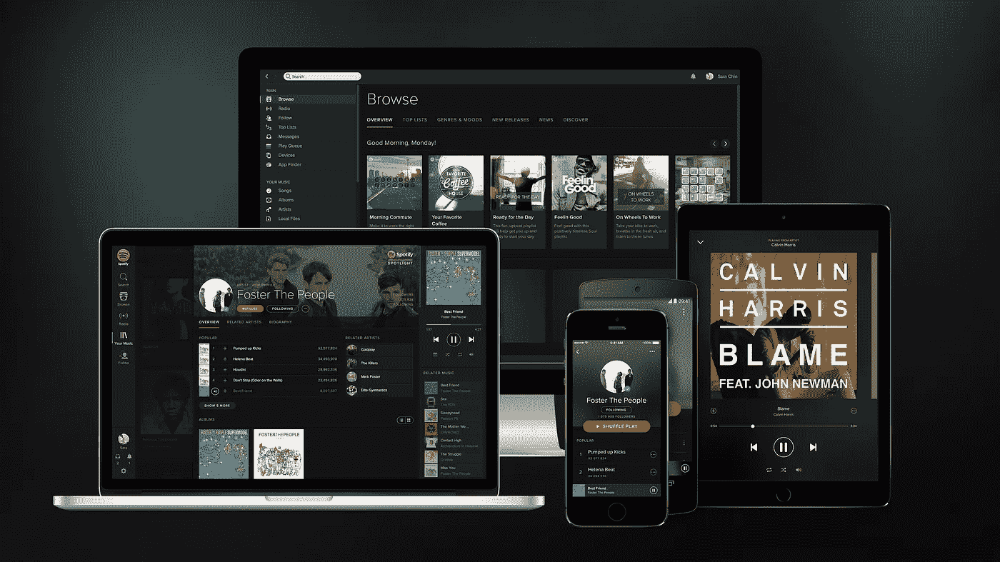

# Spotify 最新更新——Spotify 为艺术家提供的新功能

> 原文：<https://medium.com/hackernoon/latest-spotify-update-spotifys-new-features-for-artists-78b64661aa3a>

Spotify 修改了他们的艺术家资料部分，为艺术家提供更多 Spotify 推广功能。

Spotify 拥有超过 7000 万订户和 1.59 亿活跃用户，是听音乐的主要服务。然而，由于艺术家正在与 Spotify 上超过 20 亿个播放列表中的 3500 多万首其他歌曲竞争，因此艺术家页面需要在其他页面中脱颖而出。这里有一个新的关键特性的列表，以及艺术家可以使用它们做什么。

**得到验证**

艺术家现在可以验证他们的页面。你需要在你的艺术家名字旁边打一个蓝色小勾，这听起来很愚蠢，但这是必不可少的，因为这意味着你可以随时更新你的艺术家图像，将艺术家播放列表发布到你的个人资料中，并选择艺术家。简单的蓝色勾号基本上让粉丝知道个人资料属于艺术家，如果他们没有，艺术家将难以成长。

这也很容易实现。一旦艺术家获得 Spotify for Artists 的访问权限，他们的身份就可以得到验证。这可能需要几天时间，但一旦侧写看起来更可信，等待是值得的。

**如何利用 Spotify 的新功能最大化你的艺人档案**

Spotify 是新兴艺术家的支持者，明白这个行业对新乐队来说有多困难，所以[最近宣布了](https://artists.spotify.com/blog/spruce-up-your-artist-profile-with-photo-galleries-and-social-connections)两个新功能，让你的艺术家页面更好、更容易推广——上传你自己的图片库和连接你所有的社交媒体账户的能力。

首先，让我们浏览一下照片库功能。现在，您可以使用 Spotify for Artists 应用程序将多达 125 张图像上传到自己的照片库中。你也可以编辑图像的顺序，所以要确保最能代表你们乐队的照片是第一批，因为这将是你的观众看到的第一个画面。

除了添加到您的画廊，您还可以通过 Spotify for Artists 应用程序更新您的头像图像，以及您的艺术家简历和艺术家精选等功能。

其次，你可以很容易地将你的社交媒体句柄添加到你的页面上，同样使用 Spotify for Artists 网络工具。该功能出现在 Spotify 上的“关于”标签中，因此您的听众可以轻松浏览您的社交网站和 Spotify 个人资料。

**有一段有趣的经历**

就在新的画廊功能下面是你的艺术家简历，如果你还没有，一定要写一个。你的艺术家简历让读者对你作为一个乐队有了深入的了解，所以要让它引人入胜，有创意，与时俱进。你可以在这里阅读更多关于如何写一份完美的艺术家简历的技巧。

**创建艺术家播放列表**

Spotify for Artists 让将艺术家播放列表发布到您的个人资料变得非常简单。这是一个简单的方法来增加流量，并把你的乐队和你的影响者放在一起，所以按照下面的说明来制作一个吧。

-在 Spotify 应用程序中创建新的播放列表

-通过添加歌曲来创建您的播放列表。我们建议你将你的音乐嵌入播放列表中，这样就不仅仅是你和少数人的了，不要太自我了！

-播放列表准备好后，打开 Spotify for Artists 应用程序

-转到“个人资料”选项卡，向下滚动到艺术家播放列表部分

-单击编辑，然后+添加播放列表

-搜索播放列表，或者在搜索栏中复制并粘贴播放列表的 Spotify 链接

-点击保存

使用诸如“*乐队名称*旅游巴士歌曲”或“我们在听什么”等标题，让您的艺术家播放列表更有创意。

**添加您即将到来的巡演日期**

concert 标签允许您将即将到来的巡演日期添加到您的艺术家个人资料中。这不仅意味着你的所有细节都在一个地方，而且它还地理定位球迷，所以他们知道你何时在他们附近打球，这意味着门票销售的增加！

concert 标签会从 Songkick 自动更新，因此如果您尚未更新，请[立即更新您的列表。](https://tourbox.songkick.com/)

**使用艺术家的选择**

“艺术家精选”类似于 Twitter 上的一条固定推文，你可以在你的个人资料顶部固定一些东西，使这成为别人在你的个人资料上看到的第一个东西。你可以从多种不同的东西中挑选，如曲目、专辑、播放列表或巡演日期，并附有一条短信。

再次强调，[要有创造性](https://www.burstimo.com/single-post/2017/10/09/How-to-grow-your-fans-on-Social-Media-BE-CREATIVE)。不要重复宣传自己的音乐、播放列表和巡演日期。Spotify 创建了艺术家精选功能，让艺术家有机会通过他们的平台表达自己，就这样做吧！分享曾激励过你的专辑，用一首曲目发表声明，或分享决定添加你的曲目的播放列表。